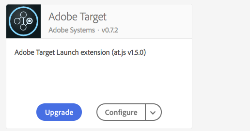

# Adobe Experience Platform Launch Tutorials

Adobe Experience Platform Launch is the next generation of website tag and mobile SDK management capabilities from Adobe. Experience Platform Launch gives customers a simple way to deploy and manage all of the analytics, marketing, and advertising solutions necessary to power relevant customer experiences. Use these videos and tutorials to help master this critical technology.

## What's New

* **[Implement the Adobe Experience Cloud in websites with Launch (Tutorial)](https://docs.adobe.com/content/help/en/launch-learn/implementing-in-websites-with-launch/index.html)**
    *A step-by-step tutorial to learn how to implement Experience Cloud applications with Launch.*

* **[Implement the Adobe Experience Platform Mobile SDK in Android Apps (Tutorial)](https://docs.adobe.com/content/help/en/launch-learn/implementing-in-mobile-android-apps-with-launch/index.html)**
    *A step-by-step tutorial to learn how to implement the Adobe Experience Platform Mobile SDK in Android&trade; apps with Launch.*

* **[Implement the Adobe Experience Platform Mobile SDK in iOS Swift Apps (Tutorial)](https://docs.adobe.com/content/help/en/launch-learn/implementing-in-mobile-ios-swift-apps-with-launch/index.html)**
    *A step-by-step tutorial to learn how to implement the Adobe Experience Platform Mobile SDK in iOS Swift&trade; apps with Launch.*

## Staff Picks

<table>
<tr>
  <td>
    
    

      <a href="https://docs.adobe.com/content/help/en/launch-learn/implementing-in-websites-with-launch/index.html">
    <strong>Implement in Websites with Launch</strong>
    </a>
    

    

    <em>Implement the Adobe Experience Cloud solutions in your website</em>
    

  </td>
  <td>
    
    

      <a href="https://docs.adobe.com/content/help/en/launch-learn/implementing-in-mobile-android-apps-with-launch/index.html">
    <strong>Implement in Android&trade; Apps</strong>
    </a>
    

    

    <em>Use Launch to implement the new mobile SDK</em>
    

  </td>
  <td>
    
    

      <a href="https://docs.adobe.com/content/help/en/launch-learn/implementing-in-mobile-ios-swift-apps-with-launch/index.html">
    <strong>Implement in iOS Swift&trade; Apps</strong>
    </a>
    

    

    <em>Use Launch to implement the new mobile SDK</em>
    

  </td>
</tr>
</table>
_Apple, the Apple logo, iPad, iPhone, iPod, and iPod touch are trademarks of Apple Inc., registered in the U.S. and other countries. Swift and the Swift logo are trademarks of Apple Inc.
Android is a trademark of Google LLC._