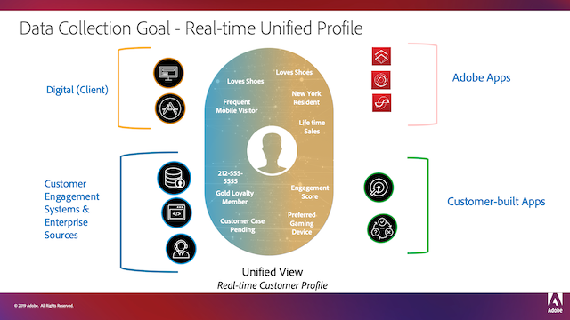
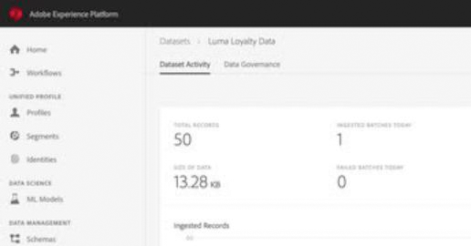

# Overview

Adobe Experience Platform is the most powerful, flexible, and open system on the market for building and managing complete solutions that drive customer experience. Experience Platform enables organizations to centralize and standardize customer data and content from any system and apply data science and machine learning to dramatically improve the design and delivery of rich, personalized experiences. Use these videos and tutorials to learn the many components of Experience Platform.

## What's New

* **[Getting Started with Experience Platform for Data Architects and Data Engineers (Tutorial)](https://docs.adobe.com/content/help/en/platform-learn/getting-started-for-data-architects-and-data-engineers/overview.html)**
     
    *Get hands-on with multiple Platform features with this multi-page tutorial*
* **[Business Value of Experience Platform and Magento Commerce (Video)](/help/experience-cloud/business-value-of-platform-and-magento.md)**
     
    *Power intelligent commerce with Platform and Magento*

* **[Business Value of Attribution AI (Video)](/help/intelligent-services/business-value-of-attribution-ai.md)**
     
    *Measure and optimize marketing and advertising spend*

* **[Business Value of Customer AI (Video)](/help/intelligent-services/business-value-of-customer-ai.md)**
     
    *Enrich customer profiles with AI-based propensities*

## Staff Picks

<table>
<tr>
  <td>
    
    

      <a href="intro-to-platform/a-customer-experience-powered-by-experience-platform.md">
    <strong>A Customer Experience Powered by Experience Platform</strong>
    </a>
    

    

    <em>See how Platform can be used to power a customer experience</em>
    

  </td>
  <td>
    
    

      <a href="https://docs.adobe.com/content/help/en/platform-learn/getting-started-for-data-architects-and-data-engineers/overview.html">
    <strong>Getting Started for Data Architects and Data Engineers</strong>
    </a>
    

    

    <em>Hands-on exercises to get started</em>
    

  </td>
  <td>
    
    

      <a href="data-ingestion/understanding-source-connectors.md">
    <strong>Understanding Source Connectors</strong>
    </a>
    

    

    <em>Easily ingest your data</em>
    

  </td>
   <!--
   <td>
    
    

      <a href="data-ingestion/create-datasets-and-ingest-data.md">
    <strong>Create Datasets and Ingest Data</strong>
    </a>
    

    

    <em>Ingest your dataset.</em>
    

  </td>
  <td>
    
    

      <a href="segments/create-segments.md">
    <strong>Create Segments</strong>
    </a>
    

    

    <em>Build segments based on your data.</em>
    

  </td>-->
</tr>
</table>
