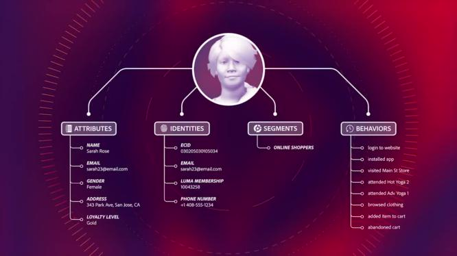
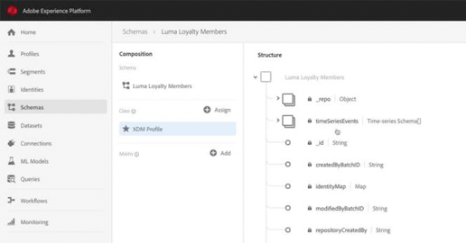

# Overview

Adobe Experience Platform is the most powerful, flexible, and open system on the market for building and managing complete solutions that drive customer experience. Experience Platform enables organizations to centralize and standardize customer data and content from any system and apply data science and machine learning to dramatically improve the design and delivery of rich, personalized experiences. Use these videos and tutorials to learn the many components of Experience Platform.

## What's New

* **[Understanding Streaming Ingestion (Video)](datasets/understanding-streaming-ingestion.md)**
     
    *Stream data to the Real-time Customer Profile in under a second.*

* **[Build Segments Across Classes and Include Segment Context (Video)](segments/create-segments-across-classes-and-include-segment-context.md)**
     
    *Create segments that span multiple XDM classes and include additional context about the segment.*

* **[Understanding Identity and Identity Graphs (Video)](identities/understanding-identity-and-identity-graphs.md)**
     
    *Learn about the rich set of Identity resolution capabilities, which link disconnected identities to create a unified profile.*

## Staff Picks

<table>
<tr>
  <td>
    
    

      <a href="intro-to-platform/a-customer-experience-powered-by-experience-platform.md">
    <strong>A Customer Experience Powered by Experience Platform</strong>
    </a>
    

    

    <em>See how Platform can be used to power a customer experience</em>
    

  </td>
  <td>
    
    

      <a href="intro-to-platform/behind-the-scenes-a-customer-experience-powered-by-experience-platform.md">
    <strong>Behind the Scenes: A Customer Experience Powered by Experience Platform</strong>
    </a>
    

    

    <em>Go behind the scenes of Platform</em>
    

  </td>
  <td>
    
    

      <a href="schemas/create-your-first-schema-with-out-of-the-box-components.md">
    <strong>Create your first Schema</strong>
    </a>
    

    

    <em>Build a schema for your dataset</em>
    

  </td>
   <!--
   <td>
    
    

      <a href="datasets/create-datasets-and-ingest-data.md">
    <strong>Create Datasets and Ingest Data</strong>
    </a>
    

    

    <em>Ingest your dataset.</em>
    

  </td>
  <td>
    
    

      <a href="segments/create-segments.md">
    <strong>Create Segments</strong>
    </a>
    

    

    <em>Build segments based on your data.</em>
    

  </td>-->
</tr>
</table>
