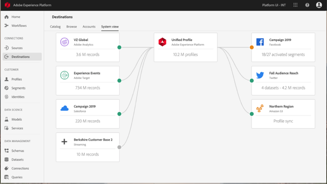

# Overview

Adobe Experience Platform is the most powerful, flexible, and open system on the market for building and managing complete solutions that drive customer experience. Experience Platform enables organizations to centralize and standardize customer data and content from any system and apply data science and machine learning to dramatically improve the design and delivery of rich, personalized experiences. Use these videos and tutorials to learn the many components of Experience Platform.

## What's New

* **[Demo of Real-time Customer Data Platform (Video)](/help/rtcdp/demo.md)**
     
    *See a demo of a personalized experience build with Real-time CDP*

* **[Introduction to Adobe Experience Platform Web SDK and Edge Network (Video)](/help/data-ingestion/web-sdk/introduction-to-web-sdk-and-edge-network.md)**
     
    *Learn how Web SDK will simplify your implementations and improve page performance*

* **[Demo of Adobe Experience Platform Web SDK and Edge Network (Video)](/help/data-ingestion/web-sdk/demo-of-web-sdk-and-edge-network.md)**
     
    *See a demo of Web SDK and a single call being sent to Platform, Analytics, Audience Manager, and Target*

## Staff Picks

<table>
<tr>
  <td>
    
    

      <a href="intro-to-platform/a-customer-experience-powered-by-experience-platform.md">
    <strong>A Customer Experience Powered by Experience Platform</strong>
    </a>
    

    

    <em>See how Platform can be used to power a customer experience</em>
    

  </td>
  <td>
    
    

      <a href="rtcdp/understanding-the-real-time-customer-data-platform.md">
    <strong>Understanding the Real-time Customer Data Platform (CDP)</strong>
    </a>
    

    

    <em>Activate your profiles with Real-time CDP</em>
    

  </td>
  <td>
    
    

      <a href="data-ingestion/understanding-source-connectors.md">
    <strong>Understanding Source Connectors</strong>
    </a>
    

    

    <em>Easily ingest your data</em>
    

  </td>
   <!--
   <td>
    
    

      <a href="data-ingestion/create-datasets-and-ingest-data.md">
    <strong>Create Datasets and Ingest Data</strong>
    </a>
    

    

    <em>Ingest your dataset.</em>
    

  </td>
  <td>
    
    

      <a href="segments/create-segments.md">
    <strong>Create Segments</strong>
    </a>
    

    

    <em>Build segments based on your data.</em>
    

  </td>-->
</tr>
</table>
