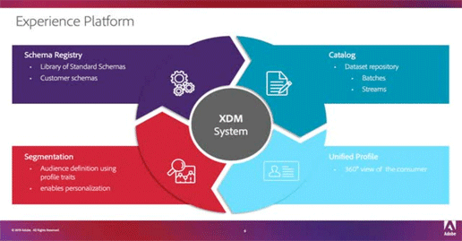
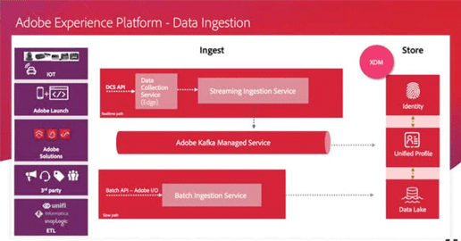
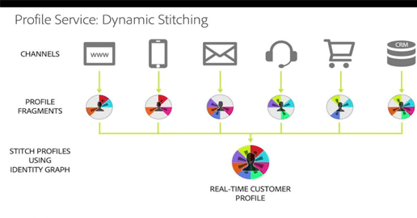

# Overview

Adobe Experience Platform is the most powerful, flexible, and open system on the market for building and managing complete solutions that drive customer experience. Experience Platform enables organizations to centralize and standardize customer data and content from any system and apply data science and machine learning to dramatically improve the design and delivery of rich, personalized experiences. Use these videos and tutorials to learn the many components of the Experience Platform.

## What's New

* **[Understanding Identity and Identity Graphs (Video)](README.md)**
     
    *Learn about the rich set of Identity resolution capabilities, which link disconnected identities to create a unified profile.*

* **[Create Dynamic Segments (Video)](README.md)**
     
    *Learn how to build segments using dynamic attributes to scale your personalization.*

* **[Create Segments (Video)](README.md)**
     
    *Learn how to build audience segments with the new segment builder.*

## Staff Picks

<table>
<tr>
  <td>
    
    

      <a href="schemas/create-your-first-schema-with-out-of-the-box-components.md">
    <strong>Create your first Schema</strong>
    </a>
    

    

    <em>Build a schema for your dataset</em>
    

  </td>
   <td>
    
    

      <a href="datasets/create-datasets-and-ingest-data.md">
    <strong>Create Datasets and Ingest Data</strong>
    </a>
    

    

    <em>Ingest your dataset.</em>
    

  </td>
  <td>
    
    

      <a href="segments/create-segments.md">
    <strong>Create Segments</strong>
    </a>
    

    

    <em>Build segments based on your data.</em>
    

  </td>
</tr>
</table>

## Schemas

<table>
<tr>
  <td> <a href="schemas/understanding-the-xdm-system-and-experience-data-model.md">Understanding the XDM System</a></td>
  <td> <a href="schemas/create-your-first-schema-with-out-of-the-box-components.md">Create your first Schema</a></td>
  <td> <a href="schemas/create-your-own-mixins-and-classes.md">Create your own Mixins and Classes</a></td>
  <td> </td>
</tr>
</table>

## Data Ingestion

<table>
<tr>
  <td> <a href="datasets/understanding-data-ingestion.md">Understanding Data Ingestion</a></td>
  <td> <a href="datasets/create-datasets-and-ingest-data.md">Create Datasets and Ingest Data</a></td>
  <td> </td>
  <td> </td>
</tr>
</table>

## Profiles

<table>
<tr>
  <td> <a href="profiles/understanding-the-real-time-customer-profile.md">Understanding the Real-time Customer Profile</a></td>
  <td> <a href="profiles/bring-data-into-the-real-time-customer-profile.md">Bring Data into Unified Profile</a></td>
  <td> </td>
  <td> </td>
</tr>
</table>

## Segments

<table>
<tr>
  <td> <a href="segments/create-segments.md">Create Segments</a></td>
  <td> <a href="segments/create-dynamic-segments.md">Create Dynamic Segments</a></td>
  <td> </td>
  <td> </td>
</tr>
</table>