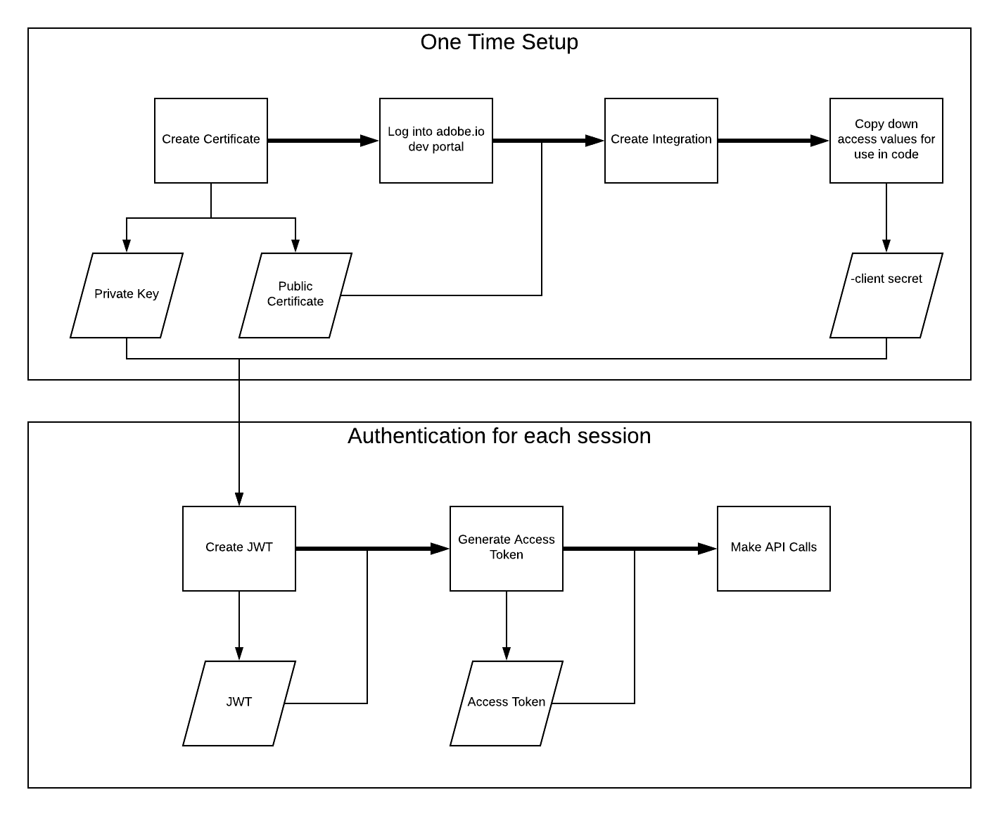

# Authenticate and access [!DNL Experience Platform] APIs

In order to make calls to Adobe Experience Platform APIs, you must first gain access to an Experience Platform developer account. 

For step-by-step instructions outlining how to gain access to a developer account, please visit the [Experience Platform API authentication tutorial](https://www.adobe.com/go/platform-api-authentication-en). 

The tutorial covers the steps for authentication through the creation of an access token as outlined in the following flowchart:

