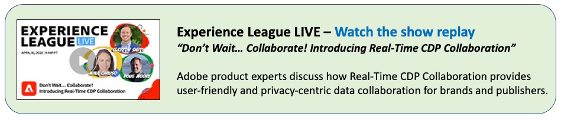

# Real-Time CDP Collaboration Overview

With Adobe Real-Time Customer Data Platform (CDP) Collaboration, you can discover, activate, and measure high-value audiences without relying on third-party cookies. This solution enables advanced data collaboration between advertisers and publishers, helping you create personalized and impactful customer experiences in a privacy-safe, centralized environment.

Below you will find videos and other resources to help you learn how to set up, use, and get value from Real-Time CDP Collaboration. Additional assets will be added to this page and site, so please check back often. Happy learning!

For more information, see the Real-Time CDP Collaboration [documentation](https://experienceleague.adobe.com/en/docs/real-time-cdp-collaboration/using/home){target="_blank"}.

## Introduction

Get an introduction to Adobe Real-Time Collaboration, a purpose-built data collaboration application that lets you discover and activate high-value audiences and use measurement capabilities to drive tangible results.

>[!VIDEO](https://video.tv.adobe.com/v/3446801?learn=on&enablevpops)

## Setup

<!-- CARDS
{cta=Watch}
* set-permissions-for-collaboration.md
* set-up-an-advertiser-account.md

-->
<!-- START CARDS HTML - DO NOT MODIFY BY HAND -->

    

        

            

                <figure class="image x-is-16by9">
                    
                </figure>
            

            

                

                    

                        <a href="set-permissions-for-collaboration.md" target="_blank" rel="referrer" title="Set permissions for Real-Time CDP Collaboration">Set permissions for Real-Time CDP Collaboration</a>
                    

                    
Learn how to set up the needed permissions to access and use Real-Time CDP Collaboration

                

                <a href="set-permissions-for-collaboration.md" target="_blank" rel="referrer" class="spectrum-Button spectrum-Button--outline spectrum-Button--primary spectrum-Button--sizeM" style="align-self: flex-start; margin-top: 1rem;">
                    Watch
                </a>
            

        

    

    

        

            

                <figure class="image x-is-16by9">
                    
                </figure>
            

            

                

                    

                        <a href="set-up-an-advertiser-account.md" target="_blank" rel="referrer" title="Set up an Advertiser account in Real-Time CDP Collaboration">Set up an Advertiser account in Real-Time CDP Collaboration</a>
                    

                    
Learn how to set up an Advertiser account (organization) in Real-Time CDP Collaboration.

                

                <a href="set-up-an-advertiser-account.md" target="_blank" rel="referrer" class="spectrum-Button spectrum-Button--outline spectrum-Button--primary spectrum-Button--sizeM" style="align-self: flex-start; margin-top: 1rem;">
                    Watch
                </a>
            

        

    

<!-- END CARDS HTML - DO NOT MODIFY BY HAND -->

## Advertiser Workflow

<!-- CARDS
{cta=Watch}
* reference-audiences-as-an-advertiser.md
* connect-with-publishers.md
* create-a-project.md

-->
<!-- START CARDS HTML - DO NOT MODIFY BY HAND -->

    

        

            

                <figure class="image x-is-16by9">
                    
                </figure>
            

            

                

                    

                        <a href="reference-audiences-as-an-advertiser.md" target="_blank" rel="referrer" title="Reference audiences as an advertiser in Real-Time CDP Collaboration">Reference audiences as an advertiser in Real-Time CDP Collaboration</a>
                    

                    
As an advertiser, learn how to reference audiences, bringing them into your interface so that they can be used as you collaborate with partners.

                

                <a href="reference-audiences-as-an-advertiser.md" target="_blank" rel="referrer" class="spectrum-Button spectrum-Button--outline spectrum-Button--primary spectrum-Button--sizeM" style="align-self: flex-start; margin-top: 1rem;">
                    Watch
                </a>
            

        

    

    

        

            

                <figure class="image x-is-16by9">
                    
                </figure>
            

            

                

                    

                        <a href="connect-with-publishers.md" target="_blank" rel="referrer" title="Connect with publishers in Real-Time CDP Collaboration">Connect with publishers in Real-Time CDP Collaboration</a>
                    

                    
As an advertiser, learn how to make a connection with a publisher in order to collaborate with them.

                

                <a href="connect-with-publishers.md" target="_blank" rel="referrer" class="spectrum-Button spectrum-Button--outline spectrum-Button--primary spectrum-Button--sizeM" style="align-self: flex-start; margin-top: 1rem;">
                    Watch
                </a>
            

        

    

    

        

            

                <figure class="image x-is-16by9">
                    
                </figure>
            

            

                

                    

                        <a href="create-a-project.md" target="_blank" rel="referrer" title="Create a project in Real-Time CDP Collaboration">Create a project in Real-Time CDP Collaboration</a>
                    

                    
Learn the basics of creating projects in Collaboration, including a brief look at discovery, activation, and measurement.

                

                <a href="create-a-project.md" target="_blank" rel="referrer" class="spectrum-Button spectrum-Button--outline spectrum-Button--primary spectrum-Button--sizeM" style="align-self: flex-start; margin-top: 1rem;">
                    Watch
                </a>
            

        

    

<!-- END CARDS HTML - DO NOT MODIFY BY HAND -->
