# Import sample data to Adobe Experience Platform

Learn how to set up an Experience Platform sandbox environment with sample data. Using a Postman collection, you can create field groups, schemas, datasets and then import sample data into Experience Platform.

## Sample data use case 

Experience Platform business users often have to go through a series of steps that include identifying field groups, creating schemas, preparing data, creating datasets, and then ingesting data before they can explore the marketing capabilities offered by Experience Platform. This tutorial automates some of the steps so you can get data into a Platform sandbox as quickly as possible. 

This tutorial focuses on a fictional, retail brand called Luma. They invest in Adobe Experience Platform to combine loyalty, CRM, product catalog, and offline purchase data into real-time customer profiles and activate these profiles to take their marketing to the next level. We have generated sample data for Luma, and in the remainder of this tutorial, you will import this data into one of your Experience Platform sandbox environments.

>[!NOTE]
>
>The end-result of this tutorial is a sandbox containing similar data to the [Getting Started with Adobe Experience Platform for Data Architects and Data Engineers tutorial](https://experienceleague.adobe.com/docs/platform-learn/getting-started-for-data-architects-and-data-engineers/overview.html). It was updated in April 2023 to support the [Journey Optimizer challenges](https://experienceleague.adobe.com/docs/journey-optimizer-learn/challenges/introduction-and-prerequisites.html). It was updated in June 2023 to switch the authentication method to OAuth.

## Prerequisites

* You have access to Experience Platform APIs and know how to authenticate. If not,  review this [tutorial](https://experienceleague.adobe.com/docs/platform-learn/tutorials/platform-api-authentication.html).
* You have access to an Experience Platform development sandbox.
* You know your Experience Platform tenant id. You can obtain it by making an authenticated [API request](https://experienceleague.adobe.com/docs/experience-platform/xdm/api/getting-started.html?lang=en#know-your-tenant_id)
 or by extracting it from the URL when you log into your Platform account. For example, in the following URL, the tenant is "`techmarketingdemos`" `https://experience.adobe.com/#/@techmarketingdemos/sname:prod/platform/home`. 

## Using [!DNL Postman] {#postman}

### Set up environment variables

Before you follow the steps, ensure that you have downloaded the [Postman](https://www.postman.com/downloads/) application. Let's get started!

1. Download the [platform-utils-main.zip](../assets/data-generator/platform-utils-main.zip) file, which contains all files required for this tutorial. 

    >[!NOTE]
    >
    >User data contained in the [platform-utils-main.zip](../assets/data-generator/platform-utils-main.zip) file is fictitious and is to be used for demonstration purposes only.

1. From your downloads folder, move the `platform-utils-main.zip` file to the desired location on your computer, and unzip it.
1. In the `luma-data` folder, open all the `json` files in a text editor and replace all instances of `_yourTenantId` with your own tenant id, preceded by an underscore.
1. Open `luma-offline-purchases.json`, `luma-inventory-events.json`, and `luma-web-events.json` in a text editor and update all the timestamps so that the events occur in the last month (for example, search for `"timestamp":"2022-11` and replace the year and month)
1. Note the location of the unzipped folder, as you need it later when setting up the `FILE_PATH` [!DNL Postman] environment variable:

    >[!NOTE]
    > To obtain file path on your Mac, navigate to the `platform-utils-main` folder, right-click on the folder and select **Get Info** option.
    >
    > 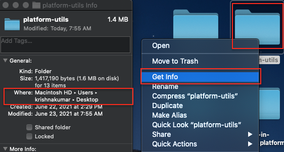

    >[!NOTE]
    > To obtain file path on your windows, click to open the location of the desired folder, and then right-click to the right of the path in the address bar. Copy address to obtain the file path.
    > 
    > 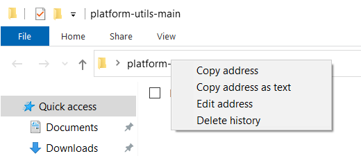

1. Open [!DNL Postman] and create a workspace from the **Workspaces** dropdown menu:  
    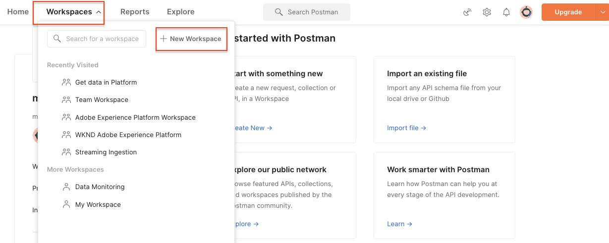
1. Enter a **Name** and optional **Summary** for your workspace and click **Create Workspace**. [!DNL Postman] will switch to your new workspace when you create it.
   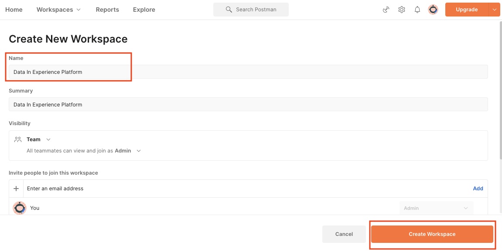
1. Now adjust some settings to run the [!DNL Postman] collections in this workspace. In the header of [!DNL Postman], click the gear icon and select **Settings** to open the settings modal. You can also use the keyboard shortcut (CMD/CTRL + ,) to open the modal.
1. Under the `General` tab, update the request time out in ms to `5000 ms` and enable `allow reading file outside this directory`
    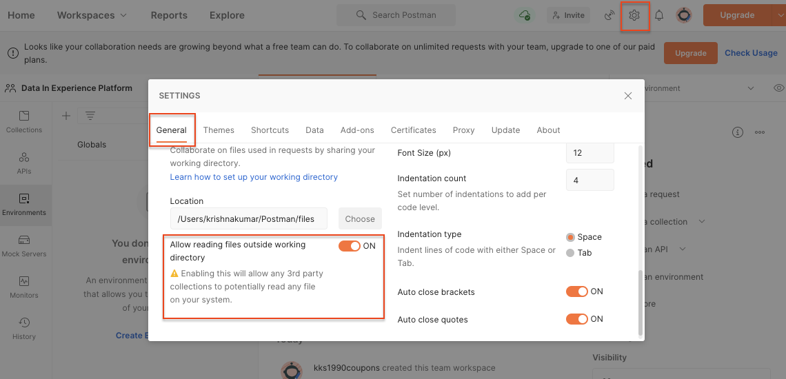

    >[!NOTE]
    > If files are loaded from within the working directory it will run smoothly across devices if the same files are stored on the other devices. However, if you wish to run files from outside the working directory, then a setting has to be turned on to state the same intent. If your `FILE_PATH` is not same as the [!DNL Postman]'s working directory path, then this option should be enabled.

1. Close the **Settings** panel.
1. Select the **Environments** and then select **Import**: 
    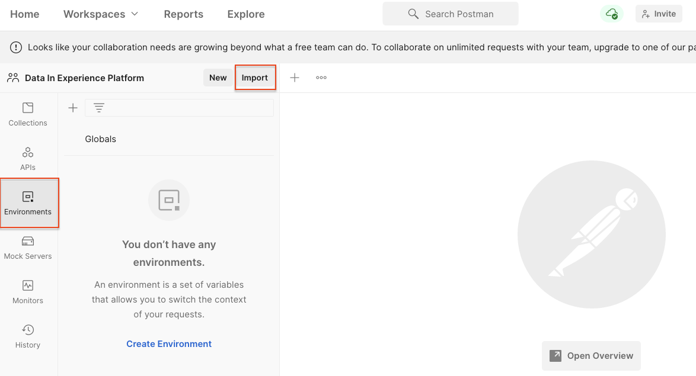
1. Import the downloaded json environment file, `DataInExperiencePlatform.postman_environment`
1. In Postman, select your environment in the top-right dropdown and click the eye icon to view the environment variables:
    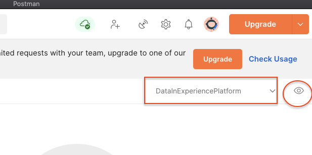

1. Make sure that the following environment variables are populated. To learn how to obtain the environment variables' value, check out the [Authenticate to Experience Platform APIs](/help/platform/authentication/platform-api-authentication.md) tutorial for step-by-step instructions. 

    * `CLIENT_SECRET` 
    * `API_KEY`&mdash;`Client ID` in Adobe Developer Console
    * `SCOPES`
    * `TECHNICAL_ACCOUNT_ID`
    * `IMS`
    * `IMS_ORG`&mdash;`Organization ID` in Adobe Developer Console
    * `SANDBOX_NAME`
    * `TENANT_ID`&mdash;be sure to lead with an underscore, for example `_techmarketingdemos`
    * `CONTAINER_ID`
    * `platform_end_point`
    * `FILE_PATH`&mdash;use the local folder path where you have unzipped the `platform-utils-main.zip` file. Be sure it includes the folder name, for example `/Users/dwright/Desktop/platform-utils-main`

1. **Save** the updated environment

### Import Postman collections

Next you need to import the collections into Postman.

1. Select **Collections** and then choose the import option:

    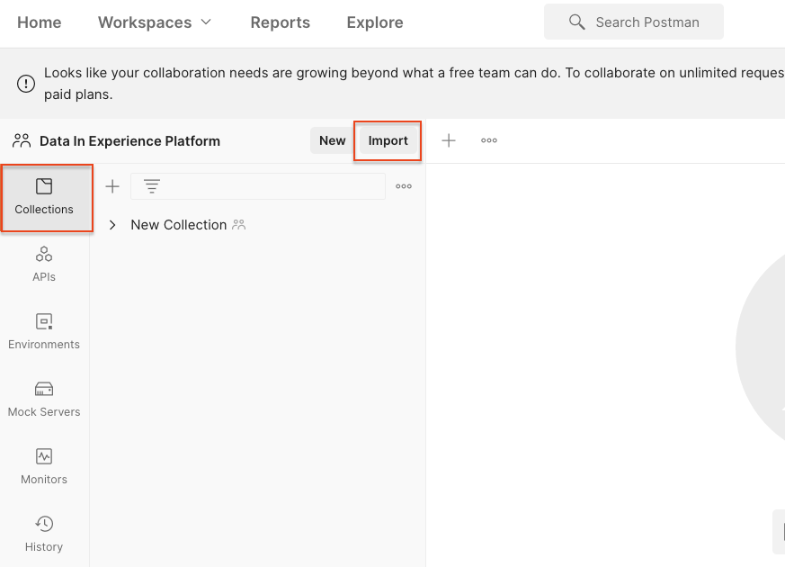

1. Import the following collections:

    * `0-Authentication.postman_collection.json`
    * `1-Luma-Loyalty-Data.postman_collection.json`
    * `2-Luma-CRM-Data.postman_collection.json`
    * `3-Luma-Product-Catalog.postman_collection.json`
    * `4-Luma-Offline-Purchase-Events.postman_collection.json`
    * `5-Luma-Product-Inventory-Events.postman_collection.json`
    * `6-Luma-Test-Profiles.postman_collection.json`
    * `7-Luma-Web-Events.postman_collection.json`

    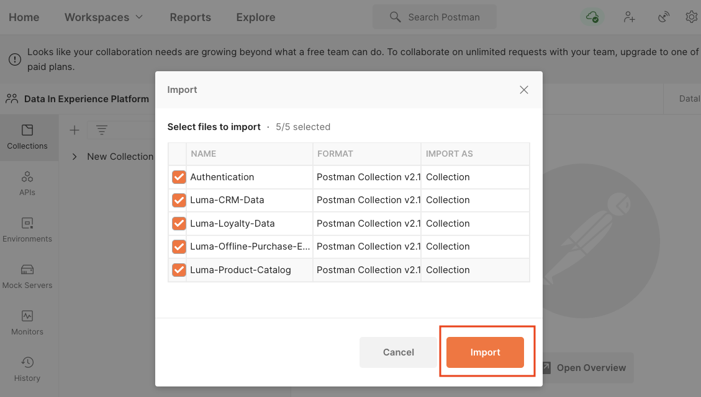

### Authenticate

Next you need to need to authenticate and generate a user token. Please be aware that the token-generation methods used in this tutorial are suitable for non-production use only. Local Signing loads a JavaScript library from a 3rd-party host, and Remote signing sends the private key to an Adobe owned and operated web service. While Adobe does not store this private key, production keys should never be shared with anyone.

1. Open the `0-Authentication` collection, Select the `OAuth: Request Access Token` request, and click `SEND` to authenticate and obtain the access token.

    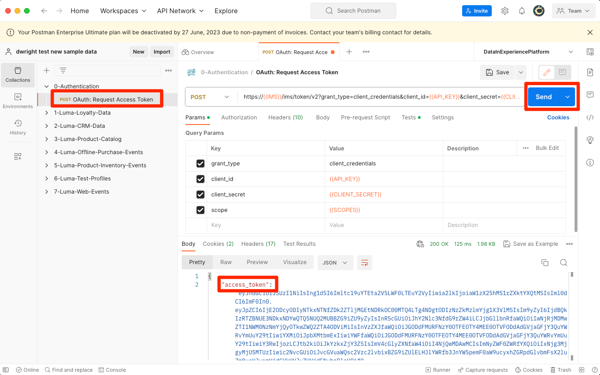

1. Review the environment variables, and notice that the `ACCESS_TOKEN` is now populated.

### Import data

Now you can prepare and import the data into your Platform sandbox. The Postman collections you imported will do all of the heavy lifting!

1. Open the `1-Luma-Loyalty-Data` collection and click **Run** on the overview tab to start a Collection Runner.

    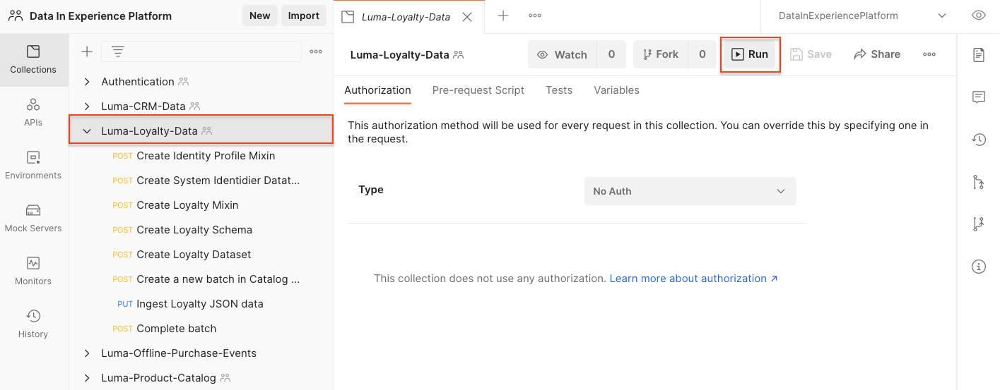

1. In the collection runner window, make sure to select the environment from the dropdown, update the **Delay** to `4000ms`, check the **Save responses** option, and make sure that the run order is correct. Click the **Run Luma Loyalty Data** button

    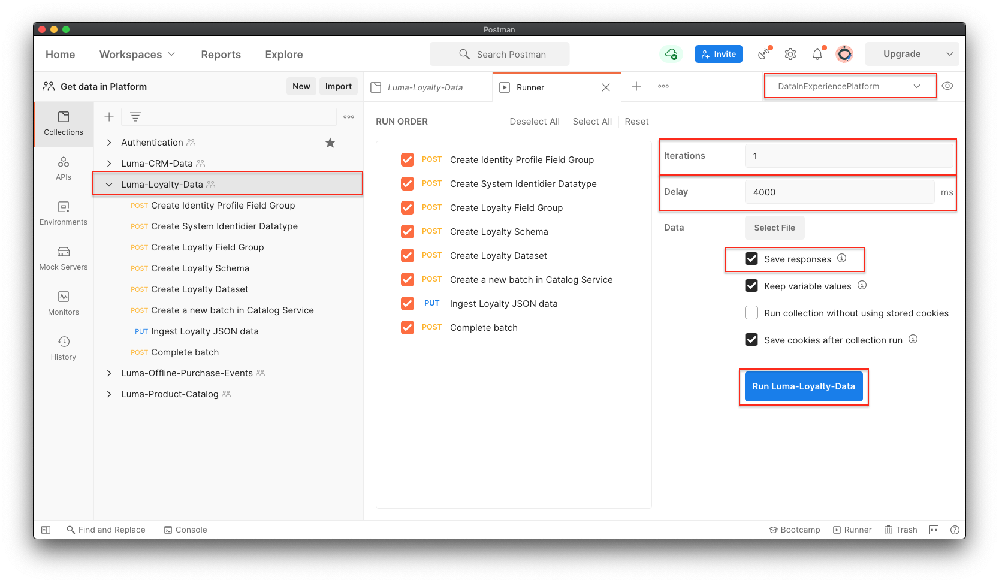

    >[!NOTE]
    >
    >**1-Luma-Loyalty-Data** creates a schema for customer loyalty data. The schema is based on XDM Individual Profile class, standard field group, and a custom field group and dataype. The collection creates a dataset using the schema and uploads sample customer loyalty data to Adobe Experience Platform.

    >[!NOTE]
    >
    >If any collection requests fail during the Postman collection runner, stop the execution and run the collection requests one by one. 

1. If everything goes well, all requests in the `Luma-Loyalty-Data` collection should pass. 

    

1. Now let's login to [Adobe Experience Platform interface](https://platform.adobe.com/) and navigate to datasets. 
1. Open the `Luma Loyalty Dataset` dataset, and under the dataset activity window, you can view a successful batch run that ingested 1000 records. You can also click on the preview dataset option to verify the records ingested. You might need to wait several minutes to confirm that 1000 [!UICONTROL New Profile Fragments] were created.
     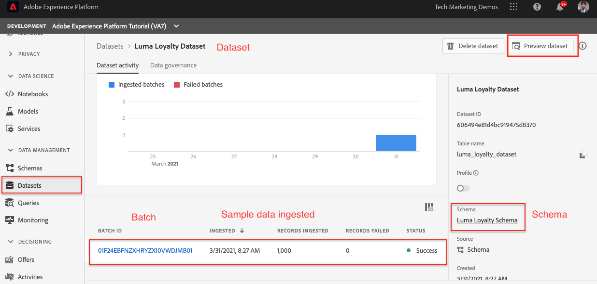
1. Repeat steps 1-3 to run the other collections:
    * `2-Luma-CRM-Data.postman_collection.json` creates a schema and populated dataset for CRM data of customers. The schema is based on XDM Individual Profile class that comprises Demographic Details, Personal Contact Details, Preference Details and a custom identity field group. 
    * `3-Luma-Product-Catalog.postman_collection.json` creates a schema and populated dataset for product catalog information. The schema is based on a custom product catalog class and uses a custom product catalog field group.
    * `4-Luma-Offline-Purchase-Events.postman_collection.json` creates a schema and populated dataset for offline purchase event data of customers. The schema is based on XDM ExperienceEvent class and comprises a custom identity and Commerce Details field groups.
    * `5-Luma-Product-Inventory-Events.postman_collection.json` creates a schema and populated dataset for events related to products going in and out of stock. The schema is based on a custom business event class and a custom field group.
    * `6-Luma-Test-Profiles.postman_collection.json` creates a schema and populated dataset with test profiles to use in Adobe Journey Optimizer
    * `7-Luma-Web-Events.postman_collection.json` creates a schema and populated dataset with simple historical web data.

## Validation

The sample data has been designed so that when the collections have run, Real-Time Customer Profiles are built that combine data from multiple systems. A good example of this is the first record of the loyalty, CRM, and offline purchase datasets. Look up that profile to confirm the data was ingested. In the [Adobe Experience Platform interface](https://experience.adobe.com/platform/):

1. Go to **[!UICONTROL Profiles]** > **[!UICONTROL Browse]**
1. Select `Luma Loyalty Id` as the **[!UICONTROL Identity namespace]**
1. Search for `5625458` as the **[!UICONTROL Identity value]**
1. Open the `Daniel Wright` profile

>[!TIP]
>
>If you don't see the profile, check the [!UICONTROL Datasets] page to confirm that all of the datasets were successfully created and ingested data. If that looks good, wait fifteen minutes and see if the profile is available in the viewer.  If there were issues with the data ingestion, check the error messages to try to locate the issue. You can also try to enable error diagnostics on the [!UICONTROL Datasets] page and drag-and-drop the json data file to re-ingest the data.

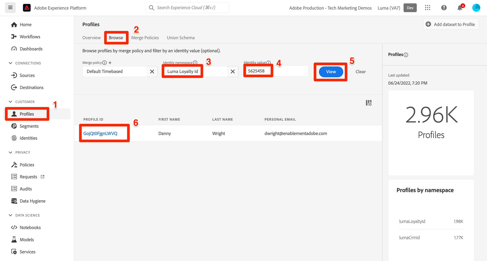

By browsing through the data in the **[!UICONTROL Attributes]** and **[!UICONTROL Events]** tabs, you should see that the profile contains data from the various data files:

## Next steps

If you would like to learn about Adobe Journey Optimizer, this sandbox contains everything you need to take the [Journey Optimizer challenges](https://experienceleague.adobe.com/docs/journey-optimizer-learn/challenges/introduction-and-prerequisites.html)

If you would like to learn about merge policies, data governance, query service, and the segment builder, jump over to [lesson 11 in the Getting Started for Data Architects and Data Engineers tutorial](https://experienceleague.adobe.com/docs/platform-learn/getting-started-for-data-architects-and-data-engineers/create-merge-policies.html?lang=en). The earlier lessons of this other tutorial have you manually build everything that was just populated by these Postman collections--enjoy the head start! 

If you would like to build a sample Web SDK implementation to link to this sandbox, go through the
[Implement Adobe Experience Cloud with Web SDK tutorial](https://experienceleague.adobe.com/docs/platform-learn/implement-web-sdk/overview.html). After setting up the "Initial Configuration", "Tags Configuration", and "Set up Experience Platform" lessons of the Web SDK tutorial, log into the Luma website using the first ten email addresses in the `luma-crm.json` file using the password `test` to see the profile fragments merge with data uploaded in this tutorial.

If you would like to build a sample Mobile SDK implementation to link to this sandbox, go through the
[Implement Adobe Experience Cloud in mobile apps tutorial](https://experienceleague.adobe.com/docs/platform-learn/implement-mobile-sdk/overview.html). After setting up the "Initial configuration", "App implementation", and "Experience Platform" lessons of the Web SDK tutorial, log into the Luma website using the first email addresses in the `luma-crm.json` file to see a profile fragment merge with data uploaded in this tutorial.

## Reset Sandbox environment {#reset-sandbox}

Resetting a non-production sandbox deletes all resources associated with that sandbox (schemas, datasets, and so on), while maintaining the sandbox's name and associated permissions. This "clean" sandbox continues to be available under the same name for users that have access to it.

Follow the steps [here](https://experienceleague.adobe.com/docs/experience-platform/sandbox/ui/user-guide.html?lang=en#reset-a-sandbox) to reset a sandbox environment.
