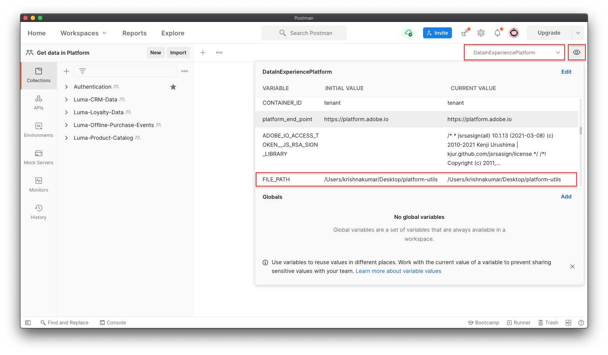

# Import sample data to Adobe Experience Platform

Learn how to set up an Experience Platform sandbox environment with some sample data. Using a postman collection, you can create field groups, schemas, datasets and then import sample data into Experience Platform.

## Sample data use case 

Experience Platform business users often have to go through a series of steps that include identifying field groups, creating schemas, preparing data, creating datasets, and then ingesting data before exploring some of the capabilities offered by Experience Platform. In this tutorial, you can find an easy way to automate some of the steps and get data in Platform as soon as possible. 

This tutorial focuses on a fictional retail brand called Luma. Luma operates brick-and-mortar stores in multiple countries and has an online presence with a website and mobile apps. They invest in Adobe Experience Platform to combine loyalty, CRM, web, and offline purchase data into real-time customer profiles and activate these profiles to take their marketing to the next level. We have sample data generated for Luma, and in the next section, you can explore how to import data to Experience Platform.

To complete this tutorial, you can either use the [Postman application's UI](#postman) or use the command line [Collection Runner for Postman (Newman)](#newman)

## Pre-requisites

* You have authenticated and have access to Experience Platform APIs. If not, you can quickly set it up by following this [tutorial](https://experienceleague.adobe.com/docs/platform-learn/tutorials/platform-api-authentication.html).
* You have access to Experience Platform sandbox environment.
* Know your Experience Platform tenant id. Your tenant id should appear in the URL when you log into your Platform account. In the following URL, the tenant is "`techmarketingdemos`" `https://experience.adobe.com/#/@techmarketingdemos/sname:prod/platform/home`. You can also obtain it by making an authenticated [API request](https://experienceleague.adobe.com/docs/experience-platform/xdm/api/getting-started.html?lang=en#know-your-tenant_id).

## Using Postman {#postman}

### Import Postman Collection and set up environment variables

Before you follow the steps, please ensure that you have downloaded the [Postman](https://www.postman.com/downloads/) application and have access to Experience Platform APIs. For this tutorial, we will be using a sandbox environment. It provides an isolated environment where you can try out functionality without mixing resources and data with your Production environment. Let's get started.

>[!NOTE]
>
>User data contained in the [platform-utils-main.zip](../assets/data-generator/platform-utils-main.zip) file is fictitious and is to be used for demonstration purposes only.

1. Download the [platform-utils-main.zip](../assets/data-generator/platform-utils-main.zip) file, which contains all files required for this tutorial. 
1. From your downloads folder, move the `platform-utils-main.zip` file to the desired location on your computer, and unzip it.
1. Please make a note of the location of the unzipped file, as we might need it later when setting up the `FILE_PATH` postman environment variable

    >[!NOTE]
    > To obtain file path on your Mac, navigate to the `platform-utils-main` folder, right click on the folder and select **Get Info** option.

    

    >[!NOTE]
    > To obtain file path on your windows, click to open the location of the desired folder, and then right-click to the right of the path in the address bar. Copy address to obtain the file path.

    

1. Launch Postman and create a new workspace. Copy the `where` metadata value from the 
1. To create a new workspace, use the **Workspaces** dropdown menu at the left of Postman. You can select an existing workspace or create a new workspace for your project. 
    
1. Enter a **Name** and optional **Summary** for your workspace and click **Create Workspace**. Postman will switch to your new workspace when you create it.
   
1. Now let's perform some additional settings to run our postman collections in this workspace. In the header of Postman, click the wrench icon and select **Settings** to open the settings modal. You can also use the keyboard shortcut (CMD/CTRL + ,) to open the modal.
1. Under the `General` tab, let's update the request time out in ms to `5000 ms` and enable `allow reading file outside this directory`
    

    >[!NOTE]
    > If files are loaded from within the working directory it will run smoothly across devices if the same files are stored on the other devices. However, if you wish to run files from outside working directory, then a setting has to be turned on to state the same intent. If your `FILE_PATH` is not same as the postman's working directory path, then this option should be enabled.

1. Close the settings panel.
1. Select the environments option and click on the import option. 
    
1. Let's import the downloaded json environment file, `DataInExperiencePlatform.postman_environment`, and click **Import**
1. In Postman, select your environment in the top-right dropdown and click the eye icon to view the environment variables.
    

1. Make sure that the following environment variables are populated. To learn how to obtain the environment variables' value, check out the [Authenticate to Experience Platform APIs](/help/platform/authentication/platform-api-authentication.md) tutorial for step-by-step instructions. 

    * `CLIENT_SECRET` 
    * `API_KEY`
    * `TECHNICAL_ACCOUNT_ID`
    * `META_SCOPE`
    * `IMS`
    * `IMS_ORG`
    * `PRIVATE_KEY`
    * `SANDBOX_NAME`
    * `CONTAINER_ID`
    * `TENANT_ID`
    * `platform_end_point`
    * `FILE_PATH` 
    * `PRIVATE_KEY`

1. Update the `FILE_PATH` variable to the local folder path where you have unzipped the `platform-utils-main.zip` file. You can edit variables either by opening an environment from Environments on the left, or by opening the environment quick look (eye button) at the top right of Postman, and clicking Edit.
    

1. Now, we need to populate the values for the following environment variables. To do that, we need to upload the collection files to our workspace.

    * `JWT_TOKEN`
    * `ACCESS_TOKEN`

1. Select collections and then choose the import option

    

1. Import the following collection files into postman

    * `Authentication.postman_collection.json`
    * `Luma-Loyalty-Data.postman_collection.json`
    * `Luma-CRM-Data.postman_collection.json`
    * `Luma-Product-Catalog.postman_collection.json`
    * `Luma-Offline-Purchase-Events.postman_collection.json`

    

1. Open the `Authentication` collection, Select the `IMS: JWT Generate + Auth via User Token` POST request, and click `SEND` to authenticate and obtain the access token.

    

1. Review the environment variables, and you can notice that the `JWT_TOKEN` and `ACCESS_TOKEN` are now populated.
1. In the `luma-data` folder, open all of the `json` files in a text editor and replace all instances of `_techmarketingdemos` with your own tenant id, preceded by an underscore.

1. Open the `Luma-Loyalty-Data` collection and click **Run** on the overview tab to start a Collection Runner.

    

1. In the collection runner window, make sure to select the environment from the dropdown, provide a delay of 4000ms, check the save responses option, and make sure that the run order is correct. Click the **Run Luma Loyalty Data** button

    

    >[!NOTE]
    >
    >**Luma-Loyalty-Data** collection run would create a schema to contain customer loyalty data. The schema is based on XDM Individual Profile class that comprises custom field groups and dataypes. Collection also creates a dataset using the schema and uploads sample customer loyalty data to Adobe Experience Platform.

    >[!NOTE]
    >
    >If any collection requests fail during the postman collection runner, stop the execution and run the collection requests one by one. 

1. If everything goes well, all requests in the `Luma-Loyalty-Data` collection should pass. 

    

1. Now let's login to [Adobe Experience Platform UI](https://platform.adobe.com/) and navigate to datasets. 
1. Open the `Luma Loyalty Dataset` dataset, and under the dataset activity window, you can view a successful batch run that ingested 1000 records. You can also click on the preview dataset option to verify the records ingested.
     
1. Repeat steps 21 - 23 to run the below collections:
    * `Luma-CRM-Data.postman_collection.json` : collection run would create a schema to contain CRM data of customers. The schema is based on XDM Individual Profile class that comprises Demographic Details, Personal Contact Details and Luma Identity Profile field groups. Collection also creates a dataset using the schema and uploads sample customer CRM data to Adobe Experience Platform.
    * `Luma-Product-Catalog.postman_collection.json` : collection run would create a schema to contain product catalog information. The schema is based on a custom class comprising product catalog mixin, Commerce details, and Consumer Experience Event mixin. Collection also creates a dataset using the schema and uploads product data to Adobe Experience Platform.
    * `Luma-Offline-Purchase-Events.postman_collection.json`: collection run would create a schema to contain offline purchase event data of customers. The schema is based on XDM ExperienceEvent class and comprises field groups to capture customer loyalty information and their offline purchase events. Collection also creates a dataset using the schema and uploads offline purchase events data to Adobe Experience Platform.

## Using Newman {#newman}

Before you follow the steps, please make sure that you have access to Experience Platform APIs. For this tutorial, we will be using a sandbox environment as it provides an isolated environment where you can try out functionality without mixing resources and data with your Production environment.

### Install NodeJs and Newman

1. To run Newman, ensure that you have Node.js >= v10. [Install Node.js via package manager](https://nodejs.org/en/download/package-manager/).
1. Run the command `node -v` to make sure that node is installed. 
1. The easiest way to install Newman is using NPM. If you have Node.js installed, it is most likely that you have NPM installed as well.
1. Follow the steps [here](https://www.npmjs.com/package/newman#using-newman-cli) to install newman for your system
1. Run the command `newman -v` to make sure that newman is installed. 
1. Download the [platform-utils-main.zip](../assets/data-generator/platform-utils-main.zip) file, which contains all files required for this tutorial. 
1. From your downloads folder, move the `platform-utils-main.zip` file to the desired location on your computer, and unzip it.
1. Please make a note of the location of the unzipped file, as we might need it later when setting up the `FILE_PATH` postman environment variable
1. Open the `platform-utils-main` folder in a terminal window.
1. Run `Luma-Loyalty-Data.postman_collection.json` to build field groups, schema, dataset, and to ingest sample loyalty data to Adobe Experience Platform
    * `newman run Luma-Loyalty-Data.postman_collection.json -e DataInExperiencePlatform.postman_environment.json --export-environment DataInExperiencePlatform.postman_environment.json —insecure --delay-request 4000`
1. If everything goes well, all requests in the `Luma-Loyalty-Data` collection should pass. 
1. Now let's login to [Adobe Experience Platform UI](https://platform.adobe.com/) and navigate to datasets. 
1. Open the `Luma Loyalty Dataset` dataset, and under the dataset activity window, you can view a successful batch run that ingested 1000 records. You can also click on the preview dataset option to verify the records ingested.

     

1. Repeat steps 10 - 13 to run below collections:
    * Run `Luma-CRM-Data.postman_collection.json` to build field groups, schema, dataset, and to ingest sample CRM data to Adobe Experience Platform
      * `newman run Luma-CRM-Data.postman_collection.json -e DataInExperiencePlatform.postman_environment.json --export-environment DataInExperiencePlatform.postman_environment.json --insecure --delay-request 4000`
    * Run `Luma-Product-Catalog.postman_collection.json` to build field groups, schema, dataset, and to ingest sample product data to Adobe Experience Platform
      * `newman run Luma-Product-Catalog.postman_collection.json -e DataInExperiencePlatform.postman_environment.json --export-environment DataInExperiencePlatform.postman_environment.json --insecure --delay-request 4000`
    * Run `Luma-Offline-Purchase-Events.postman_collection.json` to build field groups, schema, dataset, and to ingest sample product data to Adobe Experience Platform
      * `newman run Luma-Offline-Purchase-Events.postman_collection.json -e DataInExperiencePlatform.postman_environment.json --export-environment DataInExperiencePlatform.postman_environment.json --insecure --delay-request 4000`

## Reset Sandbox environment {#reset-sandbox}

Resetting a non-production sandbox deletes all resources associated with that sandbox (schemas, datasets, and so on), while maintaining the sandbox’s name and associated permissions. This “clean” sandbox continues to be available under the same name for users that have access to it.

Follow the steps [here](https://experienceleague.adobe.com/docs/experience-platform/sandbox/ui/user-guide.html?lang=en#reset-a-sandbox) to reset a sandbox environment.
