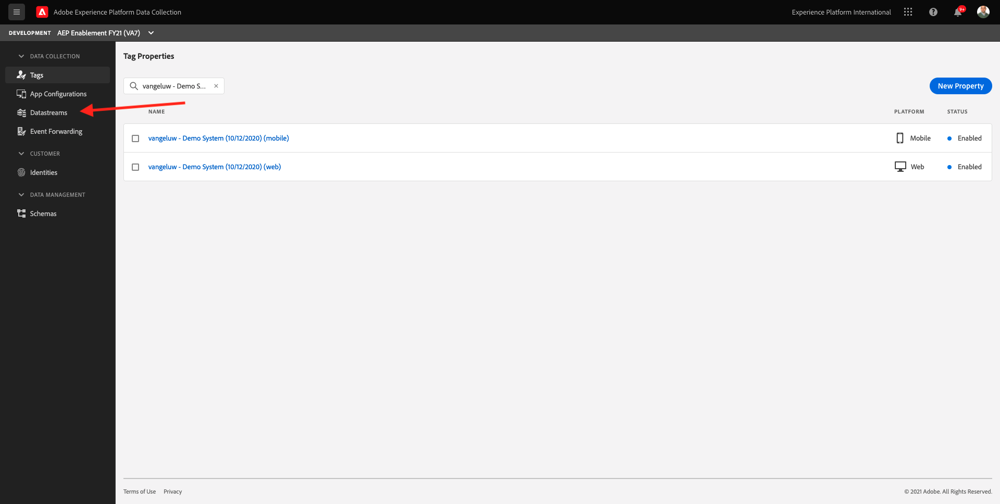
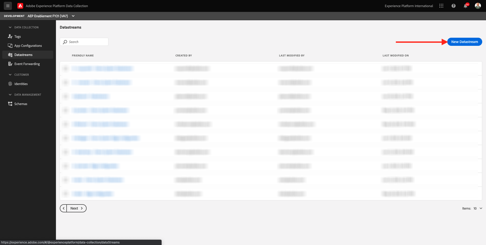
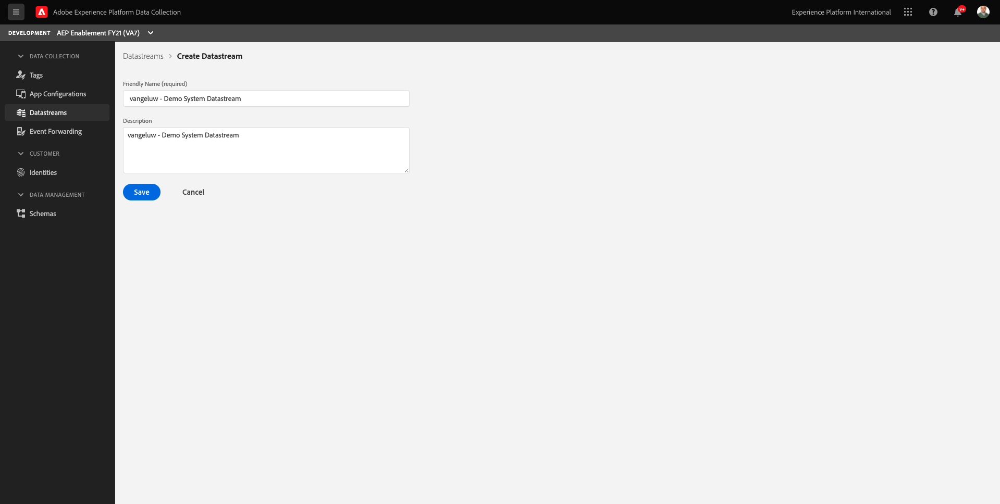
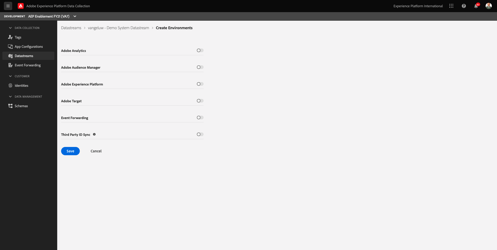
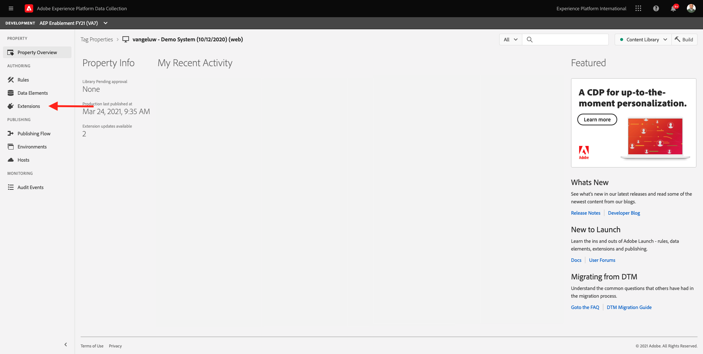
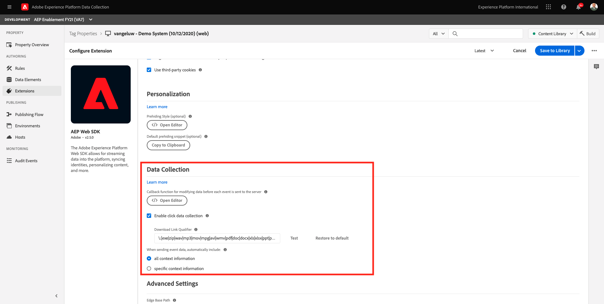
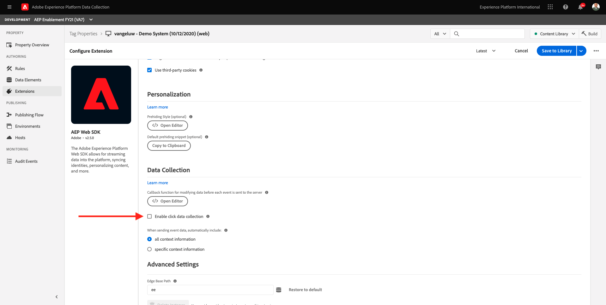
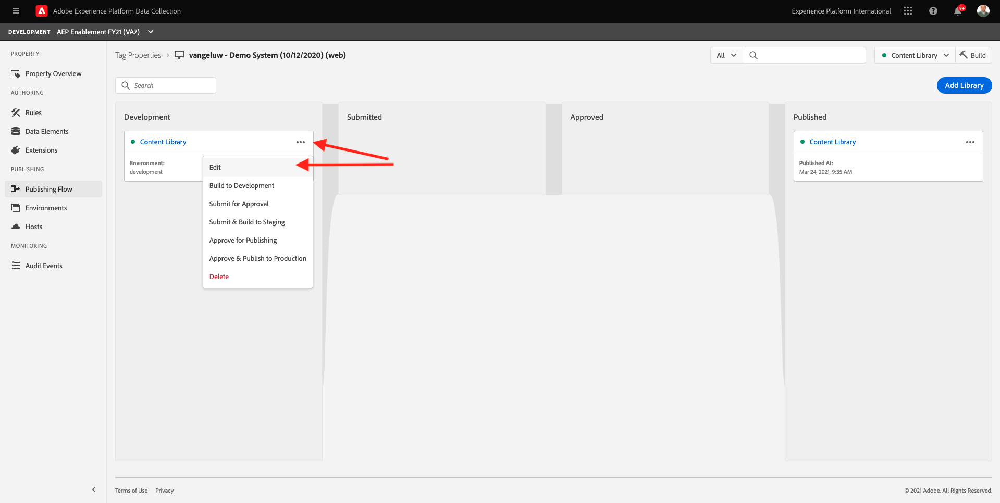

# 0.2 Create your Edge Configuration ID

Go to [https://launch.adobe.com/](https://launch.adobe.com/). After the previous exercise, you now have two Launch properties: one for web and one for mobile.

These properties are almost ready to be used, but before you can start collecting data using these properties you need to set up an Edge Configuration ID. You'll get more information around the concept of what an Edge Configuration ID is and what it means in Exercise 1.2.

For now, please follow these steps.

Open the dropdown menu and click **[!UICONTROL Edge Configuration]**.

Click **[!UICONTROL New Edge Configuration]**.

For the **[!UICONTROL Friendly Name]**, and for the optional description, enter **ldap - Demo System Edge Configuration** and replace **ldap** with your ldap.

Click the **[!UICONTROL Save]** button

You'll then see this:

Toggle on **[!UICONTROL Adobe Experience Platform]** which will expose additional fields. You'll then see this:

For **[!UICONTROL Sandbox]**, select your sandbox name.

>[!NOTE]
>
> You can find your IMS Org ID, Org Name and your Adobe Experience Platform sandbox name on your company's github repository that was set up by your Adobe contact. If you don't know which sandbox to use, verify if you can see a sandbox named **AEP Enablement FY21**. If you can see that sandbox, please select it.

For Event Dataset, select **Demo System - Event Dataset for Website (Global v1.1)** and for Profile Dataset, select **Demo System - Profile Dataset for Website (Global v1.1)**.

That's it for now. In [Module 1](./../module1/data-ingestion-launch-web-sdk.md) you'll learn more about Web SDK and how to configure all of its capabilities.

You now have this. Click **Save**.

You'll then see that your Edge Configuration consists of 3 environments.

Open the dropdown menu and click **[!UICONTROL Client Side]**.

Filter the search results to see your two Launch properties.

Open the Launch property for **Web** by clicking it. You'll then see this.

In the left menu, go to **Extensions**. On the AEP Web SDK, click **Configure**.

You'll then see this. For the **Edge Configurations**, you'll currently see a dummy value set to 1. You now need to click the **Choose from list** radio-button. In the dropdown list, select the Edge Configuration ID you created earlier.

Make sure to have selected your **Edge Configuration ID**. 

Scroll down until you see **Data Collection**.

Uncheck the checkbox for **Enable click data collection**.

Click **Save** to save your changes.

Go to **Publishing Flow**.

Click the **...** for the **Content Library**, then click **Edit**.

 

Click **Add All Changed Resources**.

Finally, click **Save & Build for Development**.

 

Your changes are now being published and will be ready in a couple of minutes.

Next Step: [0.3 Create your Enablement Configuration ID](./ex3.md)

[Go Back to Module 0](./getting-started.md)

[Go Back to All Modules](./../../overview.md)