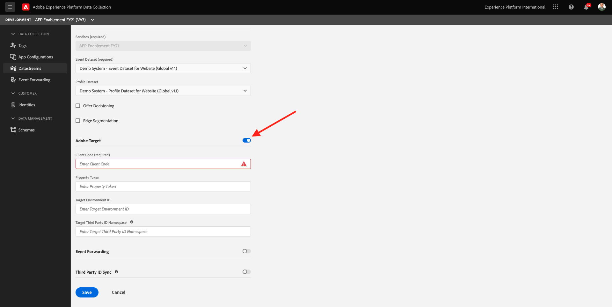
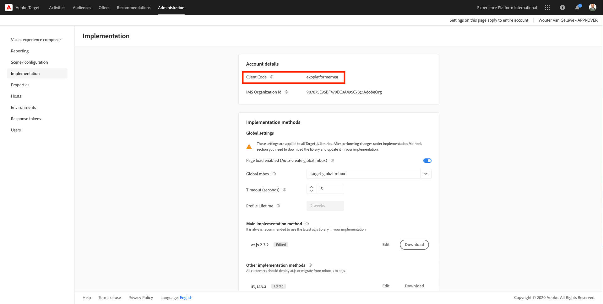

# 1.6 Implement Adobe Target

## 1.6. Update your Edge Configuration to use Adobe Target

In case you want to send data collected by Web SDK to Adobe Target and get a response from Adobe Target with a personalized experience for every customer, follow these steps.

Go to [https://experience.adobe.com/launch/](https://experience.adobe.com/launch/) and go to **Edge Configurations**. Open your specific Edge Configuration.

Click to open your **Development Environment**.

You'll then see this. To enable Adobe Target, click the toggle for Adobe Target.

You now need to enter your Adobe Target client code. Your Adobe Target client code is: `--atClientCode--`.

You can find your Adobe Target client code yourself by going to Adobe Target, to Administration and then to Implementation, where you'll find this:

Copy the value for Client Code and paste it in your Edge Configuration. Don't forget to click **Save** to save your changes.

Next Step: [1.7 XDM Schema requirements in Adobe Experience Platform](./ex7.md)

[Go Back to Module 1](./data-ingestion-launch-web-sdk.md)

[Go Back to All Modules](./../../overview.md)
