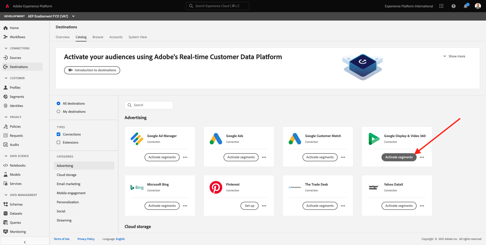
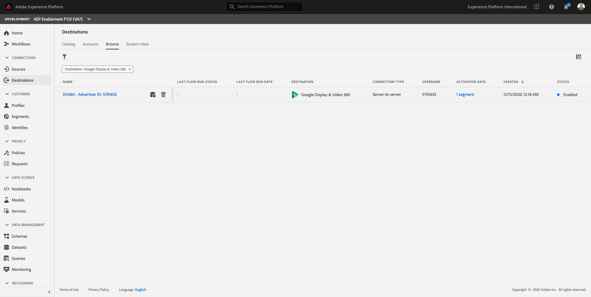
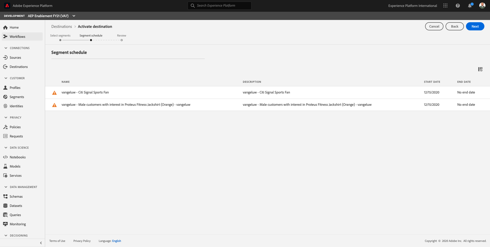
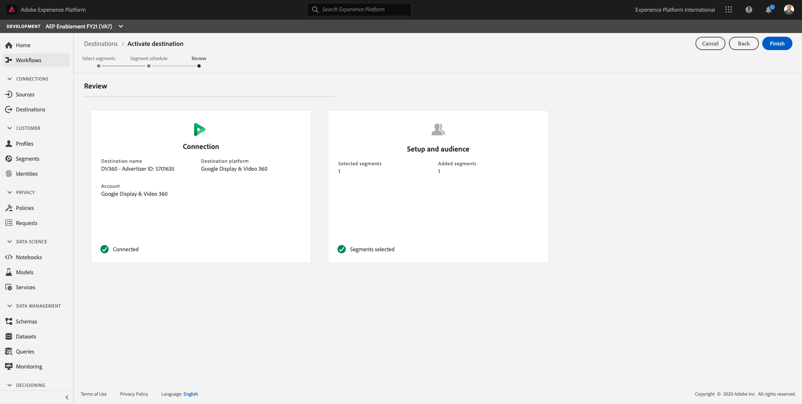

# 11.3 - Take Action: send your segment to DV360

Log in to [Adobe Experience Platform](https://experience.adobe.com/platform).

After logging in, you'll land on the homepage of Adobe Experience Platform.

Before you continue, you need to select a **sandbox**. The sandbox to select is named ``--aepSandboxId--``. You can do this by clicking the text **[!UICONTROL Production Prod]** in the blue line on top of your screen.

After selecting the appropriate sandbox, you'll see the screen change and now you're in your dedicated sandbox.

In the left menu, go to **Destinations**. You'll then see the **Destinations** homepage.

In **Destinations**, click the 3 dots on **Google Display & Video 360** and then click **View dataflow**.

Click on **Browse Destinations**.

You'll then see all available **Google Display & Video 360** destinations.

Click the **+** icon on the **Destination Name** of `DV360 - Advertiser ID: 5701635`.

You'll then see all available segments in your Adobe Experience Platform instance. Search and select the segment you created in exercise 1.

Click **Next**.

On the next page, click **Next**.

On the next page, click **Finish**.

Your segment is now linked to Google DV360. Every time a customer qualifies for this segment, a signal will be sent to Google DV360 to include that customer in the Audience at Google DV360 side.

Next Step: [11.4 Take Action: Send your segment to Google AdWords RLSA using Adobe Audience Manager](./ex4.md)

[Go Back to Module 11](./real-time-cdp-build-a-segment-take-action.md)

[Go Back to All Modules](../../overview.md)
