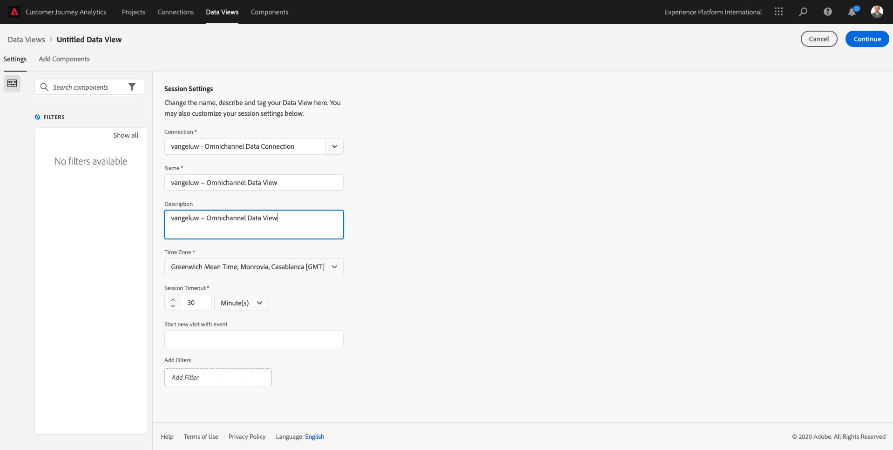
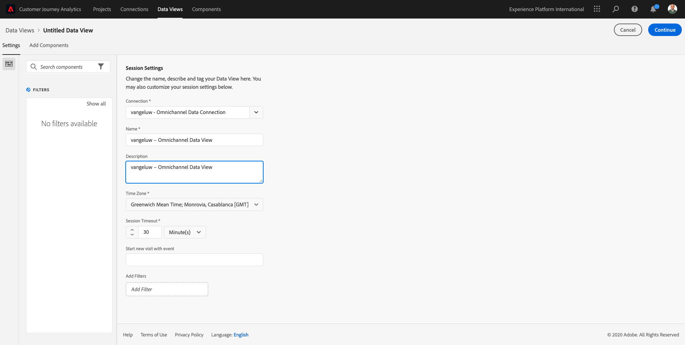
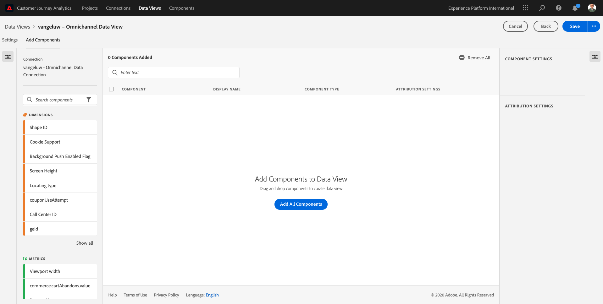
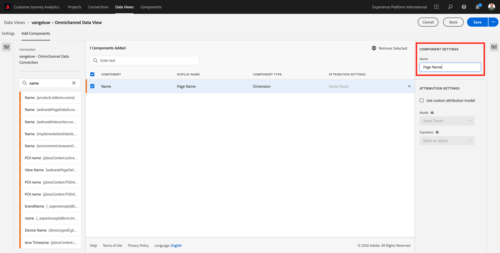
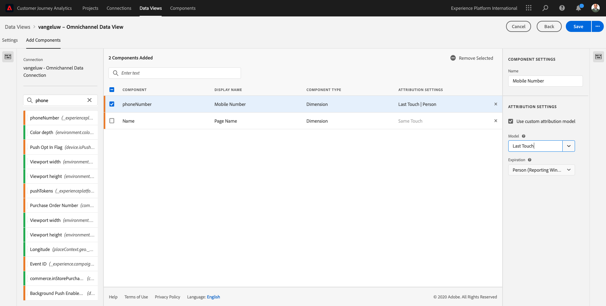
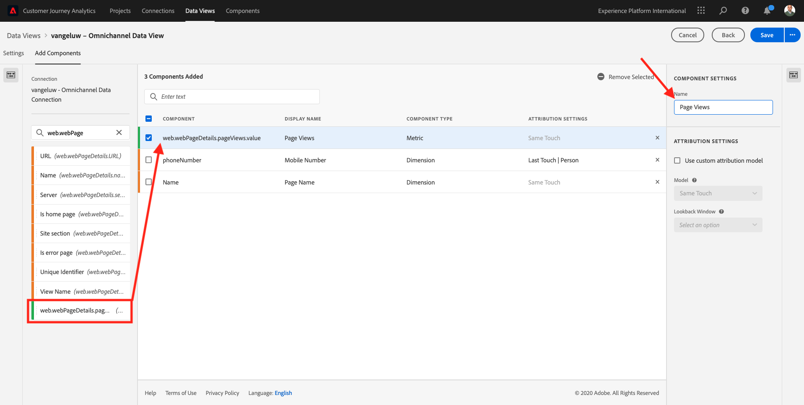
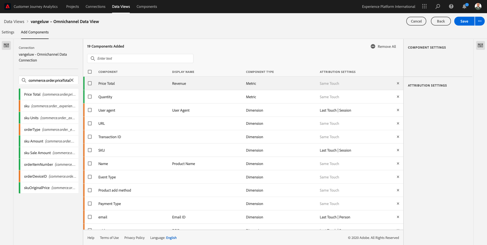

# 13.3 Create a Data View

## Objectives

- Understand the Data View UI
- Understand the basic settings of visit definition
- Understand Attribution within a Data View

## 13.3.1 Data View

With your connection done, you can now progress to influencing visualization. A difference between Adobe Analytics and CJA, is that CJA needs a Data View in order to clean and prepare the data before visualization. 

A Data View is similar to the concept of Virtual Report Suites in Adobe Analytics, where you  define context-aware visit definitions, filtering and also, how the components are called. 

You'll need a minimum of one Data View per Connection. However, for some use-cases, it's great to have multiple Data Views for the same connection, with the goal of giving different insights to different teams. 
If you want your company to become data-driven, you should adapt how data is viewed in each team. Some examples:

- UX metrics only for the UX Design team
- Use the same names for KPIs and Metrics for Google Analytics as for Customer Journey Analytics so that the digital analytics team can speak 1 language only.
- Data View filtered to show for instance data for one market only, or one brand, or only for Mobile Devices.

On the **Connections** screen, check the checkbox in front of the connection you just created.

Now click **Create Data View**.

You'll be redirected to the **Create Data View** workflow.

## 13.3.2 Data View Definition

You can now configure the basic definitions for your Data View. Things like Time zone, Session Timeout or the Data View filtering (the segmentation part similar to Virtual Report Suites in Adobe Analytics).

The **Connection** you created in the previous exercise is already selected. Your connection is named `ldap – Omnichannel Data Connection`.

Next, give your Data View a name following this naming convention: `ldap – Omnichannel Data View`. 

Enter the same value for the description: `ldap – Omnichannel Data View`.

| Name         | Description|    
| ----------------- |-------------| 
| ldap – Omnichannel Data View | ldap – Omnichannel Data View          |  

For the **Time Zone**, select the timezone **Greenwich Mean Time; Monrovia, Casablanca [GMT]**. This is a really interesting setting as some companies operate in different countries and geographies. Allocating the right time zone for each country will avoid typical data mistakes such as believing that for instance, in Peru, the majority of the people buy T-shirts at 4:00 AM.

Next, set the **Session Timeout** to 30 min. Thanks to every experience event's timestamp you can extend the concept of a session across all channels. For instance, what happens if a customer calls the call-center after visiting the website? Using custom Session Timeouts you have loots of flexibility in deciding what a session is, and how that session will merge data together.

You can also decide yourself when to start a new session, by manually specifying the event that triggers a new visit in the **Start new visit with event** field.

You should now have the following settings configured:

Click **Continue**.

## 13.3.3 Data View Components

In this exercise, you'll configure the components you need to analyze the data and visualize it using Analysis Workspace. In this UI, there are three main areas:

- Left side: Available components from the selected datasets
- Middle: Added components to the Data View
- Right side: Component settings

You now have to drag and drop the components you need for the analysis to the **Components Added**. To do this, you need to select the components in the left menu and drag and drop them onto the canvas in the middle.

Let's start with the first component:**Name (web.webPageDetails.name)**. Search for this component, then drag and drop it onto the canvas.

This component is the page name, as you can derive from reading the schema field `(web.webPageDetails.name)`. 

However, using **Name** as the name is not the best naming convention for a business user to quickly understand this dimension. 

Let's change the name to be **Page Name**. Click on the component and rename it in the **Component Settings** area.

Something really important is the **Attribution settings**. The concept of evars and prop doesn't exist in CJA but the attribution settings make a similar behavior possible. 
If you don't change these settings, CJA will interpret the dimension as a **Prop** (hit level). Also, we can change the attribution to make the dimension an **eVar** (persist the value across the journey).

If you aren't familiar with eVars and Props, you can read more about it here: [https://docs.adobe.com/evarsvsprops.html](https://docs.adobe.com/content/help/en/analytics/implementation/analytics-basics/traffic-props-evars/props-vs-evars.html)

Let's leave the Page Name as a Prop. As such, you don't need to change any **Attribution Settings**.

| Component Name to Search           | New Name   | Attribution Settings  | 
| ----------------- |-------------| --------------------| 
| Name (web.webPageDetails.name) | Page Name          |          | 

Next, pick the dimension **phoneNumber** and drop it on the canvas. The new name should be **Mobile Number**. Finally let's change the attribution settings, as the Mobile Number should persist at user level. 

Click on the model and select **Last Touch** at a Person (Reporting window), as we only care about the last mobile number of that person. If the customer doesn't fill out the mobile in future visits, you'll still see this value populated.

| Component Name to Search           | New Name    | Attribution Settings  | 
| ----------------- |-------------| --------------------| 
| phoneNumber | Phone Number          |    Last Touch, Person (reporting window)     | 

The next component is `web.webPageDetails.pageViews.value`.

In the left side menu, search for `web.webPageDetails.pageViews.value`. Drag and drop this metric onto the canvas. 

Change the name to be **Page Views**.

| Component Name to Search           | New Name    | Attribution Settings  | 
| ----------------- |-------------| --------------------| 
| web.webPageDetails.pageViews.value | Page Views          |         | 

For the attribution settings we will leave this empty. 

Note: Attribution settings on metrics can also be changed in Analysis Workspace. In some cases you may choose to set it here to avoid business users from having to think which is the best attribution model. 

Next, you'll have to configure a lot of Dimensions and Metrics, as indicated in the below table.

### DIMENSIONS

| Component Name to Search           | New Name      | Attribution Settings  | 
| ----------------- |-------------| --------------------| 
| brandName | Brand Name          | Last Touch, Session         | 
| callfeeling | Call Feeling          |          | 
| call ID | Call Interaction Type          |          | 
| callTopic | Call Topic          | Last Touch, Session   | 
| ecid  | ECID          | Last Touch, Person (reporting window)       | 
| email | Email ID          | Last Touch, Person (reporting window)        | 
| Payment Type | Payment Type          |          | 
| Product add method | Product add method          | Last Touch, Session         | 
| Event Type | Event Type         |         | 
| Name (productListItems.name) | Product Name          |         | 
| SKU | SKU (Session)          | Last Touch, Session         | 
| Transaction ID | Transaction ID          |         | 
| URL (web.webPageDetails.URL) | URL          |         | 
| User Agent | User Agent          | Last Touch, Session         |

### METRICS

| Component Name to Search           | New Name    | Attribution Settings  | 
| ----------------- |-------------| --------------------| 
| Quantity | Quantity          |          | 
| commerce.order.priceTotal | Revenue          |         | 

This is the result of your configuration.

Don't forget to **Save** your Data View. So click **Save** now.

>[!NOTE]
>
>You can come back to this Data View afterwards and change settings and components at any time. Changes will affect how historical data is shown.

You can now continue with the visualization and analysis part!

Next Step: [13.4 Data Preparation in Customer Journey Analytics](./ex4.md)

[Go Back to Module 13](./customer-journey-analytics-build-a-dashboard.md)

[Go Back to All Modules](./../../overview.md)
