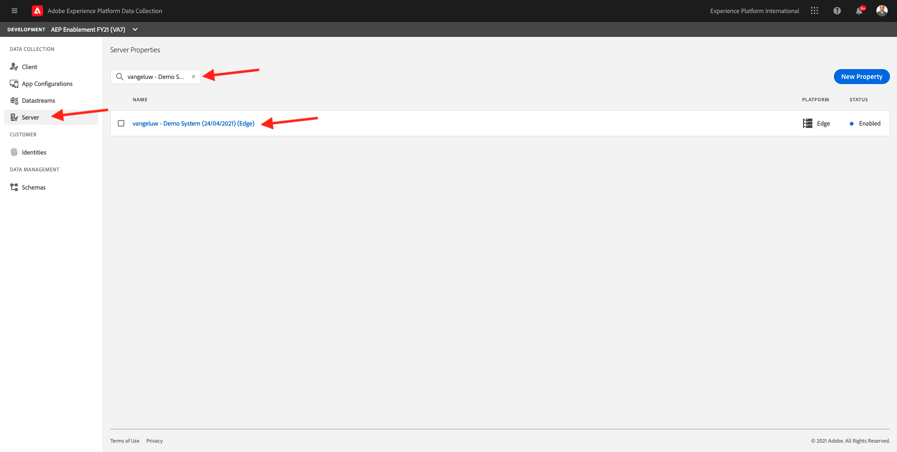
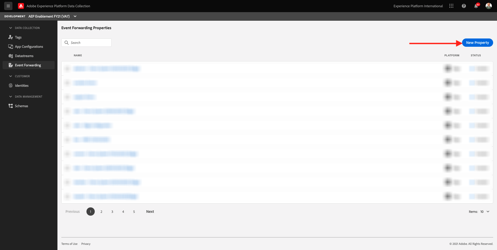
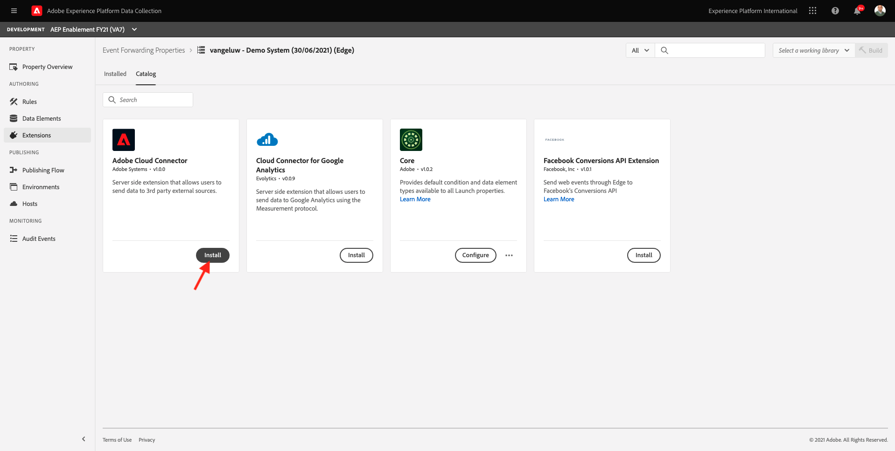
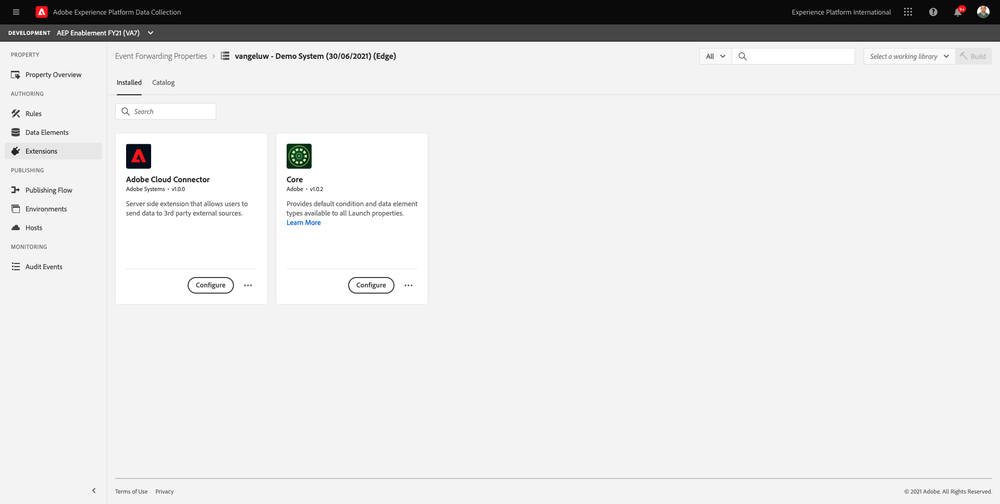
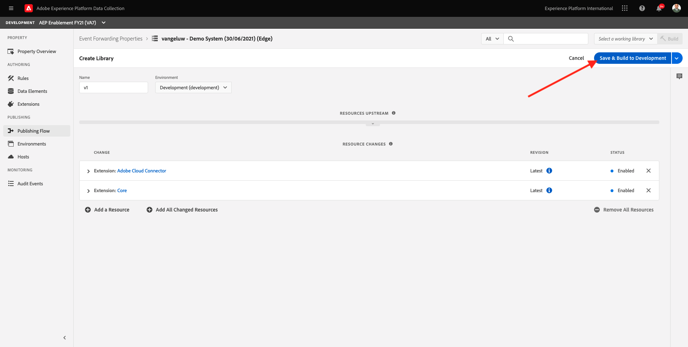
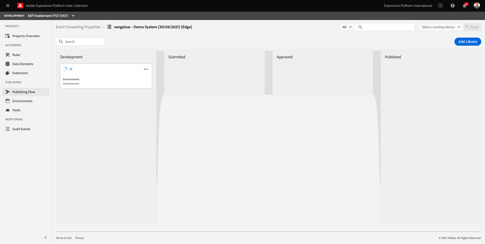

# 21.1 Create a Launch Server Side property

>[!NOTE]
>
>The Adobe Experience Platform Edge mobile extension is currently in BETA. Use of this extension is by invitation only. Please contact your Adobe Customer Success Manager to learn more and get access to the materials for this tutorial.

## 21.1.1 What is a Launch Server Side property?

Typically, when data is collected using Launch, it is collected on the **Client Side**. The **Client Side** is an environment such as a website or a mobile application. In Module 0 and Module 1, the configuration of a Launch Client Side property was discussed in depth and you implemented that Launch Client Side property onto your website and mobile application, so that data could be collected there when a customer was interacting with the website and mobile application.

When that interaction data is collected by the Launch Client Side property, a request is sent by the website or mobile app to Adobe's Edge. The Edge is Adobe's Data Collection environment and is the entrypoint for clickstream data into the Adobe ecosystem. From the Edge, that collected data is then sent to applications like Adobe Experience Platform, Adobe Analytics, Adobe Audience Manager or Adobe Target. 

With the addition of a Launch Server Side property, it's now possible to configure a Launch property that listens to incoming data on the Edge. When that Launch Server Side property that is running on the Edge sees incoming data, it has the ability to use that data and forward it to somewhere else. That somewhere else can now also be a non-Adobe external webhook, which makes it possible to send that data to for instance, your data lake of choice, a decisioning application, or any other application that has the ability to open up a webhook.

The configuration of a Launch Server Side property looks familiar to a Client Side property, with the ability to configure data elements and rules just like in the past with Launch Client Side properties. However, the way that data will be accessed and used will be slightly different, depending on your use case.

Let's start by creating the Launch Server Side property.

## 21.1.2 Create a Launch Server Side property

Go to [https://launch.adobe.com](https://launch.adobe.com).

In the top left corned, click **Client Side** and in the dropdown menu, click **Server Side**.

You'll then see an overview of all avaiable Server Side Launch properties. Click the **New Property** button.

You now need to enter a name for your Launch Server Side property. As a naming convention, use **ldap - Demo System (DD/MM/YYYY) (Edge)**. For instance, in this example, the name is **vangeluw - Demo System (14/11/2021) (Edge)**. Click **Save**.

You'll then be back in the list of Server Side Launch properties. Click to open the property you just created.

## 21.1.2 Configure the Adobe Cloud Connector extension

In the left menu, go to **Extensions**. You'll see that the **Core** extension is already configured.

Go to **Catalog**. You'll see the **Adobe Cloud Connector** extension. Click **Install** to install it.

The extension will then be added. There's no configuration to do at this step. You'll be sent back to the overview of installed extensions.

## 21.1.3 Deploy your Launch Server Side property

In the left menu, go to **Publishing Flow**. Click **Add New Library**.

Enter the name **v1** and click **+ Add All Changed Resources**. 

You'll then see this. Click **Save & Build for Development**.

Your library will then be built, which might take a 1-2 minutes.

Finally your library will be built and ready.

Next Step: [21.2 Update your Edge Configuration to make data available to your Launch Server Side property](./ex2.md)

[Go Back to Module 21](./aep_data_collection_ssf.md)

[Go Back to All Modules](./../../overview.md)
