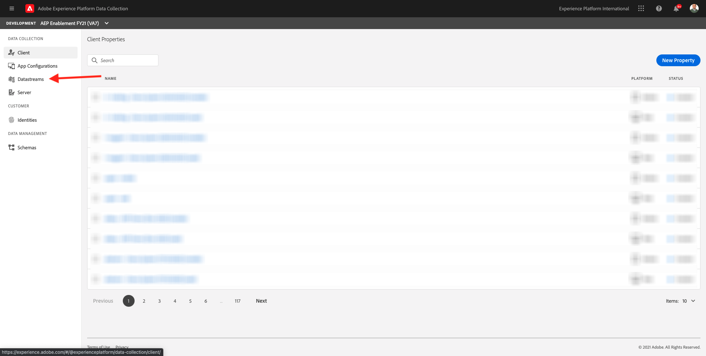
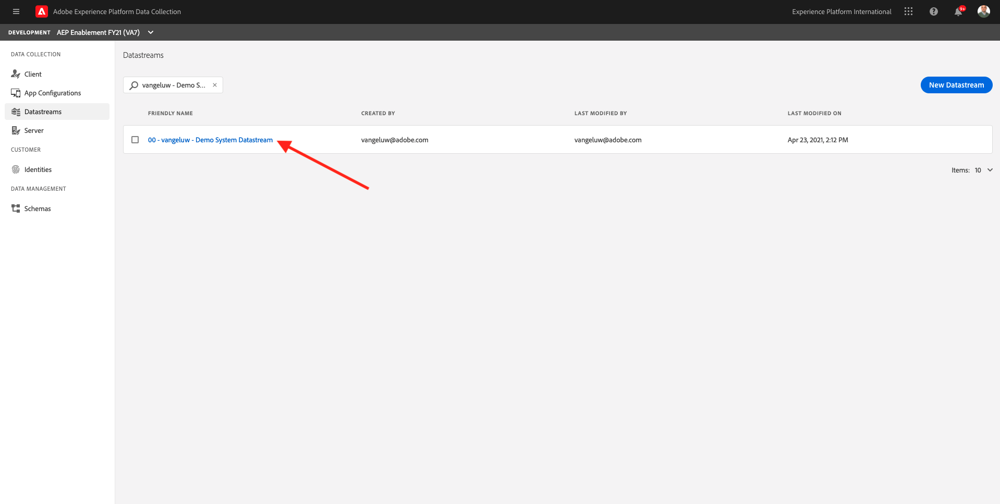
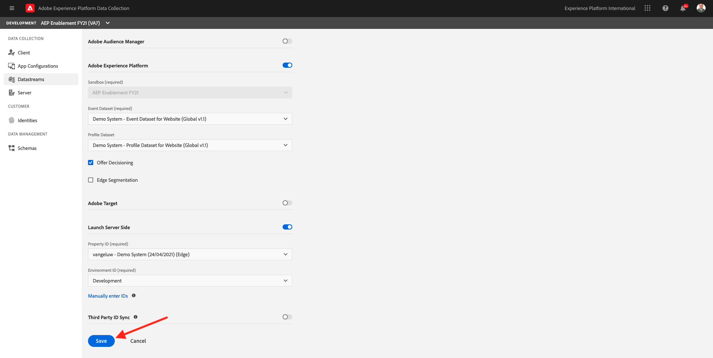
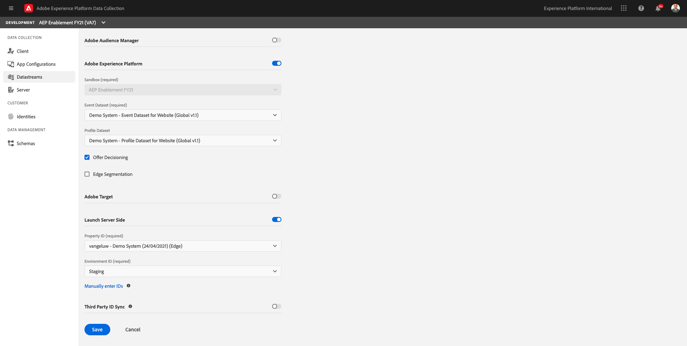
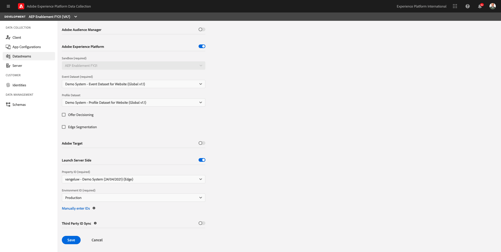

# 21.2 Update your Edge Configuration to make data available to your Launch Server Side property

>[!NOTE]
>
>The Adobe Experience Platform Edge mobile extension is currently in BETA. Use of this extension is by invitation only. Please contact your Adobe Customer Success Manager to learn more and get access to the materials for this tutorial.

## 21.2.1 Update your Edge Configuration ID

In [Exercise 0.2](./../../modules/module0/ex2.md), you created your own **[!UICONTROL Edge Configuration ID]**. You then used the name **ldap - Demo System Edge Configuration** and replaced **ldap** with your ldap.

In this exercise, you need to configure that **[!UICONTROL Edge Configuration ID]** to work with **[!DNL Launch Server Side Forwarding]**.

To do that, go to [https://launch.adobe.com/](https://launch.adobe.com/). You'll then see this. 

Click **[!UICONTROL Client Side]**. In the dropdown menu, click **[!UICONTROL Edge Configurations]**.

Search for your **[!UICONTROL Edge Configuration]**. Click your **[!UICONTROL Edge Configuration]** to open it.

You'll then see this. Click **[!UICONTROL Development Environment]**.

In the **[!UICONTROL Development Environment]**, you'll see your Adobe Experience Platform configuration. 

Scroll down to **[!DNL Launch Server Side]** and toggle the button to turn [!DNL Launch Server Side] on.

You can then select your **[!DNL Launch Server Side property ID]** from the dropdown list.

Seach and select the **[!DNL Launch Server Side property]** you created in the previous step.

After selecting the **[!DNL Launch Server Side property]**, you need to select the Environment ID. Select **[!DNL Development]**.

Click **[!DNL Save]**.

You'll then be back here.

Next, repeat the above steps for the other environments.

This should be your configuration for the **[!DNL Staging Environment]**.

And this should be your configuration for the **[!DNL Production Environment]**.

Your Edge Configuration is now ready to work with your **[!DNL Launch Server Side property]**.

Next Step: [21.3 Create and configure a custom webhook](./ex3.md)

[Go Back to Module 21](./aep_data_collection_ssf.md)

[Go Back to All Modules](./../../overview.md)
