# 21.3 Create and configure a custom webhook

>[!NOTE]
>
>The Adobe Experience Platform Edge mobile extension is currently in BETA. Use of this extension is by invitation only. Please contact your Adobe Customer Success Manager to learn more and get access to the materials for this tutorial.

## 21.3.1 Create your custom webhook

Go to [https://webhook.site/](https://webhook.site/). You'll see something like this:

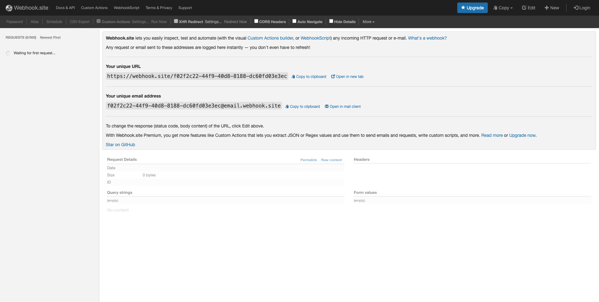

You'll see your unique URL, which looks like this: https://webhook.site/f02f2c22-44f9-40d8-8188-dc60fd03e3ec.

This website has now created this webhook for you, and you'll be able to configure this webhook in your **[!DNL Launch Server Side property]** to start testing the forwarding of events.

## 21.3.2 Update your Launch Server Side property: Create a Data Element

Go to [https://launch.adobe.com](https://launch.adobe.com).

In the top left corned, click **Client Side** and in the dropdown menu, click **Server Side**.

You'll then see an overview of all available Server Side Launch properties. Click to open the property you created in [exercise 21.1](./ex1.md).

In the left menu, go to **Data Elements**. Click **Create New Data Element**.

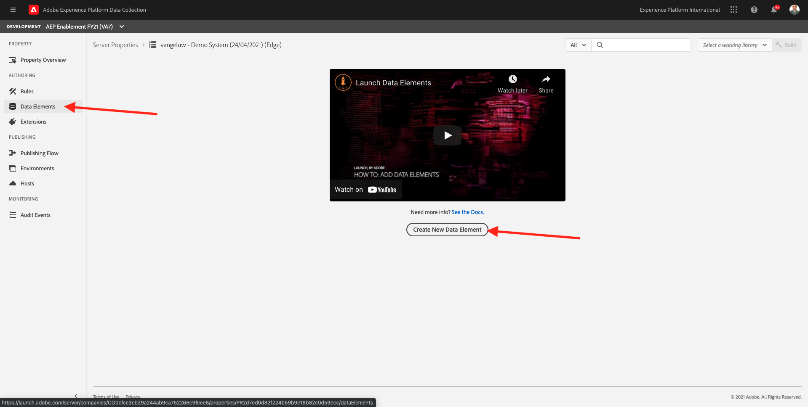

You'll then see a new data element to configure.

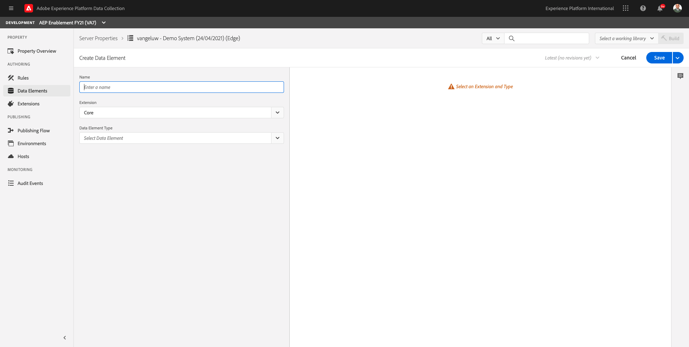

Make the following selection:

- As the **Name**, enter **XDM Event**.
- As the **Extension**, select **Core**.
- As the **Data Element Type**, select **Path**.
- As the **Path**, enter **arc.event.xdm**. By entering this path, you'll be filtering out the **XDM** section from the event payload that is sent by the website or mobile app into the Adobe Edge.

You'll now have this. Click **Save**.

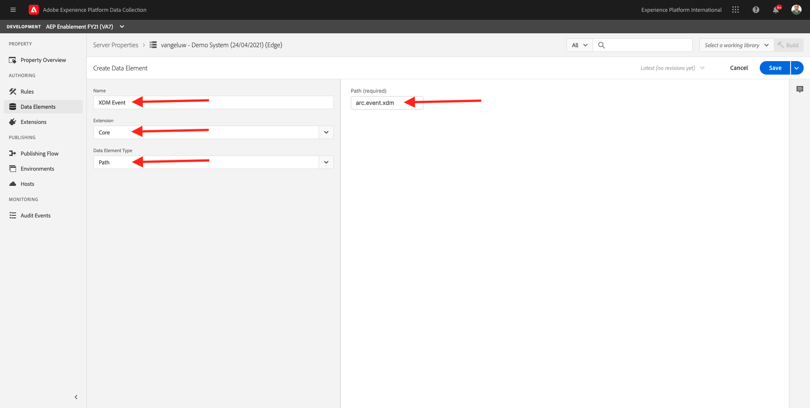

>[!NOTE]
>
>In the above path, a reference is made to **arc**. **arc** stands for Adobe Resource Context and **arc** always stands for the highest available object that is available in the Server Side context. Enrichments and transformations may be added to that **arc** object using Launch Server Side functions.
>
>In the above path, a reference is made to **event**. **event** stands for a unique event and Launch Server Side will always evaluate every event individually. Sometimes, you may see a reference to **events** in the payload sent by Web SDK Client Side, but in Launch Server Side, every event is evaluated individually.

## 21.3.3 Update your Launch Server Side property: Create a Rule

In the left menu, go to **Rules**. Click **Create New Rule**.

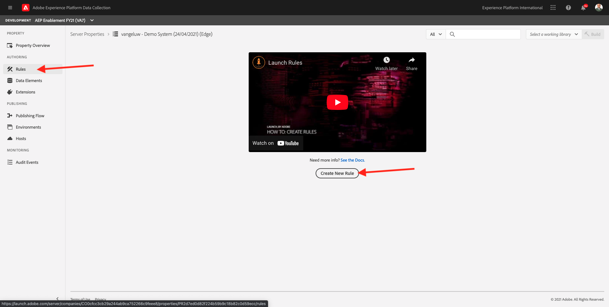

You'll then see a new rule to configure. 

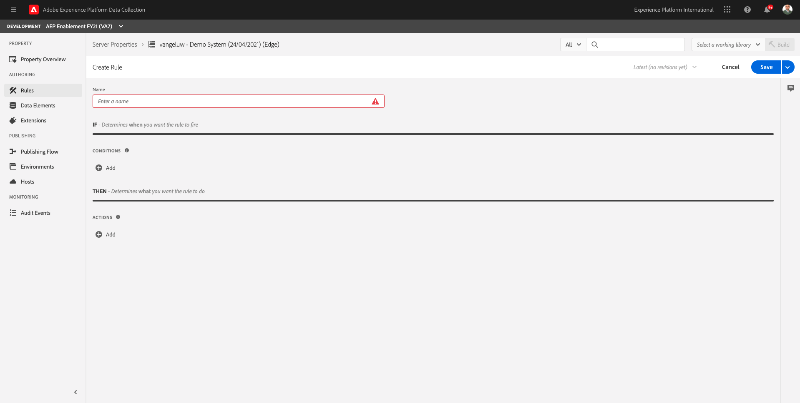

Enter the **Name**: **All Pages**.

For this exercise, you won't need to configure a condition. Instead, you'll setup an action. Click the **+ Add** button under **Actions**.

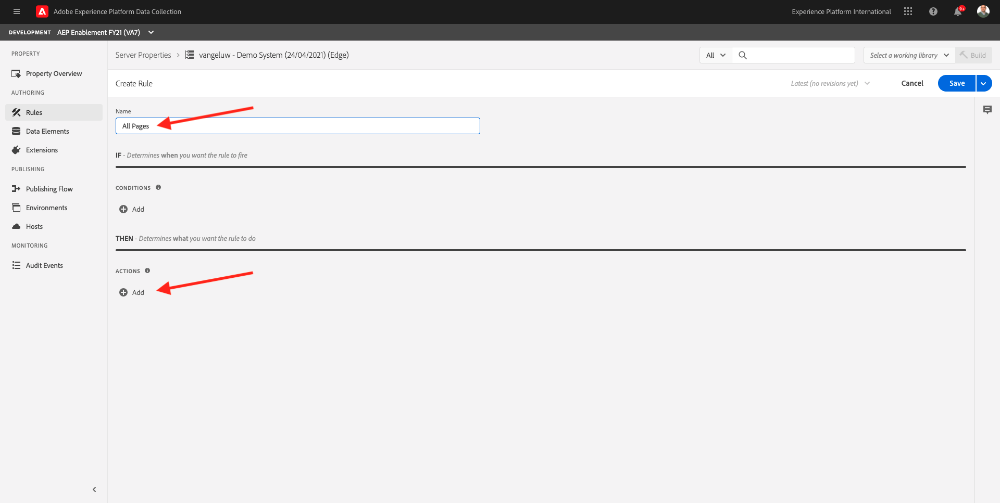

You'll then see this.

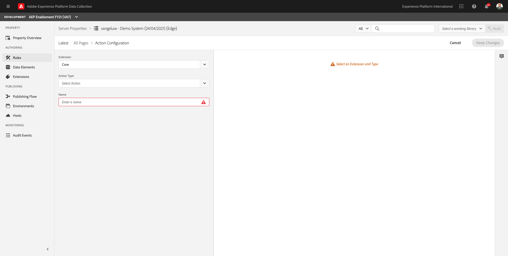

Make the following selection:

- Select the **Extension**: **Adobe Cloud Connector**.
- Select the **Action Type**: **Make Fetch Call**.

That should give you this **Name**: **Adobe Cloud Connector - Make Fetch Call**. You should now see this:

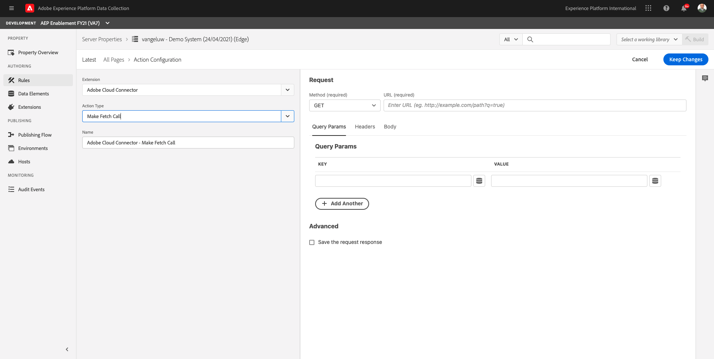

Next, configure the following:

- Change the request protocol from GET to **POST**
- Enter the URL of the custom webhook you created in one of the previous steps on the [https://webhook.site/](https://webhook.site/) website, which looks like this: https://webhook.site/f02f2c22-44f9-40d8-8188-dc60fd03e3ec

You should now have this. Next, go to **Body**.

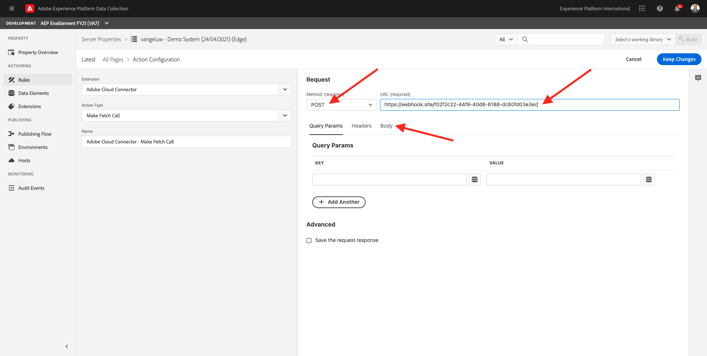

You'll then see this. Click the Data Element icon as indicated below.

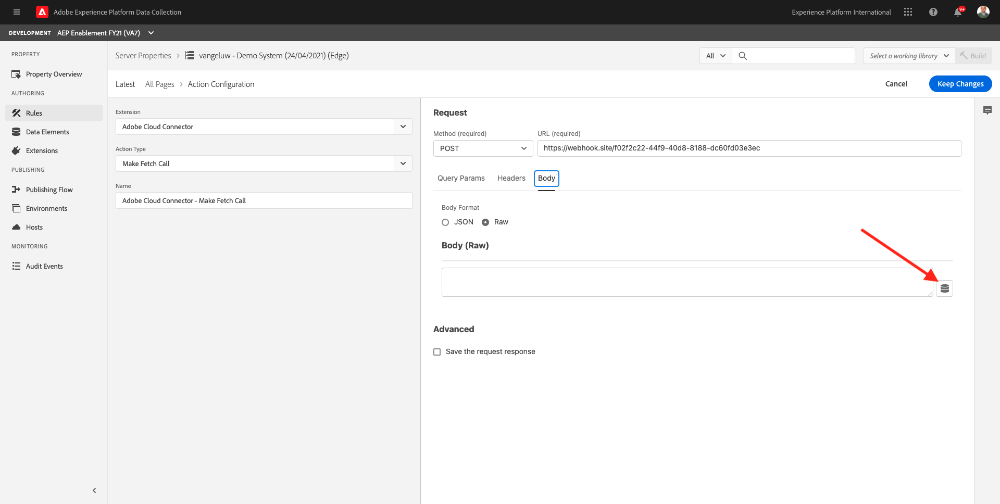

In the popup, select the data element **XDM Event** which you created in the previous step. Click **Select**.

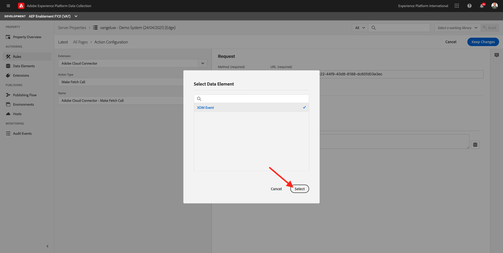

You'll then see this. Click **Keep Changes**.

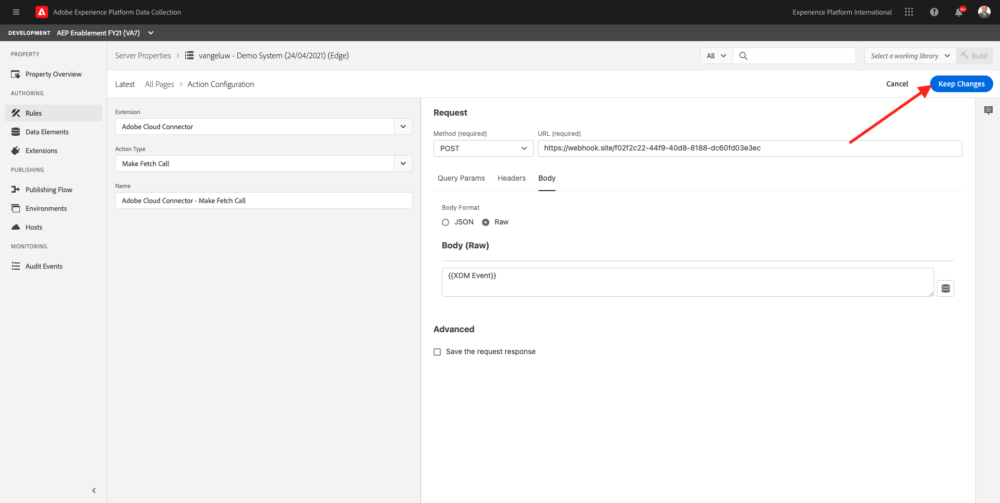

You'll then see this. Click **Save**.

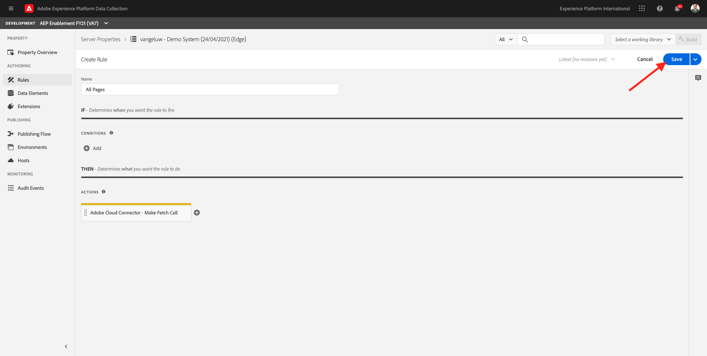

You've now configured your first rule in a Launch Server Side property. Go to **Publishing Flow** to publish your changes.

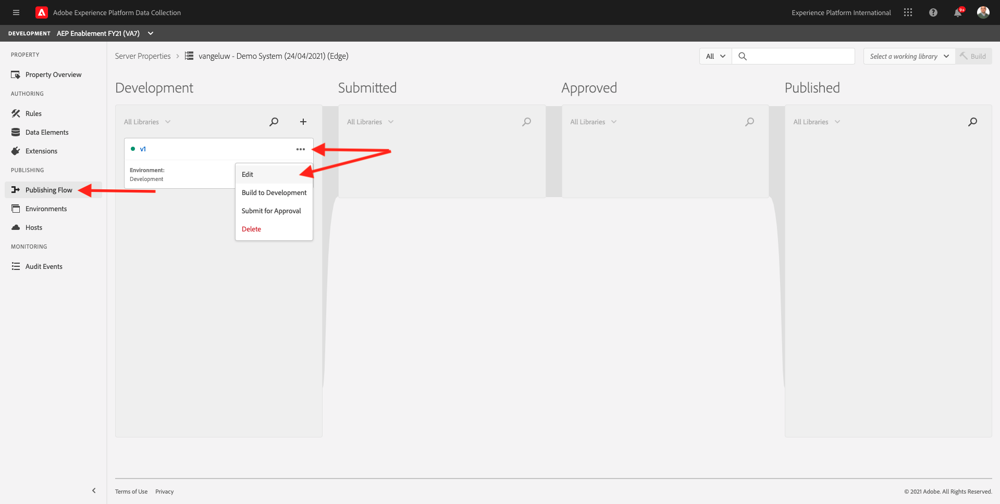

Open your Development library **v1** by clicking **Edit** as indicated.

Click the **Add All Changed Resources** button, after which you'll see your Rule and Data Element appear in this library. Next, click **Save & Build for Development**. Your changes are now being deployed.

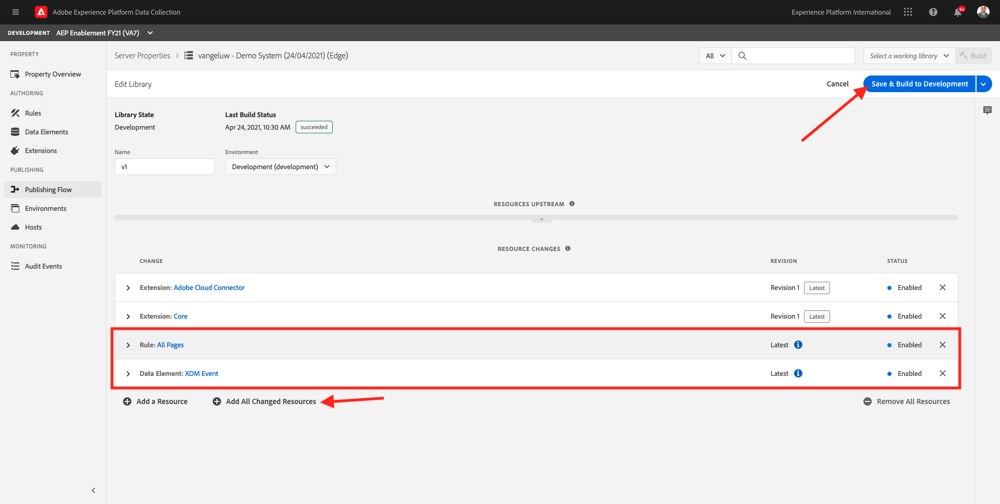

After a couple of minutes, you'll see that the deployment is done and ready to be tested.

## 21.3.4 Test your configuration

Open a new, clean incognito browser window and go to [https://public.aepdemo.net](https://public.aepdemo.net). 

You'll then see this. 

Enter your Configuration ID and click **Load Configuration**. Your configuration is then loaded.

Scroll down and click **Save Configuration**.

You'll then be redirected to the Admin homepage. Go to **Select LDAP**. Select your LDAP and click **Save**.

You'll then be redirected to the Admin homepage. Go to **Select Brand** and select the brand **Luma**, click **Save**.

You'll then be redirected to the Admin homepage. Click the **Luma** logo.

You'll then see the Luma homepage.

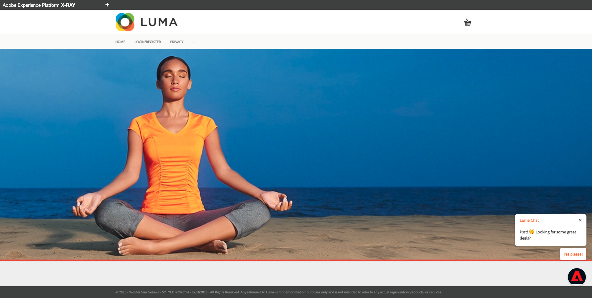

When you open up your browser Developer View, you can inspect Network requests as indicated below. When you use the filter **interact**, you'll see the network requests that are sent by Launch Client Side to the Adobe Edge.

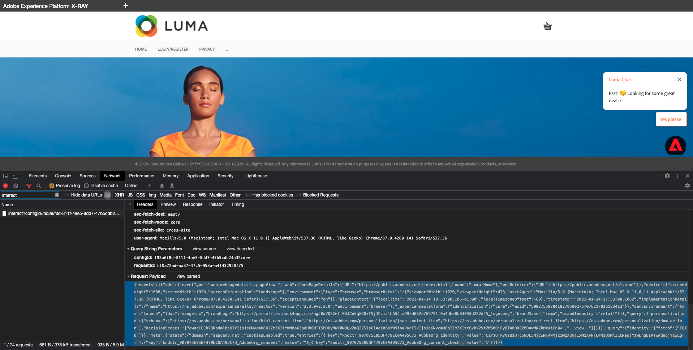

If you select the raw payload, go to [https://jsonformatter.org/json-pretty-print](https://jsonformatter.org/json-pretty-print) and paste the payload. Click **Make Pretty**. You'll then see the JSON payload, the **events** object and the **xdm** object. In one of the previous steps, when you defined the Data Element, you used the reference **arc.event.xdm**, which will result in you parsing out the **xdm** object of this payload.

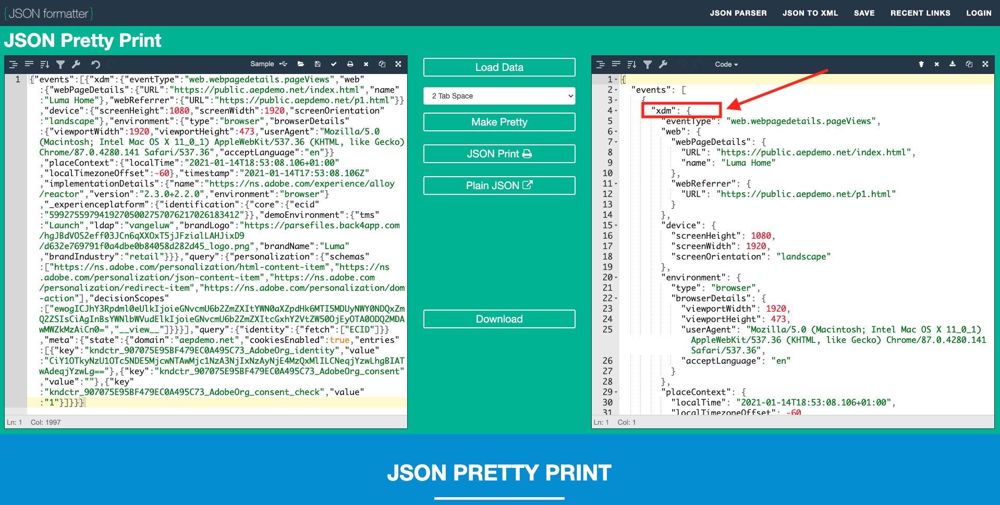

Switch your view to the website [https://webhook.site/](https://webhook.site/) which you used in one of the previous steps. You should now have a view similar to this one, with network requests being shown in the left menu. You're seeing the **xdm** payload that was filter out of the network request that was shown above. 

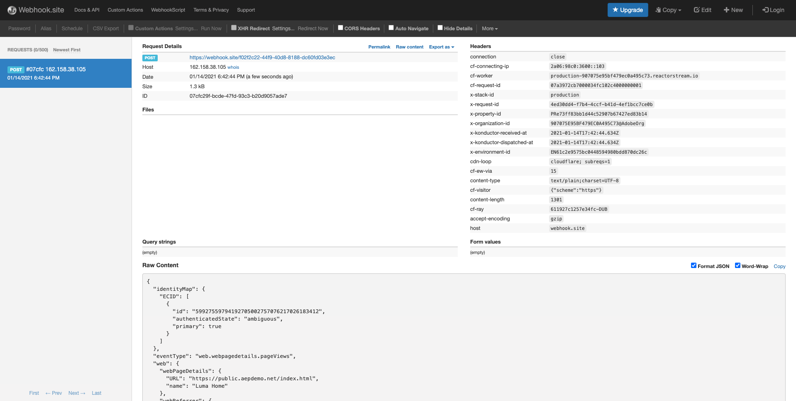

Scroll down a bit in the payload to find the page name, which in this case is **Luma Home**.

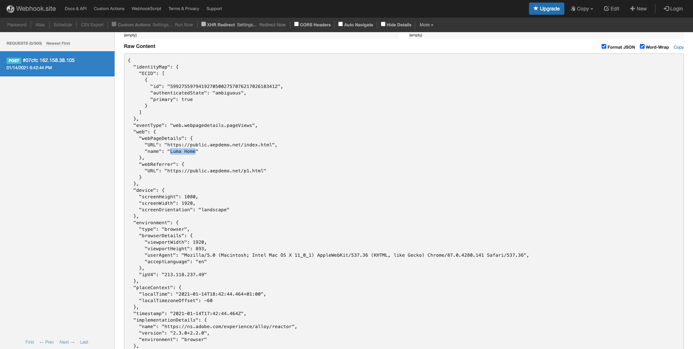

If you now navigate across the website, you'll see additional network requests becoming available on this custom webhook in real-time.

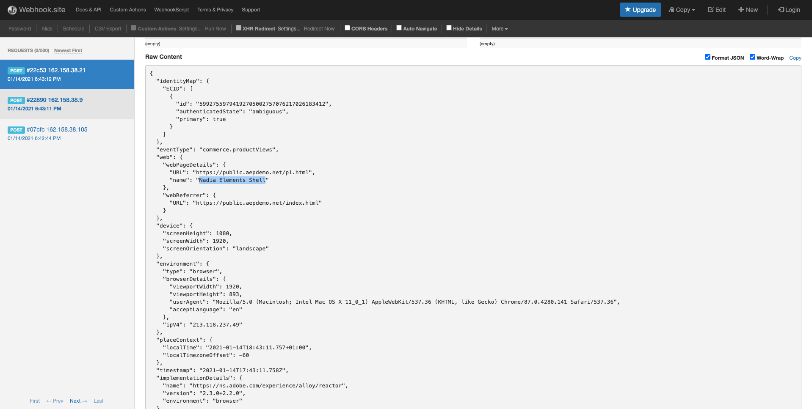

You've now configured the Server Side Forwarding of Web SDK/XDM payloads to an external custom webhook. In the next exercises, you'll configure a similar approach, and you'll be sending that same data towards Google and Microsoft Azure environments.

Next Step: [21.4 Create and configure a Google Cloud Function](./ex4.md)

[Go Back to Module 21](./aep-data-collection-ssf.md)

[Go Back to All Modules](./../../overview.md)
