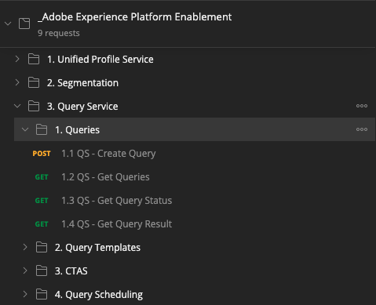
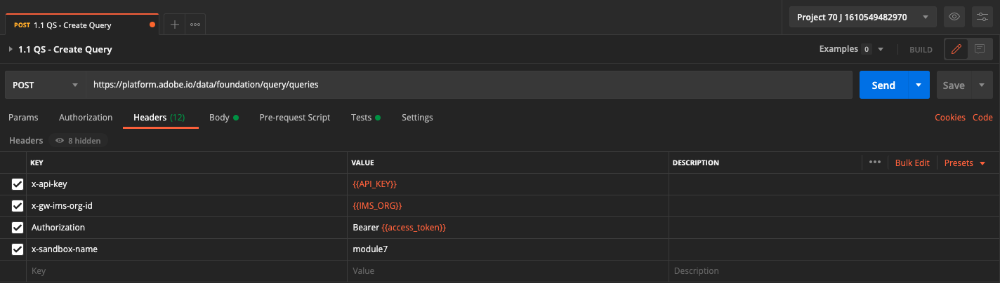
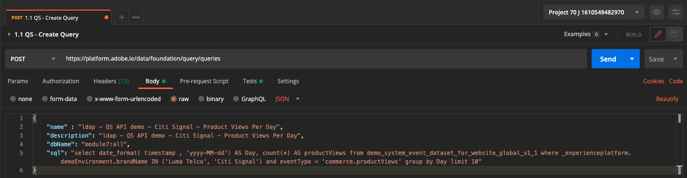
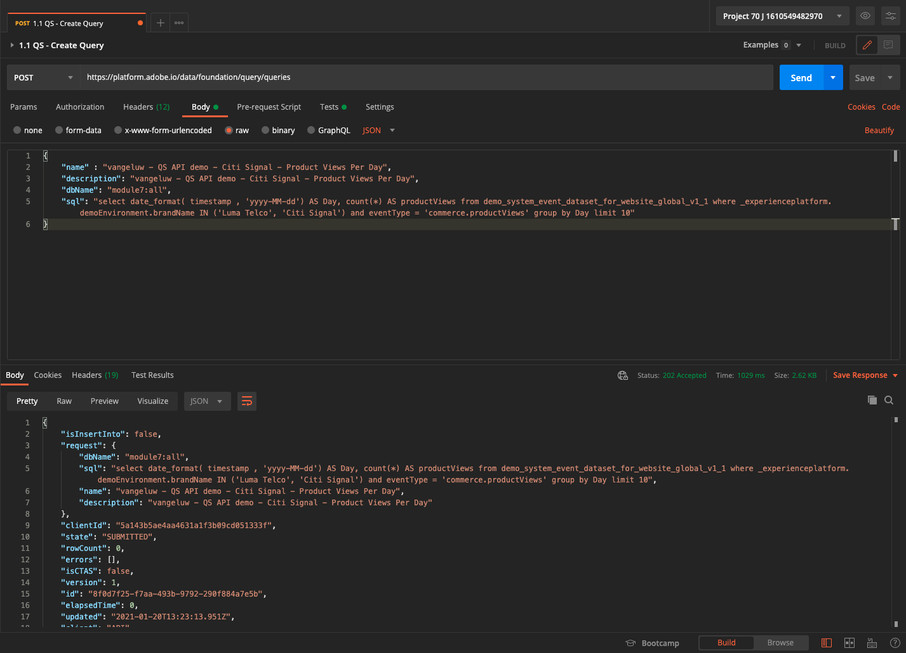
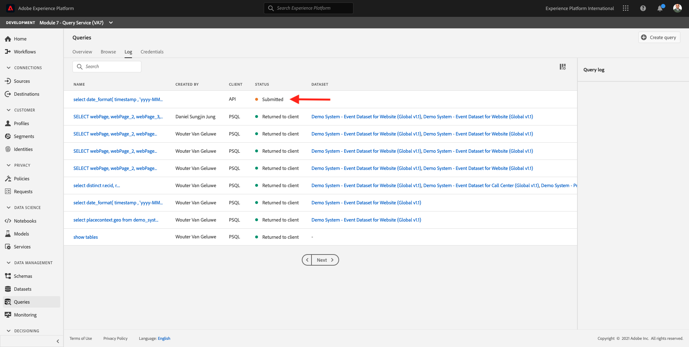
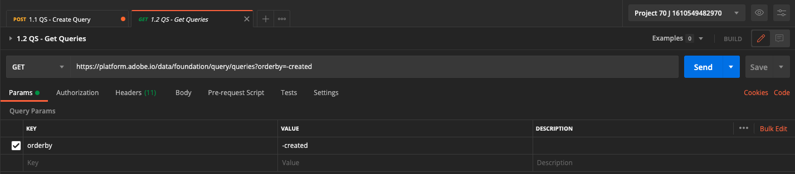
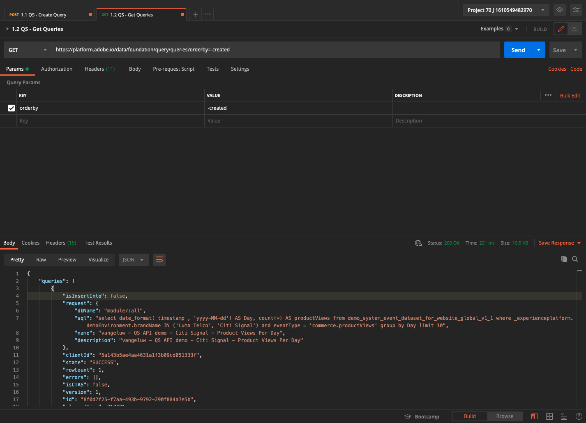
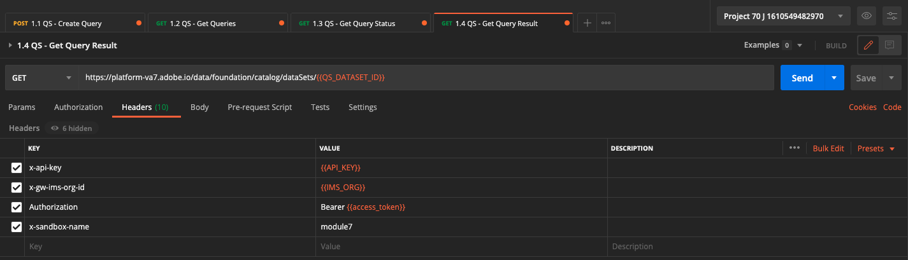

# 7.7 Query Service API

## Objective

- Use the Query Service API to manage query templates and query schedules

## Context

In this exercise you will execute API calls to manage query templates and query schedules using a Postman collection. You will define query templates, execute regular queries and CTAS queries. A **CTAS** query (create table as select query) stores its resultset in an explicit dataset. While regular queries are stored in a implicit (or system generated) dataset, that is typically exported in parquet file format.

## Documentation

- [Adobe Experience Platform Query Service Help](https://docs.adobe.com/content/help/en/experience-platform/query/api/getting-started.html)
- [Query Service API](https://www.adobe.io/apis/experienceplatform/home/api-reference.html#!acpdr/swagger-specs/qs-api.yaml)

## 7.7.1 Query Service API

The Query Service API lets you manage non-interactive queries against the Adobe Experience Platform data-lake. 

Non-interactive means that a request to execute a query will not result in an immediate response. The query will be processed and its resultset will be stored in an implicit or explicit (CTAS: create table as select) dataset. 

## 7.7.2 Example Query

As an example query we will use the first query listed in [7.3 - Queries, queries, queries...  and churn analysis](./ex3.md):

How many product views do we have on a daily basis? 

**SQL**

```sql
select date_format( timestamp , 'yyyy-MM-dd') AS Day,
       count(*) AS productViews
from   demo_system_event_dataset_for_website_global_v1_1
where  --aepTenantId--.demoEnvironment.brandName IN ('Luma Telco', 'Citi Signal')
and eventType = 'commerce.productViews'
group by Day
limit 10;
```

## 7.7.3 Queries

Open Postman on your computer. As part of Module 3, you created a Postman environment and imported a Postman collection. Follow the instructions in [Exercise 3.3.3](./../module3/ex3.md) in case you haven't done that yet. 

As part of the Postman collection you imported, you'll see a folder **3. Query Service**. If you don't see this folder, please redownload the [Postman collection](../../assets/postman/postman_module3.zip) and reimport that collection in Postman as instructed in [Exercise 3.3.3](./../module3/ex3.md).



>[!NOTE]
>
>At this moment, only the folder **1. Queries** contains requests. Other requests will be added at a layer stage.

Open that folder and get to know the Query Service API calls to execute, monitor and download the query resultset.

A POST call to [/query/queries] with the following payload will trigger the execution of our query;

### 7.7.3.1 Create Query

Click on the request named **1.1 QS - Create Query** and go to **Headers**. You'll then see this:



Let's focus on this header field:

| Key      | Value |
| ----------- | ----------- |
| x-sandbox-name      |`--aepSandboxId--`|

>[!NOTE]
>
>You need to specify the name of the Adobe Experience Platform sandbox you're using. The header field **x-sandbox-name** should be `--aepSandboxId--`.

Go the the **Body** section of this request. In the **Body** of this request, you'll see the following:



```sql
{
    "name" : "ldap - QS API demo - Citi Signal - Product Views Per Day",
	"description": "ldap - QS API demo - Citi Signal - Product Views Per Day",
	"dbName": "aepenablementfy21:all",
	"sql": "select date_format( timestamp , 'yyyy-MM-dd') AS Day, count(*) AS productViews from demo_system_event_dataset_for_website_global_v1_1 where _experienceplatform.demoEnvironment.brandName IN ('Luma Telco', 'Citi Signal') and eventType = 'commerce.productViews' group by Day limit 10"
}
```

Attention: please update the variable **name** in the below request by replacing **ldap** with your specific **ldap**.

After adding your specific **ldap**, the Body should look similar to this:

```json
{
    "name" : "vangeluw - QS API demo - Citi Signal - Product Views Per Day",
	"description": "vangeluw - QS API demo - Citi Signal - Product Views Per Day",
	"dbName": "aepenablementfy21:all",
	"sql": "select date_format( timestamp , 'yyyy-MM-dd') AS Day, count(*) AS productViews from demo_system_event_dataset_for_website_global_v1_1 where _experienceplatform.demoEnvironment.brandName IN ('Luma Telco', 'Citi Signal') and eventType = 'commerce.productViews' group by Day limit 10"
}
```

>[!NOTE]
>
>The key **dbName** in the above JSON body refers to the sandbox that is used in your Adobe Experience Platform instance. If you're using the PROD sandbox, the dbName should be **prod:all**, if you use another sandbox like for instance **aepenablementfy21**, the dbName should be equal to **aepenablementfy21:all**.

Next, click the blue **Send** button to create the segment and view the results of that.



When successful the POST request will return the following response:

```json
{
    "isInsertInto": false,
    "request": {
        "dbName": "aepenablementfy21:all",
        "sql": "select date_format( timestamp , 'yyyy-MM-dd') AS Day, count(*) AS productViews from demo_system_event_dataset_for_website_global_v1_1 where _experienceplatform.demoEnvironment.brandName IN ('Luma Telco', 'Citi Signal') and eventType = 'commerce.productViews' group by Day limit 10",
        "name": "vangeluw - QS API demo - Citi Signal - Product Views Per Day",
        "description": "vangeluw - QS API demo - Citi Signal - Product Views Per Day"
    },
    "clientId": "5a143b5ae4aa4631a1f3b09cd051333f",
    "state": "SUBMITTED",
    "rowCount": 0,
    "errors": [],
    "isCTAS": false,
    "version": 1,
    "id": "7fe0a689-6b65-4a7e-97cc-dd849611246a",
    "elapsedTime": 0,
    "updated": "2021-01-20T07:17:40.137Z",
    "client": "API",
    "userId": "A3392DB95FFF08EE0A495E87@techacct.adobe.com",
    "created": "2021-01-20T07:17:40.137Z",
    "_links": {
        "self": {
            "href": "https://platform-va7.adobe.io/data/foundation/query/queries/7fe0a689-6b65-4a7e-97cc-dd849611246a",
            "method": "GET"
        },
        "soft_delete": {
            "href": "https://platform-va7.adobe.io/data/foundation/query/queries/7fe0a689-6b65-4a7e-97cc-dd849611246a",
            "method": "PATCH",
            "body": "{ \"op\": \"soft_delete\"}"
        },
        "cancel": {
            "href": "https://platform-va7.adobe.io/data/foundation/query/queries/7fe0a689-6b65-4a7e-97cc-dd849611246a",
            "method": "PATCH",
            "body": "{ \"op\": \"cancel\"}"
        }
    }
}
```

The current **state** of the query is **SUBMITTED**, once executed its state will become **SUCCESS**.

You can also lookup submitted queries via Adobe Experience Platform UI, open [Adobe Experience Platform](https://experience.adobe.com/#/@experienceplatform/platform/home), navigate to **Queries**, to **Log** and select your query:



### 7.7.3.2 Get Queries

Click on the request named **1.2 QS - Get Queries** and go to **Headers**. You'll then see this:


Let's focus on this header field:

| Key      | Value |
| ----------- | ----------- |
| x-sandbox-name      |`--aepSandboxId--`|

>[!NOTE]
>
>You need to specify the name of the Adobe Experience Platform sandbox you're using. The header field **x-sandbox-name** should be `--aepSandboxId--`.

Go to **Params**. You'll then see this:



The **orderby** parameter allows you to specify a sort order based on the **created** property. Notice the **'-'** sign in front of created, which means that the order in which the list of queries is returned will be using their created date in **descending** order. Your query should be on top of the list.

Next, click the blue **Send** button to create the segment and view the results of that.



When successful the request will return a response similar to the below one. The **state** of the response may be **SUBMITTED**, **IN_PROGRESS** or **SUCCESS**. It may take several minutes before the query has a **SUCCESS** state. You can repeat sending this request several times, until you see the **SUCCESS** state.

```json
{
    "queries": [
        {
            "isInsertInto": false,
            "request": {
                "dbName": "aepenablementfy21:all",
                "sql": "select date_format( timestamp , 'yyyy-MM-dd') AS Day, count(*) AS productViews from demo_system_event_dataset_for_website_global_v1_1 where _experienceplatform.demoEnvironment.brandName IN ('Luma Telco', 'Citi Signal') and eventType = 'commerce.productViews' group by Day limit 10",
                "name": "vangeluw - QS API demo - Citi Signal - Product Views Per Day",
                "description": "vangeluw - QS API demo - Citi Signal - Product Views Per Day"
            },
            "clientId": "5a143b5ae4aa4631a1f3b09cd051333f",
            "state": "SUCCESS",
            "rowCount": 10,
            "errors": [],
            "isCTAS": false,
            "version": 1,
            "id": "7fe0a689-6b65-4a7e-97cc-dd849611246a",
            "elapsedTime": 299612,
            "updated": "2021-01-20T07:22:39.749Z",
            "client": "API",
            "userId": "A3392DB95FFF08EE0A495E87@techacct.adobe.com",
            "created": "2021-01-20T07:17:40.137Z",
            "_links": {
                "self": {
                    "href": "https://platform-va7.adobe.io/data/foundation/query/queries/7fe0a689-6b65-4a7e-97cc-dd849611246a",
                    "method": "GET"
                },
                "soft_delete": {
                    "href": "https://platform-va7.adobe.io/data/foundation/query/queries/7fe0a689-6b65-4a7e-97cc-dd849611246a",
                    "method": "PATCH",
                    "body": "{ \"op\": \"soft_delete\"}"
                },
                "referenced_datasets": [
                    {
                        "id": "5fd1a9dee3224d194cdfe786",
                        "href": "https://platform-va7.adobe.io/data/foundation/catalog/dataSets/5fd1a9dee3224d194cdfe786"
                    }
                ]
            }
        }
     ]
    },
    "version": 1
}
```

When the state is **SUCCESS**, please continue with the next request.

### 7.7.3.3 Get Query Status

Click on the request named **1.3 QS - Get Query Status** and go to **Headers**. You'll then see this:


Let's focus on this header field:

| Key      | Value |
| ----------- | ----------- |
| x-sandbox-name      |`--aepSandboxId--`|

>[!NOTE]
>
>You need to specify the name of the Adobe Experience Platform sandbox you're using. The header field **x-sandbox-name** should be `--aepSandboxId--`.

Next, click the blue **Send** button to create the segment and view the results of that.


When successful the request will return a response similar to the below one.

```json
{
    "isInsertInto": false,
    "request": {
        "dbName": "aepenablementfy21:all",
        "sql": "select date_format( timestamp , 'yyyy-MM-dd') AS Day, count(*) AS productViews from demo_system_event_dataset_for_website_global_v1_1 where _experienceplatform.demoEnvironment.brandName IN ('Luma Telco', 'Citi Signal') and eventType = 'commerce.productViews' group by Day limit 10",
        "name": "vangeluw - QS API demo - Citi Signal - Product Views Per Day",
        "description": "vangeluw - QS API demo - Citi Signal - Product Views Per Day"
    },
    "clientId": "5a143b5ae4aa4631a1f3b09cd051333f",
    "state": "SUCCESS",
    "rowCount": 10,
    "errors": [],
    "isCTAS": false,
    "version": 1,
    "id": "7fe0a689-6b65-4a7e-97cc-dd849611246a",
    "elapsedTime": 299612,
    "updated": "2021-01-20T07:22:39.749Z",
    "client": "API",
    "userId": "A3392DB95FFF08EE0A495E87@techacct.adobe.com",
    "created": "2021-01-20T07:17:40.137Z",
    "_links": {
        "self": {
            "href": "https://platform-va7.adobe.io/data/foundation/query/queries/7fe0a689-6b65-4a7e-97cc-dd849611246a",
            "method": "GET"
        },
        "soft_delete": {
            "href": "https://platform-va7.adobe.io/data/foundation/query/queries/7fe0a689-6b65-4a7e-97cc-dd849611246a",
            "method": "PATCH",
            "body": "{ \"op\": \"soft_delete\"}"
        },
        "referenced_datasets": [
            {
                "id": "5fd1a9dee3224d194cdfe786",
                "href": "https://platform-va7.adobe.io/data/foundation/catalog/dataSets/5fd1a9dee3224d194cdfe786"
            }
        ]
    }
}
```

When a query reaches the state of **SUCCESS**, the response will also indicate the number of rows retrieved by the query via the **rowCount** property. In our example 10 rows are returned by the query. Let's see in the next section how we can retrieve the 10 rows.

### 7.7.3.4 Retrieve Query Result

The **SUCCESS** response above includes a **referenced_datasets** property, which points to the implicit dataset which stores the query result. To get access to the result, we use its **href** or **id** property. 

Click on the request named **1.4 QS - Get Query Result** and go to **Headers**. You'll then see this:



Let's focus on this header field:

| Key      | Value |
| ----------- | ----------- |
| x-sandbox-name      |`--aepSandboxId--`|

>[!NOTE]
>
>You need to specify the name of the Adobe Experience Platform sandbox you're using. The header field **x-sandbox-name** should be `--aepSandboxId--`.

Next, click the blue **Send** button to create the segment and view the results of that.

The response of this request will point to the dataset files:

```json
{
    "5fd1a9dee3224d194cdfe786": {
        "description": "Demo System - Event Dataset for Website (Global v1.1)",
        "enableErrorDiagnostics": false,
        "name": "Demo System - Event Dataset for Website (Global v1.1)",
        "namespace": "ACP",
        "state": "DRAFT",
        "tags": {
            "adobe/siphon/partition/definition": [
                "day(timestamp, _ACP_DATE)",
                "identity(_ACP_BATCHID)"
            ],
            "aep/siphon/partitions": [
                "_ACP_DATE",
                "_ACP_BATCHID"
            ],
            "acp_granular_plugin_validation_flags": [
                "identity:enabled",
                "profile:enabled"
            ],
            "adobe/siphon/buffered-promotion-recency": [
                "live"
            ],
            "adobe/siphon/use-buffered-promotion": [
                "true"
            ],
            "adobe/pqs/table": [
                "demo_system_event_dataset_for_website_global_v1_1"
            ],
            "aep/siphon/expire-snapshot-timestamp": [
                "1611033992486"
            ],
            "acp_granular_validation_flags": [
                "requiredFieldCheck:enabled"
            ],
            "aep/siphon/cleanup/trash/timestamp": [
                "1611039313990"
            ],
            "acp_validationContext": [
                "enabled"
            ],
            "adobe/siphon/table/format": [
                "iceberg"
            ],
            "unifiedProfile": [
                "enabled:true",
                "enabledAt:2020-12-10 04:53:54"
            ],
            "aep/siphon/cleanup/meta/timestamp": [
                "1611039314278"
            ],
            "unifiedIdentity": [
                "enabled:true"
            ]
        },
        "imsOrg": "907075E95BF479EC0A495C73@AdobeOrg",
        "sandboxId": "68b9c64d-0dde-4db5-b9c6-4d0ddebdb5a7",
        "lastBatchId": "01EWFBKKT7GAYH8F9VMXQB7XBD",
        "lastBatchStatus": "loading",
        "lastSuccessfulBatch": "01EWEW2G4PP4RFPXB9BJS4SYT9",
        "lastFailedBatch": "01ES98DJS4CY7NYNTS86K0DFE6",
        "version": "1.0.99",
        "created": 1607576030348,
        "updated": 1611128229696,
        "createdClient": "750e24ee855b4ac18ccc4f4817f96ee1",
        "createdUser": "3A260B485E909A170A495E76@techacct.adobe.com",
        "updatedUser": "acp_foundation_dataTracker@AdobeID",
        "viewId": "5fd1a9dee3224d194cdfe787",
        "fileDescription": {
            "containerFormat": "parquet",
            "format": "parquet",
            "persisted": true
        },
        "files": "@/dataSets/5fd1a9dee3224d194cdfe786/views/5fd1a9dee3224d194cdfe787/files",
        "schemaMetadata": {
            "delta": [],
            "gdpr": []
        },
        "schemaRef": {
            "contentType": "application/vnd.adobe.xed-full+json;version=1",
            "id": "https://ns.adobe.com/experienceplatform/schemas/d9b88a044ad96154637965a97ed63c7b20bdf2ab3b4f642e"
        }
    }
}
```

>[!NOTE]
>
>More exercises will be added soon to help you interact with the Query Service API.

Next Step: [Summary and benefits](./summary.md)

[Go Back to Module 7](./query-service.md)

[Go Back to All Modules](../../overview.md)

