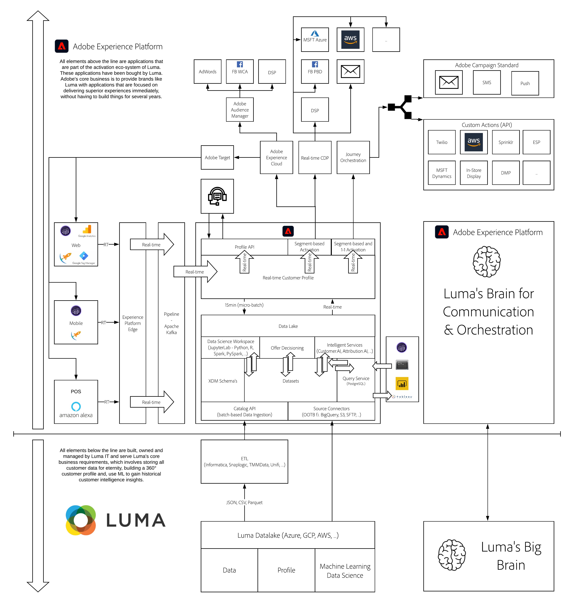

# Architecture

## Learning Objectives

- Learn how to describe the architecture behind Adobe Experience Platform and this tutorial
- Understand the positioning of Adobe Experience Platform in your organization's ecosystem.

## YouTube

You can find additional interesting videos [on our YouTube channel](https://www.youtube.com/channel/UCUKG2dkZ9pYuZUPebQ21jUw).

## Adobe Experience Platform Architecture Overview

>[!VIDEO](https://video.tv.adobe.com/v/35266?quality=12&learn=on)

## Architecture Overview

Here's the image of the whiteboard as you've seen it being created in the above video:

Here's the link to the Lucidchart document which you can copy and reuse if desired:

[Lucidchart Architecture](https://lucid.app/documents/view/69c2a0e4-9135-47d7-ae86-7f88cec9bc34)

[Go Back to All Modules](./overview.md)
