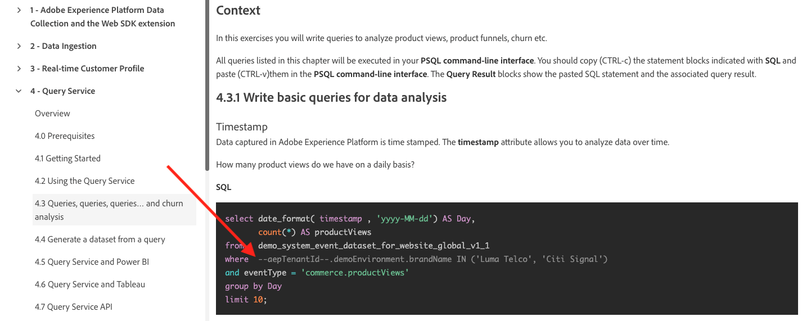
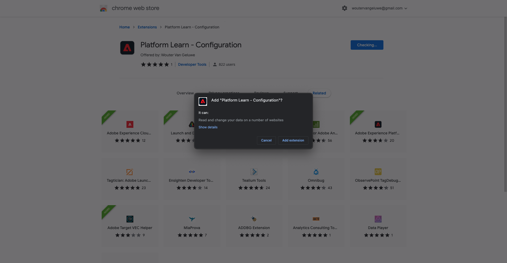
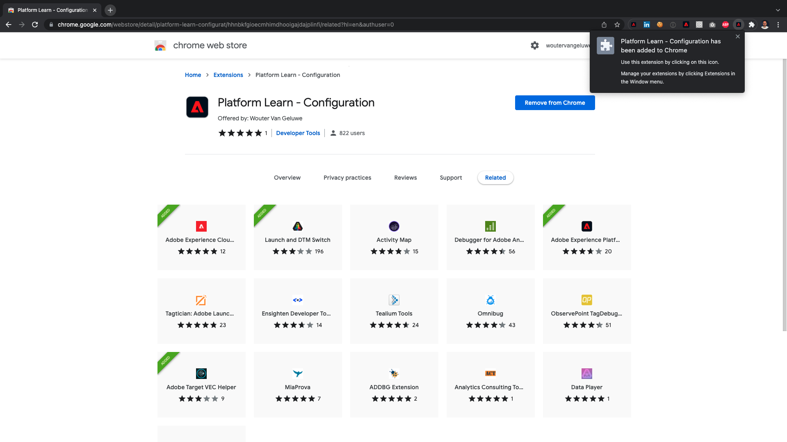
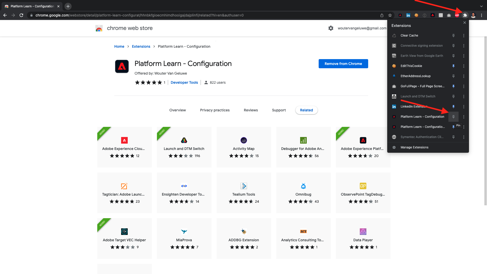
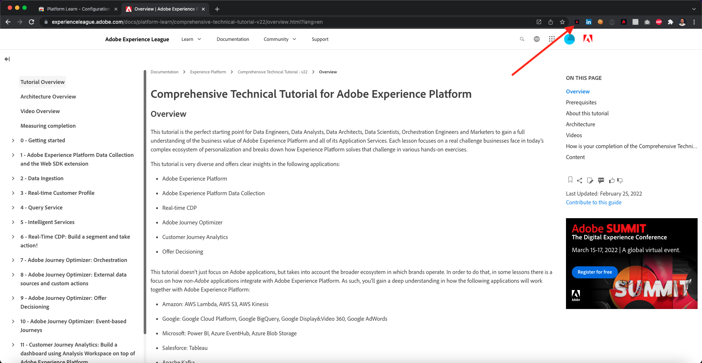
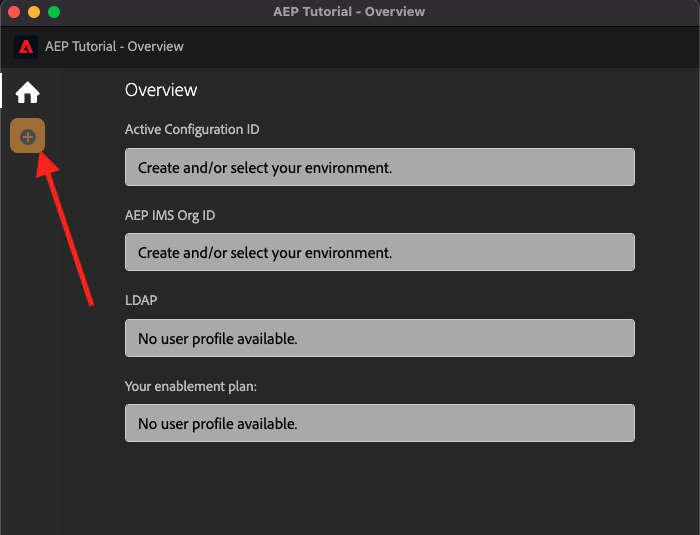
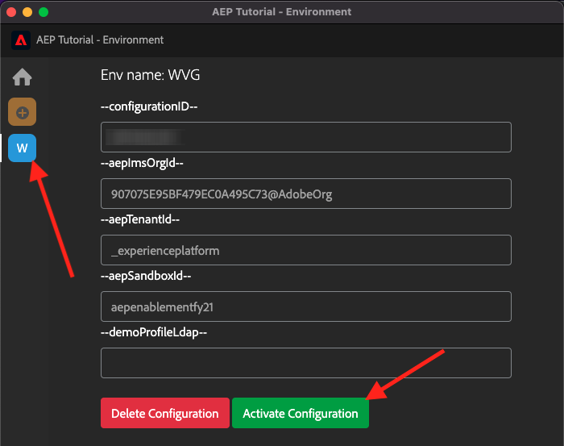
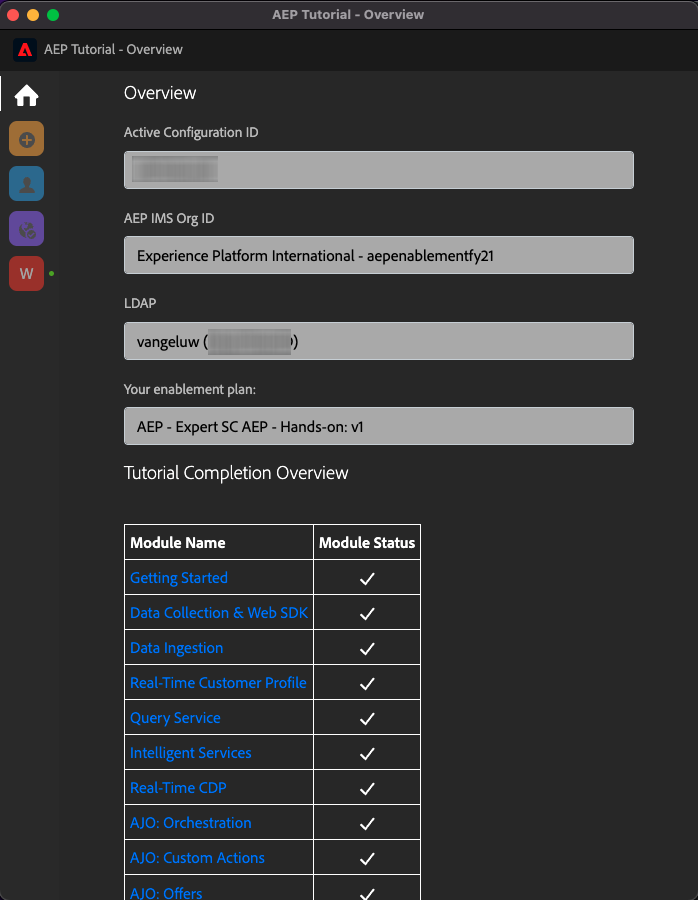
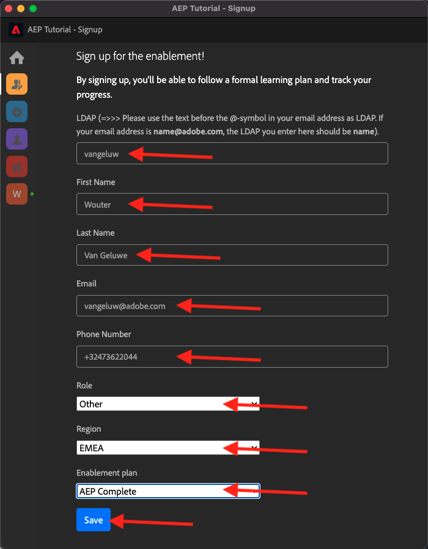
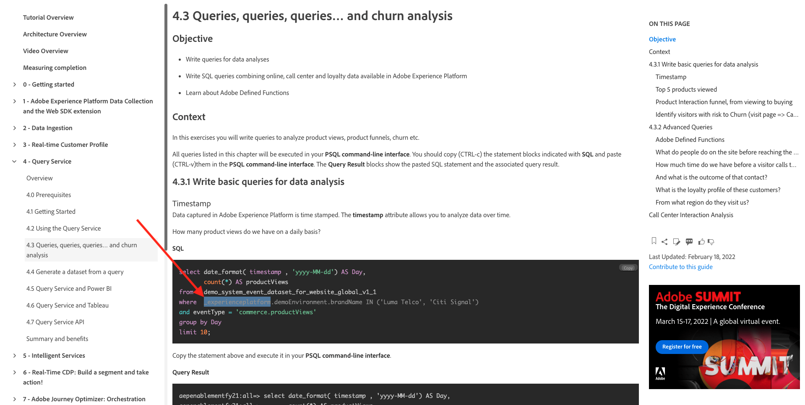

# 0.1 Install the Chrome extension for the Experience League documentation

## 0.1.1 Why did we create a Chrome extension?

The documentation has been made generic so that it can easily be reused by anyone, using any Adobe Experience Platform instance. 
By making the documentation reusable, **Environment Variables** were introduced in the documentation, which means that you'll find the below **keys** in the documentation. Every key is a specific variable for a specific environment, and the Chrome extension will change that variable for you and as such make it easy for you to copy code and text from the tutorial pages and paste it in the various User Interfaces that you'll be using as part of the tutorial.

An example of such values can be found below. Currently, these values can't be used yet but as soon as you install and activate the Chrome extension, you'll see these variables change into 'normal' text that you can copy and reuse.

| Name     | Key | 
|:-------------:| :---------------:|
| AEP IMS Org ID         | `--aepImsOrgId--` |
| AEP Tenant ID         | `--aepTenantId--` |
| DCS Inlet ID         | `--dcsInletId--` | 
| Demo Profile LDAP        | `--demoProfileLdap--` | 

As an example, in the below screenshot you can see a reference to `--aepTenantId--`.

Once the extension is installed, that same text will be changed automatically to reflect your instance-specific values.

The extension will also make it possible for you to:

- Sign up for the tutorial
- Track your progress by submitting completion of each module as indicated in [How is Completion Measured?](../../completion.md)

## 0.1.2 Install the Chrome extension

To install that Chrome extension, open your Chrome browser and go to: [https://chrome.google.com/webstore/detail/platform-learn-configurat/hhnbkfgioecmhimdhooigajdajplinfi/related?hl=en&authuser=0](https://chrome.google.com/webstore/detail/platform-learn-configurat/hhnbkfgioecmhimdhooigajdajplinfi/related?hl=en&authuser=0). You'll then see this. 

Click **Add to Chrome**. 

You'll then see this. Click **Add extension**.

The extension will then be installed, and you'll see a similar notification.

In the **extensions** menu, click the **puzzle piece** icon and pin the **Platform Learn - Configuration** extension to the extension menu.

## 0.1.2 Configure the Chrome extension

Go to [https://experienceleague.adobe.com/docs/platform-learn/comprehensive-technical-tutorial-v22/overview.html?lang=en](https://experienceleague.adobe.com/docs/platform-learn/comprehensive-technical-tutorial-v22/overview.html?lang=en) and then click the extension icon to open it.

You'll then see this popup. Click the **+** icon.

Enter your name and the Configuration ID that was created for your Adobe Experience Platform environment. Click **Create New**.

>[!IMPORTANT]
>
>If you're an Adobe employee: you can find the configuration ID to use on the internal Github repo (https://git.corp.adobe.com/vangeluw/platformenablement).
>
>If you're an Adobe Solution Partner, please contact your Solution Partner contact or email **spphelp@adobe.com**.

In the left menu of the extension, you'll now see an icon with your initials. Click it. You'll then see the mapping between the **Environment Variables** and your specific Adobe Experience Platform instance values. Click **Activate Configuration**.

After activating your configuration, you'll see a green dot next to your initials. This means that your Configuration ID is now active. You'll also see a number of additional menu options appear.

You now have 2 options:

- If you're an existing user of the enablement with an existing setup, go to **0.1.3 Existing user - Login** 
- If you're a completely new user who's starting this tutorial for the first time, go to **0.1.4 Signup** and skip **0.1.3 Existing user - Login**

## 0.1.3 Existing user - Login

>[!IMPORTANT]
>
>Exercise **0.1.3 Existing user - Login** will only work if you're an existing user who previously signed up for this tutorial.

If you're an existing user who's setting up this Chrome extension for the first time, click the purple icon in the left menu. You'll then see this.

Fill out the values as required. 

>[!IMPORTANT]
>
>The **LDAP** is the most important field: you should use the same LDAP that you used when you first signed up for the tutorial. This will ensure that your progress is loaded successfully. If you're not sure what your ldap is, have a look at your email address. Use the text before the @-symbol in your email address as LDAP. If your email address is **vangeluw@adobe.com**, the LDAP you enter here should be **vangeluw**).

Click **OK**.

After 30sec-1 minute, your screen will change and you'll be reverted back to **Home**, where you'll see this:

Your Chrome extension is now configured, and you can now verify if everything is working fine.

## 0.1.4 New user - Signup

>[!IMPORTANT]
>
>Exercise **0.1.4 New user - Signup** is intended for new users who're starting this tutorial for the first time.

If you're a new user who's signing up for this tutorial the first time, click the yellow icon in the menu. You'll then see this.

Fill out the fields as required. Click **Save**.

>[!IMPORTANT]
>
>The **LDAP** is the most important field. If you're not sure what your ldap is, have a look at your email address. Use the text before the @-symbol in your email address as LDAP. If your email address is **vangeluw@adobe.com**, the LDAP you enter here should be **vangeluw**).

After 30sec-1 minute, your screen will change and you'll be reverted back to **Home**, where you'll see this:

Your Chrome extension is now configured, and you can now verify if everything is working fine.

## 0.1.5 Verify tutorial content

As a test, go to [this page](https://experienceleague.adobe.com/docs/platform-learn/comprehensive-technical-tutorial-v22/module4/ex3.html?lang=en).

You should now see that all **Environment Variables** have been replaced by their true values, based on the Configuration ID in the chrome extension.

You should now have a similar view to the below, where the environment variables `--aepTenantId--` has been replaced by your real tenant ID, which in this case is **_experienceplatform**. 

Next Step: [0.2 Use Demo System Next to setup your Adobe Experience Platform Data Collection client property](./ex2.md)

[Go Back to Module 0](./getting-started.md)

[Go Back to All Modules](./../../overview.md)
