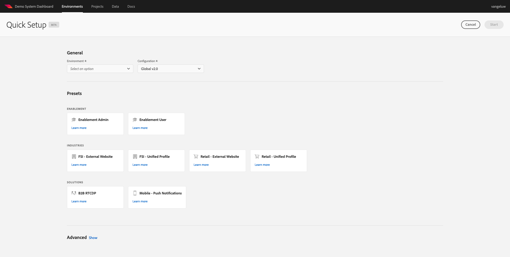
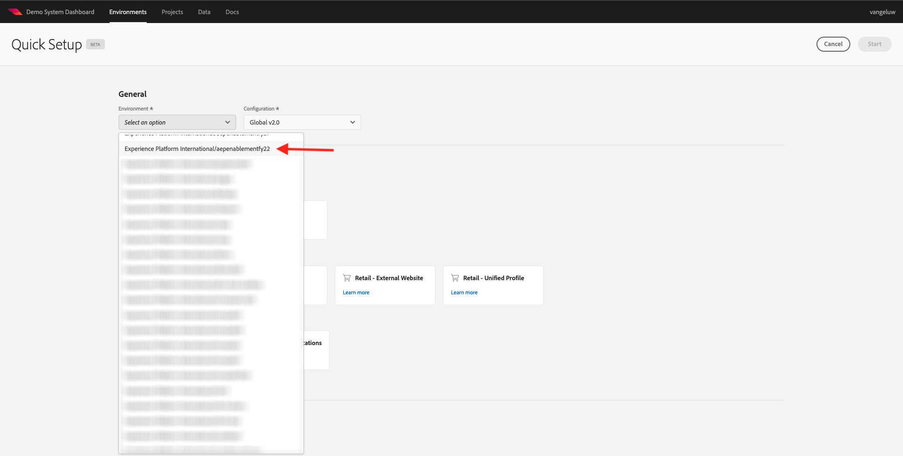
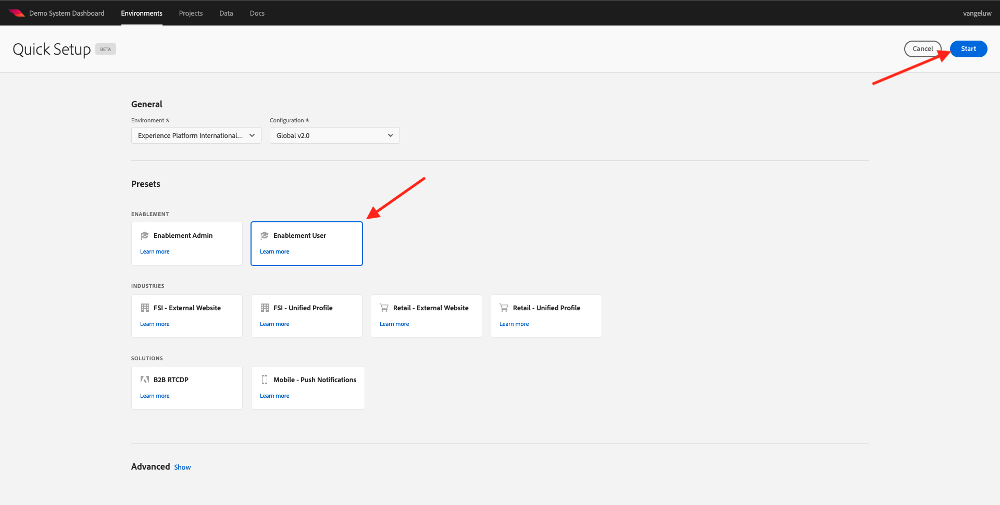
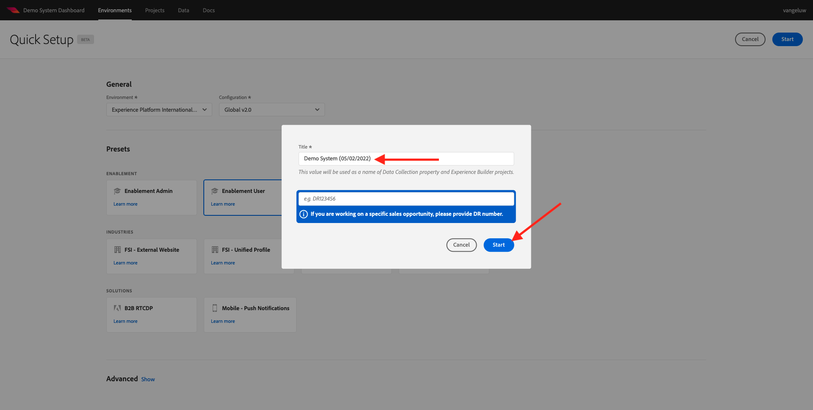
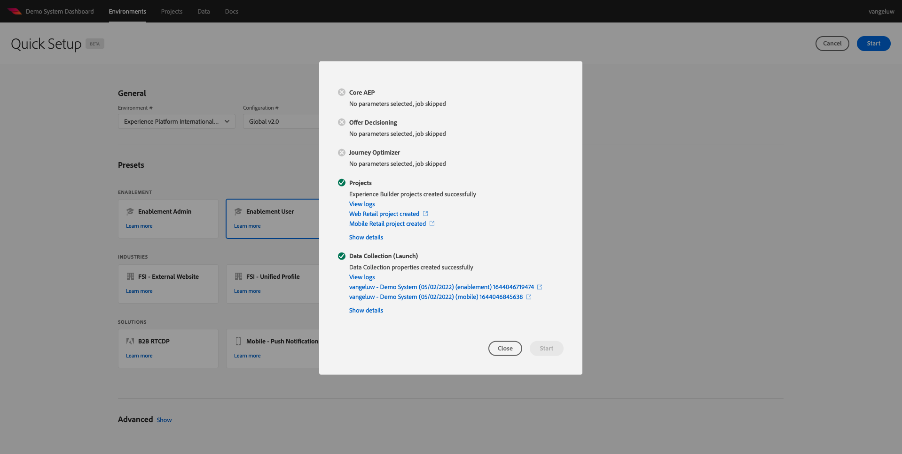

# 0.2 Use Demo System Next to setup your Adobe Experience Platform Data Collection client property

After signing up for the Comprehensive Technical Tutorial for Adobe Experience Platform, there's an automated process that will provide you with access to Demo System, so that you can access and run the below configuration.

Once you've got access to Demo System, proceed with the below steps.

Go to [https://dashboard.adobedemo.com/](https://dashboard.adobedemo.com/). Select your sandbox and click **Quick Setup**.

You'll see this:

Under **General** - **Environment**, select your Adobe Experience Platform instance and your sandbox, in this case:

- **Experience Platform International**
- **aepenablementfy22**
- Configuration: please select **Global v2.0**

Next, select the preset **Enablement User** and click **Start**.

In the popup, enter a name for your Data Collection property. Please use this naming convention: **Demo System (DD/MM/YYYY)**. FYI: your LDAP will be appended automatically, you do not need to add it yourself.

Click **Start**.

You'll then see this popup, which is showing you the progress while creating your website and mobile app projects and your data collection properties.

Once the quick setup process has completed, you'll have:

- 1 Web Retail project, which makes it possible to use a demo website with the Luma demo brand
- 1 Mobile Retail project, which makes it possible to use a demo mobile app with the Luma demo brand
- 1 CX App Retail project, which makes it possible to use a call center and clienteling app with the Luma demo brand
- 1 Data Collection property for web, which you'll use to collect data from the website
- 1 Data Collection property for mobile, which you'll use to collect data from the mobile app

Keep this screen open as you'll need it in the next steps.

Next Step: [0.3 Create your Datastream](./ex3.md)

[Go Back to Module 0](./getting-started.md)

[Go Back to All Modules](./../../overview.md)
