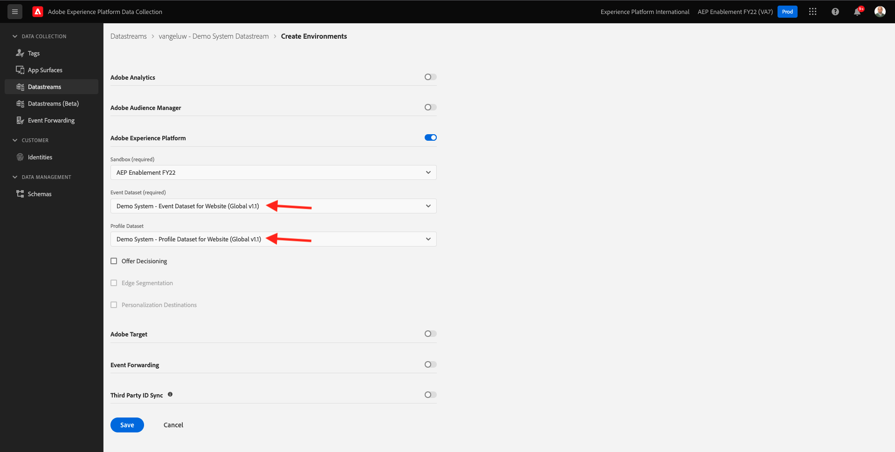
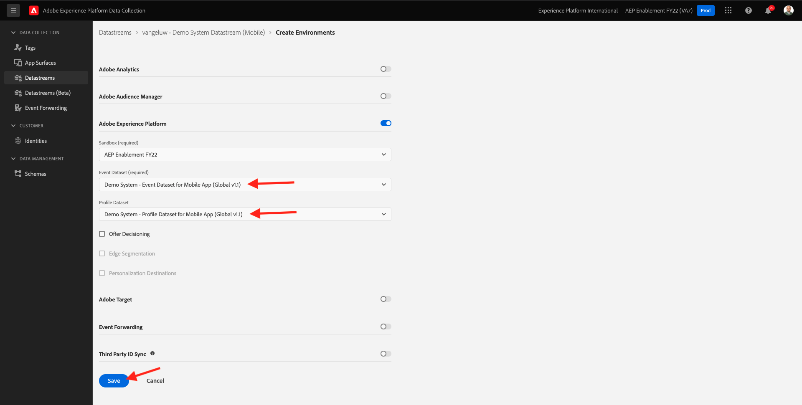
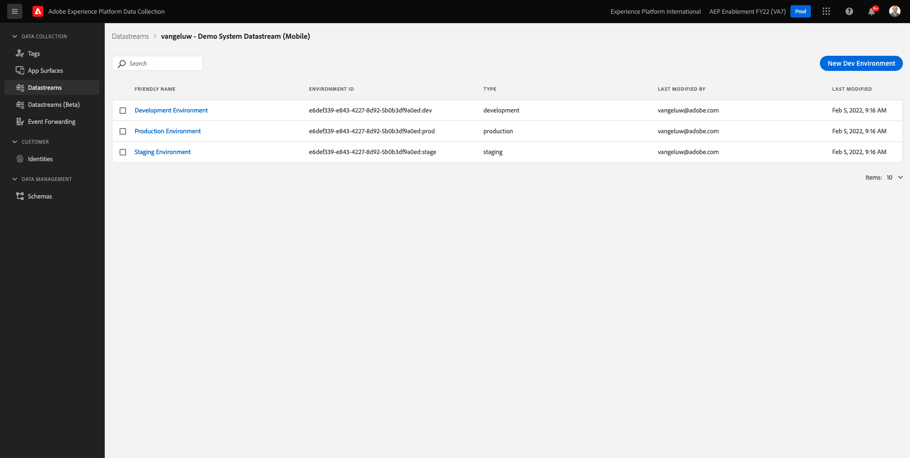

# 0.3 Create your Datastream

Go to [https://experience.adobe.com/#/data-collection/](https://experience.adobe.com/#/data-collection/). After the previous exercise, you now have two Data Collection properties: one for web and one for mobile.

These properties are almost ready to be used, but before you can start collecting data using these properties you need to set up a datastream. You'll get more information around the concept of what a datastream is and what it means in Exercise 1.2.

For now, please follow these steps.

## 0.3.1 Create your Datastream for Web

Click **[!UICONTROL Datastreams]**.

Click **[!UICONTROL New Datastream]**.

For the **[!UICONTROL Friendly Name]**, and for the optional description, enter `--demoProfileLdap-- - Demo System Datastream` and click **Save**.

You'll then see this:

Toggle on **[!UICONTROL Adobe Experience Platform]** which will expose additional fields. You'll then see this:

For **[!UICONTROL Sandbox]**, select your sandbox name, which should be `--aepSandboxId--`.

For Event Dataset, select **Demo System - Event Dataset for Website (Global v1.1)** and for Profile Dataset, select **Demo System - Profile Dataset for Website (Global v1.1)**.

That's it for now. In [Module 1](./../module1/data-ingestion-launch-web-sdk.md) you'll learn more about Web SDK and how to configure all of its capabilities.

You now have this. Click **Save**.

You'll then see that your datastream consists of 3 environments.

In the left menu, clik **[!UICONTROL Tags]**.

Filter the search results to see your two Data Collection properties. Open the property for **Web** by clicking it.

You'll then see this. Click **Extensions**.

On the Adobe Experience Platform Web SDK extension, click **Configure**.

You'll then see this. For **Datastreams**, you'll currently see a dummy value set to 1. You now need to click the **Choose from list** radio-button. In the dropdown list, select the Datastream you created earlier.

Make sure to have selected your **Datastream**. TIP: You can filter the results in the dropdown easily by typing your `--demoProfileLdap--`.

Scroll down until you see **Data Collection**. Please ensure that the checkbox for **Enable click data collection** is not enabled. Click **Save** to save your changes.

Go to **Publishing Flow**.

Click the **...** for **Main**, then click **Edit**.

Click **Add All Changed Resources** and then click **Save & Build for Development**.

Your changes are now being published and will be ready in a couple of minutes.

## 0.3.2 Create your Datastream for Mobile

Go to [https://experience.adobe.com/#/data-collection/](https://experience.adobe.com/#/data-collection/). 

Open the dropdown menu and click **[!UICONTROL Datastream]**.

Click **[!UICONTROL New Datastream]**.

For the **[!UICONTROL Friendly Name]**, and for the optional description, enter `--demoProfileLdap-- - Demo System Datastream (Mobile)`.
Click **[!UICONTROL Save]**.

You'll then see this:

Toggle on **[!UICONTROL Adobe Experience Platform]** which will expose additional fields. You'll then see this:

For **[!UICONTROL Sandbox]**, select your sandbox name.

For Event Dataset, select **Demo System - Event Dataset for Mobile App (Global v1.1)** and for Profile Dataset, select **Demo System - Profile Dataset for Mobile App (Global v1.1)**. Click **Save**.

You'll then see that your Datastream consists of 3 environments.

Your Datastream is now ready to be used in your Adobe Experience Platform Data Collection Client property for Mobile.

Go to **Tags** and filter the search results to see your two Data Collection properties. Open the property for **Mobile** by clicking it. 

You'll then see this. Click **Extensions**.

On the **Adobe Experience Platform Edge Network** extension, click **Configure**.

You'll then see this. For the **Datastreams**, you'll currently see a dummy value set to 1. You now need to click the **Choose from list** radio-button. In the dropdown list, select the Datastream you created earlier. Click **Save** to save your changes.

Go to **Publishing Flow**.

Click the **...** next to **Main**, then click **Edit**.

Click **Add All Changed Resources**, then click **Save & Build for Development**.

Your changes are now being published and will be ready in a couple of minutes.

Next Step: [0.4 Use the website](./ex4.md)

[Go Back to Module 0](./getting-started.md)

[Go Back to All Modules](./../../overview.md)