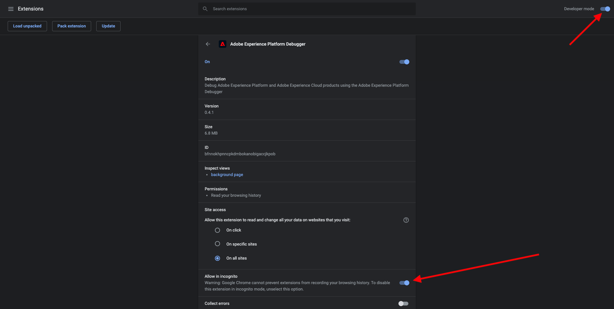
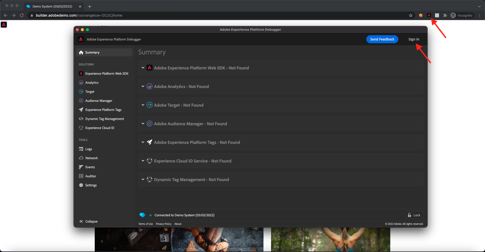
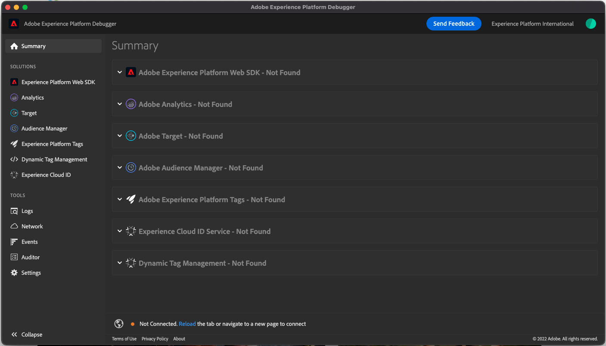
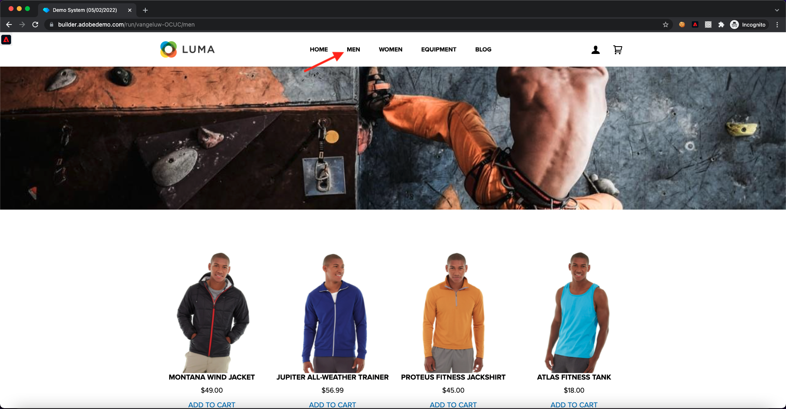
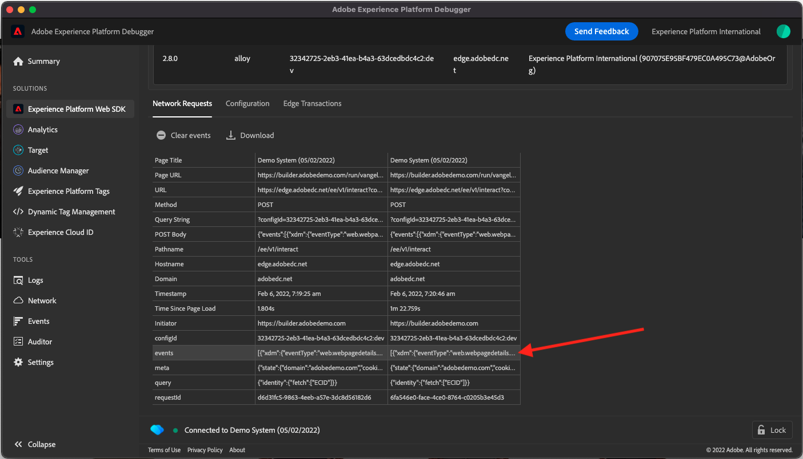

# 1.4 Client-side Web Data Collection

## 1.4.1 Validate the data in the request

### Install the Adobe Experience Platform Debugger

The Experience Platform Debugger is an extension available for Chrome and Firefox browsers which helps you see the Adobe technology implemented in your web pages. Download the version for your preferred browser:

- [Firefox extension](https://addons.mozilla.org/en-US/firefox/addon/adobe-experience-platform-dbg/)

- [Chrome extension](https://chrome.google.com/webstore/detail/adobe-experience-platform/bfnnokhpnncpkdmbokanobigaccjkpob)

If you've never used the Debugger before - and this one is different from the previous Adobe Experience Cloud Debugger - you might want to watch this five minute overview video:

>[!VIDEO](https://video.tv.adobe.com/v/32156?quality=12&learn=on)

Given that you'll be loading the demo website in incognito mode, you need to make sure the Experience Platform Debugger is also available in incognito mode. To do so, go to **chrome://extensions** in your browser and open the Experience Platform Debugger extension.

Verify that these 2 settings are enabled:

- Developer Mode
- Allow in incognito

### Open the demo website

Go to [https://builder.adobedemo.com/projects](https://builder.adobedemo.com/projects). After logging in with your Adobe ID, you'll see this. Click your website project to open it.

On the **Screens** page, click **Run**. 

You'll then see your demo website open up. Select the URL and copy it to your clipboard.

Open a new incognito browser window.

Paste the URL of your demo website, which you copied in the previous step. You'll then be asked to login using your Adobe ID.

Select your account type and complete the login process.

You'll then see your website loaded in an incognito browser window. For every demonstration, you'll need to use a fresh, incognito browser window to load your demo website URL.

### Use the Experience Platform Debugger to see the calls going to the Edge

Make sure you have the demo website open and click the Experience Platform Debugger extension icon. 

The Debugger will open and show the details of the implementation created in your Adobe Experience Platform Data Collection Property. Remember that you're debugging the Extension and rules that you have just been editing.

Click the **[!UICONTROL Sign In]** button on the top right to authenticate. If you already have a browser tab open with the Adobe Experience Platform Data Collection interface, the authentication step will be automatic and you won't have to enter your username and password again.

Hit the reload button on your demo website to connect the debugger to that specific tab.

Confirm the Debugger is **[!UICONTROL Connected to Home]** as pictured above and then click the **[!UICONTROL lock]** icon to lock the Debugger to the demo website. If you don't do this, the Debugger will keep switching to expose the implementation details of whatever browser tab is in focus, which can be confusing.

Next, go to any page on the demo website like for instance, the **Men** category page.

Now click **[!UICONTROL Experience Platform Web SDK]** in the left navigation, to see the **[!UICONTROL Network Requests]**.

Each request contains an **[!UICONTROL events]** row.

Click to open the **[!UICONTROL events]** row. Note how you can see the **web.webpagedetails.pageViews** event, as well as other, out-of-the-box variables adhering to the **Web SDK ExperienceEvent XDM** format.

These types of request details are also visible in the Network tab. Filter for requests with **interact** to locate the requests sent by Web SDK. You can find all the details of the XDM payload in the Request Payload Headers:

Next step: [1.5 Implement Adobe Analytics and Adobe Audience Manager](./ex5.md)

[Go Back to Module 1](./data-ingestion-launch-web-sdk.md)

[Go Back to All Modules](./../../overview.md)
