# 10.2 Configure a batch-based newsletter journey 

Login to Adobe Journey Optimizer by going to [Adobe Experience Cloud](https://experience.adobe.com). Click **Journey Optimizer**.

You'll be redirected to the **Home**  view in Journey Optimizer. First, make sure you're using the correct sandbox. The sandbox to use is called `--aepSandboxId--`. To change from one sandbox to another, click on **PRODUCTION Prod (VA7)** and select the sandbox from the list. In this example, the sandbox is named **AEP Enablement FY22**. You'll then be in the **Home** view of your sandbox `--aepSandboxId--`.

## 10.2.1 Create newsletter journey

You'll now create a batch-based journey. Unlike the event-based journey of the previous exercise which relies on incoming experience events or segment entries or exits to trigger a journey for 1 specific customer, batch-based journeys target a whole segment once with unique content like newsletters, one-off promotions, or generic information or periodically with similar content sent on a regular basis like for instance birthday campaigns and reminders. 

In the menu, go to **Journeys** and click **Create Journey**.

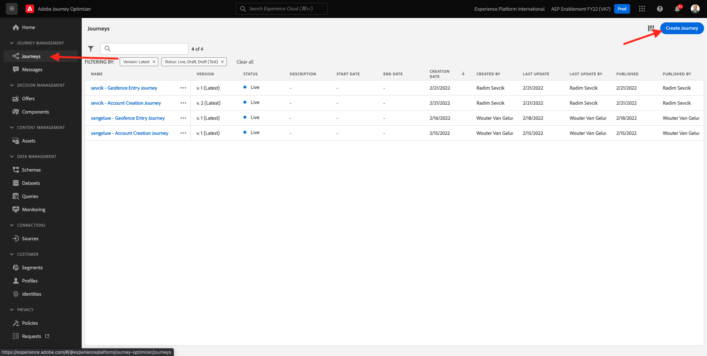

On the right-hand side you will see a form where you need to specify the journey name and description. Enter the following values:

- **Name**: `--demoProfileLdap-- - Newsletter Journey`. For instance: **vangeluw - Newsletter Journey**.
- **Description**: Monthly Newsletter

Click **Ok**. 

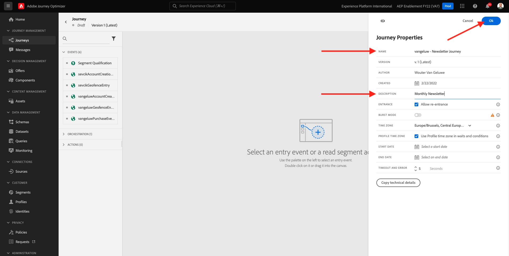

Under **Orchestration**, drag and drop **Read Segment** onto the canvas. This means that, once published, the journey will start by retrieving the whole segment audience, which then becomes the target audience of the journey and message. Click **Select a segment**.

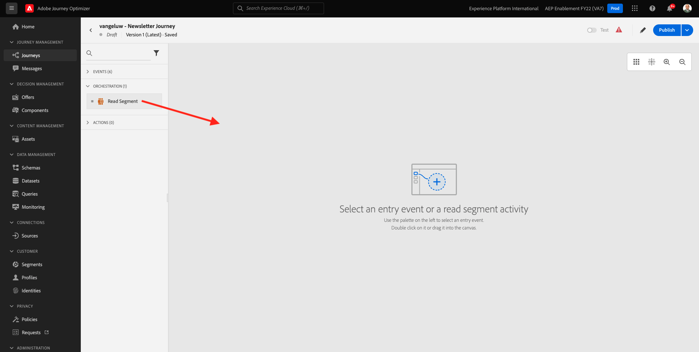

In the **Choose a segment** popup, search for your ldap and select the segment you created in [Module 6 - Real-time CDP - Build a segment and take action](../module6/real-time-cdp-build-a-segment-take-action.md) named `--demoProfileLdap-- - Interest in PROTEUS FITNESS JACKSHIRT`. for example: vangeluw - Interest in PROTEUS FITNESS JACKSHIRT. Click **Save**.

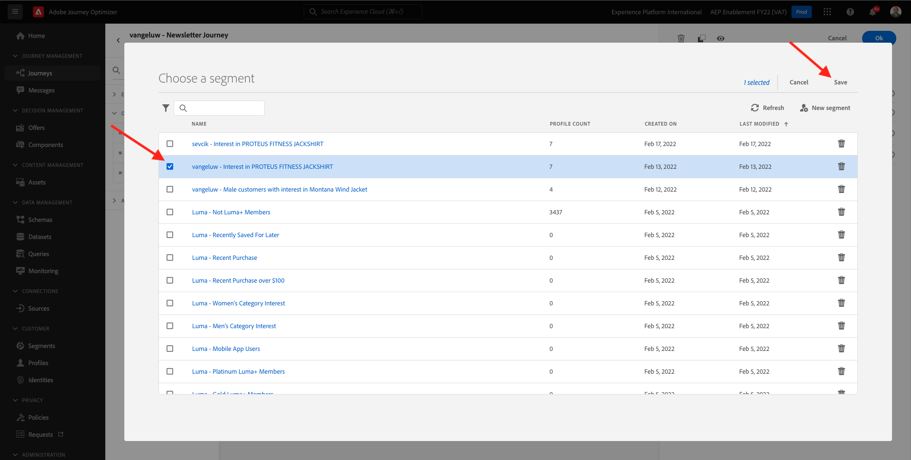

Click **Ok**.

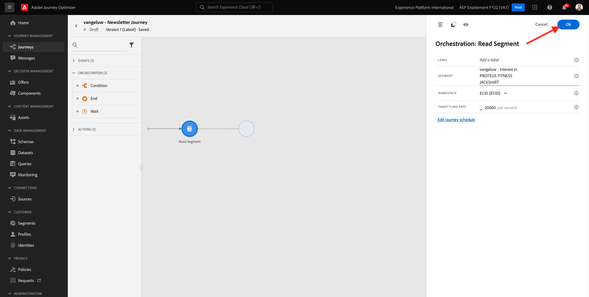

In the left menu, find the **Actions** section and drag and drop an **Email** action onto the canvas.

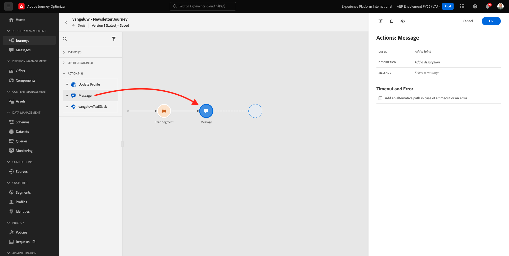

Set the **Category** to **Marketing** and select an email surface that enables you to send email. In this case, the email surface to select is **Email**. Ensure that the checkboxes for **Clicks on email** and **email opens** are both enabled.

The next step is to create your message. To do that, click **Edit content**.

You now see this. Click the **Subject line** text field.

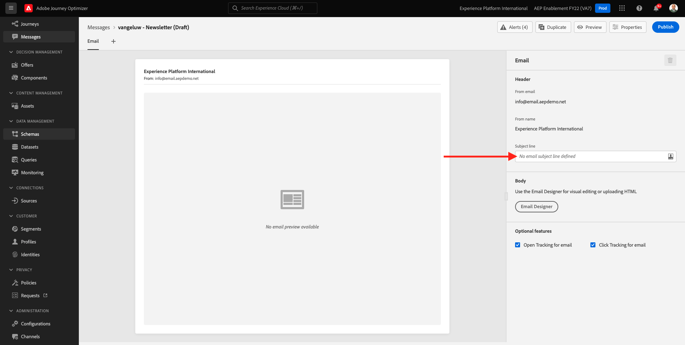

Enter this text for the subject line: `Luma Newsletter - your monthly update has arrived.`. Click **Save**.

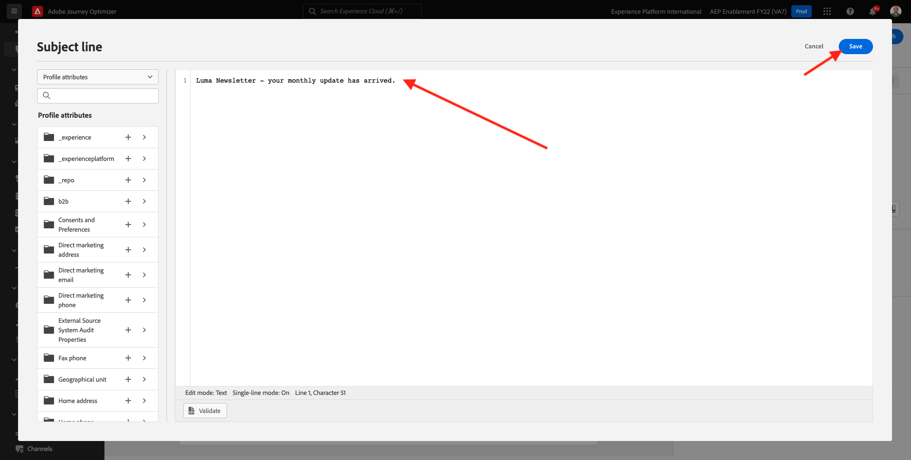

You'll then be back here. Click **Email Designer** to start creating the email content. 

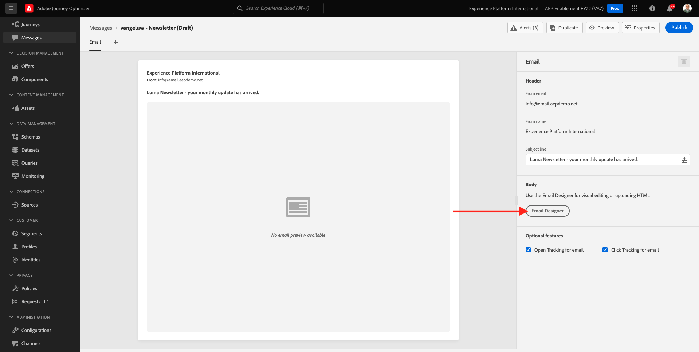

You'll then see this. Click **Import HTML**.

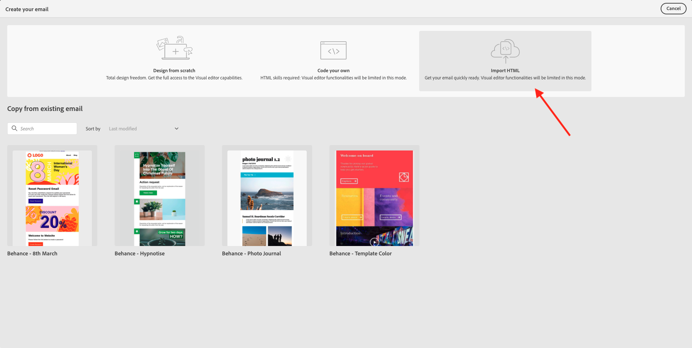

In the pop-up screen, you'll need to drag and drop the HTML file of the email. You can find the HTML template [here](../../assets/html/ajo-newsletter.html.zip). Download the zip-file with the HTML template to your local machine and unzip in onto your desktop.

Drag and drop the file **ajo-newsletter.html** to upload it in Journey Optimizer. Click **Import**.

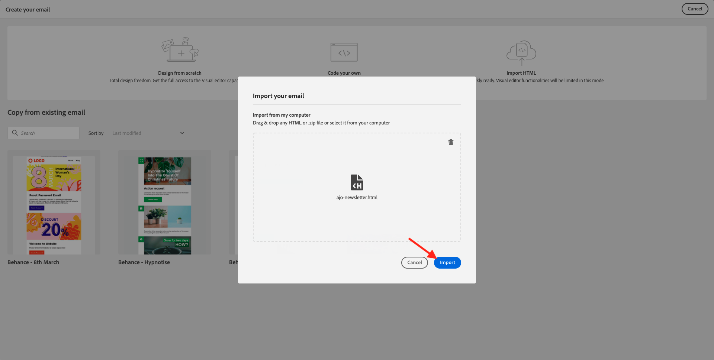

This email content is ready to go since it has all the expected personalization, imagery and text. Only the offer placeholder is left empty. 

You might get an error message: **Error when trying to fetch assets**. This is linked to the image in the email.

If you get this error, select the image and click the **Edit image** button.

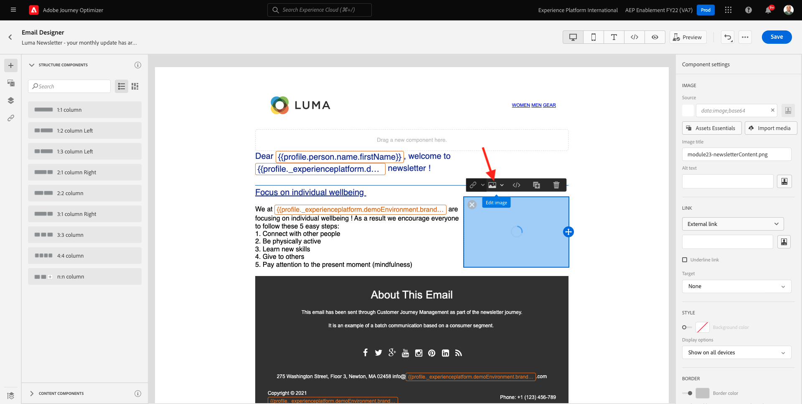

Click **Assets Essentials** to go back to your AEM Assets Essentials library.

You'll then see this popup. Navigate to the folder **enablement-assets** and select the image **luma-newsletterContent.png**. Click **Select**.

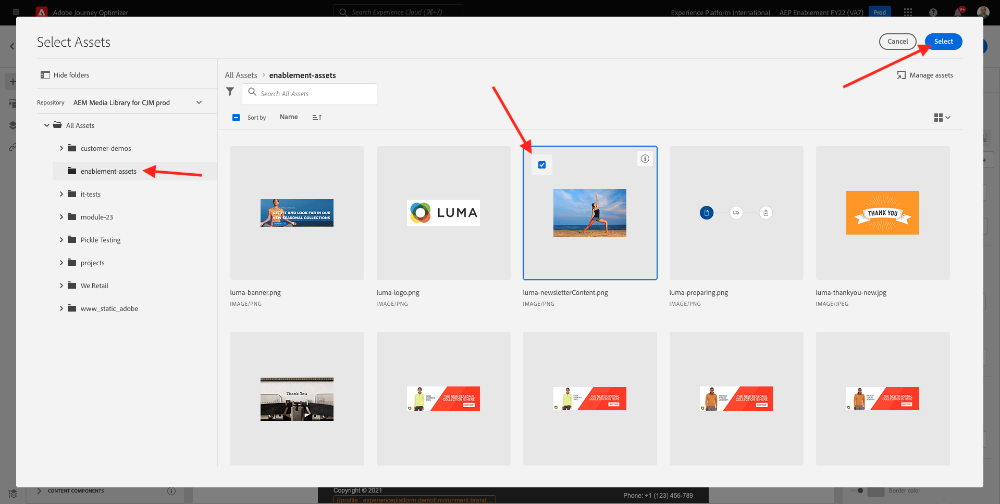

Your basic newsletter email is now ready. Click **Save**.

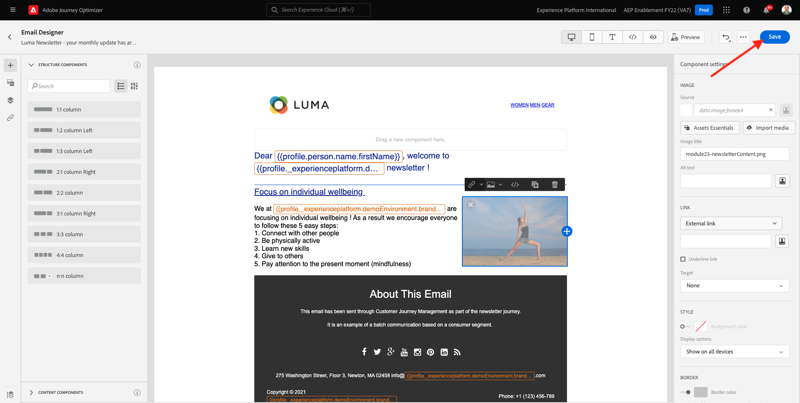

Go back to the message dashboard by clicking the **arrow** next to the subject line text in the top-left corner.

Click the arrow in the top left corner to go back to your journey.

Click **Ok** to close your email action.

Your newsletter journey is now ready to be published. Before you do so, notice the **Schedule** section where you can switch this journey from being a one-off to a recurring campaign. Click the **Schedule** button.

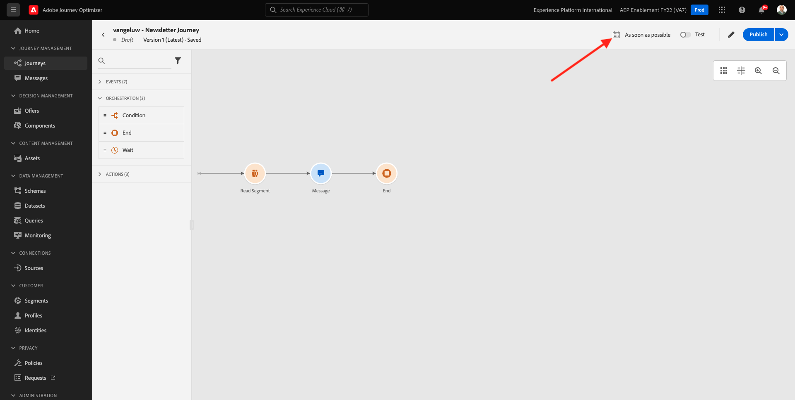

You'll then see this. Select **Once**.

Select a date and time within the next hour so you can test your journey. Click **Ok**.

>[!NOTE]
>
>Message send date and time must be within more than one hour.

Click **Publish**.

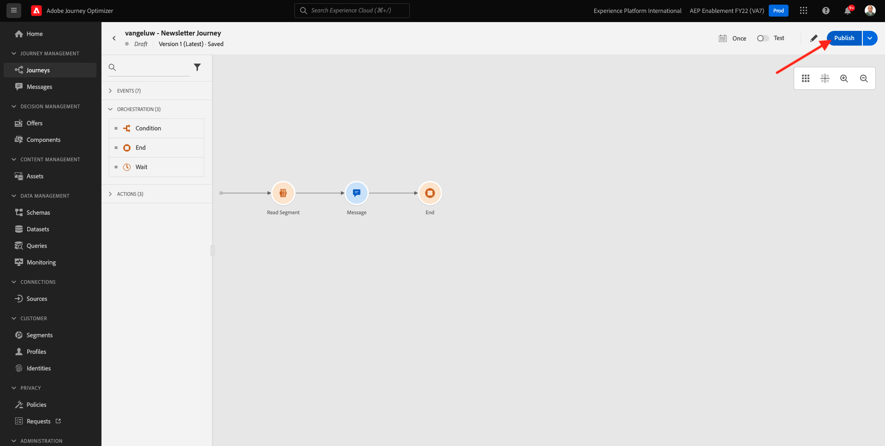

Click **Publish** again.

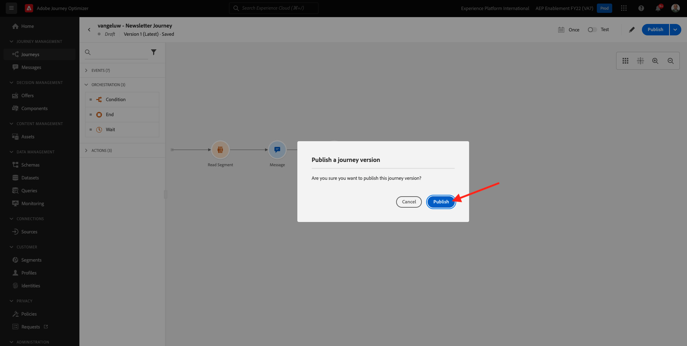

Your basic newsletter journey is now published. Your newsletter email message will be sent as you defined it in your schedule, and your journey will stop as soon as the last email has been sent.

You have finished this exercise.

Next Step: [10.3 Apply personalization in an email message](./ex3.md)

[Go Back to Module 10](./journeyoptimizer.md)

[Go Back to All Modules](../../overview.md)
