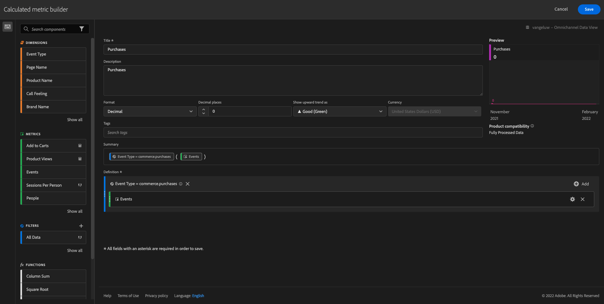
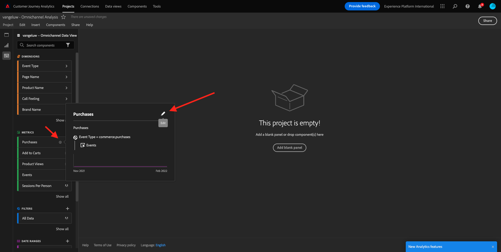
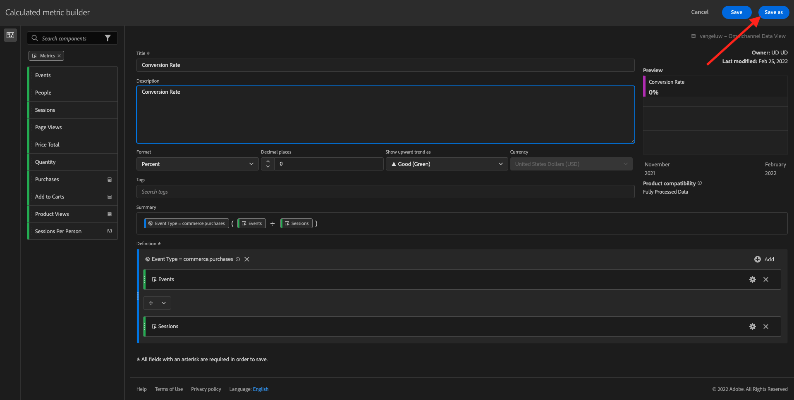

# 11.4 Data preparation in Analysis Workspace

## Objectives

- Understand the Analysis Workspace UI in CJA
- Understand the concepts of data preparation in Analysis Workspace
- Learn how to do data calculations

## Exercise 11.4.1 Analysis Workspace UI in CJA

Analysis Workspace removes all of the typical limitations of a single Analytics report. It provides a robust, flexible canvas for building custom analysis projects. Drag-and-drop any number of data tables, visualizations, and components (dimensions, Metrics, segments, and time granularities) to a project. Instantly create breakdowns and segments, create cohorts for analysis, create alerts, compare segments, do flow and fallout analysis, and curate and schedule reports for sharing with anyone in your business.

Customer Journey Analytics brings this solution on top of Platform data. We highly recommend watching this four-minute overview video:

>[!VIDEO](https://video.tv.adobe.com/v/35109?quality=12&learn=on)

If you haven't used Analysis Workspace before, we highly recommend watching this video:

>[!VIDEO](https://video.tv.adobe.com/v/26266?quality=12&learn=on)

### Create Your Project

Now it's time to create your first CJA project. Go to the projects tab inside of CJA. 
Click on create a new project.


You'll then see an empty project.


First, make sure to select the correct Data View in the upper right corner of your screen. In this example, the Data View to select is `vangeluw - Omnichannel Data View`.


Next, you'll save your project and give it a name. You can use the following command to save:

|  OS        | Short cut   | 
| ----------------- |-------------| 
| Windows | Control + S          | 
| Mac | Command + S          | 

You'll see this popup: 


Please use this naming convention:

|  Name       | Description   | 
| ----------------- |-------------| 
| `--demoProfileLdap-- - Omnichannel Analysis`| `--demoProfileLdap-- - Omnichannel Analysis`|

Next, click **Save**.


## Exercise 11.4.2 Calculated Metrics

Although we have organized all the components in the Data View, you still need to adapt some of them, so that business users are ready to start their analysis.

If you remember, we didn't specifically bring in Metrics such us Add to Cart, Product View or Purchases into the Data View. 
However, we do have a dimension called: **Product Interaction Type**. So, let's derive these interaction types by creating 3 calculated Metrics.

Back in module 4, [Query Service](./../../modules/module4/query-service.md), you created a SQL query to get the interactions funnel:

**Query & Result**

```text
aepenablementfy22:all=> select eventType, count(*)
aepenablementfy22:all-> from   demo_system_event_dataset_for_website_global_v1_1
aepenablementfy22:all-> where  --aepTenantId--.demoEnvironment.brandName IN ('Luma Telco', 'Citi Signal')
aepenablementfy22:all-> and    eventType is not null
aepenablementfy22:all-> and    eventType <> ''
aepenablementfy22:all-> group  by eventType;
          eventType           | count(1) 
------------------------------+----------
 commerce.productViews        |     2297
 commerce.productListAdds     |      494
 commerce.purchases           |      246
(3 rows)
```

The goal in CJA is to avoid using SQL queries, but still have access to the same components using real analytics power through a User Interface.

### Product Views

Let's start with first Metric: **Product Views**. Click on the **+** to create your first calculated Metric.


The **Calculated Metric Builder** will show up:


Within the components, on the left side, please search **Event Type**.


Then drag and drop it in to the Calculated Metric's **Definition** canvas.

You'll now see a popup. In the popup, in the dropdown, find and select **commerce.productViews** (or enter it manually and click Enter). 


Next, click **Done**.


Now we must quantify this interaction. To do this select the Metric **Events (occurrences)**, then drag and drop it inside the filter. This will allow us to understand how many times the **commerce.productViews** event has occurred.


To finish, add a name and description.

| Title         | Description|    
| ----------------- |-------------| 
| Product Views | Product Views     |   

You'll then see this:


Click **Save** to save your calculated Metric.


Next, repeat the same process for **commerce.productListAdds** and **commerce.purchases**.

### Add to Cart

| Event Type | Name         | Description| 
| ----------------- |-------------| -------------|
| commerce.productListAdds|Add to Carts | Add to Carts     |

The Metric definition should look like this:


### Purchases

| Product Interaction Type | Name         | Description| 
| ----------------- |-------------| -------------|
| commerce.purchases|Purchases | Purchases   |

The Metric definition should look like this:



Don't forget to **Save** each Calculated Metric.


### Conversion Rate

To finish this exercise, let's create a last calculated Metric: **Conversion Rate**.

Find the **Purchase** Calculated Metric we've just created in the list of Metrics in the left side menu. Click on the **info** icon.
Now click on the **edit** icon.



Typically, conversion rate means **Conversions / Sessions**. So let's do the same calculation in the calculated Metric definition canvas. Find the **Sessions** metric and drag and drop it into the definition builder.


Notice that the division operator is automatically selected.


The conversion rate is commonly represented in percentage. So, let's change the format to be percentage and also select 2 decimals.


Change the name and description:

| Name         | Description|    
| ----------------- |-------------| 
| Conversion Rate | Conversion Rate      | 

Now click **Save As** to save your new Calculated Metric without overwriting the original one..



## Exercise 11.4.3 Calculated Dimensions: Filters (segmentation) & Date Ranges

### Filters: Calculated Dimensions

Calculations are not meant to be only for Metrics. Before starting any analysis it's also interesting to create some **Calculated Dimensions**. This basically meant **segments** back in Adobe Analytics. In Customer Journey Analytics, these segments are called **Filters**. 


Creating filters will help business users to start the analysis with some valuable calculated dimensions. This will automate some tasks as well as helping on the adoption part. Here are some examples:

1. Own Media, Paid Media, 
2. New vs Returning visits
3. Customers with Abandoned Cart

These filters can be created before or during the analysis part (which you'll do in the next exercise). 

### Date Ranges: Calculated Time Dimensions

Time Dimensions are another type of calculated dimensions. Some are already create, but you also have the ability to create your own custom Time Dimensions at the data preparation phase. 

These Calculated Time Dimensions we will help analysts and business users to remember important dates and use them to filter and change the reporting time. Typical questions and doubts that come to our minds when we do analysis:

- When was Black Friday last year? 21th-29th?
- When did we run that TV campaign in December?
- From when to when did we do the 2018 Summer Sales? I want to compare it against 2019. By the way, do you know the exact days in 2019? 


You've now finished the data preparation exercise using CJA Analysis Workspace.

Next Step: [11.5 Visualization using Customer Journey Analytics](./ex5.md)

[Go Back to Module 11](./customer-journey-analytics-build-a-dashboard.md)

[Go Back to All Modules](./../../overview.md)
