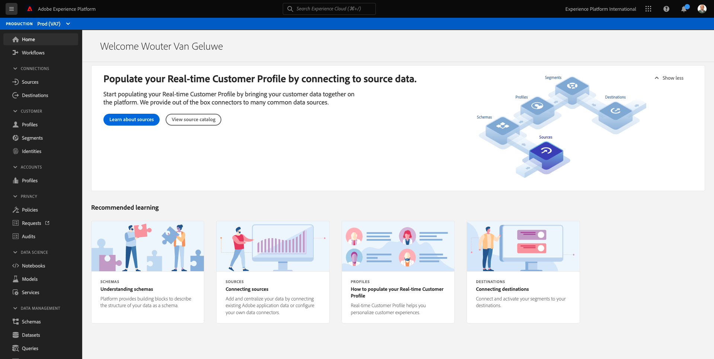
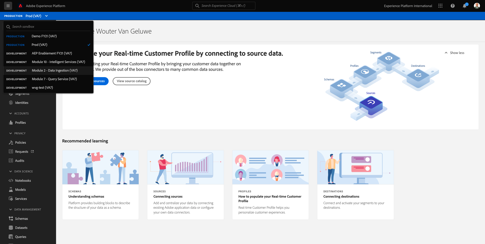
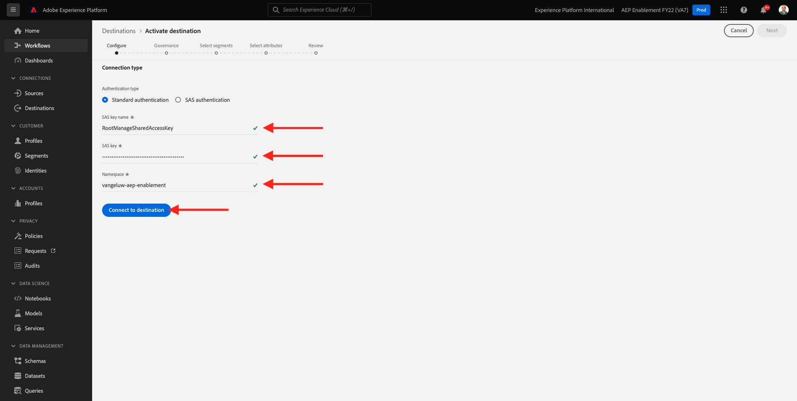
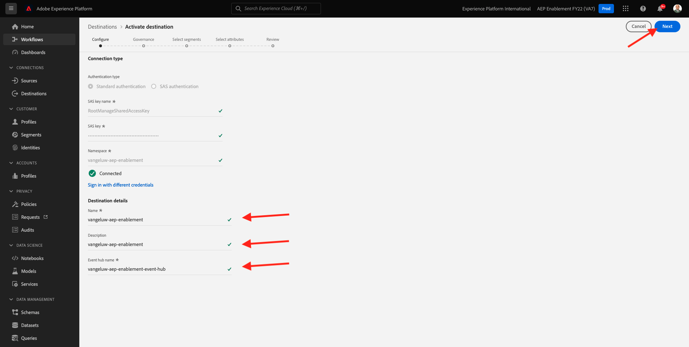
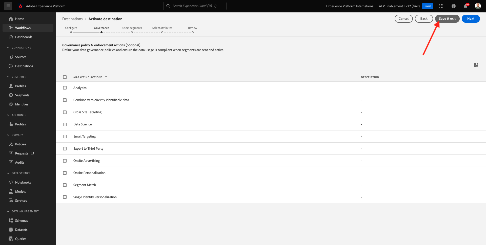
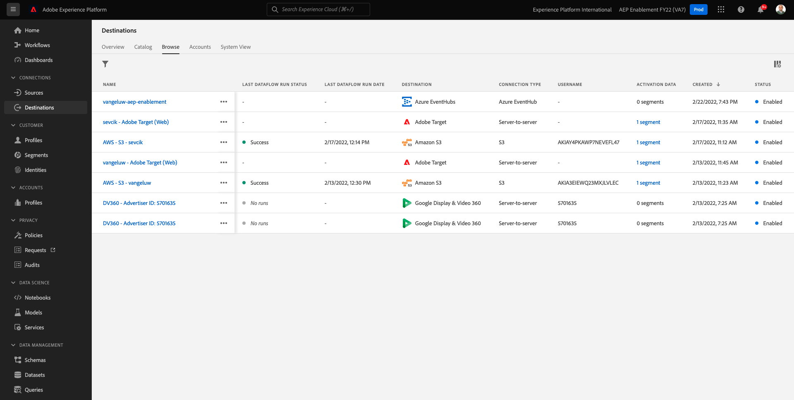

# 13.2 Configure your Azure Event Hub Destination in Adobe Experience Platform

## 13.2.1 Identify Required Azure Connection parameters

To define an Event Hub destination in Adobe Experience Platform you need your:

- Event Hubs namespace
- Event Hub
- Azure SAS Key name
- Azure SAS Key

Event Hub and EventHub namespace have been defined in the previous exercise: [Exercise 1 - Setup Event Hub in Azure](./ex1.md)

### Event Hubs Namespace
  
To lookup the above information in Azure Portal, navigate to [https://portal.azure.com/#home](https://portal.azure.com/#home). Make sure that you are using the correct Azure account.

Select **All Resources** in Azure Portal:

### Event Hub

Look for a resource with resource type **Event Hubs Namespace**, if you followed the naming conventions used in the previous exercise you Event Hubs Namespace will be `--demoProfileLdap---aep-enablement`. Take a note of it, you will need it in the next exercise.

Click on the Event Hubs Namespace name to get the details:

Select **Event Hubs** to get a list of Event Hubs defined in your Event Hubs Namespace, if you followed the naming conventions used in the previous exercise you will find an Event Hub named `--demoProfileLdap---aep-enablement-event-hub`. Take a note of it, you will need it in the next exercise.
  

### SAS Key Name

Select **Shared access policies** for your **Event Hubs Namespace**

You will see a list of Shared access policies. The SAS Key that we are looking for is **RootManageSharedAccessKey**. This is the SAS Key name. Write it down.

### SAS Key Value

Click on the **RootManageSharedAccessKey** to get the SAS Key Value. And press the **Copy to clipboard** icon to copy the **Primary key**:

### Destination Values Summary

At this point you should have identified all the values needed to define the Azure Event Hub destination in Adobe Experience Platform Real-time CDP.

| Destination Attribute Name |  Destination Attribute Value | Example Value |
|---|---|---|
|sasKeyName|SAS Key Name|RootManageSharedAccessKey|  
|sasKey|SAS Key Value|srREx9ShJG1Rv7f/... |
|namespace|Event Hubs Namespace|`--demoProfileLdap---aep-enablement`|
|eventHubName|Event Hub|`--demoProfileLdap---aep-enablement-event-hub`| 

## 13.2.2 Create Azure Event Hub Destination in Adobe Experience Platform

Log in to Adobe Experience Platform by going to this URL: [https://experience.adobe.com/platform](https://experience.adobe.com/platform).

After logging in, you'll land on the homepage of Adobe Experience Platform.

Before you continue, you need to select a **sandbox**. The sandbox to select is named ``--aepSandboxId--``. You can do this by clicking the text **[!UICONTROL Production Prod]** in the blue line on top of your screen. After selecting the appropriate sandbox, you'll see the screen change and now you're in your dedicated sandbox.

Go to **Destinations**, then go to **Catalog**.

Select **Cloud Storage** and go to **Azure Event Hubs** and click **Set up** or **Configure**:

Fill in the destination values that you have collected in the previous exercise. Next, click **Connect to Destination**.

If your credentials were correct, you'll see a confirmation: **Connected**. 

You now need to enter the name and description in the format `--demoProfileLdap---aep-enablement`. Enter the **eventHubName** (see previous exercise, it looks like this: `--demoProfileLdap---aep-enablement-event-hub`) and click **Next**.
  

Click **Save & exit**.

Your destination is now created and available in Adobe Experience Platform.

Next Step: [13.3 Create a segment](./ex3.md)

[Go Back to Module 13](./segment-activation-microsoft-azure-eventhub.md)

[Go Back to All Modules](./../../overview.md)
