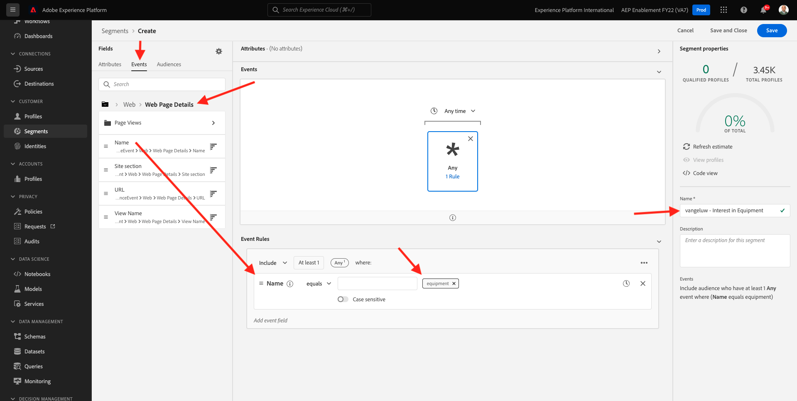
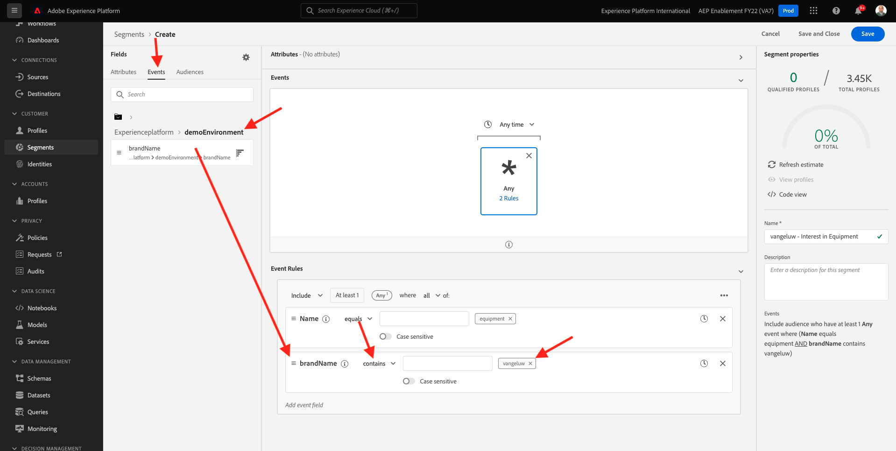

# 13.3 Create a segment

## 13.3.1 Introduction

You'll create a simple segment:

- **Interest in Equipment** for which customer profiles will qualify when they visit the **Equipement** page of the Luma demo website. 

### Good to know

Real-time CDP will trigger an activation to a destination when you qualify for a segment that is part of that destination's activation list. When that is the case, the segment qualification payload that will be send to that destination will contain **all the segments for which your profile qualifies**. 

The goal of this module is to show that your Customer Profile's segment qualification is sent to **your** event hub destination in real-time. 

### Segment Status

A segment qualification in Adobe Experience Platform always has a **status**-property and can be one of the following:

- **realized**: this indicates a new segment qualification
- **existing**: this indicates an existing segment qualification
- **exited**: this indicates that the profile does no longer qualify for the segment

## 13.3.2 Build the segment

Building a segment is explained in detail in [Module 6](../module6/real-time-cdp-build-a-segment-take-action.md).

### Create Segment

Log in to Adobe Experience Platform by going to this URL: [https://experience.adobe.com/platform](https://experience.adobe.com/platform).

After logging in, you'll land on the homepage of Adobe Experience Platform.


Before you continue, you need to select a **sandbox**. The sandbox to select is named ``--aepSandboxId--``. You can do this by clicking the text **[!UICONTROL Production Prod]** in the blue line on top of your screen. After selecting the appropriate sandbox, you'll see the screen change and now you're in your dedicated sandbox.


Go to **Segments**. Click the **+ Create segment** button.


Name your segment `--demoProfileLdap-- - Interest in Equipment` and add the page name experience event:

Click on **Events**, and drag and drop **XDM ExperienceEvent > Web > Web page details > Name**. Enter **equipment** as the value:



Drag and drop **XDM ExperienceEvent > `--aepTenantIdSchema--` > demoEnvironment > brandName**. Enter `--demoProfileLdap--` as the value, set the comparison parameter to **contains** and click **Save**:



### PQL Definition

The PQL of your segment looks like:

```code
CHAIN(xEvent, timestamp, [C0: WHAT(web.webPageDetails.name.equals("equipment", false) and _experienceplatform.demoEnvironment.brandName.contains("--demoProfileLdap--", false))])
```

Next Step: [13.4 Activate segment](./ex4.md)

[Go Back to Module 13](./segment-activation-microsoft-azure-eventhub.md)

[Go Back to All Modules](./../../overview.md)
