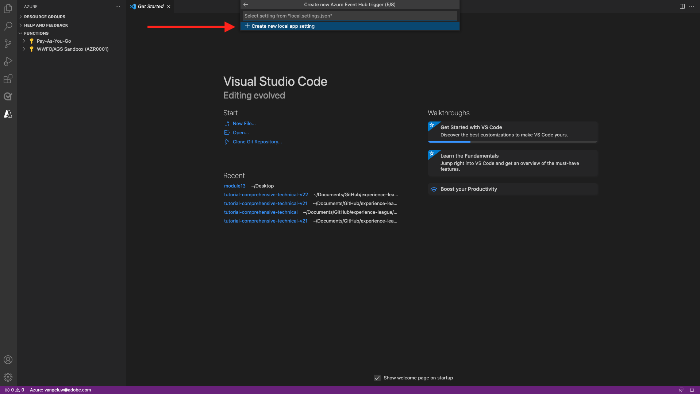
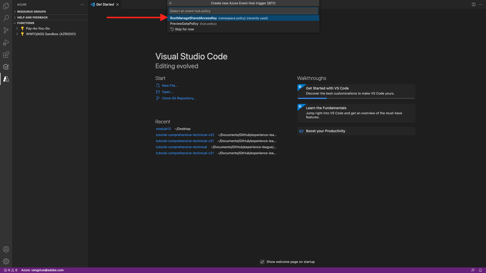
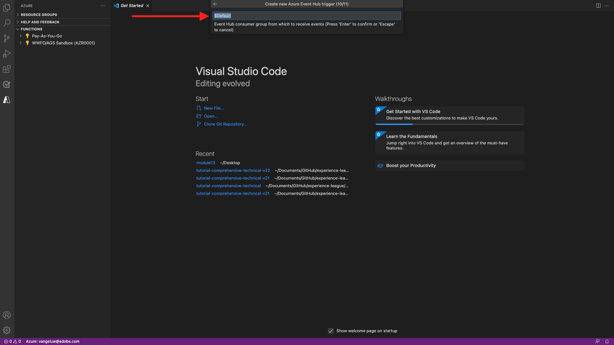
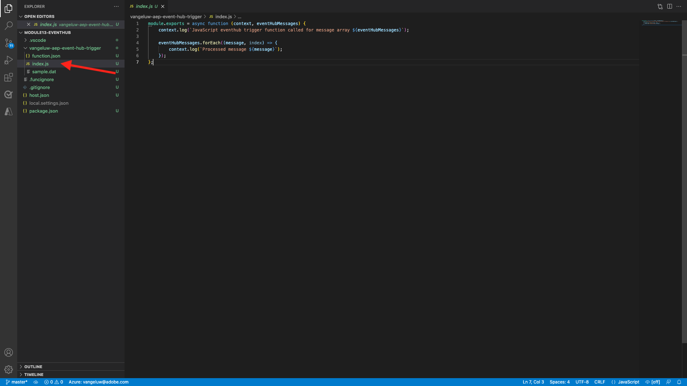
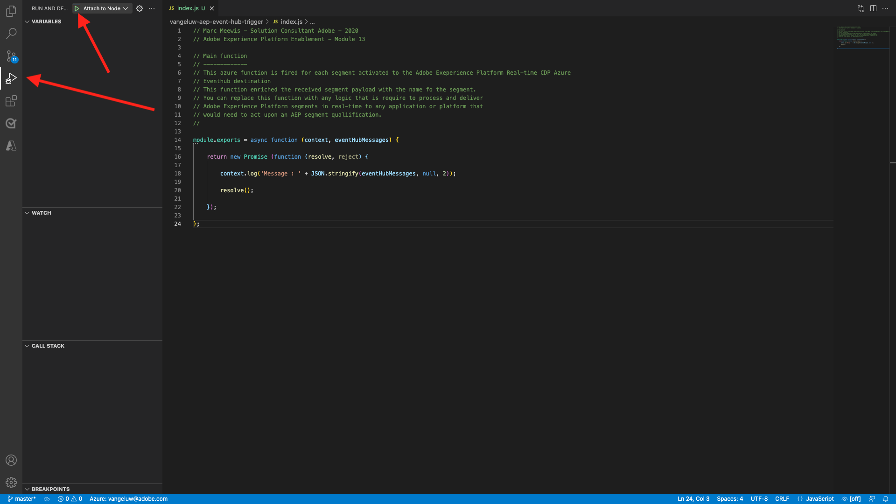
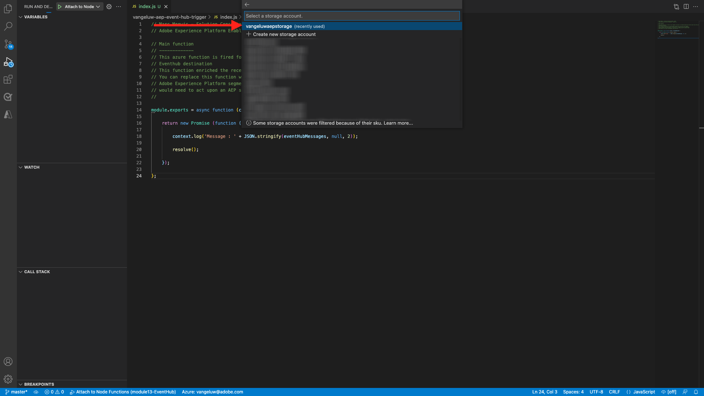

# 13.5 Create your Microsoft Azure Project

## 13.5.1 Getting familiar with Azure Event Hub functions

Azure Functions allows you to run small pieces of code (called **functions**) without worrying about application infrastructure. With Azure Functions, the cloud infrastructure provides all the up-to-date servers you need to keep your application running at scale.

A function is **triggered** by a specific type of event. Supported triggers include responding to changes in data, responding to messages (for example Event Hubs), running on a schedule, or as the result of an HTTP request.

Azure Functions is a serverless compute service that lets you run event-triggered code without having to explicitly provision or manage infrastructure. 

Azure Event Hubs integrates with Azure Functions for a serverless architecture.

## 13.5.2 Open Visual Studio Code and Logon to Azure

Visual Studio Code makes it easy to...

- define and bind Azure functions to Event Hubs
- test locally 
- deploy to Azure
- remote log function execution

### Open Visual Studio Code

To open Visual Studio Code enter **visual** in your operating system's search (Spotlight search on OSX, Search in Window's Taskbar). If you do not find it, you need to repeat the steps outlined in [Exercise 0 - Pre-requisites](./ex0.md). 


### Logon to Azure

When you logon with your Azure account that you used to register in [Exercise 0 - Pre-requisites](./ex0.md), Visual Studio Code will let you find and bind all Event Hub resources. 

Click the **Azure** icon in Visual Studio Code. If you do not have that option, something might have gone wrong with the installation of the required extensions.

Next select **Sign in to Azure**:


You will be redirected to you browser to login. Remember to select the Azure account that you used to register.


When you see the following screen in your browser, you are logged in with Visual Code Studio:


Return to Visual Code Studio (you will see the name of your Azure subscription, for example **Azure subscription 1**):


## 13.5.3 Create an Azure Project

When you hover over **Azure subscription 1**, a menu will appear above the section, select **Create New Project...**:


Select a local folder of your choice to save the project and click **Select**:


You will now enter the project creation wizard. Select **Javascript** as the language for your project:


Select **Azure Event Hub trigger** as your project's first function template:


Enter a name for your function, use the following format `--demoProfileLdap---aep-event-hub-trigger` and press enter:
  


Select **Create new local app setting**:



Select an event hub namespace, you should see the Event Hub that you defined in **Exercise 2**. In this example the Event Hub namespace is **vangeluw-aep-enablement**:


Select your Event Hub, you should see the Event Hub that you defined in **Exercise 2**. In my case that is **vangeluw-aep-enablement-event-hub**:


Select **RootManageSharedAccessKey** as your Event Hub policy:



Enter to use **$Default**:



Select **Add to workspace** on how to open your project:


After you project is created, click on **index.js** to have the file open in the editor:



The payload sent by Adobe Experience Platform to your Event Hub will include segment id's:

```json
[{
"segmentMembership": {
"ups": {
"ca114007-4122-4ef6-a730-4d98e56dce45": {
"lastQualificationTime": "2020-08-31T10:59:43Z",
"status": "realized"
},
"be2df7e3-a6e3-4eb4-ab12-943a4be90837": {
"lastQualificationTime": "2020-08-31T10:59:56Z",
"status": "realized"
},
"39f0feef-a8f2-48c6-8ebe-3293bc49aaef": {
"lastQualificationTime": "2020-08-31T10:59:56Z",
"status": "realized"
}
}
},
"identityMap": {
"ecid": [{
"id": "08130494355355215032117568021714632048"
}]
}
}]
```

Replace the code in your Visual Studio Code's index.js with the code below. This code will be executed each time Real-time CDP sends segment qualifications to your Event Hub destination. In our example, the code is just about displaying and enhancing the received payload. But you can imagine any kind of function to process segment qualifications in real-time.

```javascript
// Marc Meewis - Solution Consultant Adobe - 2020
// Adobe Experience Platform Enablement - Module 13

// Main function
// -------------
// This azure function is fired for each segment activated to the Adobe Exeperience Platform Real-time CDP Azure 
// Eventhub destination
// This function enriched the received segment payload with the name fo the segment. 
// You can replace this function with any logic that is require to process and deliver
// Adobe Experience Platform segments in real-time to any application or platform that 
// would need to act upon an AEP segment qualiification.
// 

module.exports = async function (context, eventHubMessages) {

    return new Promise (function (resolve, reject) {

        context.log('Message : ' + JSON.stringify(eventHubMessages, null, 2));

        resolve();

    });    

};
```

The result should look like this:


## 13.5.4 Run Azure Project

Now it is time to run your project. At this stage we will not deploy the project to Azure. We will run it locally in debug mode. Select the Run icon, click the green arrow. 



The first time you run you project in debug mode, you will need to attach a Azure storage account, click **Select storage account**.


From the list of storage accounts, select the one that you have created as part of [13.1.4 Setup your Azure Storage Account](./ex1.md). Your storage account is named `--demoProfileLdap--aepstorage`, for instance: **mmeewisaepstorage**.



Your project is now up and running and is listing for events in the Event Hub. In the next exercise you'll demonstrate behavior on the Luma demo website that will qualify you for those segments. As a result you will receive a segment qualification payload in the terminal of your Event Hub trigger function:


## 13.5.5 Stop Azure Project

To stop your project, select the **Terminal** tab, click in the terminal window and press **CMD-C** on OSX or **CTRL-C** on Windows:


Next Step: [13.6 End-to-end scenario](./ex6.md)

[Go Back to Module 13](./segment-activation-microsoft-azure-eventhub.md)

[Go Back to All Modules](./../../overview.md)
