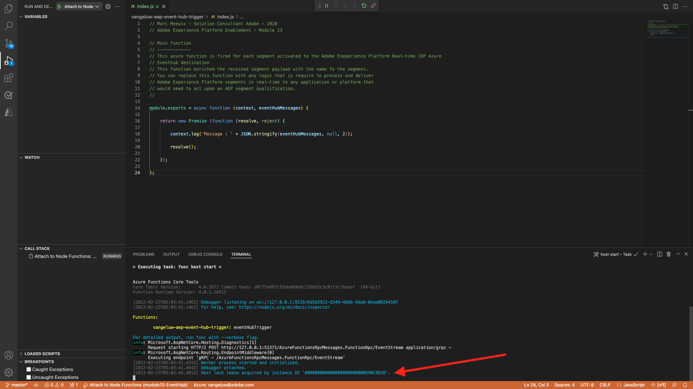
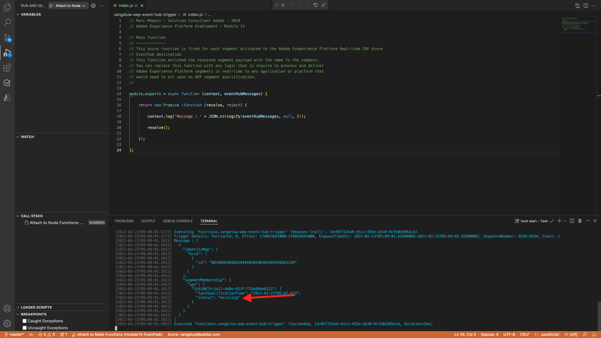

# 13.6 End-to-end scenario

## 13.6.1 Start Azure Event Hub trigger

To show the payload send by Adobe Experience Platform Real-time CDP to our Azure Event Hub upon segment qualification, we need to start our simple Azure Event Hub trigger function. This function will simple "dump" the payload to the console in Visual Studio Code. But remember this function can be extended in any way to interface with all sorts of environments using dedicated API's and protocols.

### Launch Visual Studio Code and start project

Make sure to have your Visual Studio Code project opened and running

To start/stop/restart your Azure function in Visual Studio Code, refer to the following exercises:

- [Exercise 13.5.4 - Start Azure Project](./ex5.md)
- [Exercise 13.5.5 - Stop Azure Project](./ex5.md)

Your Visual Studio Code's **Terminal** should mention something similar to this:

```code
[2022-02-23T05:03:41.429Z] Worker process started and initialized.
[2022-02-23T05:03:41.484Z] Debugger attached.
[2022-02-23T05:03:46.401Z] Host lock lease acquired by instance ID '000000000000000000000000D90C881B'.
```



## 13.6.2 Load your Luma website

Go to [https://builder.adobedemo.com/projects](https://builder.adobedemo.com/projects). After logging in with your Adobe ID, you'll see this. Click your website project to open it.


You can now follow the below flow to access the website. Click **Integrations**.


On the **Integrations** page, you need to select the Data Collection property that was created in exercise 0.1. 


You'll then see your demo website open up. Select the URL and copy it to your clipboard.


Open a new incognito browser window.


Paste the URL of your demo website, which you copied in the previous step. You'll then be asked to login using your Adobe ID.


Select your account type and complete the login process.


You'll then see your website loaded in an incognito browser window. For every demonstration, you'll need to use a fresh, incognito browser window to load your demo website URL.


## 13.6.3 Qualify for your Interest in Equipment segment

Navigate to the **Equipment** page once, and **do not reload or refresh it**. This action should qualify you for your `--demoProfileLdap-- - Interest in Equipment` segment. 


To verify, open the Profile Viewer panel. You should now be a member of the `--demoProfileLdap-- - Interest in Equipment`. If your segment memberships are not yet updated in your Profile Viewer panel, click the reload button.  


Switch back to Visual Studio Code and look at your **TERMINAL** tab, you should see a list of segments for your specific **ECID**. This activation payload is delivered to your event hub as soon as you qualify for the `--demoProfileLdap-- - Interest in Equipment` segment. 

When you take a closer look a the segment payload, you can see that `--demoProfileLdap-- - Interest in Equipment` is in status **realized**. 

A segment status of **realized** means that our profile hsa just entered the segment. While the **existing** status means that our profile continues to be in the segment.


## 13.6.4 Visit the Equipment page for a second time

Do a hard refresh of the **Equipment** page.


Now, switch back to Visual Studio Code and verify your **TERMINAL** tab. You will see that we still have your segment, but now in status **existing** which means that our profile continues to be in the segment.



## 13.6.5 Visit the Sports page for a third time

If you would revisit the **Sports** page for a third time, no activation will take place, because there is no state change from a segment point of view. 

Segment activations only happen when the segment's status changes:


Next Step: [Summary and benefits](./summary.md)

[Go Back to Module 13](./segment-activation-microsoft-azure-eventhub.md)

[Go Back to All Modules](./../../overview.md)
