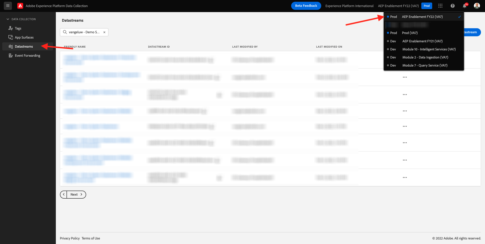
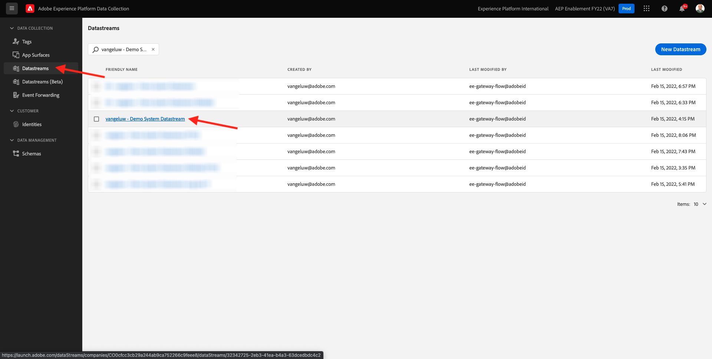
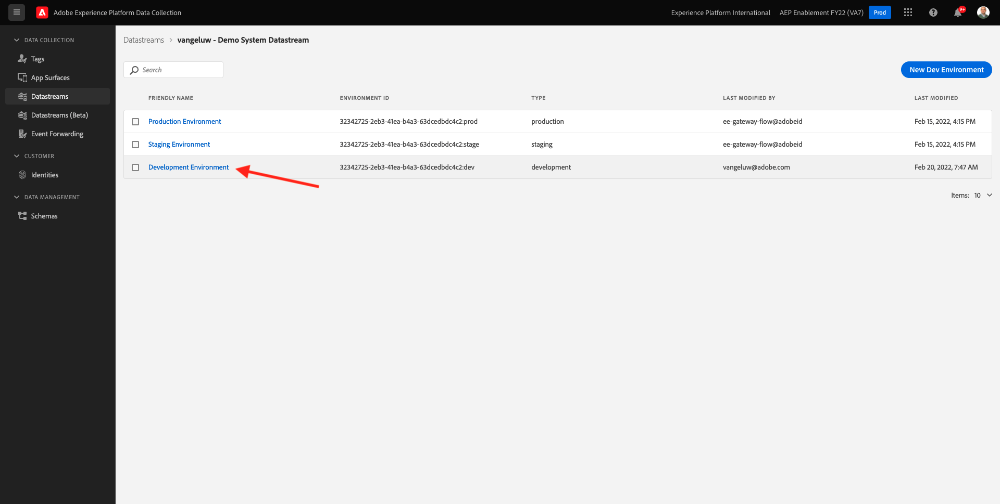
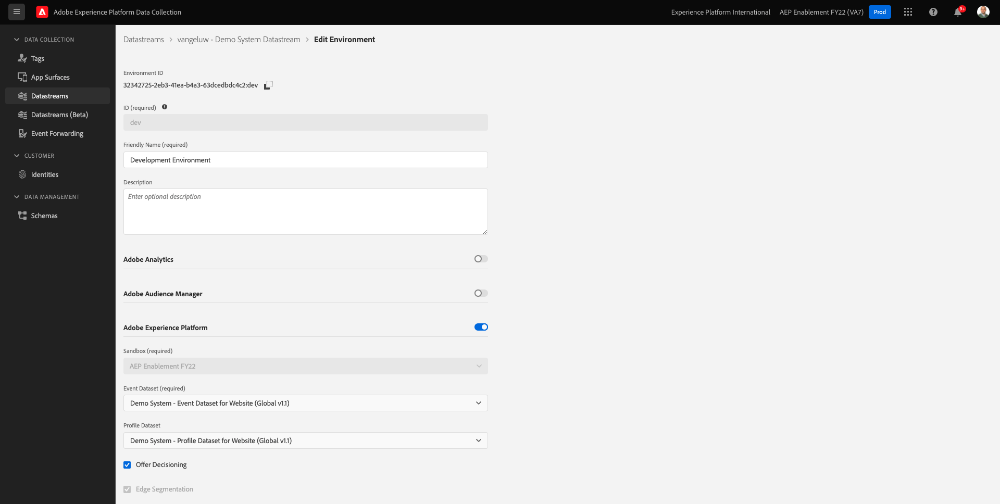
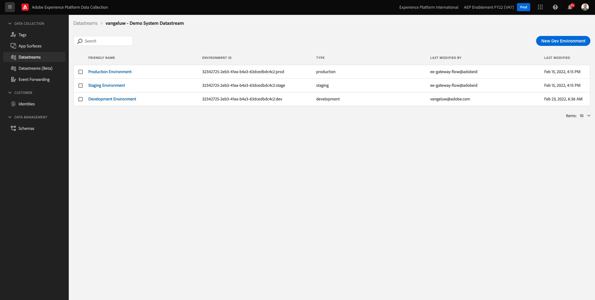

# 14.2 Update your Datastream to make data available to your Adobe Experience Platform Data Collection Server property

## 14.2.1 Update your Datastream

In [Exercise 0.2](./../../modules/module0/ex2.md), you created your own **[!UICONTROL Datastream]**. You then used the name `--demoProfileLdap-- - Demo System Datastream`.

In this exercise, you need to configure that **[!UICONTROL Datastream]** to work with your **[!DNL Data Collection Server property]**.

To do that, go to [https://experience.adobe.com/#/data-collection/](https://experience.adobe.com/#/data-collection/). You'll then see this. In the left menu, click **[!UICONTROL Datastreams]**.

In the top right corner of your screen, select your sandbox name, which should be `--aepSandboxId--`.

Search for your **[!UICONTROL Datastream]**, which is named `--demoProfileLdap-- - Demo System Datastream`. Click your **[!UICONTROL Datastream]** to open it.

You'll then see this. Click **[!UICONTROL + Add Service]**.

Select the service **Event Forwarding**. This will show you 2 additional settings. Select your Event Forwarding property, which you created in the previous exercise and which is named `--demoProfileLdap-- - Demo System (DD/MM/YYYY) (Edge)`. Then select **Development** under **Environment**. Click **Save**. 

Your datastream has now been updated and is ready for usage.

Your datastream is now ready to work with your **[!DNL Event Forwarding property]**.

Next Step: [14.3 Create and configure a custom webhook](./ex3.md)

[Go Back to Module 14](./aep-data-collection-ssf.md)

[Go Back to All Modules](./../../overview.md)
