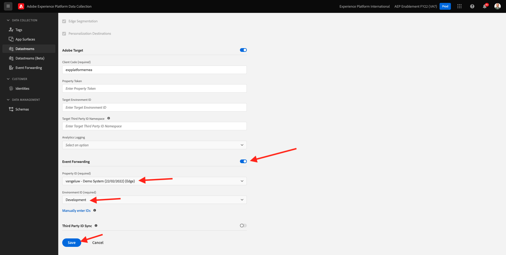

# 14.2 Update your Datastream to make data available to your Adobe Experience Platform Data Collection Server property

## 14.2.1 Update your Datastream

In [Exercise 0.2](./../../modules/module0/ex2.md), you created your own **[!UICONTROL Datastream]**. You then used the name `--demoProfileLdap-- - Demo System Datastream`.

In this exercise, you need to configure that **[!UICONTROL Datastream]** to work with your **[!DNL Data Collection Server property]**.

To do that, go to [https://experience.adobe.com/#/data-collection/](https://experience.adobe.com/#/data-collection/). You'll then see this. In the left menu, click **[!UICONTROL Datastreams]**.
Search for your **[!UICONTROL Datastream]**. Click your **[!UICONTROL Datastream]** to open it.

You'll then see this. Click **[!UICONTROL Development Environment]**.

In the **[!UICONTROL Development Environment]**, you'll see your current datastream configuration. 

Scroll down to **[!DNL Launch Server Side]** and toggle the button to turn [!DNL Launch Server Side] on.
You can then select your **[!DNL Event Forwarding property]** from the dropdown list. Search and select the **[!DNL Event Forwarding property]** you created in the previous step. After selecting the **[!DNL Event Forwarding property]**, you need to select the Environment ID. Select **[!DNL Development]**.

Click **[!DNL Save]**.

You'll then be back here.

Your datastream is now ready to work with your **[!DNL Event Forwarding property]**.

Next Step: [14.3 Create and configure a custom webhook](./ex3.md)

[Go Back to Module 14](./aep-data-collection-ssf.md)

[Go Back to All Modules](./../../overview.md)
