# 14.4 Create and configure a Google Cloud Function

## 14.4.1 Create your Google Cloud Function

Go to [https://console.cloud.google.com/](https://console.cloud.google.com/). Go to **Cloud Functions**.


You'll then see this. Click **CREATE FUNCTION**.

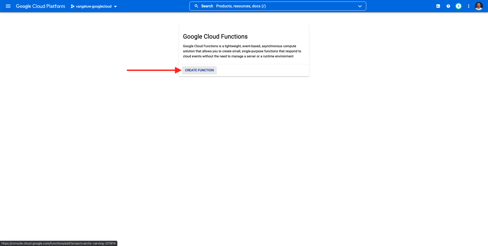

You'll then see this.

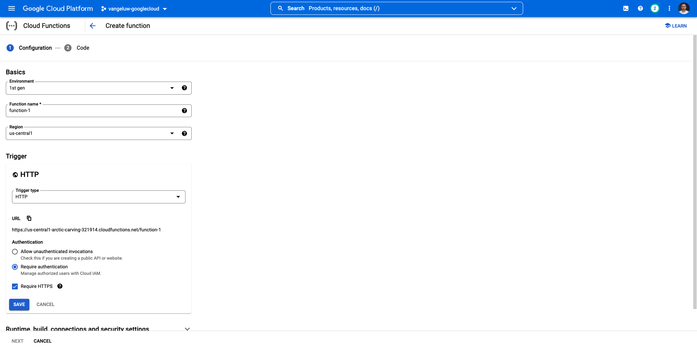

Make the following choices:

- **Function name**: `--demoProfileLdap---event-forwarding`
- **Region**: select any region
- **Trigger Type**: select **HTTP**
- **Authentication**: select **Allow unauthenticated invocations**

You should now have this. Click **SAVE**.

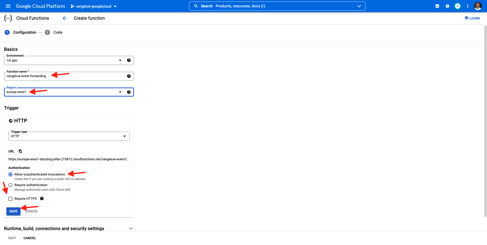

Click **NEXT**.


You'll then see this:

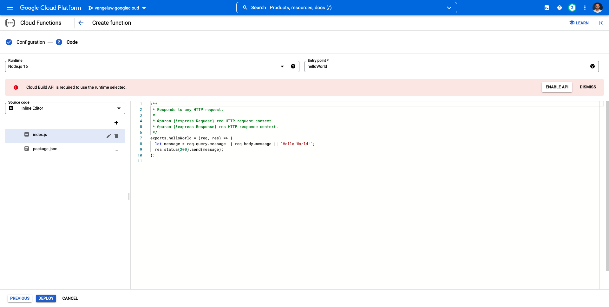

Make the following choices:

- **Runtime**: select **Node.js 16** (or more recent)
- **Entry point**: enter **helloAEP**

Click **ENABLE API** to enable **Cloud Build API**. You'll then see a new window. In that new window, click **ENABLE** again.

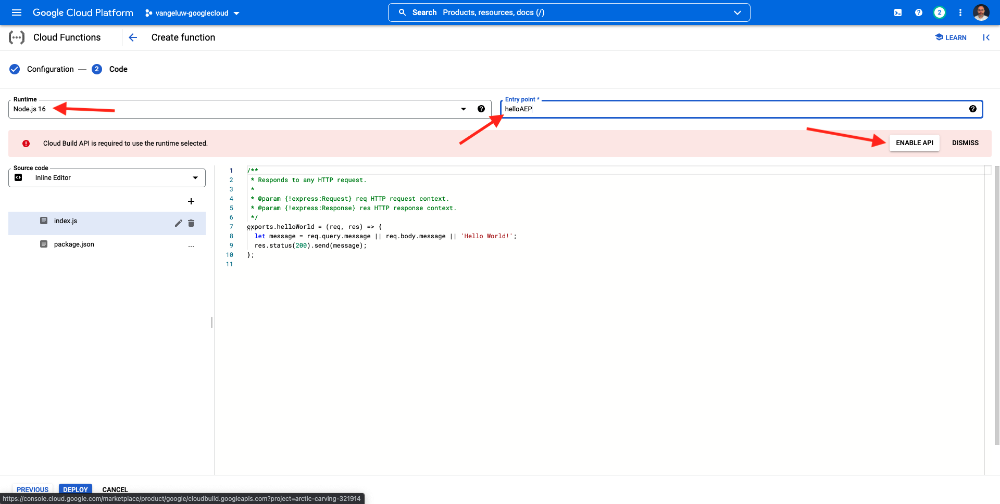

You'll then see this. Click **Enable**.

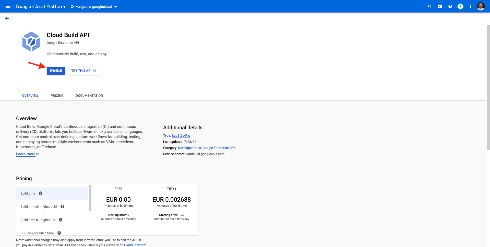

Once **Cloud Build API** has been enabled, you'll see this.


Go back to your **Cloud Function**.
In your Cloud Function Inline Editor, make sure you have the following code there:

```javascript
/**
 * Responds to any HTTP request.
 *
 * @param {!express:Request} req HTTP request context.
 * @param {!express:Response} res HTTP response context.
 */
exports.helloAEP = (req, res) => {
  let message = req.query.message || req.body.message || 'Hello World!';
  res.status(200).send(message);
};
```

Next, click **DEPLOY**.

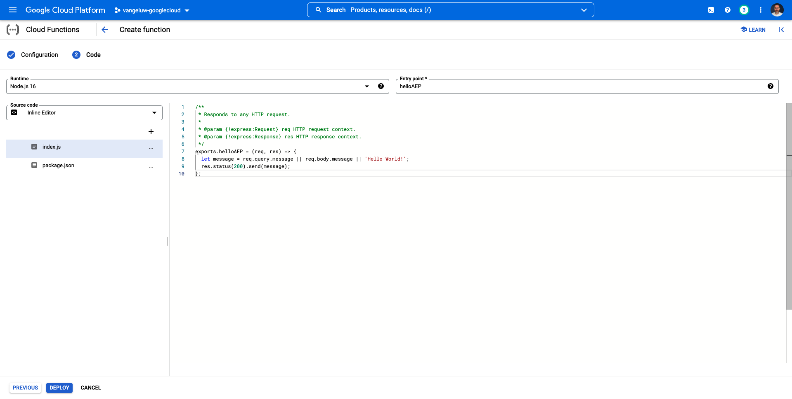

You'll then see this. Your Cloud Function is now being created. This may take a couple of minutes.

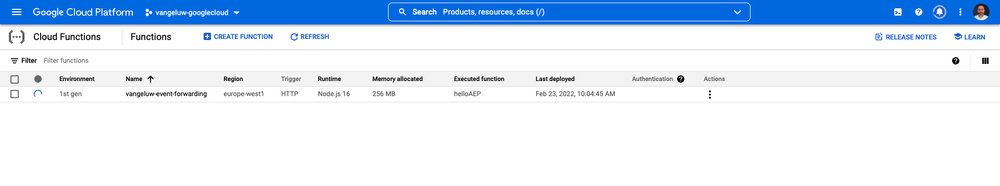

Once your function is created and running, you'll see this. Click on your function's name to open it.


You'll then see this. Go to **TRIGGER**. You'll then see the **Trigger URL** which is what you'll use to define the endpoint in Launch Server Side.

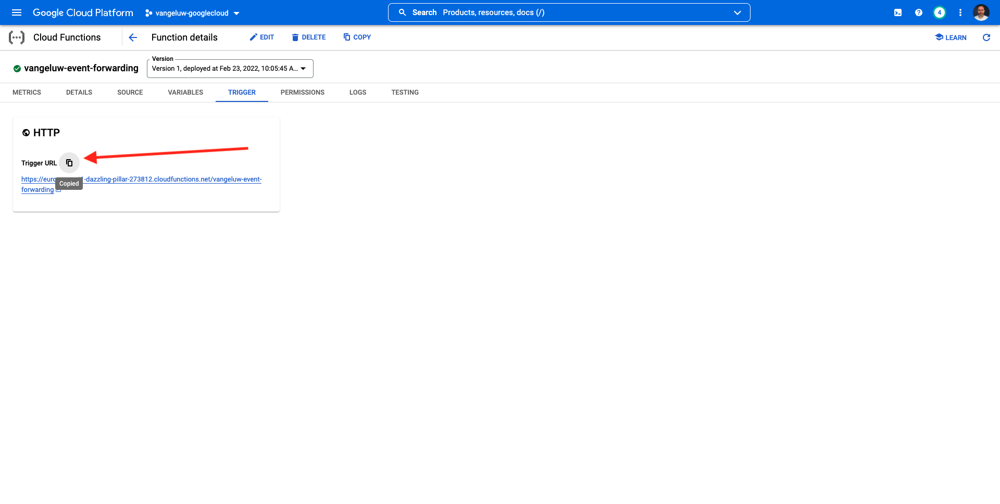

Copy the Trigger URL, which looks like this: **https://europe-west1-dazzling-pillar-273812.cloudfunctions.net/vangeluw-event-forwarding**.

In the next steps, you'll configure Adobe Experience Platform Data Collection Server to stream specific information about **Page Views** to your Google Cloud Function. Instead of just forwarding the full payload as-is, you'll only send things like **ECID**, **timestamp** and **Page Name** to your Google Cloud Function.

Here's an example of a payload that you'll need to parse to filter out the above mentioned variables:

```json
{
  "events": [
    {
      "xdm": {
        "eventType": "web.webpagedetails.pageViews",
        "web": {
          "webPageDetails": {
            "URL": "https://builder.adobedemo.com/run/vangeluw-OCUC",
            "name": "vangeluw-OCUC",
            "viewName": "vangeluw-OCUC",
            "pageViews": {
              "value": 1
            }
          },
          "webReferrer": {
            "URL": "https://builder.adobedemo.com/run/vangeluw-OCUC/equipment"
          }
        },
        "device": {
          "screenHeight": 1080,
          "screenWidth": 1920,
          "screenOrientation": "landscape"
        },
        "environment": {
          "type": "browser",
          "browserDetails": {
            "viewportWidth": 1920,
            "viewportHeight": 451
          }
        },
        "placeContext": {
          "localTime": "2022-02-23T06:51:07.140+01:00",
          "localTimezoneOffset": -60
        },
        "timestamp": "2022-02-23T05:51:07.140Z",
        "implementationDetails": {
          "name": "https://ns.adobe.com/experience/alloy/reactor",
          "version": "2.8.0+2.9.0",
          "environment": "browser"
        },
        "_experienceplatform": {
          "identification": {
            "core": {
              "ecid": "08346969856929444850590365495949561249"
            }
          },
          "demoEnvironment": {
            "brandName": "vangeluw-OCUC"
          },
          "interactionDetails": {
            "core": {
              "channel": "web"
            }
          }
        }
      },
      "query": {
        "personalization": {
          "schemas": [
            "https://ns.adobe.com/personalization/html-content-item",
            "https://ns.adobe.com/personalization/json-content-item",
            "https://ns.adobe.com/personalization/redirect-item",
            "https://ns.adobe.com/personalization/dom-action"
          ],
          "decisionScopes": [
            "eyJ4ZG06YWN0aXZpdHlJZCI6Inhjb3JlOm9mZmVyLWFjdGl2aXR5OjE0YzA1MjM4MmUxYjY1MDUiLCJ4ZG06cGxhY2VtZW50SWQiOiJ4Y29yZTpvZmZlci1wbGFjZW1lbnQ6MTRiZjA5ZGM0MTkwZWJiYSJ9",
            "__view__"
          ]
        }
      }
    }
  ],
  "query": {
    "identity": {
      "fetch": [
        "ECID"
      ]
    }
  },
  "meta": {
    "state": {
      "domain": "adobedemo.com",
      "cookiesEnabled": true,
      "entries": [
        {
          "key": "kndctr_907075E95BF479EC0A495C73_AdobeOrg_identity",
          "value": "CiYwODM0Njk2OTg1NjkyOTQ0NDg1MDU5MDM2NTQ5NTk0OTU2MTI0OVIPCPn66KfyLxgBKgRJUkwx8AH5-uin8i8="
        },
        {
          "key": "kndctr_907075E95BF479EC0A495C73_AdobeOrg_consent_check",
          "value": "1"
        },
        {
          "key": "kndctr_907075E95BF479EC0A495C73_AdobeOrg_consent",
          "value": "general=in"
        }
      ]
    }
  }
}
```

These are the fields that contain the information that needs to be parsed out:

- ECID: **events.xdm._experienceplatform.identification.core.ecid**
- timestamp: **timestamp**
- Page Name: **events.xdm.web.webPageDetails.name**

Let's go to Adobe Experience Platform Data Collection Server now, to configure the data elements to make that possible.

## 14.4.2 Update your Event Forwarding property: Data Elements

Go to [https://experience.adobe.com/#/data-collection/](https://experience.adobe.com/#/data-collection/) and go to **Event Forwarding**. Search your Event Forwarding property and click it to open it.


In the left menu, go to **Data Elements**. Click **Add Data Element**.


You'll then see a new data element to configure.

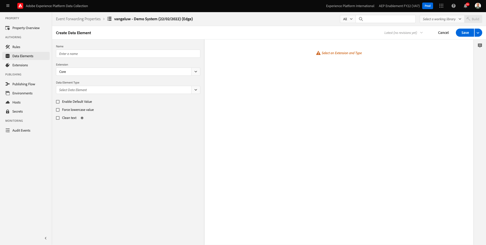

Make the following selection:

- As the **Name**, enter **customerECID**.
- As the **Extension**, select **Core**.
- As the **Data Element Type**, select **Path**.
- As the **Path**, enter `arc.event.xdm.--aepTenantId--.identification.core.ecid`. By entering this path, you'll be filtering out the field **ecid** from the event payload that is sent by the website or mobile app into the Adobe Edge.

>[!NOTE]
>
>In the above and below paths, a reference is made to **arc**. **arc** stands for Adobe Resource Context and **arc** always stands for the highest available object that is available in the Server Side context. Enrichments and transformations may be added to that **arc** object using Adobe Experience Platform Data Collection Server functions.
>
>In the above and below paths, a reference is made to **event**. **event** stands for a unique event and Adobe Experience Platform Data Collection Server will always evaluate every event individually. Sometimes, you may see a reference to **events** in the payload sent by Web SDK Client Side, but in Adobe Experience Platform Data Collection Server, every event is evaluated individually.

You'll now have this. Click **Save**.

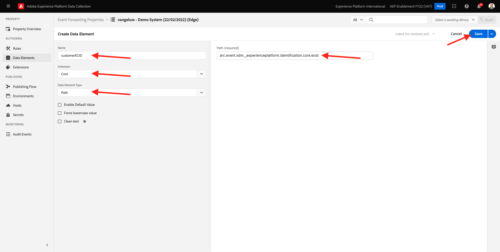

Click **Add Data Element**.


You'll then see a new data element to configure.


Make the following selection:

- As the **Name**, enter **eventTimestamp**.
- As the **Extension**, select **Core**.
- As the **Data Element Type**, select **Path**.
- As the **Path**, enter **arc.event.xdm.timestamp**. By entering this path, you'll be filtering out the field **timestamp** from the event payload that is sent by the website or mobile app into the Adobe Edge.

You'll now have this. Click **Save**.

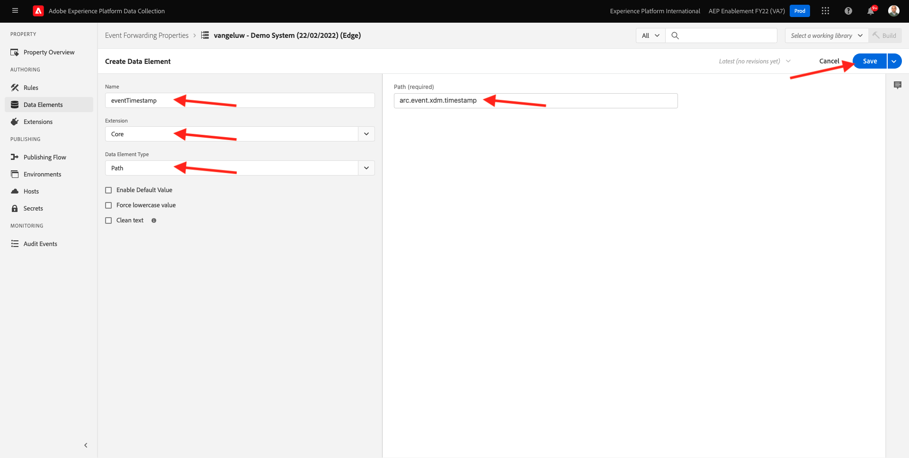

Click **Add Data Element**.


You'll then see a new data element to configure.


Make the following selection:

- As the **Name**, enter **pageName**.
- As the **Extension**, select **Core**.
- As the **Data Element Type**, select **Path**.
- As the **Path**, enter **arc.event.xdm.web.webPageDetails.name**. By entering this path, you'll be filtering out the field **name** from the event payload that is sent by the website or mobile app into the Adobe Edge.

You'll now have this. Click **Save**.

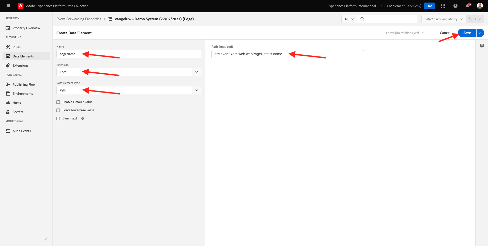

You now have these data elements created:


## 14.4.3 Update your Event Forwarding property: Update a Rule

In the left menu, go to **Rules**. In the previous exercise, you created the rule **All Pages**. Click that rule to open it.

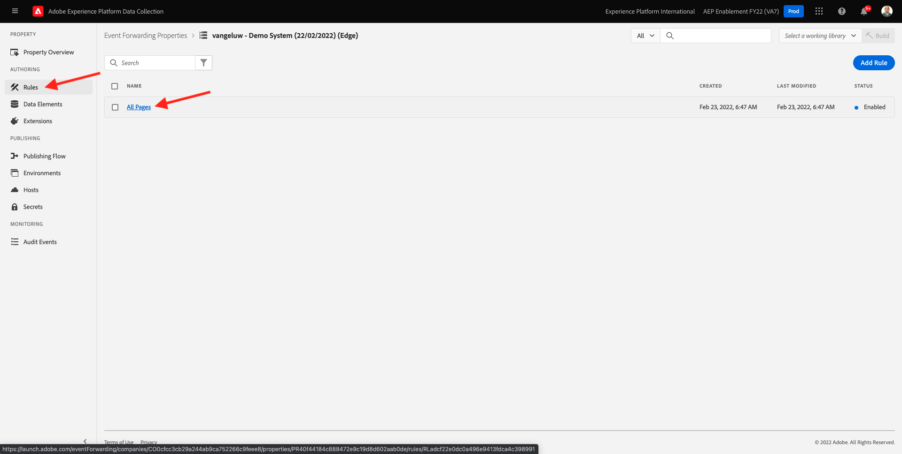

You'll then this. Click the **+** icon under **Actions** to add a new action. 

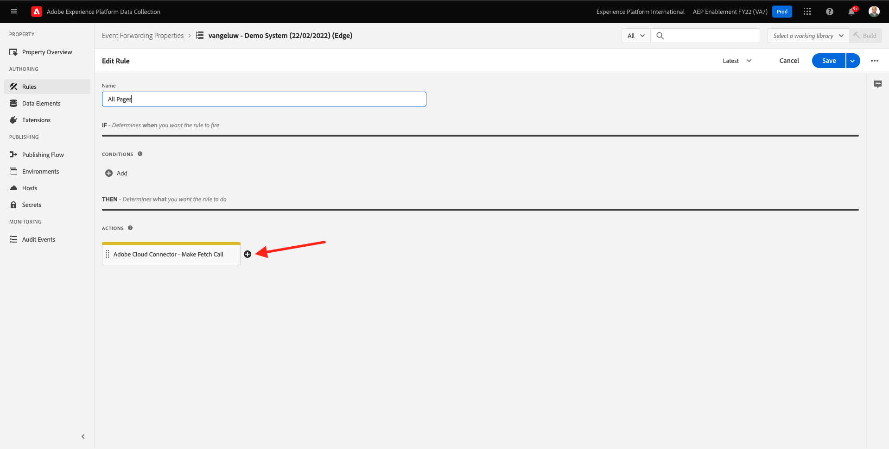

You'll then see this.

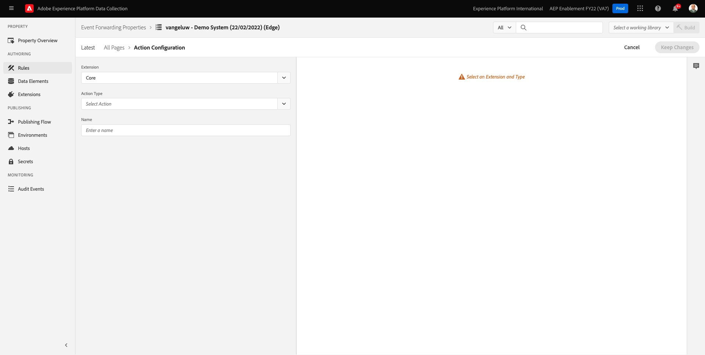

Make the following selection:

- Select the **Extension**: **Adobe Cloud Connector**.
- Select the **Action Type**: **Make Fetch Call**.

That should give you this **Name**: **Adobe Cloud Connector - Make Fetch Call**. You should now see this:

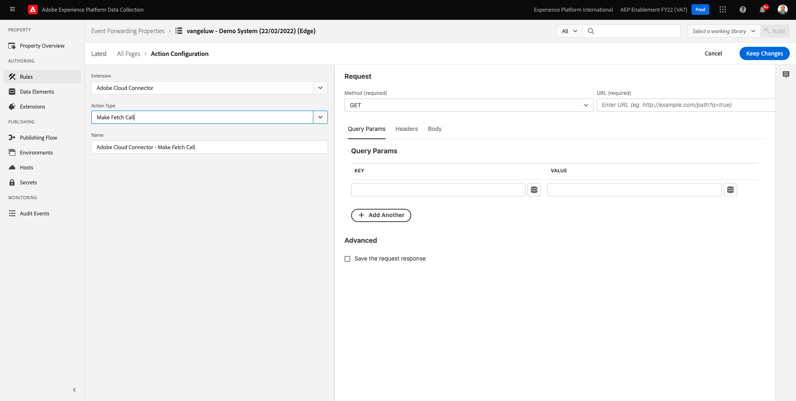

Next, configure the following:

- Change the request protocol from GET to **POST**
- Enter the URL of the Google Cloud Function you created in one of the previous steps which looks like this: **https://europe-west1-dazzling-pillar-273812.cloudfunctions.net/vangeluw-event-forwarding**

You should now have this. Next, go to **Body**.


You'll then see this. Click the radio button for **JSON**.

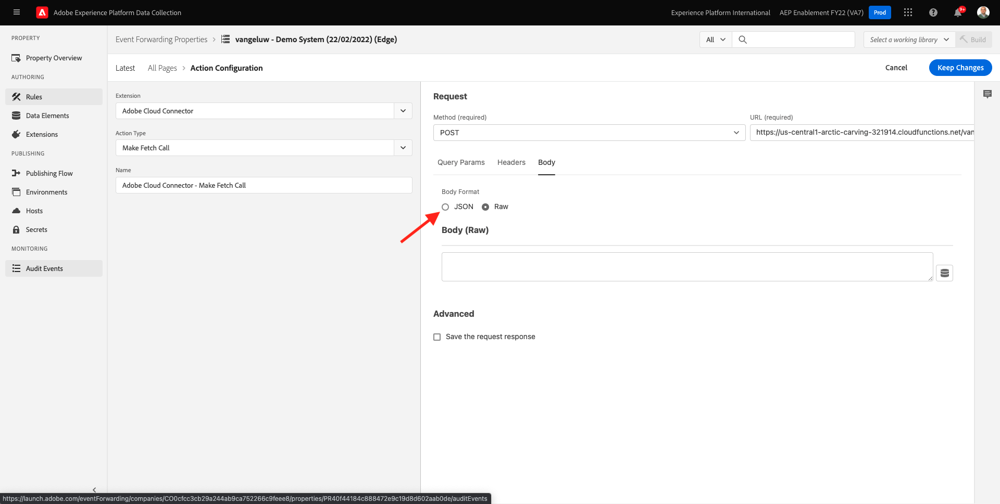

Configure the **Body** as follows:

| KEY | VALUE | 
|--- |--- |
|customerECID|{{customerECID}}|
|pageName|{{pageName}}|
|eventTimestamp|{{eventTimestamp}}|

You'll then see this. Click **Keep Changes**.

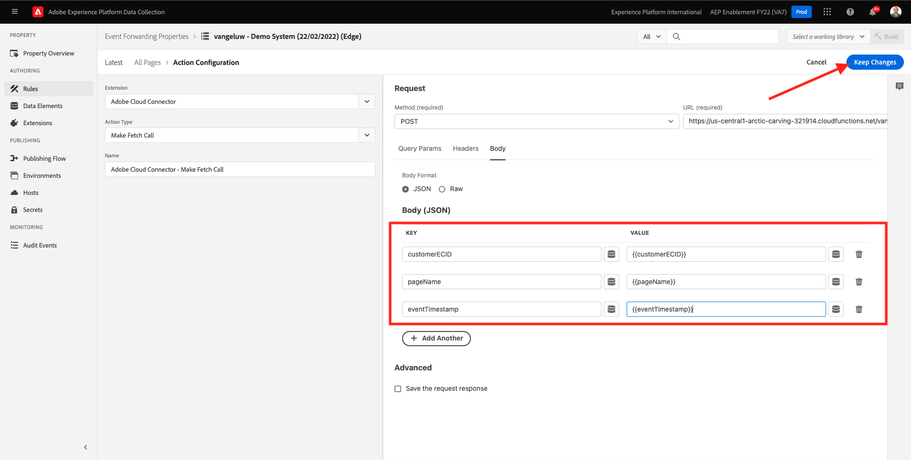

You'll then see this. Click **Save**.


You've now update your existing rule in a Adobe Experience Platform Data Collection Server property. Go to **Publishing Flow** to publish your changes. Open your Development library **Main** by clicking **Edit** as indicated.

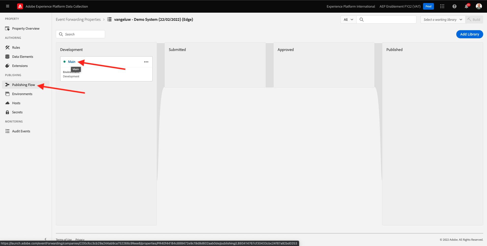

Click the **Add All Changed Resources** button, after which you'll see your Rule and Data Element appear in this library. Next, click **Save & Build for Development**. Your changes are now being deployed.


After a couple of minutes, you'll see that the deployment is done and ready to be tested.

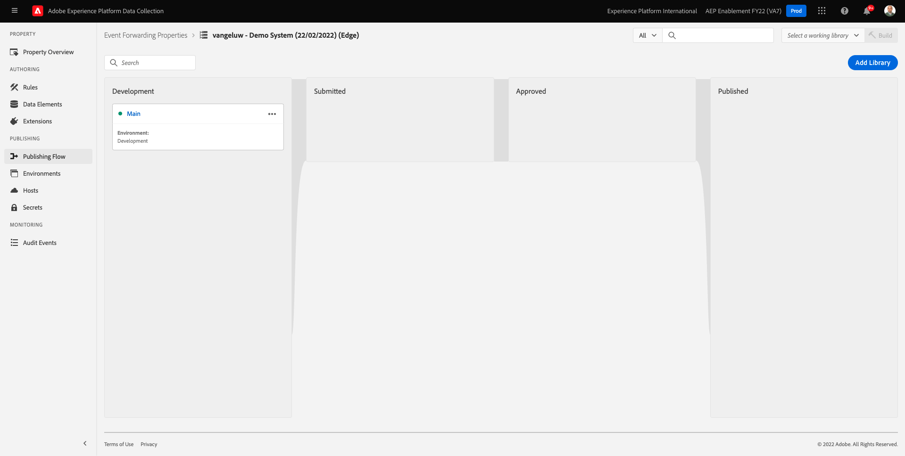

## 14.3.4 Test your configuration

Go to [https://builder.adobedemo.com/projects](https://builder.adobedemo.com/projects). After logging in with your Adobe ID, you'll see this. Click your website project to open it.


You can now follow the below flow to access the website. Click **Integrations**.

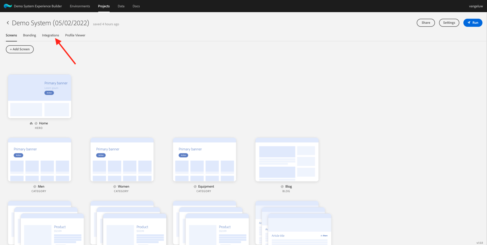

On the **Integrations** page, you need to select the Data Collection property that was created in exercise 0.1. 

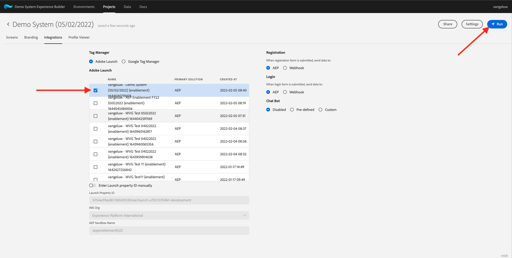

You'll then see your demo website open up. Select the URL and copy it to your clipboard.


Open a new incognito browser window.


Paste the URL of your demo website, which you copied in the previous step. You'll then be asked to login using your Adobe ID.


Select your account type and complete the login process.


You'll then see your website loaded in an incognito browser window. For every demonstration, you'll need to use a fresh, incognito browser window to load your demo website URL.


When you open up your browser Developer View, you can inspect Network requests as indicated below. When you use the filter **interact**, you'll see the network requests that are sent by Adobe Experience Platform Data Collection Client to the Adobe Edge.

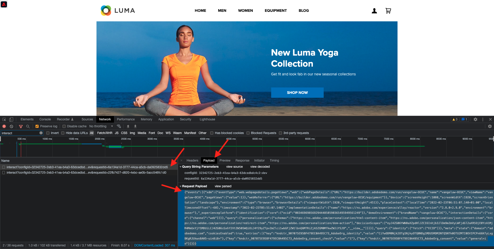

Switch your view to your Google Cloud Function and go to **LOGS**. You should now have a view similar to this one, with a number of log entries being shown. Every time you see **Function execution started**, it means that incoming traffic was received in your Google Cloud Function.

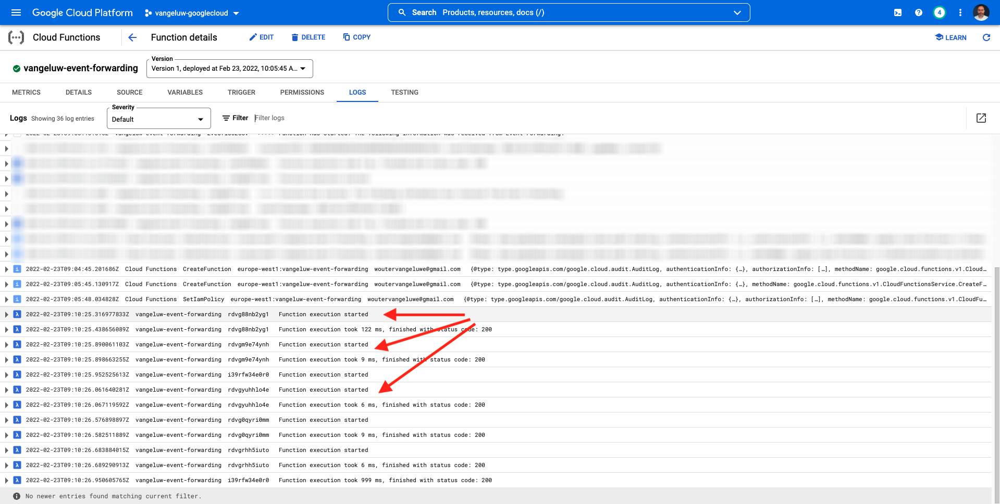

Let's update your function a bit to work with the incoming data, and display the information that was received from Adobe Experience Platform Data Collection Server. Go to **SOURCE** and click **EDIT**.

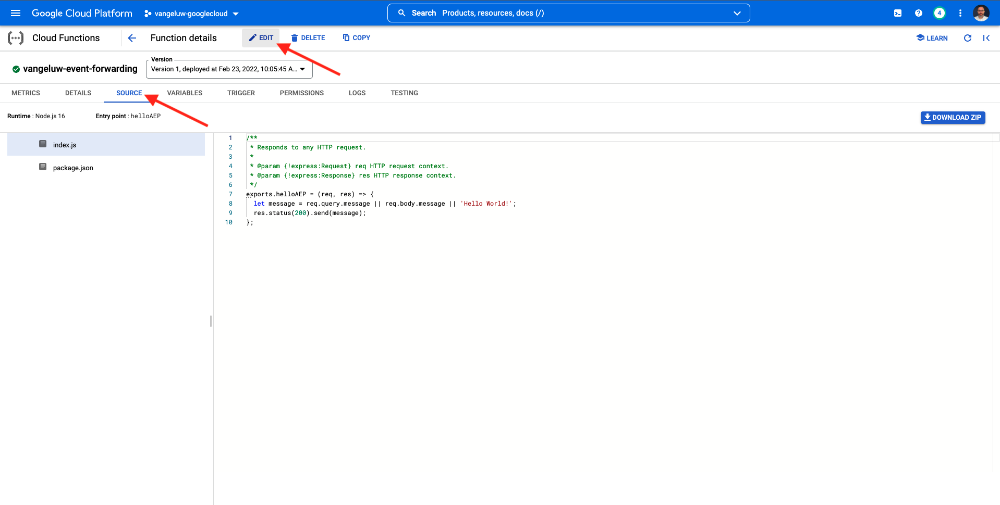

In the next screen, click **NEXT**.

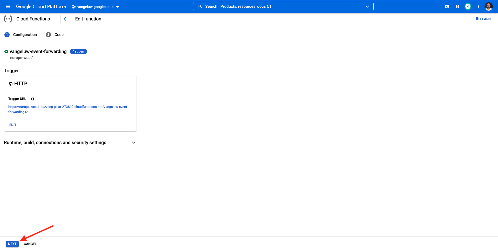

Update your code like this:

```javascript
/**
 * Responds to any HTTP request.
 *
 * @param {!express:Request} req HTTP request context.
 * @param {!express:Response} res HTTP response context.
 */
exports.helloAEP = (req, res) => {
  console.log('>>>>> Function has started. The following information was received from Event Forwarding:');
  console.log(req.body);

  let message = req.query.message || req.body.message || 'Hello World!';
  res.status(200).send(message);
};
```

You'll then have this. Click **DEPLOY**.

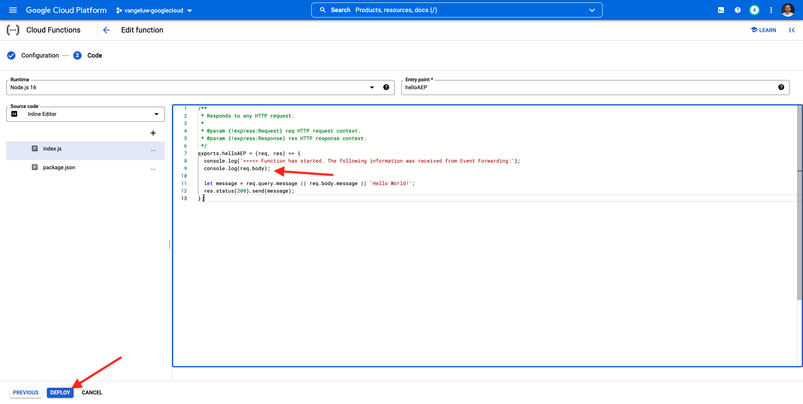

After a couple of minutes, your function will be deployed again. Click your function name to open it.

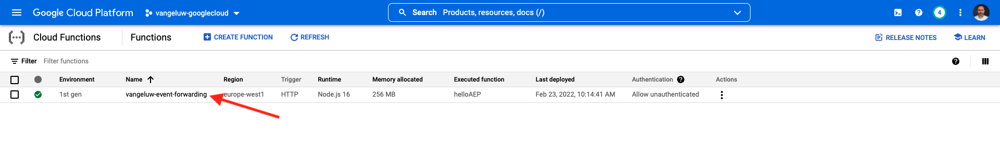

On your demo website, navigate to a product, like for instance **DEIRDRE RELAXED-FIT CAPRI**.


Switch your view to your Google Cloud Function and go to **LOGS**. You should now have a view similar to this one, with a number of log entries being shown.

For every page view on your demo website, you should now see a new log entry pop up in your Google Cloud Function's logs, which shows the received information.


You've now successfully sent data that was collected by Adobe Experience Platform Data Collection, in real-time, to a Google Cloud Function endpoint. From there, that data can be used by any Google Cloud Platform application, such as BigQuery for storage and reporting or for Machine Learning use cases.

Next Step: [14.5 Forward events towards the AWS ecosystem](./ex5.md)

[Go Back to Module 14](./aep-data-collection-ssf.md)

[Go Back to All Modules](./../../overview.md)
