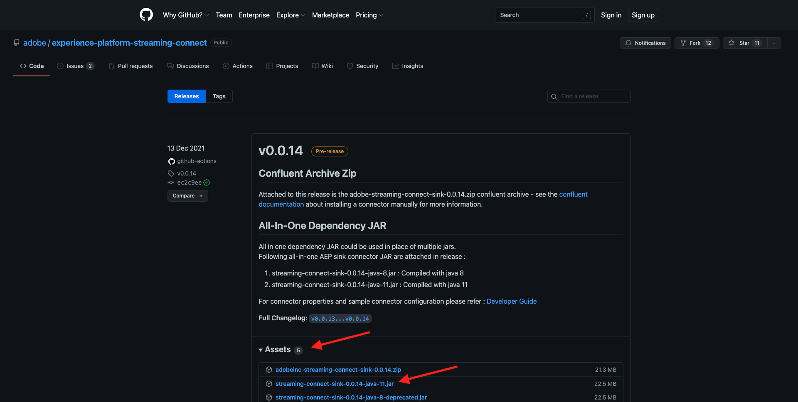
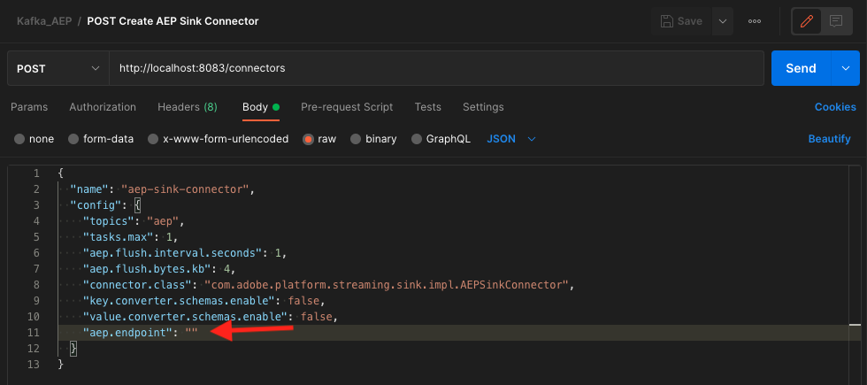
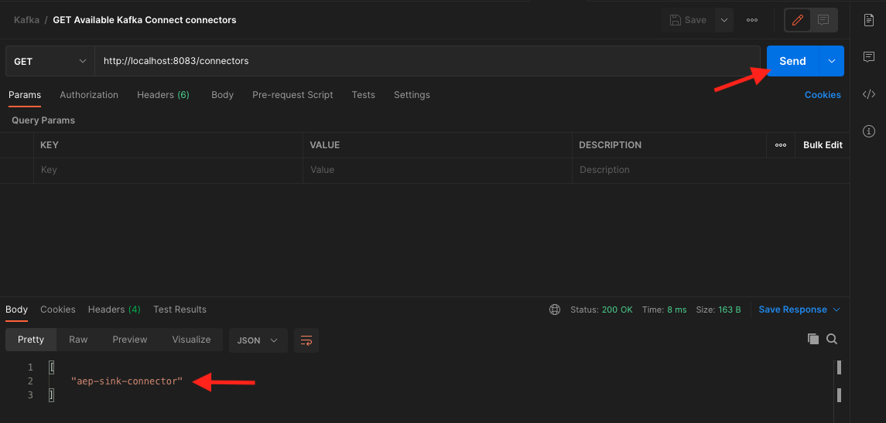
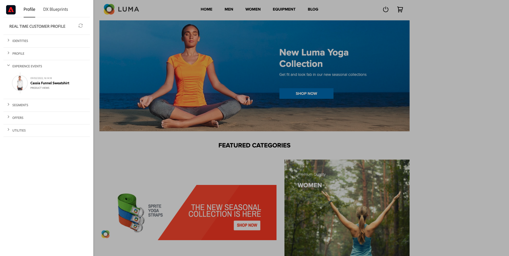
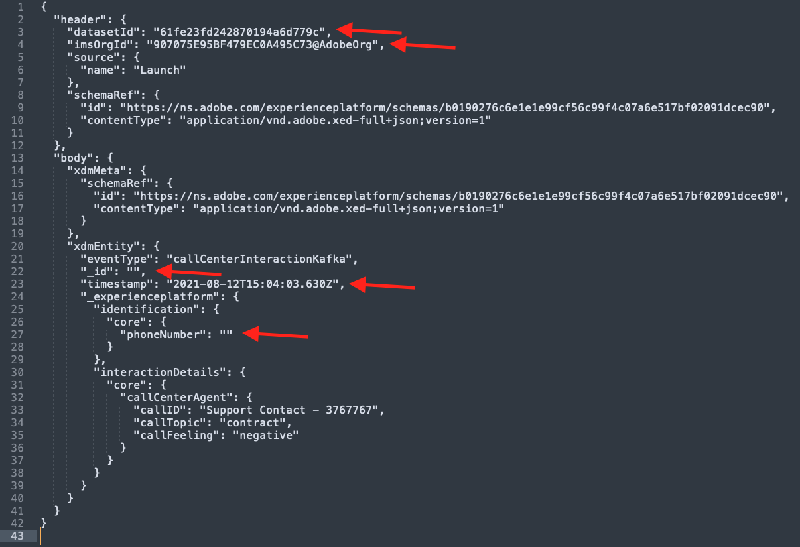
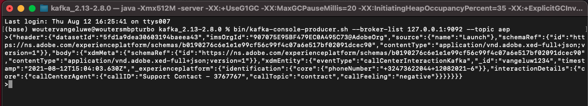
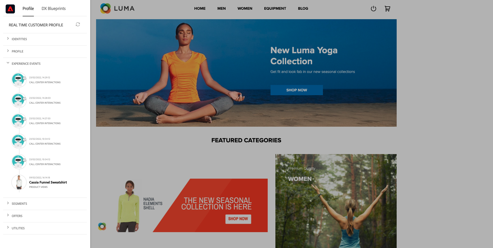

# 15.4 Install and configure Kafka Connect and the Adobe Experience Platform Sink Connector

## 15.4.1 Download the Adobe Experience Platform Sink Connector

Go to [https://github.com/adobe/experience-platform-streaming-connect/releases](https://github.com/adobe/experience-platform-streaming-connect/releases) and download the latest official release of the Adobe Experience Platform Sink Connector.



Place the download file, **streaming-connect-sink-0.0.14-java-11.jar**, onto your desktop.


## 15.4.2 Configure Kafka Connect

Go to the folder on your desktop named **Kafka_AEP** and navigate to the folder `kafka_2.13-3.1.0/config`.
In that folder, open the file **connect-distributed.properties** using any Text Editor.


In your Text Editor, go to line 34 and 35 and make sure to set the fields `key.converter.schemas.enable` and `value.converter.schemas.enable` to `false`

```json
key.converter.schemas.enable=false
value.converter.schemas.enable=false
```

Save your changes to this file.


Next, go back to the folder `kafka_2.13-3.1.0` and manually create a new folder, and name it `connectors`.


Right-click the folder and click **New terminal at Folder**.


You'll then see this. Enter the command `pwd` to retrieve the full path for that folder. Select the full path and copy it to your clipboard.


Go back to your Text Editor, to the file **connect-distributed.properties** and scroll down to the last line (line 86 in the screenshot). You should uncomment the line that starts with `# plugin.path=` and you should paste the full path to the folder named `connectors`. The result should look similar to this:

`plugin.path=/Users/woutervangeluwe/Desktop/Kafka_AEP/kafka_2.13-3.1.0/connectors` 

Save your changes to the file **connect-distributed.properties** and close your Text Editor.


Next, copy the latest official release of the Adobe Experience Platform Sink Connector that you downloaded into the folder named `connectors`. The file that you downloaded before is named **streaming-connect-sink-0.0.14-java-11.jar**, you can simply move it into the `connectors` folder.


Next, open a new Terminal window at the level of the **kafka_2.13-3.1.0** folder. Right-click that folder and click **New Terminal at Folder**.

In the Terminal window, paste this command: `bin/connect-distributed.sh config/connect-distributed.properties` and click **Enter**. This command will start Kafka Connect and will load the library of the Adobe Experience Platform Sink Connector.


After a couple of seconds, you'll see something like this:


## 15.4.3 Create your Adobe Experience Platform Sink Connector using Postman

You can now interact with Kafka Connect using Postman. To do so, download [this Postman Collection](../../assets/postman/postman_kafka.zip) and uncompress it to your local computer on the desktop. You'll then have a file that is called `Kafka_AEP.postman_collection.json`.


You need to import this file in Postman. To do so, open Postman, click **Import**, drag and drop the file `Kafka_AEP.postman_collection.json` into the popup and click **Import**.


You'll then find this collection in the left menu of Postman. Click the first request, **GET Available Kafka Connect connectors** to open it.


You'll then see this. Click the blue **Send** button, after which you should see an empty response `[]`. The empty response is due to the fact that no Kafka Connect connectors are currently defined.


To create a connector, click to open the second request in the Kafka collection, **POST Create AEP Sink Connector**. You'll then see this. On line 11, where it says **"aep.endpoint": ""**, you need to paste in the HTTP API Streaming endpoint URL that you received at the end of exercise [15.3](./ex3.md). The HTTP API Streaming endpoint URL looks like this: `https://dcs.adobedc.net/collection/d282bbfc8a540321341576275a8d052e9dc4ea80625dd9a5fe5b02397cfd80dc`.



After pasting it, the body of your request should look like this. Click the blue **Send** button to create your connector. You'll get an immediate response of the creation of your connector.


Click the first request, **GET Available Kafka Connect connectors** to open it again and click the blue **Send** button again. you'll now see that a Kafka Connect connector is created.



Next, open the third request in the Kafka collection, **GET Check Kafka Connect Connector Status**. Click the blue **Send** button, you'll then get a response like the one below, stating that the connector is running.


## 15.4.4 Produce an experience event

Open a new **Terminal** window by right-clicking your folder **kafka_2.13-3.1.0** and clicking **New Terminal at Folder**.


Enter the following command:

`bin/kafka-console-producer.sh --broker-list 127.0.0.1:9092 --topic aep`


You'll then see this. Every new line followed by pushing the Enter button will result in a new message being sent into the topic **aep**.


You can now send a message, which will result in being consumed by the Adobe Experience Platform Sink Connector, and which will be ingested into Adobe Experience Platform in real-time.

Let's do a little demo to test this.

Go to [https://builder.adobedemo.com/projects](https://builder.adobedemo.com/projects). After logging in with your Adobe ID, you'll see this. Click your website project to open it.


On the **Screens** page, click **Run**. 


You'll then see your demo website open up. Select the URL and copy it to your clipboard.


Open a new incognito browser window.


Paste the URL of your demo website, which you copied in the previous step. You'll then be asked to login using your Adobe ID.


Select your account type and complete the login process.


You'll then see your website loaded in an incognito browser window. For every demonstration, you'll need to use a fresh, incognito browser window to load your demo website URL.


Click the Adobe logo icon in the top left corner of your screen to open the Profile Viewer.
  


Have a look at the Profile Viewer panel and the Real-time Customer Profile with the **Experience Cloud ID** as the primary identifier for thi currently unknown customer.
      


Go to the Register/Login page. Click **CREATE AN ACCOUNT**.
  

  
Fill out your details and click **Register** after which you'll be redirected to the previous page. 


Open the Profile Viewer panel and go to Real-time Customer Profile. On the Profile Viewer panel, you should see all of your personal data displayed, like your newly added email and phone identifiers.
  


You may see some experience events based on past activity.



Let's change that and send in a Callcenter experience event from Kafka into Adobe Experience Platform.

Take the below sample experience event payload and copy it into a Text Editor.

```json
{
  "header": {
    "datasetId": "61fe23fd242870194a6d779c",
    "imsOrgId": "--aepImsOrgID--",
    "source": {
      "name": "Launch"
    },
    "schemaRef": {
      "id": "https://ns.adobe.com/experienceplatform/schemas/b0190276c6e1e1e99cf56c99f4c07a6e517bf02091dcec90",
      "contentType": "application/vnd.adobe.xed-full+json;version=1"
    }
  },
  "body": {
    "xdmMeta": {
      "schemaRef": {
        "id": "https://ns.adobe.com/experienceplatform/schemas/b0190276c6e1e1e99cf56c99f4c07a6e517bf02091dcec90",
        "contentType": "application/vnd.adobe.xed-full+json;version=1"
      }
    },
    "xdmEntity": {
      "eventType": "callCenterInteractionKafka",
      "_id": "",
      "timestamp": "2022-02-23T09:54:12.232Z",
      "_experienceplatform": {
        "identification": {
          "core": {
            "phoneNumber": ""
          }
        },
        "interactionDetails": {
          "core": {
            "callCenterAgent": {
              "callID": "Support Contact - 3767767",
              "callTopic": "contract",
              "callFeeling": "negative"
            }
          }
        }
      }
    }
  }
}
```

You'll then see this. You need to manually update 2 fields:

- **_id**: please set it to a random id, something like `--demoProfileLdap--1234`
- **timestamp**: update the timestamp to the current date and time
- **phoneNumber**: enter the phoneNumber of the account that was just created on the demo website. You can find it on the Profile Viewer panel under **Identities**.

You also need to check and maybe update these fields:
- **datasetId**: you need to copy the Dataset ID for the dataset Demo System - Event Dataset for Call Center (Global v1.1)
- **imsOrgID**: your IMS Org ID is `--aepImsOrgId--`

>[!NOTE]
>
>The field **_id** needs to be unique for every data ingestion. If you produce multiple events, please make sure that you update the field **_id** every time to a new, unique value.



You should then have something like this:


Next, copy your full experience event to your clipboard. The whitespace of your JSON payload needs to be stripped and we'll use an online tool to do that. Go to [http://jsonviewer.stack.hu/](http://jsonviewer.stack.hu/) to do that.


Paste your experience event into the editor and click **Remove white space**.


Next, select all of the output text and copy it to your clipboard.


Go back to your Terminal window.


Paste the new payload without whitespaces into the Terminal window and click **Enter**.



Next, go back to your demo website and refresh the page. You should now see an experience event on your profile, under **Other Events**, just like the one below:



>[!NOTE]
>
>If you want your call center interactions to appear on the Profile Viewer panel, you need to add the below label and filter in your project on [https://builder.adobedemo.com/projects](https://builder.adobedemo.com/projects), by going to the tab **Profile Viewer**.


You have finished this exercise.

Next Step: [Summary and benefits](./summary.md)

[Go Back to Module 15](./aep-apache-kafka.md)

[Go Back to All Modules](../../overview.md)
