# 3.3 Visualize your own real-time customer profile - API

In this exercise, you'll use Postman and Adobe I/O to query Adobe Experience Platform's APIs to view your own real-time customer profile.
 
## Story

In the Real-time Customer Profile, all profile data is shown alongside event data, as well as existing segment memberships. The data shown can come from anywhere, from Adobe applications and external solutions. This is the most powerful view in Adobe Experience Platform, the experience system of record.

The Real-time Customer Profile can be consumed by all Adobe applications, but also by external solutions like Call Centers or in-store clienteling apps. The way to do this is to connect those external solutions to Adobe Experience Platform's APIs.

## 3.3.1 Your Identifiers

On the Profile Viewer panel on the website, you can find multiple identities. Every Identity is linked to a Namespace. 

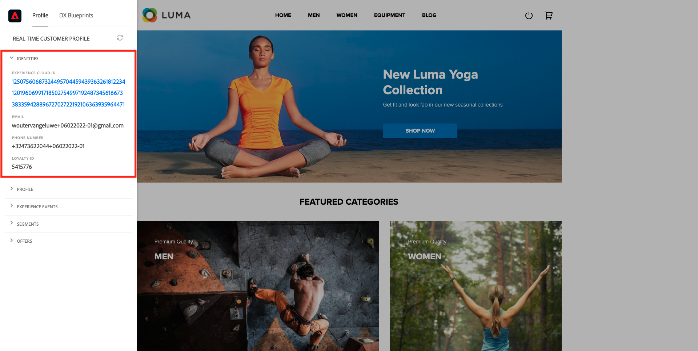

On the X-ray panel, we can see 4 different combinations of IDs and Namespaces:

| Identity     | Namespace       |
|:-------------:| :---------------:|
| Experience Cloud ID (ECID)          | 12507560687324495704459439363261812234 |
| Email ID          | woutervangeluwe+06022022-01@gmail.com|
| Mobile Number ID          | +32473622044+06022022-01|

Remember these identifiers for the next step.

With these IDs in mind, go to Postman.

## 3.3.2 Setup your Adobe I/O Project

In this exercise you'll be using Adobe I/O quite intensively to query against Platform's APIs. Please follow the below steps to setup Adobe I/O.

Go to [https://developer.adobe.com/console/home](https://developer.adobe.com/console/home)


Make sure to select the correct Adobe Experience Platform instance in the top right corner of your screen. Your instance is `--envName--`.

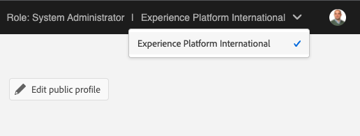

Click **Create new project**.

 or 


Select **+ Add to Project** and select **API**.

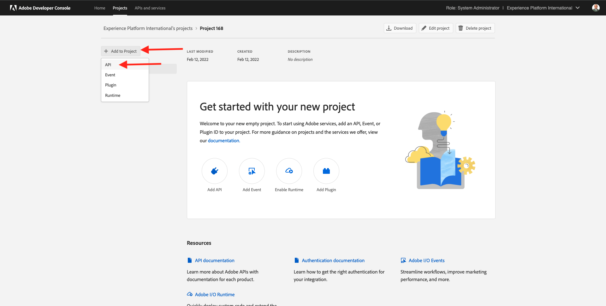

You'll then see this:

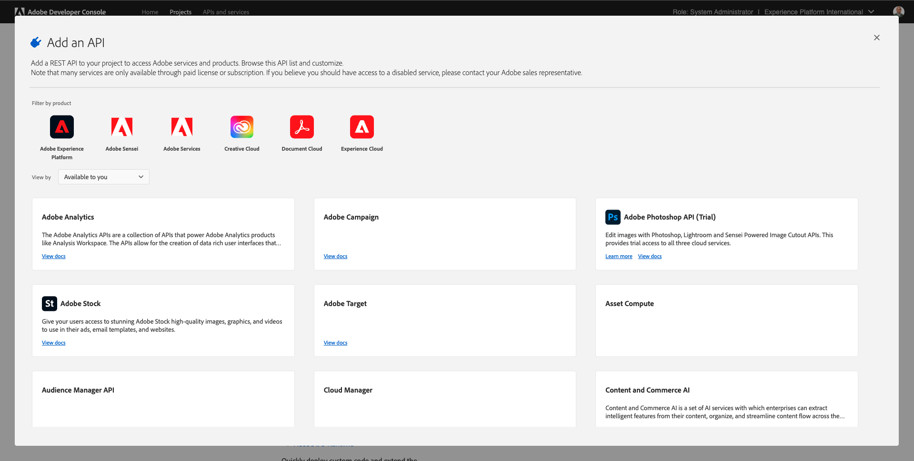

Click the **Adobe Experience Platform** icon.


Click **Experience Platform API**.


Click **Next**.


You can now choose to either have Adobe I/O generate your security key pair, or upload an existing one. 

Choose **Option 1 - Generate a key pair**.


Click **Generate keypair**.


You'll see a spinner for about 30 seconds.


You'll then see this, and your generated keypair will be downloaded as a zip file: **config.zip**.

Unzip the file **config.zip** on your desktop, you'll see it contains 2 files:


- **certificate_pub.crt** is your Public key certificate. From a security perspective, this is the certificate that is freely used to setup integrations with online applications.
- **private.key** is your Private key. This should never, ever be shared with anyone. The Private Key is what you use to authenticate to your API implementation and is supposed to be a secret. If you share your Private Key with anyone, they can access your implementation and abuse the API to ingest malicious data into Platform and extract all the data that sits in Platform.


Make sure to save the **config.zip** file in a safe location, as you'll need this for the next steps and for future access to Adobe I/O and Adobe Experience Platform APIs.

Click **Next**.


You now have to select the **Product Profile(s)** for your integration. 

Select the required Product Profiles. 

**FYI**: in your Adobe Experience Platform instance, the Product Profiles will have a different naming. You need to select at least one product profile with the proper access rights, which are set up in the Adobe Admin Console.


Click **Save Configured API**.


You'll see a spinner for a couple of seconds.


And next, you'll see your integration.


Click the **Download for Postman** button and then click **Service Account (JWT)** to download a Postman environment (wait until the environment is downloaded, this can take a couple of seconds).

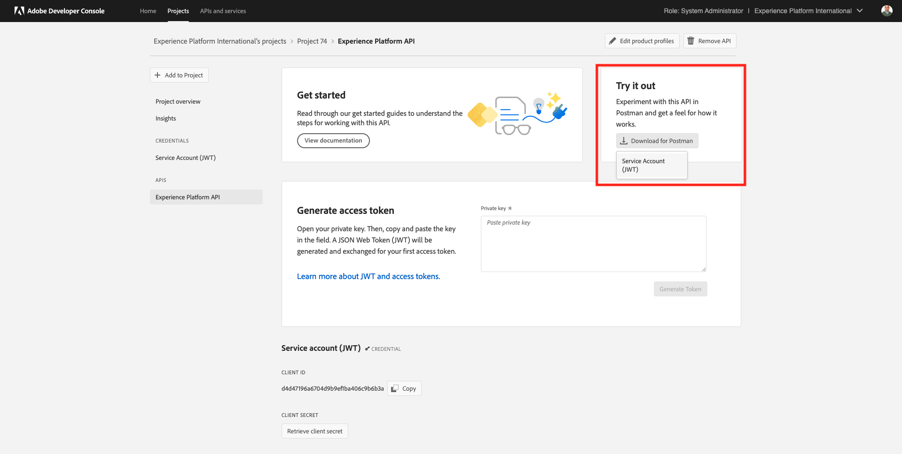

Scroll down until you see **Service Account (JWT)**, which is where you can find all your integration details that are used to configure the integration with Adobe Experience Platform.


Your IO Project currently has a generic name. You need to give a friendly name to your integration. Click on **Project 1** (or similar name) as indicated


Click **Edit Project**.


Enter a Name and Description for your integration. As a naming convention, we'll use `AEP API --demoProfileLdap--`. Replace ldap with your ldap.
For instance, if your ldap is vangeluw, the name and description of your integration becomes AEP API vangeluw.

Enter `AEP API --demoProfileLdap--` as the **Project Title**. Click **Save**.


Your Adobe I/O integration is now finished.


## 3.3.3 Postman authentication to Adobe I/O

Go to [https://www.getpostman.com/](https://www.getpostman.com/). 

Click on **Get Started**.


Next, download and install Postman.


After installation of Postman, start the application.

In Postman, there are 2 concepts: Environments and Collections.

- The Environment contains all of your environmental variables which are more or less consistent. In the Environment, you'll find things like the IMSOrg of our Platform environment, alongside security credentials like your Private Key and others. The environment file is the one you downloaded during the Adobe I/O setup in the previous exercise, it's name like this: **service.postman_environment.json**.
  
- The Collection contains a number of API requests that you can use. We will use 2 collections
  - 1 Collection for Authentication to Adobe I/0
  - 1 Collection for the exercises in this module
  - 1 collection for the exercises in the Real-Time CDP module, for Destination Authoring

Please download the file [postman.zip](../../assets/postman/postman_profile.zip) to your local desktop. 

In this **postman.zip** file, you'll find the following files:

- `_Adobe I-O - Token.postman_collection.json`
- `_Adobe Experience Platform Enablement.postman_collection.json`
- `Destination_Authoring_API.json`
  
Unzip the **postman.zip** file and store these 3 files in a folder on your desktop, together with the downloaded Postman environment from Adobe I/O. You need to have these 4 files in that folder:


Go back to Postman. Click **Import**.

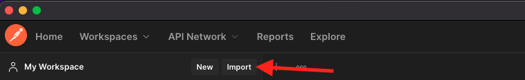

Click **Upload Files**.


Navigate to the folder on your desktop in which you extracted the 4 downloaded files. Select these 4 files at the same time and click **Open**.

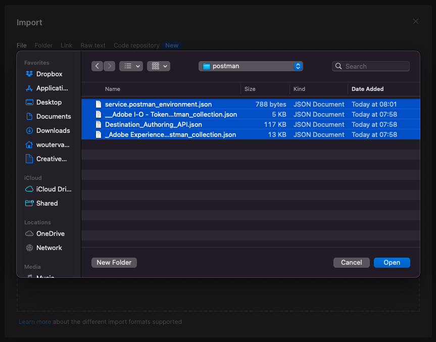

After having clicked **Open**, Postman will show you an overview of the Environment and Collections you're about to import. Click **Import**.

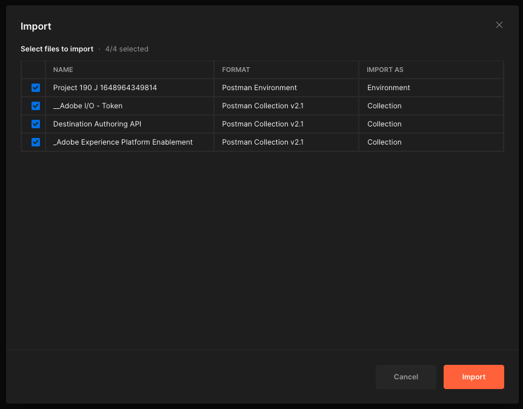

You now have everything you need in Postman to start interacting with Adobe Experience Platform through the APIs.

The first thing to do, is to make sure you're properly authenticated. To be authenticated, you need to request an access token.

Make sure that you've got the right Environment selected before executing any request. You can check the currently selected Environment by verifying the Environment-dropdown list in the top right corner. 

The selected Environment should have a name similar to this one:


Click the **eye** icon and then click **Edit** to update the Private Key in the environment file.


You'll then see this. All fields are pre-populated, except for the field **PRIVATE_KEY**.

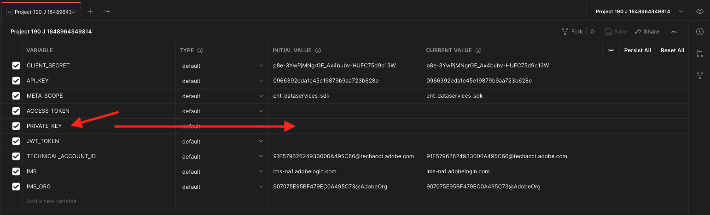

The private key has been generated when you created your Adobe I/O Project. It was downloaded as a zip file, named **config.zip**. Extract that zip file to your desktop.


Open the folder **config** and open the file **private.key** with your text editor of choice.


You'll then see something resembling this, copy all the text to your clipboard.


Go back to Postman and paste the private key in the fields next to the variable **PRIVATE_KEY**, for both the columns **INITIAL VALUE** and **CURRENT VALUE**. Click **Save**.


Your Postman environment and collections are now configured and working. You can now authenticate from Postman to Adobe I/O.

To do that, you need to load an external library that will take care of the encryption and decryption of communication. To load this library, you have to execute the request with the name **INIT: Load Crypto Library for RS256**. Select this request in the **_Adobe I/O - Token collection** and you'll see it displayed in the middle of your screen.


Click the blue **Send** button. After a couple of seconds, you should see a response displayed in the **Body** section of Postman:


With the crypto library now loaded, we can authenticate to Adobe I/O.

In the **\_Adobe I/O - Token collection**, select the request with the name **IMS: JWT Generate + Auth**. Again, you'll see the request details displayed in the middle of the screen.


Click the blue **Send** button. After a couple of seconds, you should see a response displayed in the **Body** section of Postman:


If your configuration was successful, you should see a similar response that contains the following information:

| Key     | Value     | 
|:-------------:| :---------------:| 
| token_type          | **bearer** |
| access_token    | **eyJ4NXUiOiJpbXNfbmEx...QT7mqZkumN1tdsPEioOEl4087Dg** | 
| expires_in          | **86399973** |

Adobe I/O has given you a **bearer**-token, with a specific value (this very long access_token) and an expiration window.

The token that we've received is now valid for 24 hours. This means that after 24 hours, if you want to use Postman to authenticate to Adobe I/O, you will have to generate a new token by running this request again.

## 3.3.4 Real-time Customer Profile API, Schema: Profile

Now you can go ahead and send your first request to Platform's Real-time Customer Profile APIs.

In Postman, locate the collection **_Adobe Experience Platform Enablement**.


In **1. Unified Profile Service**, select the first request with the name **UPS - GET Profile by Entity ID & NS**.


For this request, there are three required variables:

| Key     | Value     | Definition |
|:-------------:| :---------------:| :---------------:| 
| entityId          | **id** | the specific customer ID |
| entityIdNS    | **namespace** | the specific namespace that is applicable to the ID |
| schema.name          | **_xdm.context.profile** | the specific schema for which you want to receive information |

So, if you want to ask Adobe Experience Platform's APIs to give you back all Profile information for your own ECID, you will need to configure the request as follows:

| Key     | Value     | 
|:-------------:| :---------------:| 
| entityId          | **yourECID** |
| entityIdNS    | **ecid** | 
| schema.name          | **_xdm.context.profile** |


You should also verify the **Header** - fields of your request. Go to **Headers**. You'll then see this:


| Key      | Value |
| ----------- | ----------- |
| x-sandbox-name      |`--aepSandboxId--`|

>[!NOTE]
>
>You need to specify the name of the Adobe Experience Platform sandbox you're using. Your x-sandbox-name should be `--aepSandboxId--`.

Click **Send** to send your request to Platform.

You should get an immediate response from Platform, showing you something like this:


This is the full response from Platform:

```javascript
{
    "A28iM3aJBJRbEQpOnUh5HOM9": {
        "entityId": "A28iM3aJBJRbEQpOnUh5HOM9",
        "mergePolicy": {
            "id": "e632ccb8-882a-4b5e-8375-96a1ba3df1aa"
        },
        "sources": [
            "61fe23c5be4b5f19485dc379",
            "profile-streaming-segment",
            "61fe23cfa07c1219489b3ba4"
        ],
        "tags": [
            "1644130566774:1542:232:va7",
            "0a1e9dd4-940a-46ec-9114-7e371cf5c4d0",
            "aep_ups_partitioned_profile_cdc_low_lag_sla_0:106:1090888313",
            "a6fed09e-2c56-403e-8692-4e99e4779dfa:IRL1",
            "1644419616318:2989:31:va7",
            "aep_ups_profile_change_event_prod_va7:71:7946633524-8361f22c-c09e-4364-b24b-b57435c4d14f"
        ],
        "identityGraph": [
            "BUF9zMKLrXq72p4HpbsHv1SSBnr0LTAxQGdtYWlsLmNvbQ",
            "GkicrkFjgmCjUg",
            "GtCbrkFjgkSOFg",
            "A2-AP9zOsakzNTe9Rqwf7Wse",
            "BkFuK4QcJpSPByuSBnr0LTAx",
            "A28jSB484ziuECF3fEoXmFlF",
            "A28iM3aJBJRbEQpOnUh5HOM9"
        ],
        "entity": {
            "_experienceplatform": {
                "individualCharacteristics": {},
                "loyaltyDetails": {
                    "level": "Basic",
                    "points": 0
                },
                "identification": {
                    "core": {
                        "phoneNumber": "+32473622044+06022022-01",
                        "email": "woutervangeluwe+06022022-01@gmail.com",
                        "loyaltyId": "5415776",
                        "ecid": "12019606991718502754997192487345616673",
                        "crmId": "1478212"
                    }
                }
            },
            "personalEmail": {
                "address": "woutervangeluwe+06022022-01@gmail.com"
            },
            "_repo": {
                "createDate": "2022-02-06T06:56:06.424Z"
            },
            "testProfile": true,
            "homeAddress": {
                "postalCode": "1831",
                "city": "Diegem",
                "street1": "Culliganlaan 2F"
            },
            "mobilePhone": {
                "number": "+32473622044+06022022-01"
            },
            "segmentMembership": {
                "ups": {
                    "bc999ded-b6d7-40d4-87a7-d3a280b950e3": {
                        "lastQualificationTime": "2022-02-09T20:38:33Z",
                        "status": "exited"
                    },
                    "23b1cd4e-d62f-44bd-8392-3095a33109c4": {
                        "lastQualificationTime": "2022-02-09T20:38:33Z",
                        "status": "exited"
                    },
                    "f0807704-a1c8-4ac4-85dd-60db2fbf18f1": {
                        "lastQualificationTime": "2022-02-09T20:38:33Z",
                        "status": "existing"
                    }
                }
            },
            "person": {
                "name": {
                    "lastName": "Van Geluwe",
                    "firstName": "Wouter"
                },
                "gender": "female",
                "birthDate": "1982-07-08"
            },
            "userActivityRegions": {
                "IRL1": {
                    "captureTimestamp": "2022-02-09T15:21:11Z"
                }
            },
            "identityMap": {
                "email": [
                    {
                        "id": "woutervangeluwe+06022022-01@gmail.com"
                    }
                ],
                "crmid": [
                    {
                        "id": "1478212"
                    }
                ],
                "ecid": [
                    {
                        "id": "12507560687324495704459439363261812234"
                    },
                    {
                        "id": "12019606991718502754997192487345616673"
                    },
                    {
                        "id": "38335942889672702722192106363935964471"
                    }
                ],
                "phone": [
                    {
                        "id": "+32473622044+06022022-01"
                    }
                ],
                "loyaltyid": [
                    {
                        "id": "5415776"
                    }
                ]
            }
        },
        "lastModifiedAt": "2022-02-09T20:38:36Z"
    }
}
```

This is currently all of the available Profile data in Platform for this ECID.

You're not required to use the ECID to request Profile data from Platform's Real-time Customer Profile, you can use any ID in any namespace to request this data. 

Let's go back to Postman and pretend we're the call center, and send a request to Platform specifying the namespace of **Phone** and your mobile number.

So, if you want to ask Platform's APIs to give you back all Profile information for a specific Phone, you will need to configure the request as follows:

| Key     | Value     | 
|:-------------:| :---------------:| 
| entityId          | **your phone number** |
| entityIdNS    | **phone** (replace ecid by phone) | 
| schema.name          | **_xdm.context.profile** |

If your phone number contains special symbols like **+**, you have to select your full phone number, do a right-click and click **EncodeURIComponent**.


You'll then have this:

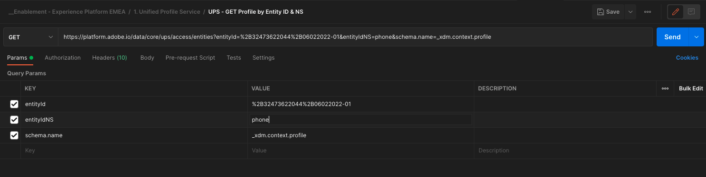

You should also verify the **Header** - fields of your request. Go to **Headers**. You'll then see this:


| Key      | Value |
| ----------- | ----------- |
| x-sandbox-name      |`--aepSandboxId--`|

>[!NOTE]
>
>You need to specify the name of the Adobe Experience Platform sandbox you're using. Your x-sandbox-name should be `--aepSandboxId--`.

Click the blue **Send** button and verify the response.

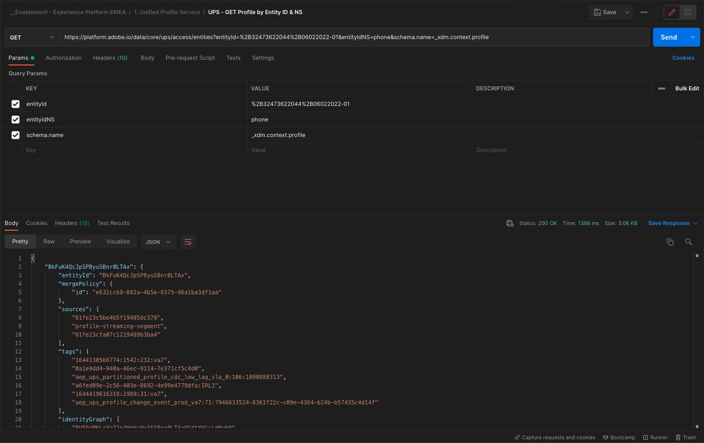

Let's do the same thing for your email address by specifying the namespace of **email** and your email address.

So, if you want to ask Platform's APIs to give you back all Profile information for a specific email address, you will need to configure the request as follows:

| Key     | Value     | 
|:-------------:| :---------------:| 
| entityId          | **youremail** |
| entityIdNS    | **email** (replace Phone with email) | 
| schema.name          | **_xdm.context.profile** |

If your email address contains special symbols like **+**, you have to select your full email address, do a right-click and click **EncodeURIComponent**.

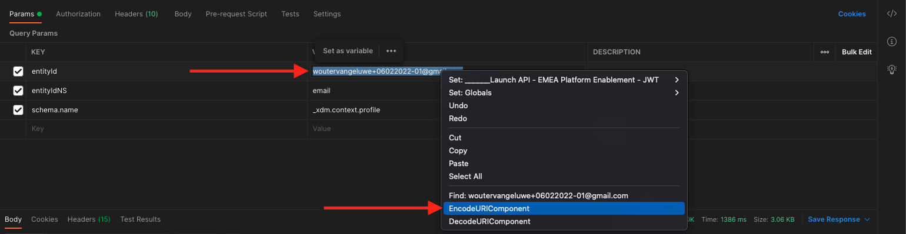

You'll then have this:

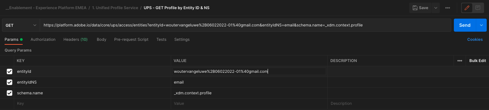

You should also verify the **Header** - fields of your request. Go to **Headers**. You'll then see this:


| Key      | Value |
| ----------- | ----------- |
| x-sandbox-name      |`--aepSandboxId--`|

>[!NOTE]
>
>You need to specify the name of the Adobe Experience Platform sandbox you're using. Your x-sandbox-name should be `--aepSandboxId--`.

Click the blue **Send** button and verify the response.

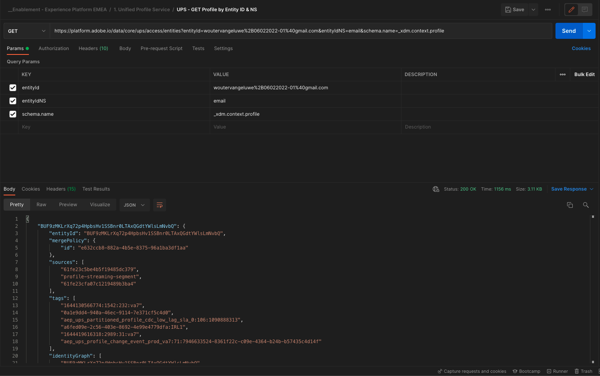

This is a very important kind of flexibility that is offered to brands. This means that any environment can send a request to Platform, using their own ID and namespace, without having to understand the complexity of multiple namespaces and IDs.

As an example:

- the Call Center will request data from Platform using the namespace **phone**
- the Loyalty System will request data from Platform using the namespace **email**
- online applications might use the namespace **ecid**

The Call Center doesn't necessarily know what kind of identifier is used in the Loyalty System and the Loyalty System doesn't necessarily know what kind of identifier is used by online applications. Each individual system can use the information that they have and understand to get the information they need, when they need it.

## 3.3.5 Real-time Customer Profile API, Schema: Profile and ExperienceEvent

After having queried Platform's APIs successfully for Profile data, let's now do the same with ExperienceEvent data.

In Postman, locate the collection **_Adobe Experience Platform Enablement**.


In **1. Unified Profile Service**, select the second request with the name **UPS - GET Profile & EE by Entity ID & NS**.


For this request, there are four required variables:

| Key     | Value     | Definition | 
|:-------------:| :---------------:|  :---------------:| 
| schema.name          | **_xdm.context.experienceevent** | the specific schema for which you want to receive information. In this case, we're looking for data that is mapped against the ExperienceEvent schema. | 
| relatedSchema.name          | **_xdm.context.profile** | While we're looking for data that is mapped against the ExperienceEvent schema, we need to specify an identity for which we want to receive that data. The schema that has access to identity is the Profile-schema, so the relatedSchema here is the Profile-schema. |
| relatedEntityId          | **id** | the specific customer I D|
| relatedEntityIdNS    | **namespace** | the specific namespace that is applicable to the ID | 

So, if you want to ask Platform's APIs to give you back all Profile information for your own ecid, you will need to configure the request as follows:

| Key     | Value     | 
|:-------------:| :---------------:| 
| schema.name          | **_xdm.context.experienceevent** |
| relatedSchema.name          | **_xdm.context.profile** |
| relatedEntityId          | **yourECID** |
| relatedEntityIdNS    | **ecid** | 


You should also verify the **Header** - fields of your request. Go to **Headers**. You'll then see this:


| Key      | Value |
| ----------- | ----------- |
| x-sandbox-name      |`--aepSandboxId--`|

>[!NOTE]
>
>You need to specify the name of the Adobe Experience Platform sandbox you're using. Your x-sandbox-name should be `--aepSandboxId--`.

Click **Send** to send your request to Platform.

You should get an immediate response from Platform, showing you something like this:


Below is the full response from Platform. In this example, there are eight ExperienceEvents linked to this customer's ECID. Have a look at the below to see the different variables on the request, as what you see below is the direct consequence of your configuration in Launch in previous exercises.

Also, when the X-ray panel shows ExperienceEvent information, it is using the below payload to parse and retrieve the information like Product Name (search for productName in the below payload) and Product Image URL (search for productImageUrl in the below payload).

```javascript
{
    "_page": {
        "orderby": "timestamp",
        "start": "d686ab8a-2d0c-4722-9ff5-bfc1020b0b55-0",
        "count": 31,
        "next": ""
    },
    "children": [
        {
            "relatedEntityId": "A28iM3aJBJRbEQpOnUh5HOM9",
            "entityId": "d686ab8a-2d0c-4722-9ff5-bfc1020b0b55-0",
            "timestamp": 1644127126596,
            "entity": {
                "environment": {
                    "ipV4": "213.118.129.117",
                    "type": "browser",
                    "browserDetails": {
                        "viewportHeight": 969,
                        "viewportWidth": 1920,
                        "userAgent": "Mozilla/5.0 (Macintosh; Intel Mac OS X 10_15_7) AppleWebKit/537.36 (KHTML, like Gecko) Chrome/98.0.4758.80 Safari/537.36"
                    }
                },
                "web": {
                    "webPageDetails": {
                        "pageViews": {
                            "value": 1
                        },
                        "name": "vangeluw-OCUC",
                        "URL": "https://builder.adobedemo.com/run/vangeluw-OCUC"
                    },
                    "webReferrer": {
                        "URL": "https://adobe.okta.com/"
                    }
                },
                "_experienceplatform": {
                    "interactionDetails": {
                        "core": {
                            "channel": "web"
                        }
                    },
                    "demoEnvironment": {
                        "brandName": "vangeluw-OCUC"
                    },
                    "identification": {
                        "core": {
                            "ecid": "12507560687324495704459439363261812234"
                        }
                    }
                },
                "implementationDetails": {
                    "name": "https://ns.adobe.com/experience/alloy/reactor",
                    "version": "2.8.0+2.9.0",
                    "environment": "browser"
                },
                "identityMap": {
                    "ECID": [
                        {
                            "id": "12507560687324495704459439363261812234",
                            "authenticatedState": "ambiguous",
                            "primary": true
                        }
                    ]
                },
                "eventType": "web.webpagedetails.pageViews",
                "_id": "d686ab8a-2d0c-4722-9ff5-bfc1020b0b55-0",
                "placeContext": {
                    "localTime": "2022-02-06T06:58:46.596+01:00",
                    "localTimezoneOffset": -60
                },
                "device": {
                    "screenOrientation": "landscape",
                    "screenWidth": 1920,
                    "screenHeight": 1080
                },
                "timestamp": "2022-02-06T05:58:46.596Z"
            },
            "lastModifiedAt": "2022-02-06T05:59:48Z"
        },
        {
            "relatedEntityId": "A28iM3aJBJRbEQpOnUh5HOM9",
            "entityId": "919a46bf-a591-4c32-9201-b72250d5f5d9-0",
            "timestamp": 1644127129876,
            "entity": {
                "environment": {
                    "ipV4": "213.118.129.117",
                    "type": "browser",
                    "browserDetails": {
                        "viewportHeight": 969,
                        "viewportWidth": 1920,
                        "userAgent": "Mozilla/5.0 (Macintosh; Intel Mac OS X 10_15_7) AppleWebKit/537.36 (KHTML, like Gecko) Chrome/98.0.4758.80 Safari/537.36"
                    }
                },
                "web": {
                    "webPageDetails": {
                        "pageViews": {
                            "value": 1
                        },
                        "name": "vangeluw-OCUC#",
                        "URL": "https://builder.adobedemo.com/run/vangeluw-OCUC#"
                    },
                    "webReferrer": {
                        "URL": "https://adobe.okta.com/"
                    }
                },
                "_experienceplatform": {
                    "interactionDetails": {
                        "core": {
                            "channel": "web"
                        }
                    },
                    "demoEnvironment": {
                        "brandName": "vangeluw-OCUC"
                    },
                    "identification": {
                        "core": {
                            "ecid": "12507560687324495704459439363261812234"
                        }
                    }
                },
                "implementationDetails": {
                    "name": "https://ns.adobe.com/experience/alloy/reactor",
                    "version": "2.8.0+2.9.0",
                    "environment": "browser"
                },
                "identityMap": {
                    "ECID": [
                        {
                            "id": "12507560687324495704459439363261812234",
                            "authenticatedState": "ambiguous",
                            "primary": true
                        }
                    ]
                },
                "eventType": "web.webpagedetails.pageViews",
                "_id": "919a46bf-a591-4c32-9201-b72250d5f5d9-0",
                "placeContext": {
                    "localTime": "2022-02-06T06:58:49.876+01:00",
                    "localTimezoneOffset": -60
                },
                "device": {
                    "screenOrientation": "landscape",
                    "screenWidth": 1920,
                    "screenHeight": 1080
                },
                "timestamp": "2022-02-06T05:58:49.876Z"
            },
            "lastModifiedAt": "2022-02-06T05:59:48Z"
        },
        {
            "relatedEntityId": "A28iM3aJBJRbEQpOnUh5HOM9",
            "entityId": "41a80489-00d4-446c-b456-8cb19c3f309a-0",
            "timestamp": 1644130597134,
            "entity": {
                "environment": {
                    "ipV4": "213.118.129.117",
                    "type": "browser",
                    "browserDetails": {
                        "viewportHeight": 1001,
                        "viewportWidth": 1920,
                        "userAgent": "Mozilla/5.0 (Macintosh; Intel Mac OS X 10_15_7) AppleWebKit/537.36 (KHTML, like Gecko) Chrome/98.0.4758.80 Safari/537.36"
                    }
                },
                "web": {
                    "webPageDetails": {
                        "pageViews": {
                            "value": 1
                        },
                        "name": "login",
                        "URL": "https://builder.adobedemo.com/run/vangeluw-OCUC/login"
                    },
                    "webReferrer": {
                        "URL": "https://builder.adobedemo.com/run/vangeluw-OCUC/login"
                    }
                },
                "_experienceplatform": {
                    "interactionDetails": {
                        "core": {
                            "channel": "web"
                        }
                    },
                    "demoEnvironment": {
                        "brandName": "vangeluw-OCUC"
                    },
                    "identification": {
                        "core": {
                            "ecid": "12507560687324495704459439363261812234"
                        }
                    }
                },
                "implementationDetails": {
                    "name": "https://ns.adobe.com/experience/alloy/reactor",
                    "version": "2.8.0+2.9.0",
                    "environment": "browser"
                },
                "identityMap": {
                    "ECID": [
                        {
                            "id": "12507560687324495704459439363261812234",
                            "authenticatedState": "ambiguous",
                            "primary": true
                        }
                    ]
                },
                "eventType": "web.webpagedetails.pageViews",
                "_id": "41a80489-00d4-446c-b456-8cb19c3f309a-0",
                "placeContext": {
                    "localTime": "2022-02-06T07:56:37.134+01:00",
                    "localTimezoneOffset": -60
                },
                "device": {
                    "screenOrientation": "landscape",
                    "screenWidth": 1920,
                    "screenHeight": 1080
                },
                "timestamp": "2022-02-06T06:56:37.134Z"
            },
            "lastModifiedAt": "2022-02-06T06:56:38Z"
        },
        {
            "relatedEntityId": "A28jSB484ziuECF3fEoXmFlF",
            "entityId": "8ACC7B6C-2320-4865-B414-3B0CFA01F628",
            "timestamp": 1644419615000,
            "entity": {
                "environment": {
                    "ipV4": "213.118.129.117",
                    "browserDetails": {
                        "userAgent": "Mozilla/5.0 (iPhone; CPU OS 15_3 like Mac OS X; en_BE)"
                    }
                },
                "eventType": "application.login",
                "_id": "8ACC7B6C-2320-4865-B414-3B0CFA01F628",
                "_experienceplatform": {
                    "interactionDetails": {
                        "core": {
                            "channel": "mobile"
                        }
                    },
                    "demoEnvironment": {
                        "brandName": "vangeluw-2L6V"
                    },
                    "identification": {
                        "core": {
                            "ecid": "12019606991718502754997192487345616673",
                            "email": "woutervangeluwe+06022022-01@gmail.com"
                        }
                    }
                },
                "timestamp": "2022-02-09T15:13:35Z",
                "identityMap": {
                    "ECID": [
                        {
                            "id": "12019606991718502754997192487345616673",
                            "authenticatedState": "ambiguous",
                            "primary": true
                        }
                    ]
                }
            },
            "lastModifiedAt": "2022-02-09T15:13:38Z"
        },
        {
            "relatedEntityId": "A28jSB484ziuECF3fEoXmFlF",
            "entityId": "54F68CE5-E9E1-4AD0-91B1-7B607A9285C4",
            "timestamp": 1644419658000,
            "entity": {
                "environment": {
                    "ipV4": "213.118.129.117",
                    "browserDetails": {
                        "userAgent": "Mozilla/5.0 (iPhone; CPU OS 15_3 like Mac OS X; en_BE)"
                    }
                },
                "_experienceplatform": {
                    "interactionDetails": {
                        "core": {
                            "channel": "mobile"
                        }
                    },
                    "demoEnvironment": {
                        "brandName": "vangeluw-2L6V"
                    },
                    "identification": {
                        "core": {
                            "ecid": "12019606991718502754997192487345616673"
                        }
                    }
                },
                "identityMap": {
                    "ECID": [
                        {
                            "id": "12019606991718502754997192487345616673",
                            "authenticatedState": "ambiguous",
                            "primary": true
                        }
                    ]
                },
                "eventType": "commerce.productViews",
                "_id": "54F68CE5-E9E1-4AD0-91B1-7B607A9285C4",
                "commerce": {
                    "productViews": {
                        "value": 1
                    }
                },
                "productListItems": [
                    {
                        "quantity": 1,
                        "productAddMethod": "Mobile",
                        "_experienceplatform": {
                            "core": {
                                "mainCategory": "Women",
                                "productURL": "product1",
                                "imageURL": "https://contentviewer.s3.amazonaws.com/helium/wh08-white_main.jpg"
                            }
                        },
                        "priceTotal": 42,
                        "name": "Cassia Funnel Sweatshirt",
                        "SKU": "product1",
                        "currencyCode": "USD"
                    }
                ],
                "timestamp": "2022-02-09T15:14:18Z"
            },
            "lastModifiedAt": "2022-02-09T15:14:21Z"
        },
        {
            "relatedEntityId": "A2-AP9zOsakzNTe9Rqwf7Wse",
            "entityId": "bfe26684-bc3b-40c5-9fe5-5aba854c3227-0",
            "timestamp": 1644420036035,
            "entity": {
                "environment": {
                    "ipV4": "193.105.139.131",
                    "type": "browser",
                    "browserDetails": {
                        "viewportHeight": 969,
                        "viewportWidth": 1920,
                        "userAgent": "Mozilla/5.0 (Macintosh; Intel Mac OS X 10_15_7) AppleWebKit/537.36 (KHTML, like Gecko) Chrome/98.0.4758.80 Safari/537.36"
                    }
                },
                "web": {
                    "webPageDetails": {
                        "pageViews": {
                            "value": 1
                        },
                        "name": "vangeluw-OCUC",
                        "URL": "https://builder.adobedemo.com/run/vangeluw-OCUC"
                    },
                    "webReferrer": {
                        "URL": "https://adobe.okta.com/"
                    }
                },
                "_experienceplatform": {
                    "interactionDetails": {
                        "core": {
                            "channel": "web"
                        }
                    },
                    "demoEnvironment": {
                        "brandName": "vangeluw-OCUC"
                    },
                    "identification": {
                        "core": {
                            "ecid": "38335942889672702722192106363935964471"
                        }
                    }
                },
                "implementationDetails": {
                    "name": "https://ns.adobe.com/experience/alloy/reactor",
                    "version": "2.8.0+2.9.0",
                    "environment": "browser"
                },
                "identityMap": {
                    "ECID": [
                        {
                            "id": "38335942889672702722192106363935964471",
                            "authenticatedState": "ambiguous",
                            "primary": true
                        }
                    ]
                },
                "eventType": "web.webpagedetails.pageViews",
                "_id": "bfe26684-bc3b-40c5-9fe5-5aba854c3227-0",
                "placeContext": {
                    "localTime": "2022-02-09T16:20:36.035+01:00",
                    "localTimezoneOffset": -60
                },
                "device": {
                    "screenOrientation": "landscape",
                    "screenWidth": 1920,
                    "screenHeight": 1080
                },
                "timestamp": "2022-02-09T15:20:36.035Z"
            },
            "lastModifiedAt": "2022-02-09T15:20:39Z"
        },
        {
            "relatedEntityId": "A2-AP9zOsakzNTe9Rqwf7Wse",
            "entityId": "0480c434-8fcd-4a80-b298-c561276ac989-0",
            "timestamp": 1644420037078,
            "entity": {
                "environment": {
                    "ipV4": "193.105.139.131",
                    "type": "browser",
                    "browserDetails": {
                        "viewportHeight": 969,
                        "viewportWidth": 1920,
                        "userAgent": "Mozilla/5.0 (Macintosh; Intel Mac OS X 10_15_7) AppleWebKit/537.36 (KHTML, like Gecko) Chrome/98.0.4758.80 Safari/537.36"
                    }
                },
                "web": {
                    "webPageDetails": {
                        "pageViews": {
                            "value": 1
                        },
                        "name": "vangeluw-OCUC#",
                        "URL": "https://builder.adobedemo.com/run/vangeluw-OCUC#"
                    },
                    "webReferrer": {
                        "URL": "https://adobe.okta.com/"
                    }
                },
                "_experienceplatform": {
                    "interactionDetails": {
                        "core": {
                            "channel": "web"
                        }
                    },
                    "demoEnvironment": {
                        "brandName": "vangeluw-OCUC"
                    },
                    "identification": {
                        "core": {
                            "ecid": "38335942889672702722192106363935964471"
                        }
                    }
                },
                "implementationDetails": {
                    "name": "https://ns.adobe.com/experience/alloy/reactor",
                    "version": "2.8.0+2.9.0",
                    "environment": "browser"
                },
                "identityMap": {
                    "ECID": [
                        {
                            "id": "38335942889672702722192106363935964471",
                            "authenticatedState": "ambiguous",
                            "primary": true
                        }
                    ]
                },
                "eventType": "web.webpagedetails.pageViews",
                "_id": "0480c434-8fcd-4a80-b298-c561276ac989-0",
                "placeContext": {
                    "localTime": "2022-02-09T16:20:37.078+01:00",
                    "localTimezoneOffset": -60
                },
                "device": {
                    "screenOrientation": "landscape",
                    "screenWidth": 1920,
                    "screenHeight": 1080
                },
                "timestamp": "2022-02-09T15:20:37.078Z"
            },
            "lastModifiedAt": "2022-02-09T15:20:39Z"
        },
        {
            "relatedEntityId": "A2-AP9zOsakzNTe9Rqwf7Wse",
            "entityId": "6b1b3983-6966-4551-a711-6b6e410fd819-0",
            "timestamp": 1644420045993,
            "entity": {
                "environment": {
                    "ipV4": "193.105.139.131",
                    "type": "browser",
                    "browserDetails": {
                        "viewportHeight": 969,
                        "viewportWidth": 1920,
                        "userAgent": "Mozilla/5.0 (Macintosh; Intel Mac OS X 10_15_7) AppleWebKit/537.36 (KHTML, like Gecko) Chrome/98.0.4758.80 Safari/537.36"
                    }
                },
                "web": {
                    "webPageDetails": {
                        "pageViews": {
                            "value": 1
                        },
                        "name": "login",
                        "URL": "https://builder.adobedemo.com/run/vangeluw-OCUC/login"
                    },
                    "webReferrer": {
                        "URL": "https://adobe.okta.com/"
                    }
                },
                "_experienceplatform": {
                    "interactionDetails": {
                        "core": {
                            "channel": "web"
                        }
                    },
                    "demoEnvironment": {
                        "brandName": "vangeluw-OCUC"
                    },
                    "identification": {
                        "core": {
                            "ecid": "38335942889672702722192106363935964471"
                        }
                    }
                },
                "implementationDetails": {
                    "name": "https://ns.adobe.com/experience/alloy/reactor",
                    "version": "2.8.0+2.9.0",
                    "environment": "browser"
                },
                "identityMap": {
                    "ECID": [
                        {
                            "id": "38335942889672702722192106363935964471",
                            "authenticatedState": "ambiguous",
                            "primary": true
                        }
                    ]
                },
                "eventType": "web.webpagedetails.pageViews",
                "_id": "6b1b3983-6966-4551-a711-6b6e410fd819-0",
                "placeContext": {
                    "localTime": "2022-02-09T16:20:45.993+01:00",
                    "localTimezoneOffset": -60
                },
                "device": {
                    "screenOrientation": "landscape",
                    "screenWidth": 1920,
                    "screenHeight": 1080
                },
                "timestamp": "2022-02-09T15:20:45.993Z"
            },
            "lastModifiedAt": "2022-02-09T15:20:47Z"
        },
        {
            "relatedEntityId": "A2-AP9zOsakzNTe9Rqwf7Wse",
            "entityId": "ae0f3551-7753-4467-8547-8fdbb66c2214-0",
            "timestamp": 1644420058565,
            "entity": {
                "environment": {
                    "ipV4": "193.105.139.131",
                    "type": "browser",
                    "browserDetails": {
                        "viewportHeight": 969,
                        "viewportWidth": 1920,
                        "userAgent": "Mozilla/5.0 (Macintosh; Intel Mac OS X 10_15_7) AppleWebKit/537.36 (KHTML, like Gecko) Chrome/98.0.4758.80 Safari/537.36"
                    }
                },
                "web": {
                    "webPageDetails": {
                        "URL": "https://builder.adobedemo.com/run/vangeluw-OCUC/home"
                    },
                    "webReferrer": {
                        "URL": "https://adobe.okta.com/"
                    }
                },
                "_experienceplatform": {
                    "interactionDetails": {
                        "core": {
                            "channel": "web"
                        }
                    },
                    "demoEnvironment": {
                        "brandName": "vangeluw-OCUC"
                    },
                    "identification": {
                        "core": {
                            "ecid": "38335942889672702722192106363935964471",
                            "email": "woutervangeluwe+06022022-01@gmail.com"
                        }
                    }
                },
                "implementationDetails": {
                    "name": "https://ns.adobe.com/experience/alloy/reactor",
                    "version": "2.8.0+2.9.0",
                    "environment": "browser"
                },
                "identityMap": {
                    "ECID": [
                        {
                            "id": "38335942889672702722192106363935964471",
                            "authenticatedState": "ambiguous",
                            "primary": true
                        }
                    ]
                },
                "eventType": "web.login",
                "_id": "ae0f3551-7753-4467-8547-8fdbb66c2214-0",
                "placeContext": {
                    "localTime": "2022-02-09T16:20:58.565+01:00",
                    "localTimezoneOffset": -60
                },
                "device": {
                    "screenOrientation": "landscape",
                    "screenWidth": 1920,
                    "screenHeight": 1080
                },
                "timestamp": "2022-02-09T15:20:58.565Z"
            },
            "lastModifiedAt": "2022-02-09T15:20:59Z"
        },
        {
            "relatedEntityId": "A2-AP9zOsakzNTe9Rqwf7Wse",
            "entityId": "5e67a9c9-b201-4e21-bd3a-4d10475f6156-0",
            "timestamp": 1644420058653,
            "entity": {
                "environment": {
                    "ipV4": "193.105.139.131",
                    "type": "browser",
                    "browserDetails": {
                        "viewportHeight": 969,
                        "viewportWidth": 1920,
                        "userAgent": "Mozilla/5.0 (Macintosh; Intel Mac OS X 10_15_7) AppleWebKit/537.36 (KHTML, like Gecko) Chrome/98.0.4758.80 Safari/537.36"
                    }
                },
                "web": {
                    "webPageDetails": {
                        "pageViews": {
                            "value": 1
                        },
                        "name": "home",
                        "URL": "https://builder.adobedemo.com/run/vangeluw-OCUC/home"
                    },
                    "webReferrer": {
                        "URL": "https://adobe.okta.com/"
                    }
                },
                "_experienceplatform": {
                    "interactionDetails": {
                        "core": {
                            "channel": "web"
                        }
                    },
                    "demoEnvironment": {
                        "brandName": "vangeluw-OCUC"
                    },
                    "identification": {
                        "core": {
                            "ecid": "38335942889672702722192106363935964471"
                        }
                    }
                },
                "implementationDetails": {
                    "name": "https://ns.adobe.com/experience/alloy/reactor",
                    "version": "2.8.0+2.9.0",
                    "environment": "browser"
                },
                "identityMap": {
                    "ECID": [
                        {
                            "id": "38335942889672702722192106363935964471",
                            "authenticatedState": "ambiguous",
                            "primary": true
                        }
                    ]
                },
                "eventType": "web.webpagedetails.pageViews",
                "_id": "5e67a9c9-b201-4e21-bd3a-4d10475f6156-0",
                "placeContext": {
                    "localTime": "2022-02-09T16:20:58.653+01:00",
                    "localTimezoneOffset": -60
                },
                "device": {
                    "screenOrientation": "landscape",
                    "screenWidth": 1920,
                    "screenHeight": 1080
                },
                "timestamp": "2022-02-09T15:20:58.653Z"
            },
            "lastModifiedAt": "2022-02-09T15:21:00Z"
        },
        {
            "relatedEntityId": "A2-AP9zOsakzNTe9Rqwf7Wse",
            "entityId": "33253c5a-6a7e-4858-a7d2-4e6d4a1c7901-0",
            "timestamp": 1644420061804,
            "entity": {
                "environment": {
                    "ipV4": "193.105.139.131",
                    "type": "browser",
                    "browserDetails": {
                        "viewportHeight": 969,
                        "viewportWidth": 1920,
                        "userAgent": "Mozilla/5.0 (Macintosh; Intel Mac OS X 10_15_7) AppleWebKit/537.36 (KHTML, like Gecko) Chrome/98.0.4758.80 Safari/537.36"
                    }
                },
                "web": {
                    "webPageDetails": {
                        "pageViews": {
                            "value": 1
                        },
                        "name": "vangeluw-OCUC",
                        "URL": "https://builder.adobedemo.com/run/vangeluw-OCUC"
                    },
                    "webReferrer": {
                        "URL": "https://builder.adobedemo.com/run/vangeluw-OCUC/home"
                    }
                },
                "_experienceplatform": {
                    "interactionDetails": {
                        "core": {
                            "channel": "web"
                        }
                    },
                    "demoEnvironment": {
                        "brandName": "vangeluw-OCUC"
                    },
                    "identification": {
                        "core": {
                            "ecid": "38335942889672702722192106363935964471"
                        }
                    }
                },
                "implementationDetails": {
                    "name": "https://ns.adobe.com/experience/alloy/reactor",
                    "version": "2.8.0+2.9.0",
                    "environment": "browser"
                },
                "identityMap": {
                    "ECID": [
                        {
                            "id": "38335942889672702722192106363935964471",
                            "authenticatedState": "ambiguous",
                            "primary": true
                        }
                    ]
                },
                "eventType": "web.webpagedetails.pageViews",
                "_id": "33253c5a-6a7e-4858-a7d2-4e6d4a1c7901-0",
                "placeContext": {
                    "localTime": "2022-02-09T16:21:01.804+01:00",
                    "localTimezoneOffset": -60
                },
                "device": {
                    "screenOrientation": "landscape",
                    "screenWidth": 1920,
                    "screenHeight": 1080
                },
                "timestamp": "2022-02-09T15:21:01.804Z"
            },
            "lastModifiedAt": "2022-02-09T15:21:03Z"
        },
        {
            "relatedEntityId": "A2-AP9zOsakzNTe9Rqwf7Wse",
            "entityId": "d8e81fb7-6de9-44c1-b9c6-60d93b520209-0",
            "timestamp": 1644420071737,
            "entity": {
                "environment": {
                    "ipV4": "193.105.139.131",
                    "type": "browser",
                    "browserDetails": {
                        "viewportHeight": 969,
                        "viewportWidth": 1920,
                        "userAgent": "Mozilla/5.0 (Macintosh; Intel Mac OS X 10_15_7) AppleWebKit/537.36 (KHTML, like Gecko) Chrome/98.0.4758.80 Safari/537.36"
                    }
                },
                "web": {
                    "webPageDetails": {
                        "pageViews": {
                            "value": 1
                        },
                        "name": "vangeluw-OCUC",
                        "URL": "https://builder.adobedemo.com/run/vangeluw-OCUC"
                    },
                    "webReferrer": {
                        "URL": "https://builder.adobedemo.com/run/vangeluw-OCUC/home"
                    }
                },
                "_experienceplatform": {
                    "interactionDetails": {
                        "core": {
                            "channel": "web"
                        }
                    },
                    "demoEnvironment": {
                        "brandName": "vangeluw-OCUC"
                    },
                    "identification": {
                        "core": {
                            "ecid": "38335942889672702722192106363935964471"
                        }
                    }
                },
                "implementationDetails": {
                    "name": "https://ns.adobe.com/experience/alloy/reactor",
                    "version": "2.8.0+2.9.0",
                    "environment": "browser"
                },
                "identityMap": {
                    "ECID": [
                        {
                            "id": "38335942889672702722192106363935964471",
                            "authenticatedState": "ambiguous",
                            "primary": true
                        }
                    ]
                },
                "eventType": "web.webpagedetails.pageViews",
                "_id": "d8e81fb7-6de9-44c1-b9c6-60d93b520209-0",
                "placeContext": {
                    "localTime": "2022-02-09T16:21:11.737+01:00",
                    "localTimezoneOffset": -60
                },
                "device": {
                    "screenOrientation": "landscape",
                    "screenWidth": 1920,
                    "screenHeight": 1080
                },
                "timestamp": "2022-02-09T15:21:11.737Z"
            },
            "lastModifiedAt": "2022-02-09T15:21:14Z"
        }
    ],
    "_links": {
        "next": {
            "href": ""
        }
    }
}
```

This is currently all of the available ExperienceEvent data in Platform for this ECID.

You're not required to use the ECID to request ExperienceEvent data from Adobe Experience Platform's Real-time Profile, you can use any ID in any namespace to request this data. 

Next Step: [3.4 Create a segment - UI](./ex4.md)

[Go Back to Module 3](./real-time-customer-profile.md)

[Go Back to All Modules](../../overview.md)
