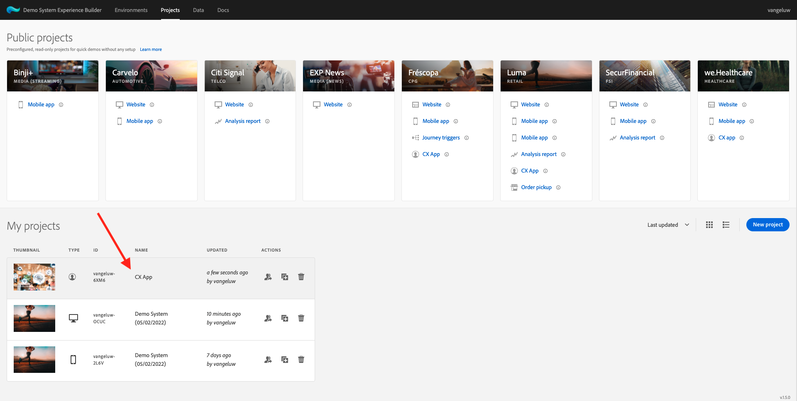
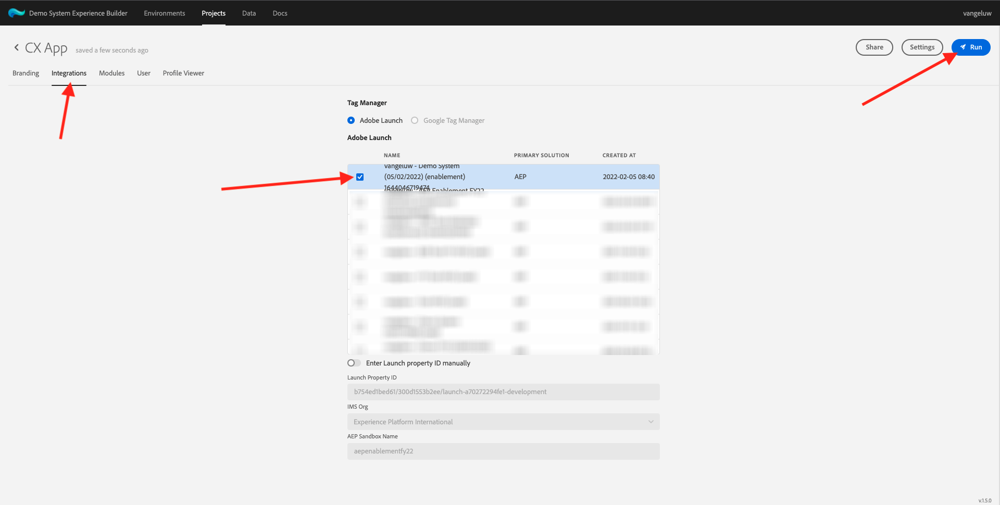
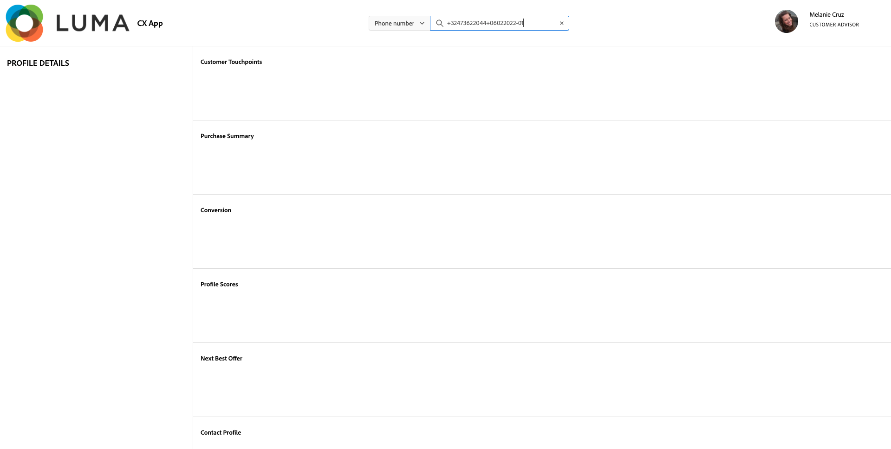

# 3.6 See your Real-time Customer Profile in action in the Call Center

In this exercise, the goal is to have you walk through the customer journey and act like a real customer.

On this website, we've implemented Adobe Experience Platform. Every action is considered an experience event and is sent to Adobe Experience Platform in real-time, hydrating the Real-time Customer Profile.

In an earlier exercise, you started as an anonymous customer who was browsing the site, and after a couple of steps, you became a known customer.

When that same customer eventually picks up their phone and calls your call center, it's crucial that the information from other channels is available immediately, so that the call center experience can be relevant and personalized.

## 3.6.1 Use your CX App

As part of our Demo System, we've created a CX App template which can be used to simulate a call center environment. Follow these steps to create such a CX App project.

Go to [https://builder.adobedemo.com/projects](https://builder.adobedemo.com/projects). Click **New Project**.

You'll then see your CX App project. Click the project to open it.

In your CX App project, go to **Integrations**. Select the Adobe Experience Platform Data Collection property that was created in Module 0. You need to select the property that has **(enablement)** in its name. Then, click **Run**.

You'll then see this.

On the Profile Viewer panel, you can see these combinations of IDs and Namespaces:

| Identity     | Namespace       |
|:-------------:| :---------------:|
| Experience Cloud ID (ECID)          | 12507560687324495704459439363261812234 |
| Email ID          | woutervangeluwe+06022022-01@gmail.com|
| Mobile Number ID          | +32473622044+06022022-01|

When the customer calls your call center, the phone number can be used to identify the customer. So in this exercise, you'll use the phone number to retrieve the customer's profile in the CX App.

Select **Phone number** in the dropdown and enter the phone number that you used on the website. Hit **Enter**.

You'll now see the information that would ideally be displayed in the Call Center, so that the Call Center employees have all relevant information available immediately when speaking to a customer.

Next Step: [Summary and benefits](./summary.md)

[Go Back to Module 3](./real-time-customer-profile.md)

[Go Back to All Modules](../../overview.md)
