# 6.5 Take Action: send your segment to Adobe Target

Go to [Adobe Experience Platform](https://experience.adobe.com/platform). After logging in, you'll land on the homepage of Adobe Experience Platform.


Before you continue, you need to select a **sandbox**. The sandbox to select is named ``--aepSandboxId--``. You can do this by clicking the text **[!UICONTROL Production Prod]** in the blue line on top of your screen. After selecting the appropriate [!UICONTROL sandbox], you'll see the screen change and now you're in your dedicated [!UICONTROL sandbox].


## 6.5.1 Verify your Datastream

The Adobe Target destination in Real-Time CDP is connected to the datastream that is used to ingest data into the Adobe edge network. If you want to setuo your Adobe Target destination, you first need to verify whether your datastream is already enabled for Adobe Target. Your datastram was configured in [Exercise 0.2 Create your Datastream](./../module0/ex2.md) and was named `--demoProfileLdap-- - Demo System Datastream`.

Go to [https://experience.adobe.com/#/data-collection/](https://experience.adobe.com/#/data-collection/), then click **Datastreams** or **Datastreams (Beta)**.

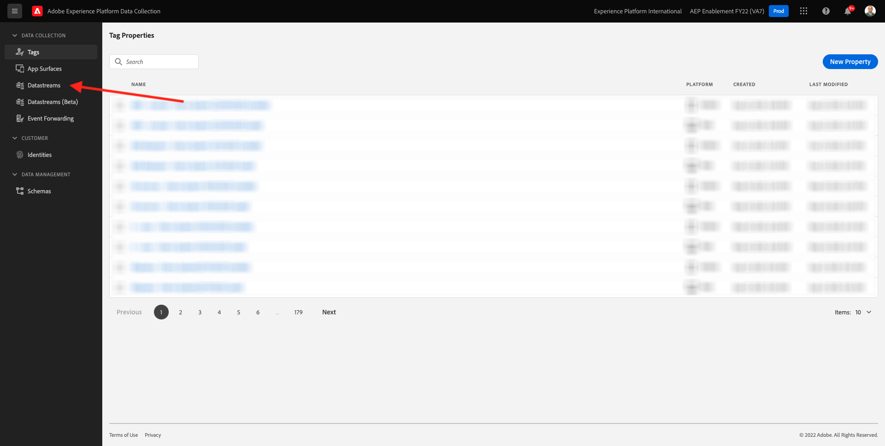

In the top right corner of your screen, select your sandbox name, which should be `--aepSandboxId--`.


In Datastreams, search for your datastream which is named `--demoProfileLdap-- - Demo System Datastream`. Click your datastream to open it.

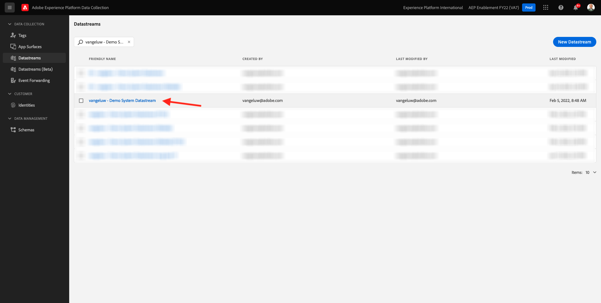

You'll then see this, click **...** next to **Adobe Experience Platform** and then click **Edit**.

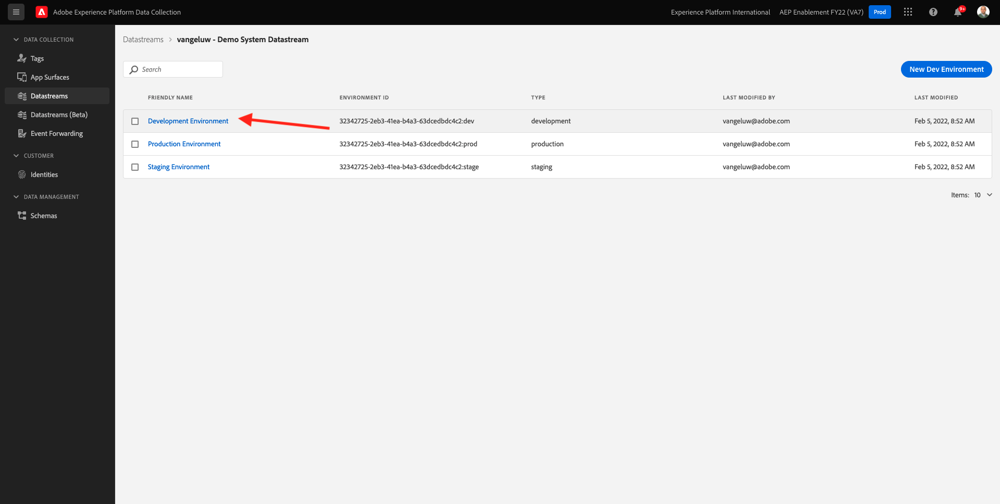

Check the checkboxes for both **Edge Segmentation** and **Personalization Destinations**. Click **Save**.

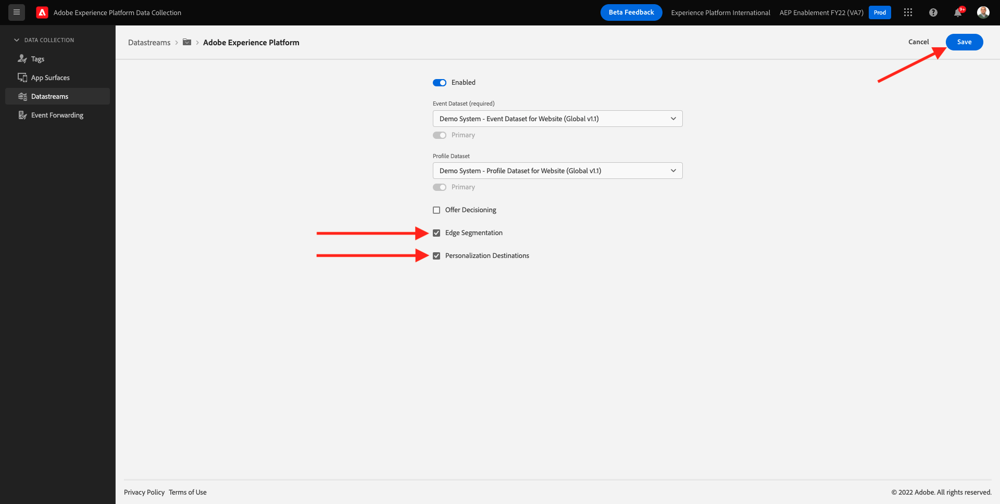

Next, click **+ Add Service**.

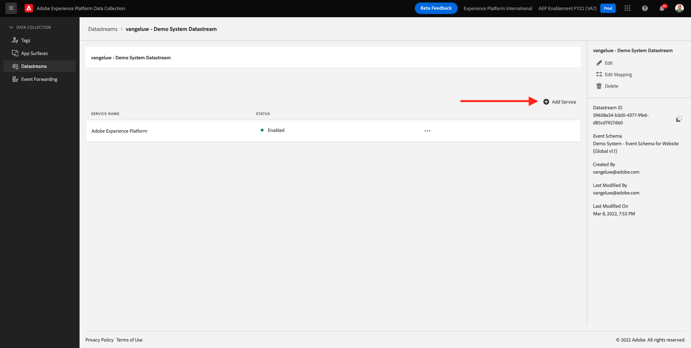

Select the service **Adobe Target**. Click **Save**.

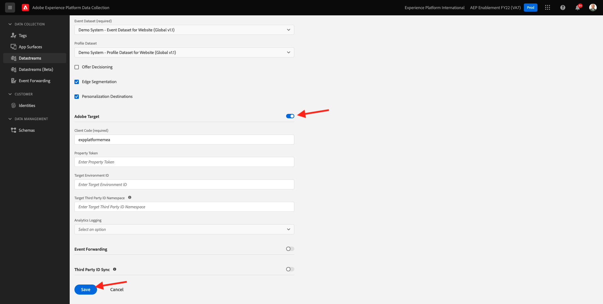

Your datastream is now configured for Adobe Target.


## 6.5.2 Configure your Adobe Target destination

Adobe Target is available as a destination from Real-Time CDP. To setup your Adobe Target integration, go to **Destinations**, to **Catalog**.

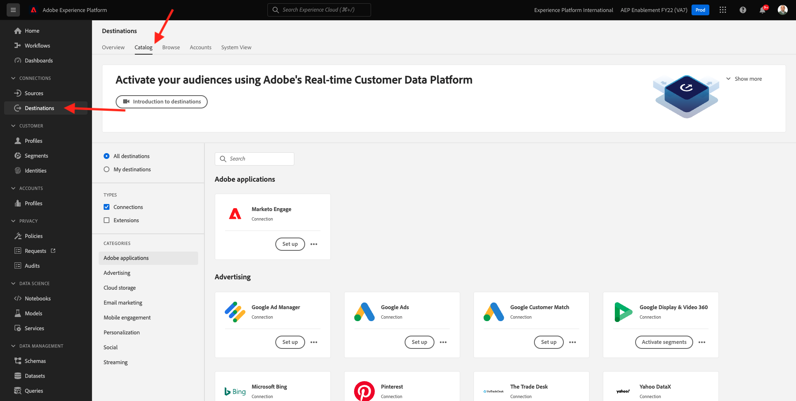

Click **Personalization** in the **Categories** menu. You'll then see the **Adobe Target** destination card. Click **Activate Segments** (or **Set up** depending on your environment).

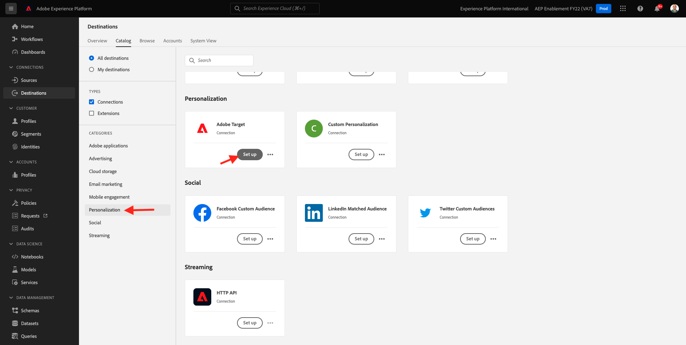

Depending on your environment, you might have to click **+ Configure new destination** to start creating your destination.


You'll then see this.


In the **Configure new destination** screen, you need to configure two things:

- Name: use the name `--demoProfileLdap-- - Adobe Target (Web)`, which should look like this: **vangeluw - Adobe Target (Web)**.
- Datastream ID: you need to select the datastream that you configured in [Exercise 0.2 Create your Datastream](./../module0/ex2.md). The name of your datastream should be: `--demoProfileLdap-- - Demo System Datastream`.

Click **Next**.

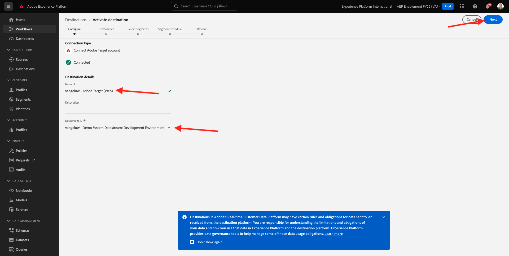

In the next screen, you can optionally select a governance policy. It's not required to select one, in this case there's no need to select one, so click **Create**.


Your destination is now created and will be shown in the list. Select your destination and click **Next** to start sending segments to your destination.


In the list of available segmennts, select the segment you created in [Exercise 6.1 Create a segment](./ex1.md), which is named `--demoProfileLdap-- - Interest in PROTEUS FITNESS JACKSHIRT`. Then, click **Next**.


On the next page, click **Next**.


Click **Finish**. 

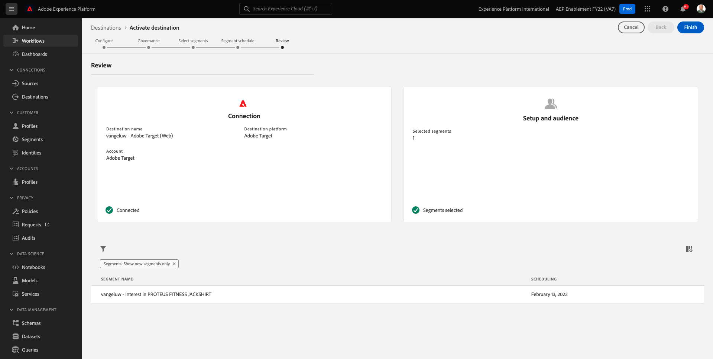

Your segment is now activated towards Adobe Target.


>[!IMPORTANT]
>
>When you've just created your Adobe Target destination in Real-Time CDP, it may take up to an hour for the destination to be live. This is a one-off wait time, due to the setup of the backend configuration. Once the initial 1 hour wait time and backend configuration is done, newly added edge segments that are sent to the Adobe Target destination will be available for targeting in real-time.

## 6.5.3 Configure your Adobe Target form-based activity 

Now that your Real-Time CDP segment is configured to be sent to Adobe Target, you can configure your Experience Targeting activity in Adobe Target. In this exercise you'll configre a Form-based activity.

Go to the Adobe Experience Cloud homepage by going to [https://experiencecloud.adobe.com/](https://experiencecloud.adobe.com/). Click **Target** to open it.

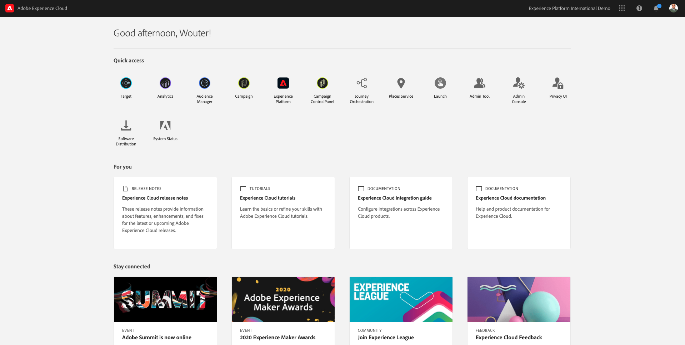

On the **Adobe Target** homepage, you'll see all existing Activities.

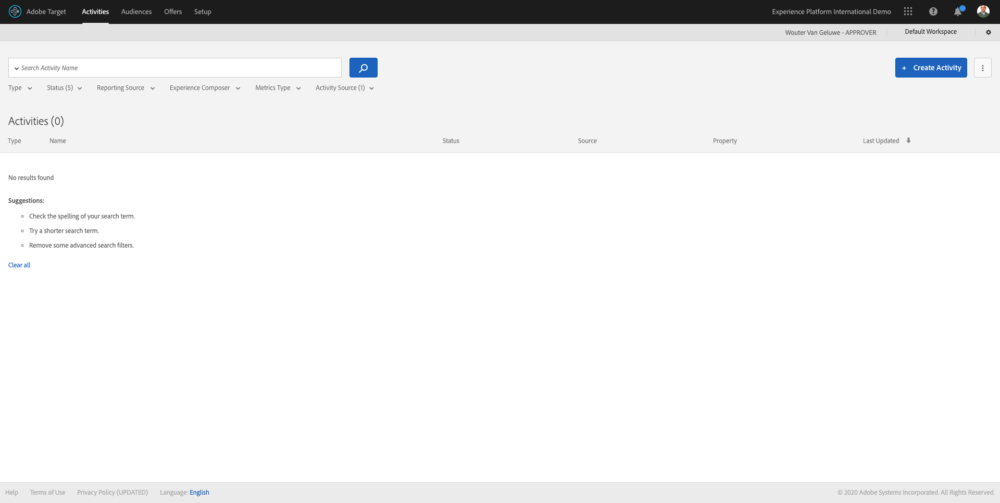

Click **+ Create Activity** to create a new Activity.


Select **Experience Targeting**.


Select **Form** and select **No Property Restrictions**. Click **Next**. 


You're now in the Form-based activity composer.

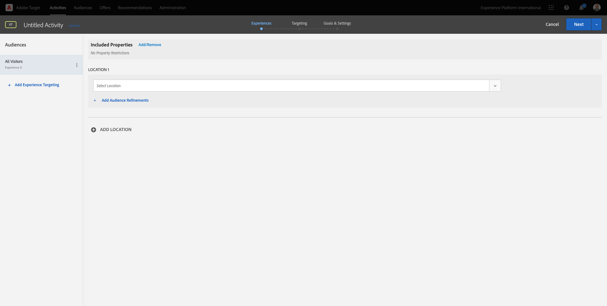

For the field **LOCATION 1**, select **target-global-mbox**.


The default audience is currently **All Visitors**. Click on the **3 dots** next to **All Visitors** and click **Change Audience**.


You're now seeing the list of available audiences, and the Adobe Experience Platform segment that you created earlier and sent to Adobe Target is now part of this list. Select the segment you previously created in Adobe Experience Platform. Click **Assign Audience**.


Your Adobe Experience Platform segment is now part of this Experience Targeting Activity.


Let's now change the Hero Image on the homepage of the website. Click to open the dropdown list next to **Default Content** and click **Create HTML Offer**.


Paste the following code. Then, click **Next**.

```javascript
<script>document.querySelector("#home > div > div > div > div > div.banner_img.d-none.d-lg-block > img").src="https://parsefiles.back4app.com/hgJBdVOS2eff03JCn6qXXOxT5jJFzialLAHJixD9/ff92fdc3885972c0090ad5419e0ef4d4_Luma - Product - Proteus - Hero Banner.png"; document.querySelector(".banner_text > *").remove()</script>
```

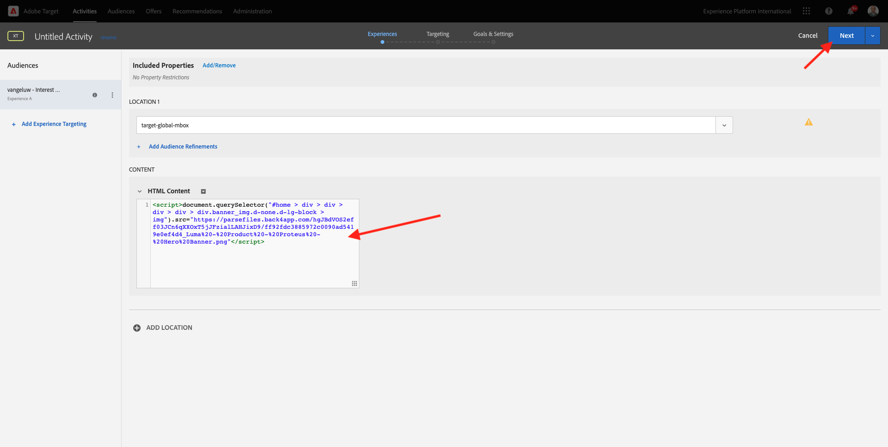

You'll then see the new experience with the new image, for your selected Audience.

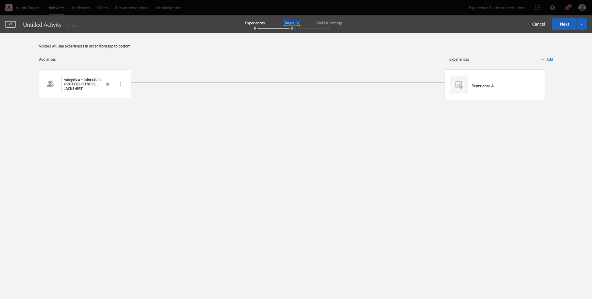

Click the title of your Activity in the upper left corner to rename it.


For the name, please use:

- `--demoProfileLdap-- - RTCDP - XT (Form)`


Click **Next**.


On the **Goals & Settings** - page, go to **Goal Metrics**.


Set the Primary Goal to **Engagement** - **Time On Site**.


Click **Save & Close**.


You're now on the **Activity Overview** page. You still need to activate your Activity.

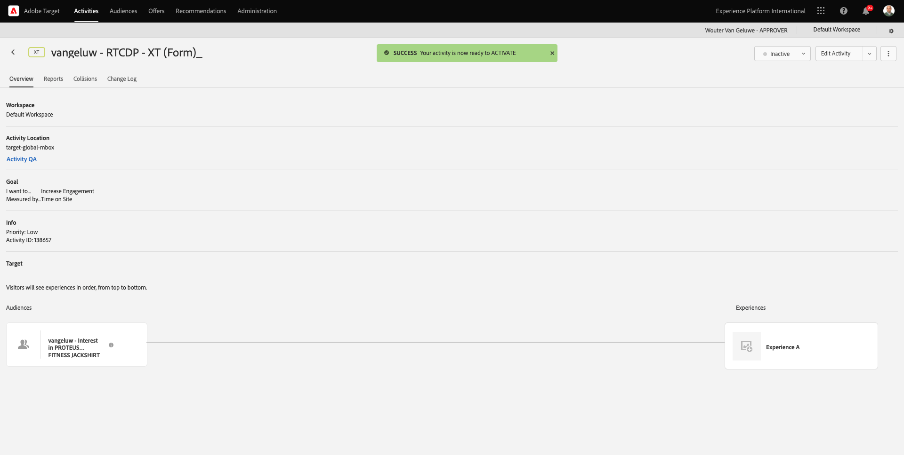

Click on the field **Inactive** and select **Activate**.


You'll then get a visual confirmation that your activity is now live.

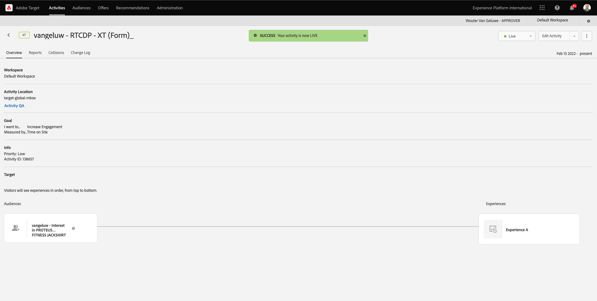

Your activity is now live and can be tested on the demo website.

>[!IMPORTANT]
>
>When you've just created your Adobe Target destination in Real-Time CDP, it may take up to an hour for the destination to be live. This is a one-off wait time, due to the setup of the backend configuration. Once the initial 1 hour wait time and backend configuration is done, newly added edge segments that are sent to the Adobe Target destination will be available for targeting in real-time.

If you now go back to your demo website and visit the product page for PROTEUS FITNESS JACKSHIRT, you'll then instantly qualify for the segment that you created, and you'll see the Adobe Target activity be displayed on the home page in real-time.

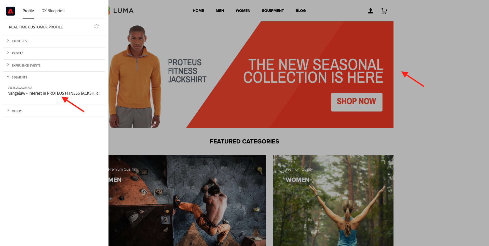

Next Step: [6.6 External Audiences](./ex6.md)

[Go Back to Module 6](./real-time-cdp-build-a-segment-take-action.md)

[Go Back to All Modules](../../overview.md)
