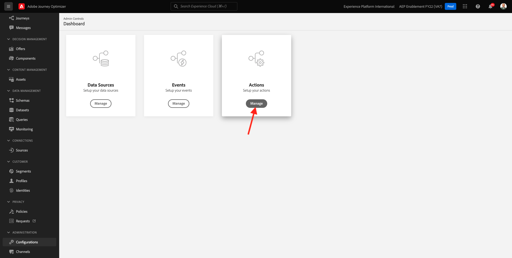
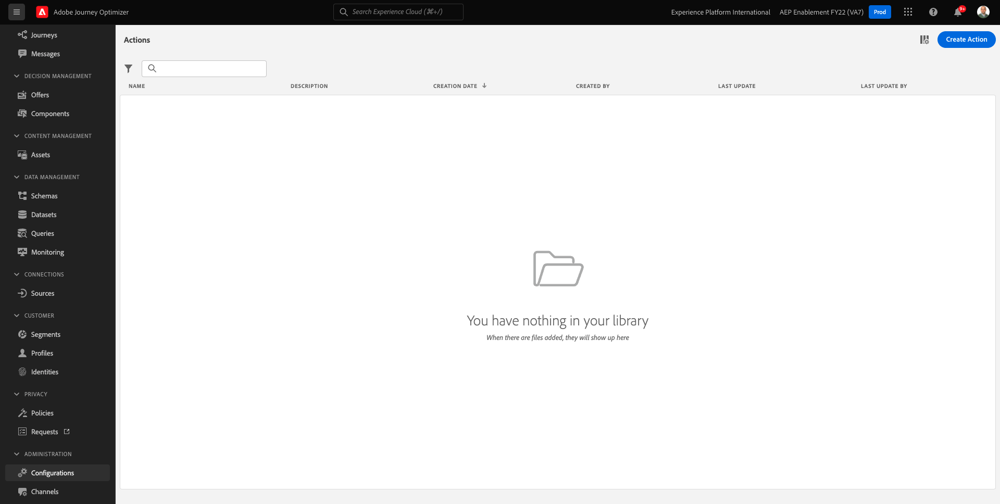
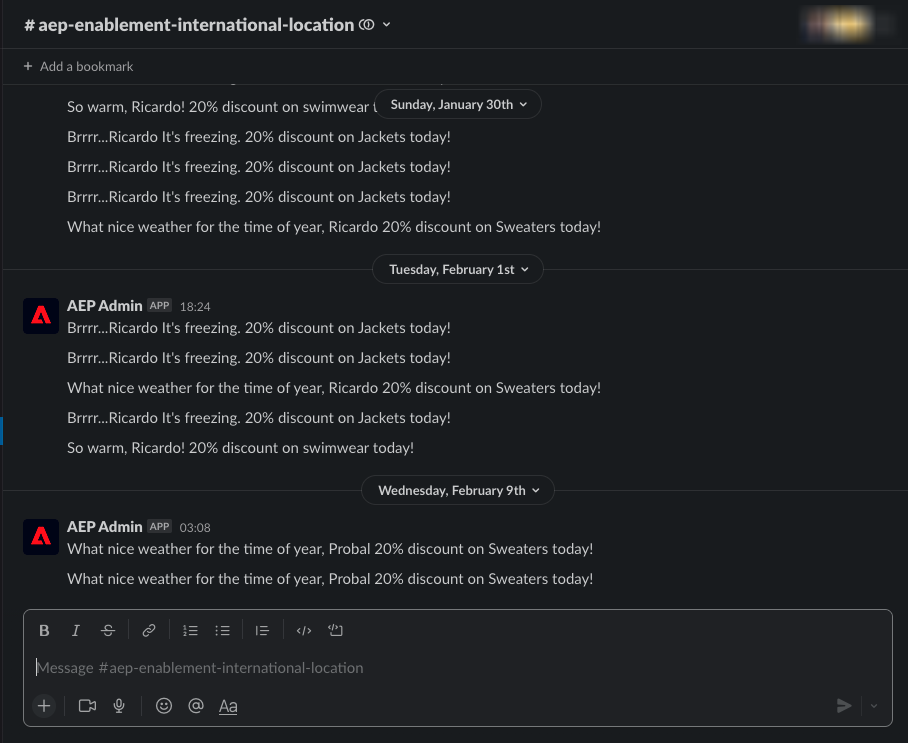
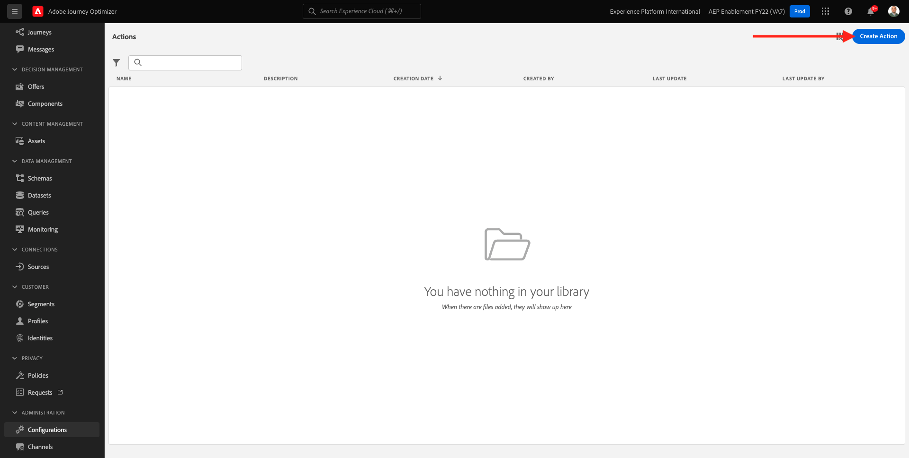
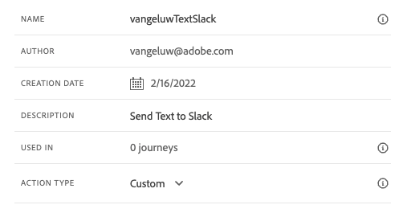
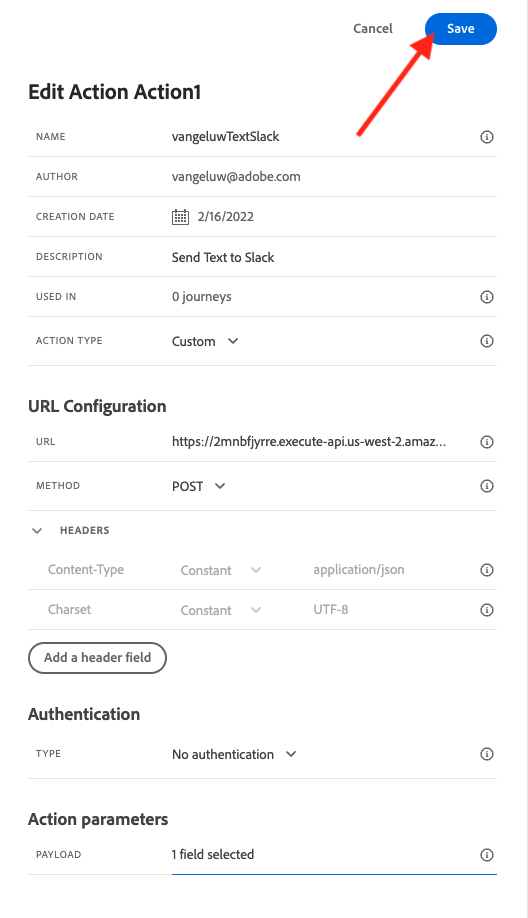
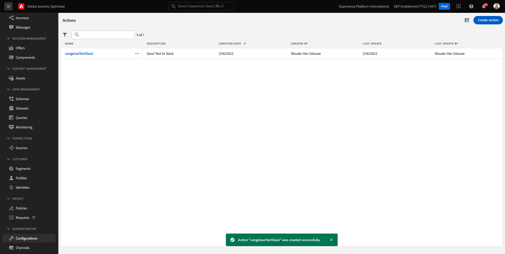

# 8.3 Define a custom action

In this exercise, you'll create two custom actions by making use of Adobe Journey Optimizer in combination.

Login to Adobe Journey Optimizer by going to [Adobe Experience Cloud](https://experience.adobe.com). Click **Journey Optimizer**.


You'll be redirected to the **Home**  view in Journey Optimizer. First, make sure you're using the correct sandbox. The sandbox to use is called `--aepSandboxId--`. To change from one sandbox to another, click on **PRODUCTION Prod (VA7)** and select the sandbox from the list. In this example, the sandbox is named **AEP Enablement FY22**. You'll then be in the **Home** view of your sandbox `--aepSandboxId--`.


In the left menu, scroll down and click **Configurations**. Next, click the **Manage** button under **Actions**.



You'll then see the **Actions** list.



You'll define one action that sends a text to a Slack channel.

## 8.3.1 Action: Send Text to Slack Channel

You'll now use an existing Slack channel and send messages to that Slack Channel. Slack has an easy-to-use API and we'll use Adobe Journey Optimizer to trigger their API.



Click **Create Action** to start adding a new action.



You'll see an empty Action popup.


As a Name for the Action, use `--demoProfileLdap--TextSlack`. In this example, the Action Name is `vangeluwTextSlack`.

Set Description to: `Send Text to Slack`.



For the **URL Configuration**, use this:

- URL: `https://2mnbfjyrre.execute-api.us-west-2.amazonaws.com/prod`
- Method: **POST**

>[!NOTE]
>
>The above URL refers to an AWS Lambda function which will then forward your request to the Slack channel as mentioned above. This is done to protect access to an Adobe-owned Slack channel. If you have your own Slack channel, you should create a Slack App through [https://api.slack.com/](https://api.slack.com/), you then need to create an Incoming Webhook in that Slack App, and then replace the above URL by your Incoming Webhook URL.

You don't need to change the Header Fields.


**Authentication** should be set to **No Authentication**.


For the **Action Parameters**, you need to define which fields should be sent towards Slack. Logically, we want Adobe Journey Optimizer and Adobe Experience Platform to be the brain of personalization, so the text to send to Slack should be defined by Adobe Journey Optimizer and then sent to Slack for execution.

So for the **Action Parameters**, click the **Edit Payload** icon.


You'll then see an empty popup-window.


Copy the below text and paste it in the empty popup window.

```json
{
 "text": {
  "toBeMapped": true,
  "dataType": "string",
  "label": "textToSlack"
 }
}
```

FYI: by specifying the below fields, these fields will become accessible from your Customer Journey and you'll be able to populate them dynamically from the Journey:

**"toBeMapped": true,**

**"dataType": "string",**

**"label": "textToSlack"**

You'll then see this:


Click **Save**.


Scroll up and click **Save** one more time to save your custom Action.



Your custom action is now part of the **Actions** list.



You've defined events, an external data sources and actions. Now let's consolidate all of that in one journey.

Next Step: [8.4 Create your journey and messages](./ex4.md)

[Go Back to Module 8](journey-orchestration-external-weather-api-sms.md)

[Go Back to All Modules](../../overview.md)
