# 8.4 Create your SMS messages

In this exercise, you'll create SMS messages by making use of Adobe Journey Optimizer.

For this use case, the goal is to send different SMS messages based on the weather conditions of the location of your customer. 3 scenarios have been defined:

- Colder than 10° Celsius
- Between 10° and 25° Celsius
- Warmer than 25° Celsius

For these 3 conditions, you'll need to define 3 SMS messages in Adobe Journey Optimizer.

Login to Adobe Journey Optimizer by going to [Adobe Experience Cloud](https://experience.adobe.com). Click **Journey Optimizer**.

You'll be redirected to the **Home**  view in Journey Optimizer. First, make sure you're using the correct sandbox. The sandbox to use is called `--aepSandboxId--`. To change from one sandbox to another, click on **PRODUCTION Prod (VA7)** and select the sandbox from the list. In this example, the sandbox is named **AEP Enablement FY22**. You'll then be in the **Home** view of your sandbox `--aepSandboxId--`.

## 8.4.1 Message 1: Colder than 10° Celsius

In the left menu, go to **Messages** and click **Create Message**.

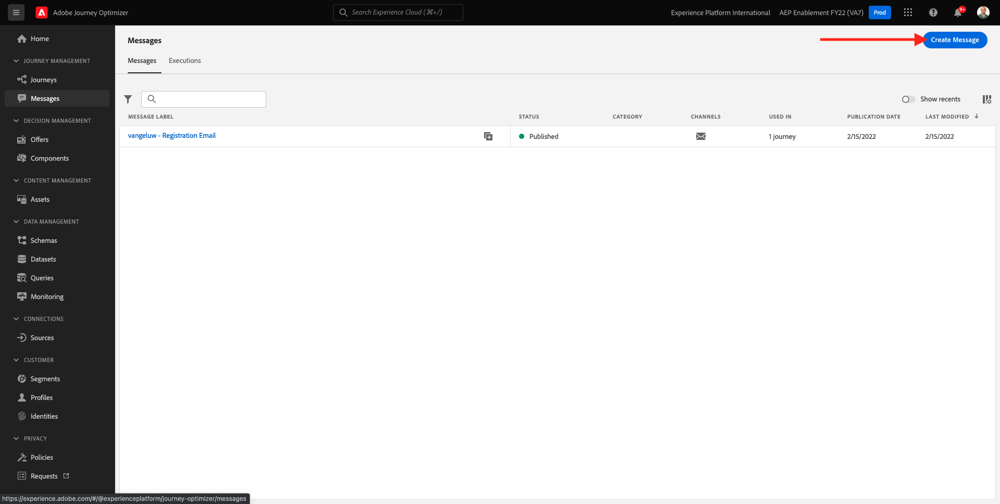

Give your Message a title following this naming convention `--demoProfileLdap-- - Weather <10`, select the **SMS Preset** and enable the **SMS** channel. Click on the **Create** button to create your SMS message.

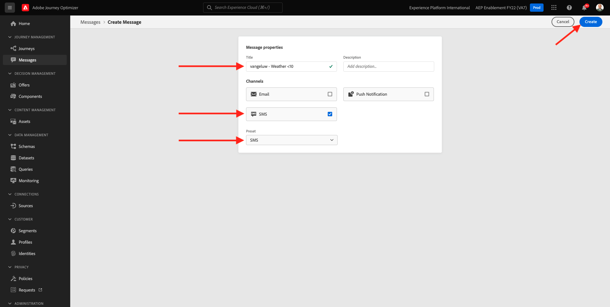

The next screen is the message dashboard, where you can configure the text of your SMS. Click the **Compose message** area to create your message.

Enter the following text: `Brrrr... {{profile.person.name.firstName}}, it's freezing. 20% discount on jackets today!`. Click **Save**.

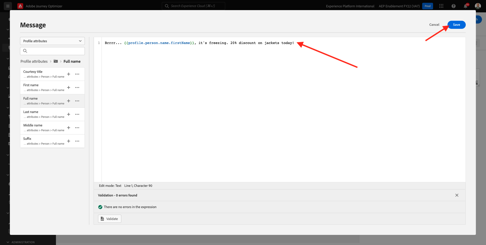

This message is now ready. Click **Publish**.

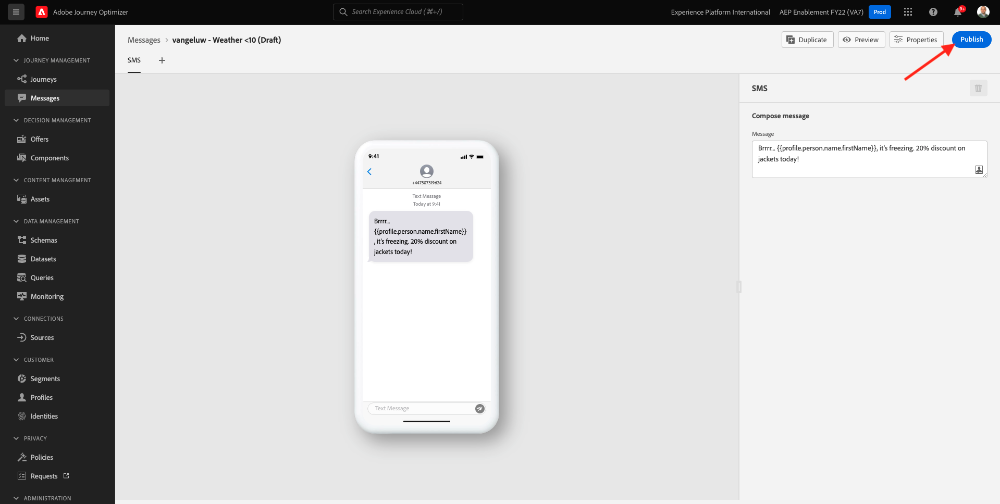

Click **Publish** again.

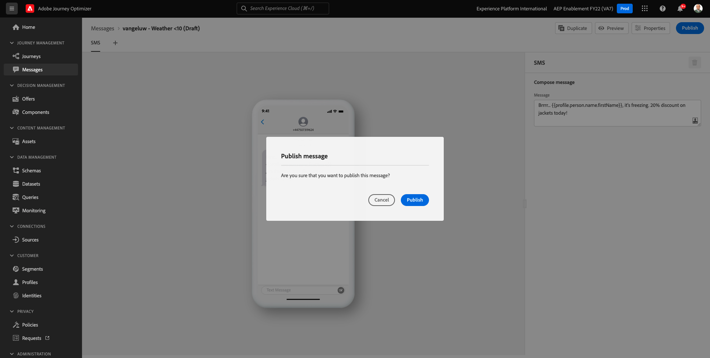

Your message is now published and can be used in a journey.

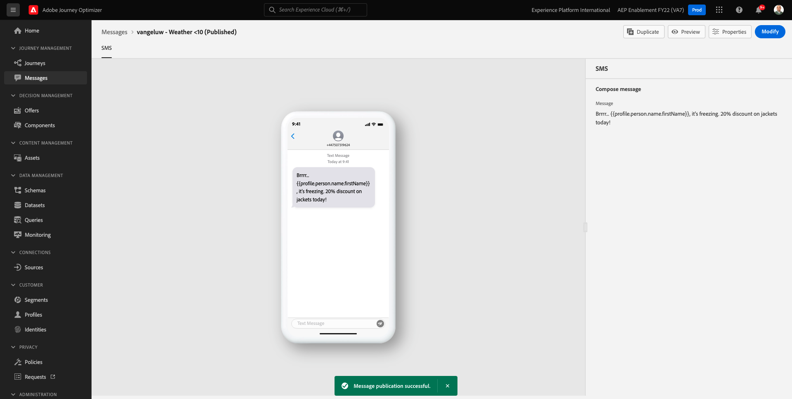

## 8.4.2 Message 2: Between 10° and 25° Celsius

Go to **Messages** and click **Create Message** again.

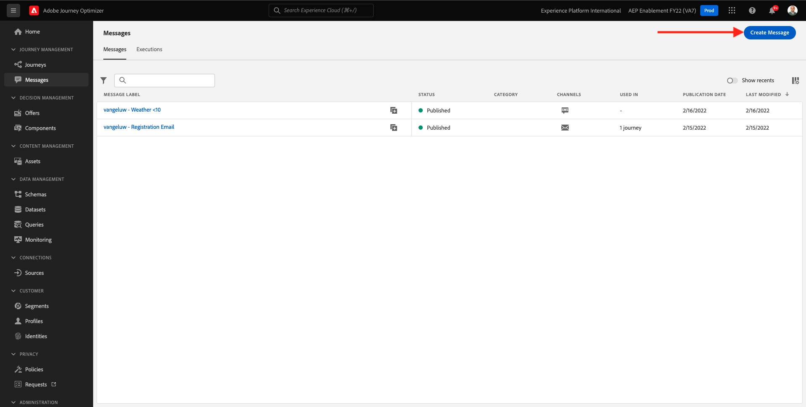

Give your Message a title following this naming convention `--demoProfileLdap-- - Weather 10-25`, select the **SMS Preset** and enable the **SMS** channel. Click on the **Create** button to create your SMS message.

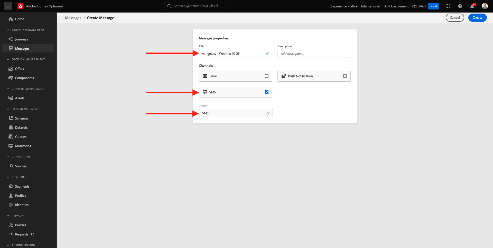

The next screen is the message dashboard, where you can configure the text of your SMS. Click the **Compose message** area to create your message.

Enter the following text: `What a nice weather for the time of year, {{profile.person.name.firstName}} - 20% discount on Sweaters today!`. Click **Save**.

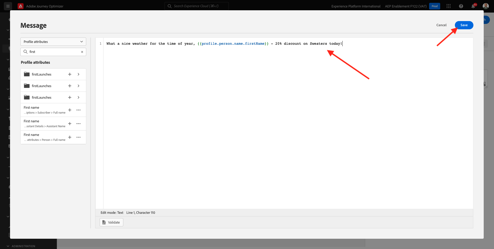

This message is now ready. Click **Publish**.

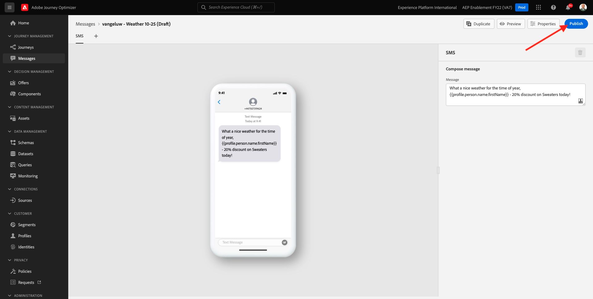

Click **Publish** again.

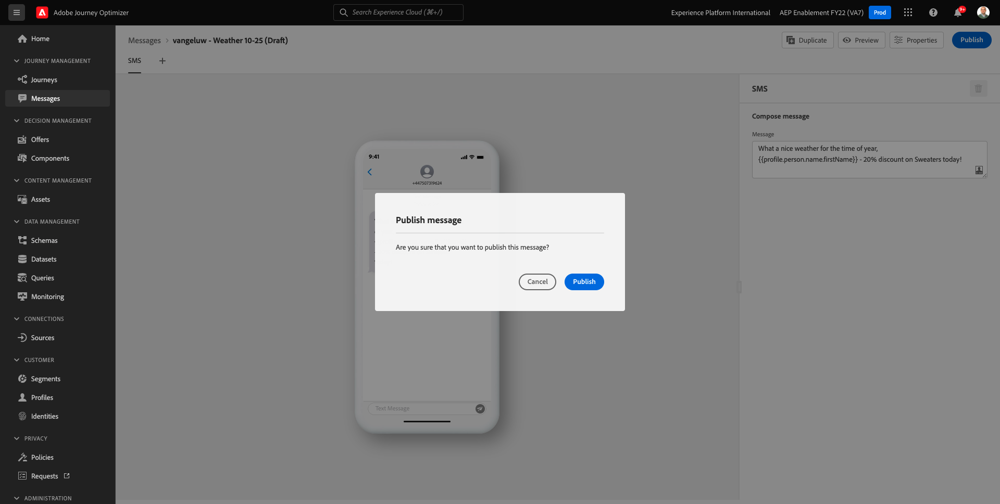

Your message is now published and can be used in a journey.

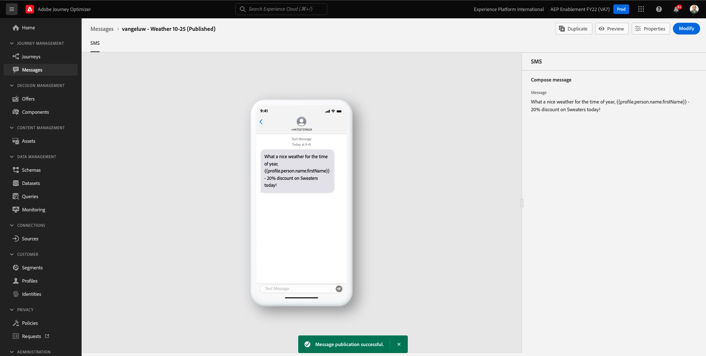

## 8.4.3 Message 3: Warmer than 25° Celsius

Go to **Messages** and click **Create Message** again.

Give your Message a title following this naming convention `--demoProfileLdap-- - Weather >25`, select the **SMS Preset** and enable the **SMS** channel. Click on the **Create** button to create your SMS message.

The next screen is the message dashboard, where you can configure the text of your SMS. Click the **Compose message** area to create your message.

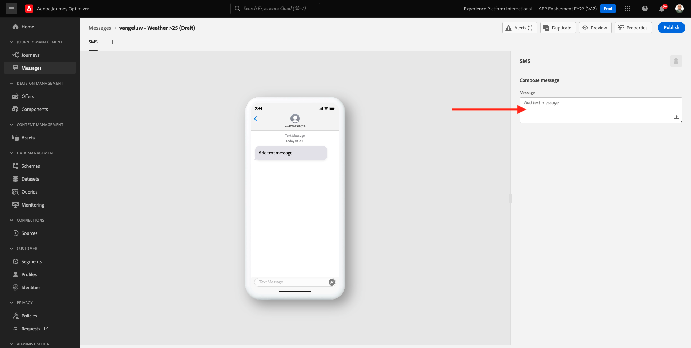

Enter the following text: `So warm, {{profile.extendedWorkDetails.assistantDetails.name.firstName}}! 20% discount on swimwear today!`. Click **Save**.

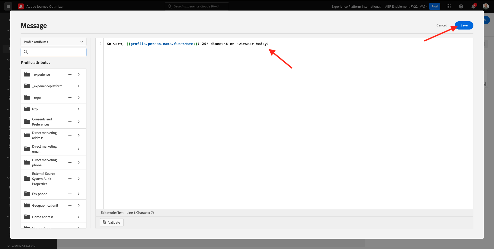

This message is now ready. Click **Publish**.

Click **Publish** again.

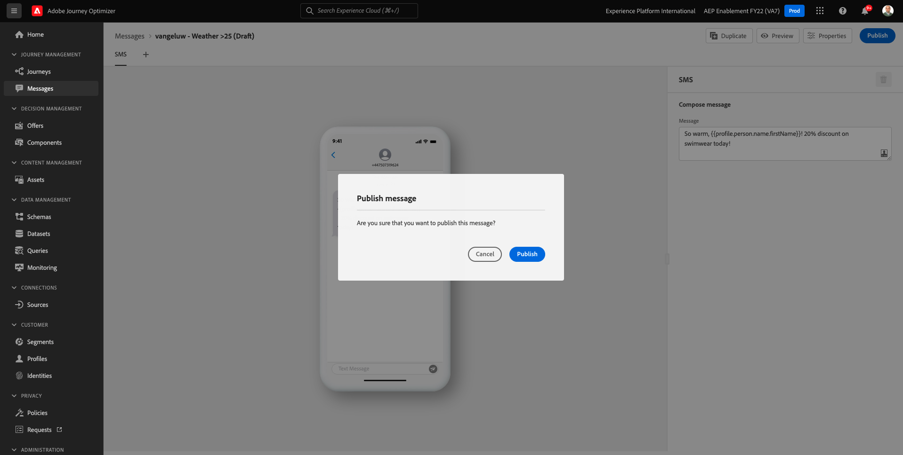

Your message is now published and can be used in a journey.

You can now proceed by creating your journey.

Next Step: [8.5 Design a trigger-based journey](./ex5.md)

[Go Back to Module 8](journey-orchestration-external-weather-api-sms.md)

[Go Back to All Modules](../../overview.md)
