# 9.5 Use your decision in an email

In this exercise, you'll use your decision to personalize the delivery of an email and SMS.

Go to **Journeys**. Find the journey you created in exercise 7.2, which is named `--demoProfileLdap-- - Account Creation Journey`. Click your journey to open it. 

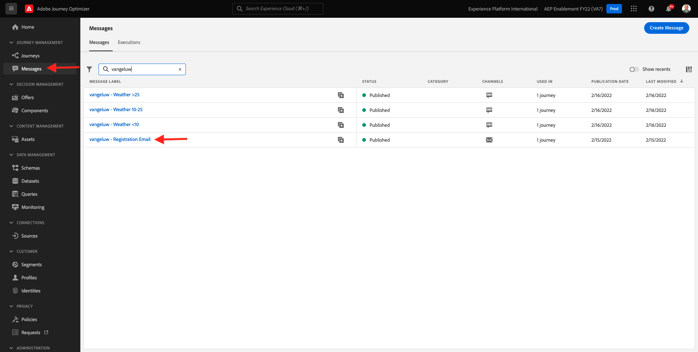

You'll then see this. Click **Create a new version**.

Click **Create a new version**.

Click the **Email** action and then click **Edit content**.

You'll then see the message dashboard. Click **Email Designer**.

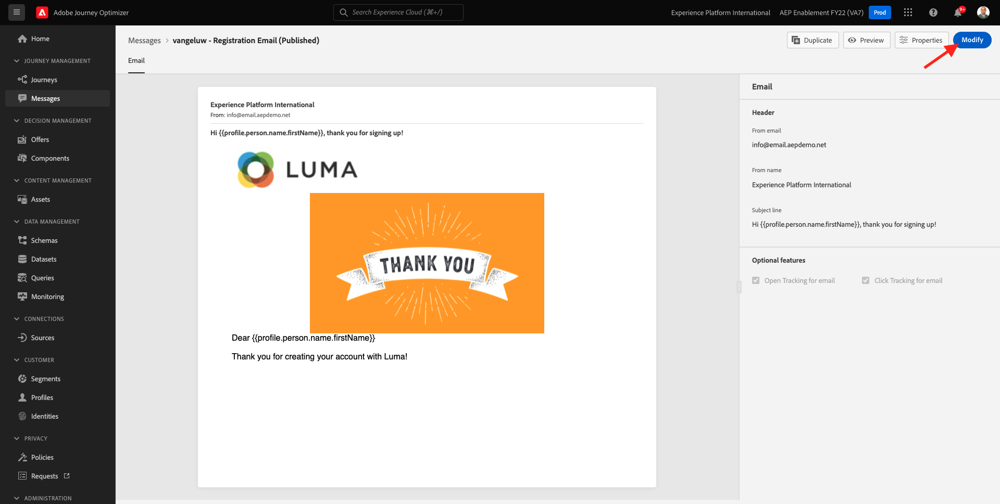

You'll then see this.

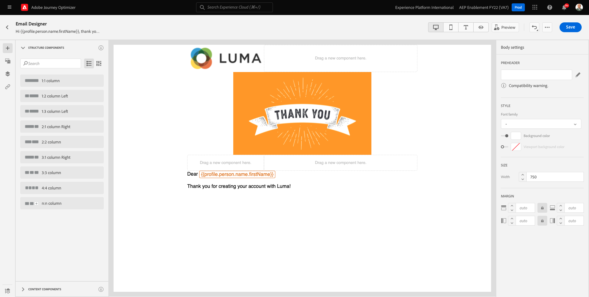

You'll then see this. Drag a new **1:1 column** structure component onto the canvas.

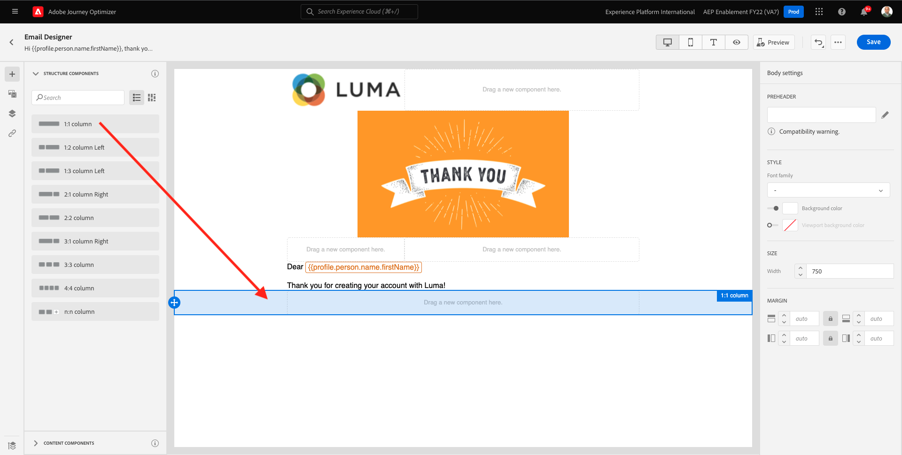

In the menu, go to **Content Components**. Select the **Offer decision** component and drag and drop this component in the email's content offer placeholder as indicated. Then, click **Add**.

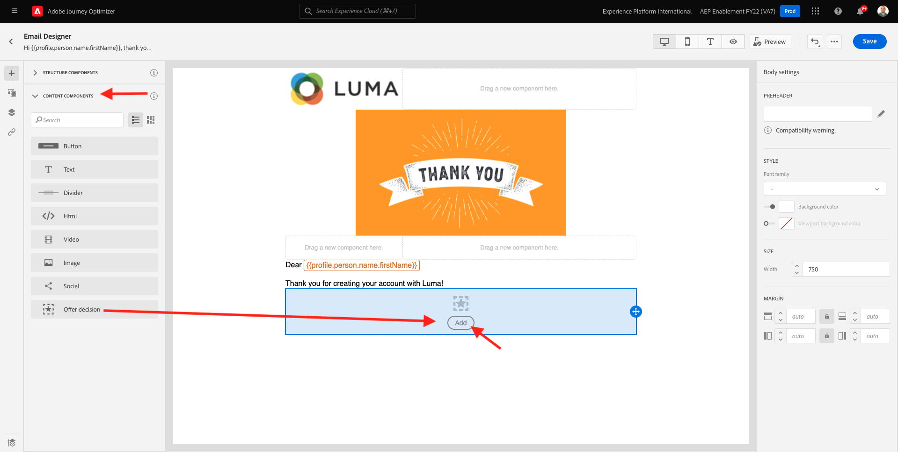

Select the type of placement that you want to include in the email. In the **Placements** dropdown menu select **Email - Image**, then select your decision `--demoProfileLdap-- - Luma Decision`. Click **Add**.

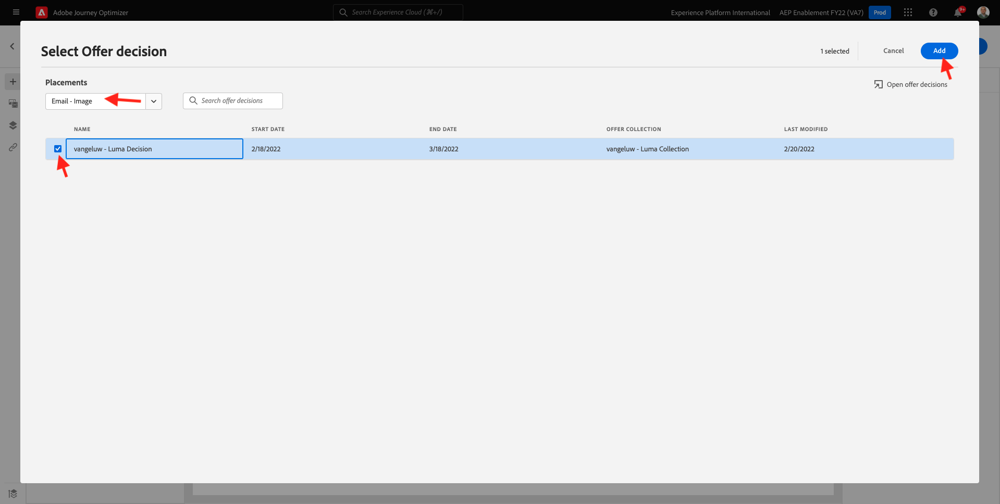

You now see all personalized offers and the fallback offer being visualized inside the email designer. Click  **Simulate Content** to preview the email message with a real customer profile.

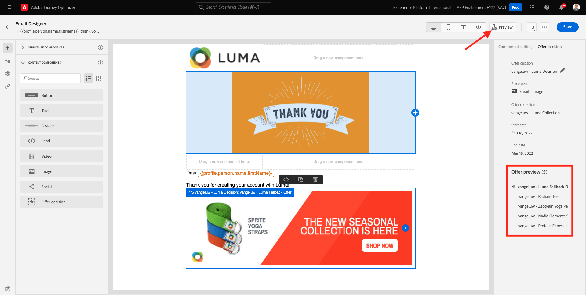

Start by identifying which profile you want to use for the preview. Select the **email** namespace and enter the email address of a customer profile you've created on the demo website. Next, click **Preview**.

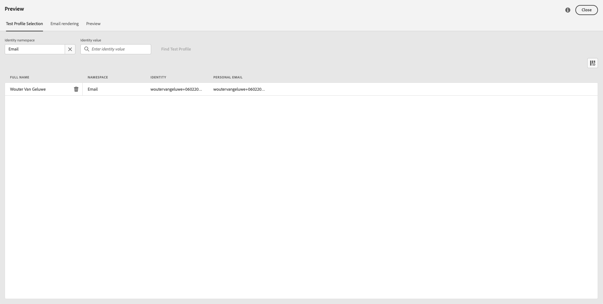

Once the email has been displayed and the offer is correctly displayed click on the **Close** button.

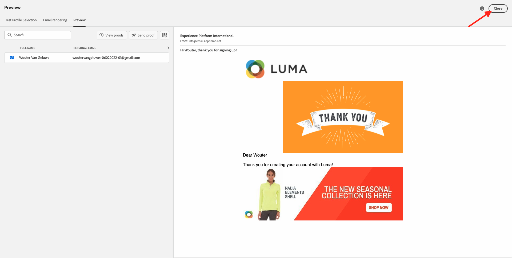

Finally, click **Save**.

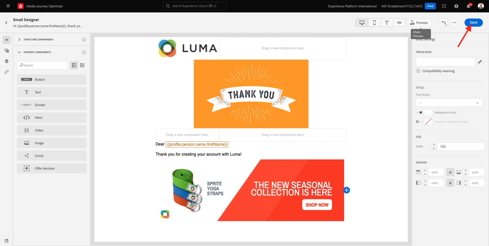

Now, click the arrow to go back to the previous screen.

You'll then see this. Click the arrow in the top left corner to go back to your journey.

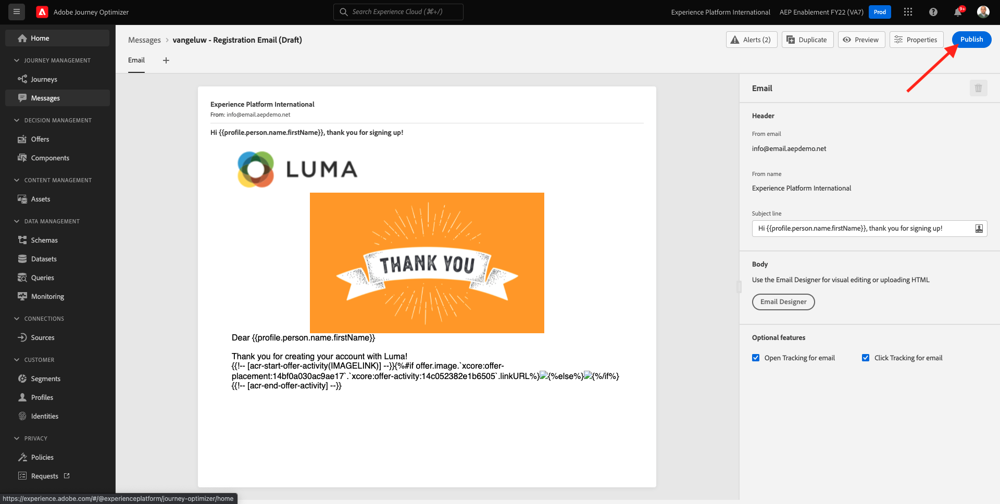

Click **Ok** to close your **Email** action.

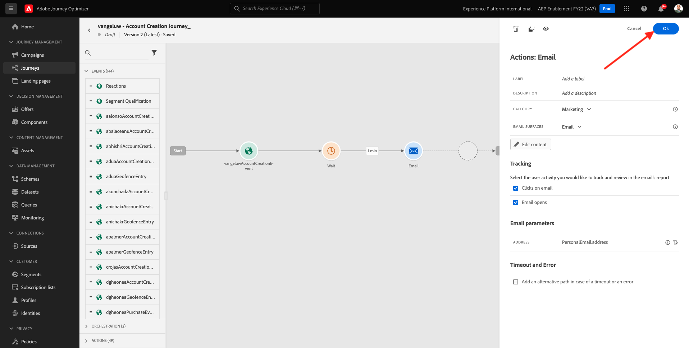

Click **Publish** to publish your updated journey.

Confirm by clicking **Publish** again.

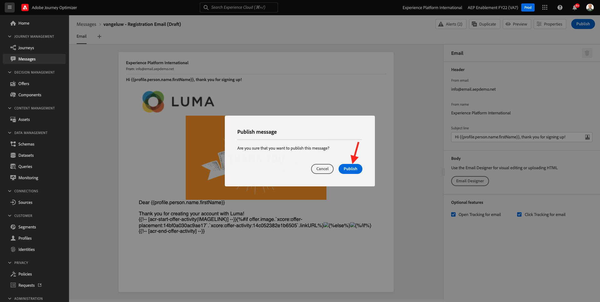

Your message is now published.

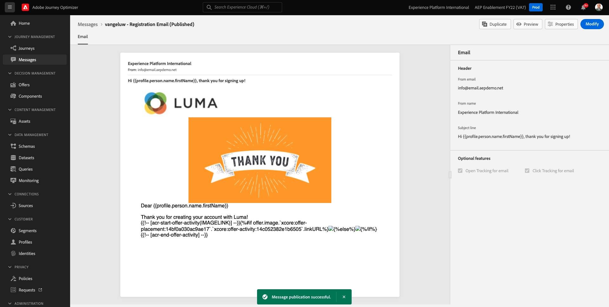

When you create a new account on the demo website, you'll now get this email:

You have finished this exercise. 

Next Step: [9.6 Test your Decision using the API](./ex6.md)

[Go Back to Module 9](./offer-decisioning.md)

[Go Back to All Modules](./../../overview.md)
