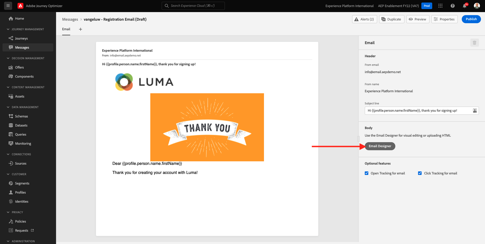

# 9.5 Use your decision in an email

In this exercise, you'll use your decision to personalize the delivery of an email and SMS.

Go to **Messages**. Find the message that you have created in a previous exercise; which is named `--demoProfileLdap-- - Registration Email`. Click your message to open it. 

You'll then see the message dashboard. Click **Modify**. 

Click **Confirm**.

Click **Email Designer**.

You'll then see this.

You'll then see this.

In the menu, go to **Content Components**. Select the **Offer decision** component and drag and drop this component in the email's content offer placeholder as indicated. Then, click **Add**.

Select the type of placement that you want to include in the email. In the **Placements** dropdown menu select **Email - Image**, then select your decision `--demoProfileLdap-- - Luma Decision`. Click **Add**.

You now see all personalized offers and the fallback offer being visualized inside the email designer. Click  **Preview** to preview the email message with a real customer profile.

Start by identifying which profile you want to use for the preview. Select the **email** namespace and enter the email address of a customer profile you've created on the demo website. Next, click **Preview**.

Once the email has been displayed and the offer is correctly displayed click on the **Close** button.

Finally, click **Save**.

Now, click the arrow to go back to the previous screen.

Click **Publish** to publish your message again.

Confirm by clicking **Publish** again.

Your message is now published.

When you create a new account on the demo website, you'll now get this email:

You have finished this exercise. 

Next Step: [9.6 Test your Decision using the API](./ex6.md)

[Go Back to Module 9](./offer-decisioning.md)

[Go Back to All Modules](./../../overview.md)
