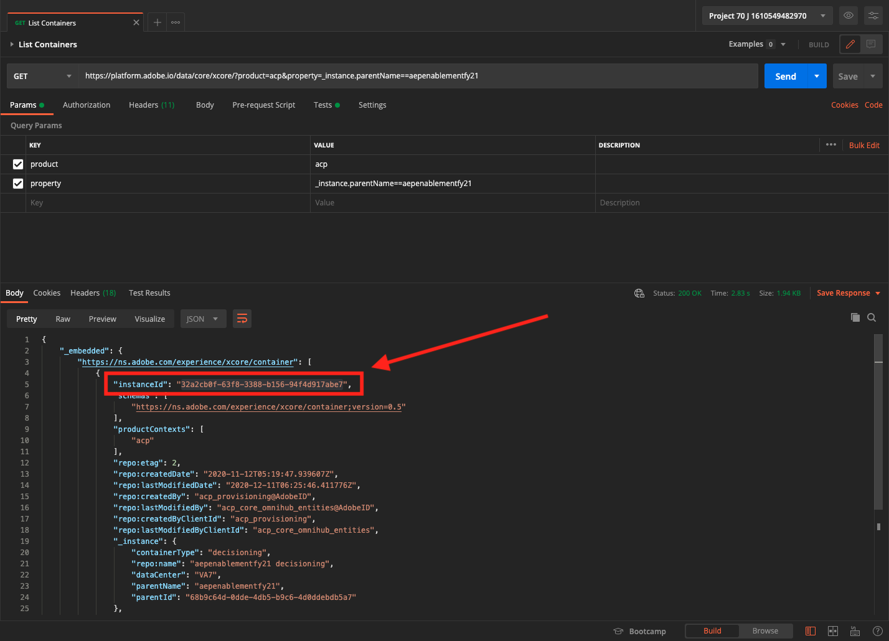
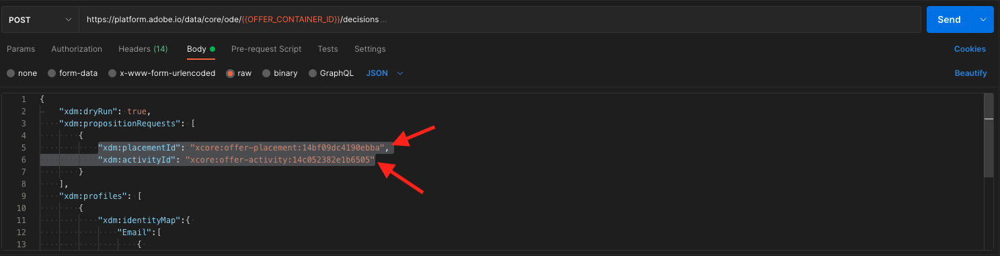

# 9.6 Test your decision using the API

## 9.6.1 Work with the Offer Decisioning API using Postman

Download [this Postman Collection for Offer Decisioning](./../../assets/postman/postman_offer-decisioning.zip) to your desktop and unzip it. You'll then have this:

You now have this file on your desktop:

- [!UICONTROL _Module 14- Decisioning Service.postman_collection.json]

In [Exercise 3.3.3 - Postman authentication to Adobe I/O](./../../modules/module3/ex3.md) you installed Postman. You'll need to use Postman again for this exercise.

Open Postman. Click **[!UICONTROL Import]**.

Click on **[!UICONTROL Upload files]**.

Select the file **[!UICONTROL _Module 14- Decisioning Service.postman_collection.json]** and click **[!UICONTROL Open]**.

You'll then have this collection available in Postman.

You now have everything you need in Postman to start interacting with Adobe Experience Platform through the APIs.

### 9.6.1.1 List Containers

Click to open the request **[!UICONTROL GET - List Containers]**. 

Under **[!UICONTROL Params]**, you'll see this: 

- property: `_instance.parentName==aepenablementfy22`

In that parameter, **[!UICONTROL aepenablementfy22]** is the name of the sandbox that is used in Adobe Experience Platform. The sandbox you should use is `--aepSandboxId--`. Replace the text **[!UICONTROL aepenablementfy22]** by `--aepSandboxId--`.

After replacing the sandbox name, click **[!UICONTROL Send]**.

This is the response, which shows the offer container for the sandbox that you specified. Please copy the **[!UICONTROL container instanceId]** as indicated below and write it down in a text file on your computer. You'll need to use this **[!UICONTROL container instanceId]** for the next exercise!

### 9.6.1.2 List Placements

Click to open the request **[!UICONTROL GET - List Placements]**. Click **[!UICONTROL Send]**.

You're now seeing all available placements in your offer container. The placements you're seeing were defined in the Adobe Experience Platform UI, as you could see in [Exercise 9.1.3](./ex1.md).

### 9.6.1.3 List Decision Rules

Click to open the request **[!UICONTROL GET - List Decision Rules]**. Click **[!UICONTROL Send]**.

In the response, you'll see the Decision Rules that you defined in the Adobe Experience Platform UI, as you could see in [Exercise 9.1.4](./ex1.md).

### 9.6.1.4 List Personalized Offers

Click to open the request **[!UICONTROL GET - List Personalized Offers]**. Click **[!UICONTROL Send]**.

In the response, you'll see the Personalized Offers that you defined in the Adobe Experience Platform UI in [Exercise 9.2.1](./ex2.md).

### 9.6.1.5 List Fallback Offers

Click to open the request **[!UICONTROL GET - List Fallback Offers]**. Click **[!UICONTROL Send]**.

In the response, you'll see the Fallback Offer that you defined in the Adobe Experience Platform UI in [Exercise 9.2.2](./ex2.md).

### 9.6.1.6 List Collections

Click to open the request **[!UICONTROL GET - List Collections]**.

In the response, you'll see the Collection that you defined in the Adobe Experience Platform UI in [Exercise 9.2.3](./ex2.md).

### 9.6.1.7 Get Detailed Offers for Customer Profile

Click to open the request **[!UICONTROL POST - Get Detailed Offers for Customer Profile]**. This request is similar to the previous one, but will actually return details like image URLs, text etc.

For this request, similar to the previous exercise which has similar requirements, you need to provide the values for **[!UICONTROL xdm:placementId]** and **[!UICONTROL xdm:activityId]** to retrieve the specific offer details for a customer.

The field **[!UICONTROL xdm:activityId]** needs to be filled out. You can retrieve that in the Adobe Experience Platform UI, as indicated below.

The field **[!UICONTROL xdm:placementId]** needs to be filled out. You can retrieve that in the Adobe Experience Platform UI, as indicated below. In the below example, you can see the placementId for the placement **[!UICONTROL Web - Image]**.

Go to **[!UICONTROL Body]** and enter the email address of the customer for whom you'd like to request an offer. Click **[!UICONTROL Send]**.

Finally, you'll then see the result of what kind of personalized offer and what assets need to be displayed to this customer.

You've now completed this exercise.

Next Step: [Summary and benefits](./summary.md)

[Go Back to Module 9](./offer-decisioning.md)

[Go Back to All Modules](./../../overview.md)
