# 14.5 Forward events towards the AWS ecosystem

>[!IMPORTANT]
>
>Completion of this exercise is optional and a cost is involved to use AWS Kinesis. While AWS provides a free tier account which lets you test and configure many services without a cost, AWS Kinesis isn't part of that free tier account. So in order to implement and test this exercise, a cost will be involved to use AWS Kinesis.

## Good to know

Adobe Experience Platform supports various Amazon services as destination. 
Kinesis and  S3 are both [profile export destinations](https://experienceleague.adobe.com/docs/experience-platform/destinations/destination-types.html?lang=en) and can be used as part of Adobe Experience Platform's Real-Time CDP.
You can easily feed high-value segment events and associated profile attributes into your systems of choice.

In this note, you’ll learn how to setup your own Amazon Kinesis stream to stream event data coming from the Adobe Experience Platform Edge ecosystem to a cloud storage destination, such as Amazon S3. This is useful in case you'd like to collect experience events from web and mobile properties and push them into your datalake for analysis and operational reporting. Datalakes generally ingest data in a batch fashion with large daily file imports, they do not expose public http endpoint which could be used in conjunction with event forwarding.

Supporting the above use cases imply that streamed data need to be buffered or placed in a queue before being written to a file. Care has to be taken to not open file for write access across multiple process. Delegating this task to dedicated system is ideal to scale nicely while ensuring a great level of service, this is where Kinesis comes to the rescue.

Amazon Kinesis Data Streams focuses on ingesting and storing data streams. Kinesis Data Firehose focuses on delivering data streams to select destinations, such as S3 buckets. 

As part of this exercise, you'll...

- Perform a basic setup of a Kinesis data stream
- Create a Firehose delivery stream and use S3 bucket as destination
- Configure Amazon API gateway as a rest api endpoint to receive your event data
- Forward raw event data from Adobe's Edge to your Kinesis stream

## 14.5.1 Configure your AWS S3 bucket

Go to [https://console.aws.amazon.com](https://console.aws.amazon.com) and sign in with the Amazon-account you previously created.


After logging in, you'll be redirected to the **AWS Management Console**.


In the **Find Services** menu, search for **s3**. Click the first search result: **S3 - Scalable Storage in the Cloud**.

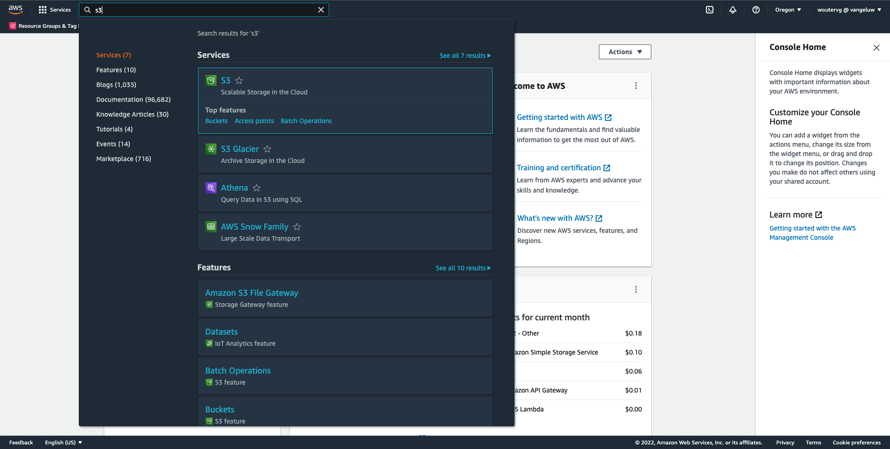

You'll then see the **Amazon S3** homepage. Click **Create Bucket**.


In the **Create Bucket** screen, you need to configure two things:
  
- Name: use the name `eventforwarding---demoProfileLdap--`. As an example, in this exercise the bucket name is **aepmodulertcdpvangeluw**
- Region: use the region **EU (Frankfurt) eu-central-1**

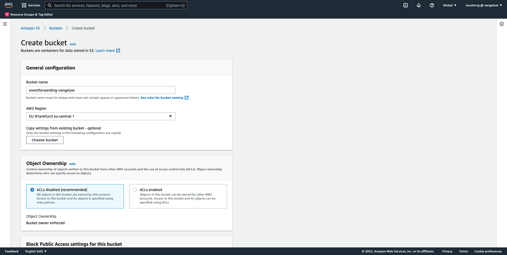

Leave all the other default settings as they are. Scroll down and click **Create bucket**.

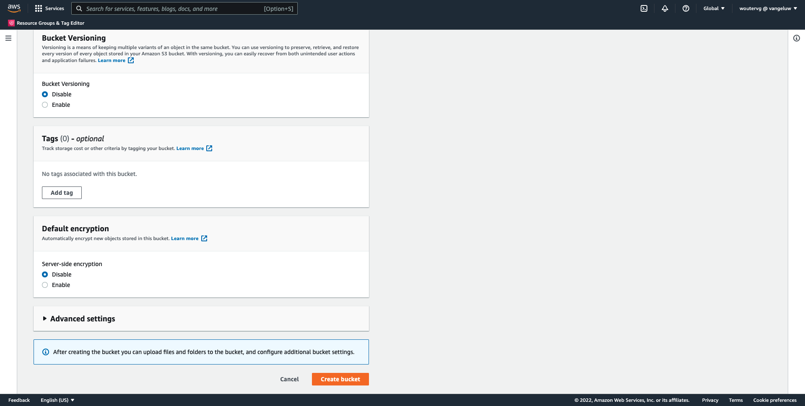

You'll then see your bucket being created and will be redirected to the Amazon S3 homepage.


## 14.5.2 Configure your AWS Kinesis Data Stream

In the **Find Services** menu, search for **kinesis**. Click the first search result: **Kinesis - Work with Real-Time Streaming Data**.


Select **Kinesis Data Streams**. Click **Create data stream**.


For the **Data stream name**, use `--demoProfileLdap---datastream`.


There's no need to change any of the other settings. Scroll down and click **Create data stream**.


You'll then see this. Once your data stream is succesfully created, you can move forward to the next exercise.


## 14.5.3 Configure your AWS Firehose Delivery Stream

In the **Find Services** menu, search for **kinesis**. Click **Kinesis Data Firehose**.


Click **Create delivery stream**.


For **Source**, select **Amazon Kinesis Data Streams**. For **Destination**, select **Amazon S3**. Click **Browse** to select your data stream.


Select your data stream. Click **Choose**.


You'll then see this. Remember the **Delivery stream name** as you'll need it later.

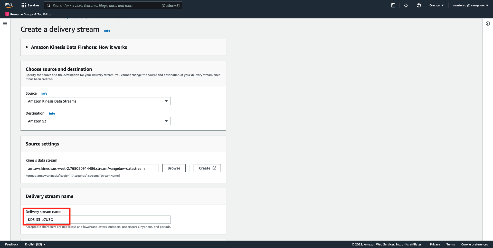

Scroll down until you see **Destination Settings**. Click **Browse** to select your S3 bucket.

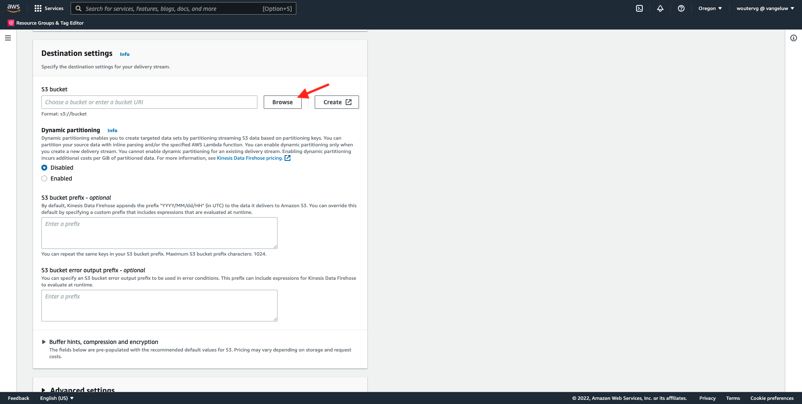

Select your S3 bucket and click **Choose**.


You'll then see something like this. Update the following settings:

- Dynamic partitioning: set to **Enabled**
- Multi record deaggregation: set to **Disabled**
- New line delimiter: set to **Enabled**
- Inline parsing for JSON: set to **Enabled**


Scroll down a bit, you'll then see this. Update the following settings:

- Dynamic partitionning keys
  - Key name: **dynamicPartitioningKey**
  - JQ expression: **.dynamicPartitioningKey**
- S3 bucket prefix: add the following code:

```bash
!{partitionKeyFromQuery:dynamicPartitioningKey}/!{timestamp:yyyy}/!{timestamp:MM}/!{timestamp:dd}/!{timestamp:HH}/}
```

- S3 bucket error ouput prefix: set to **error**


Finally, scroll down a bit more and click **Create delivery stream**


After a couple of minutes, your delivery stream will nbe created and **Active**.


## 14.5.4 Configure your AWS IAM Role

In the **Find Services** menu, search for **iam**. Click **API Gateway**.


Click **Roles**.


Search for your **KinesisFirehose** role. Click it to open it.


Click your Permissions Policy name to open it.


In the new screen that opens, click **Edit Policy**.

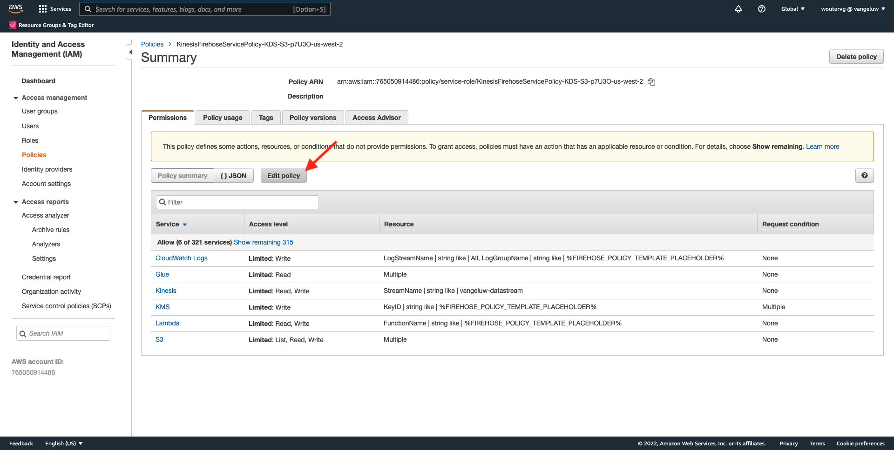

Under **Kinesis** - **Actions**, ensure that the **Write** permissions for **PutRecord** is enabled. Click **Review Policy**.


Click **Save Changes**.


You'll then be back here. Click **Roles**.

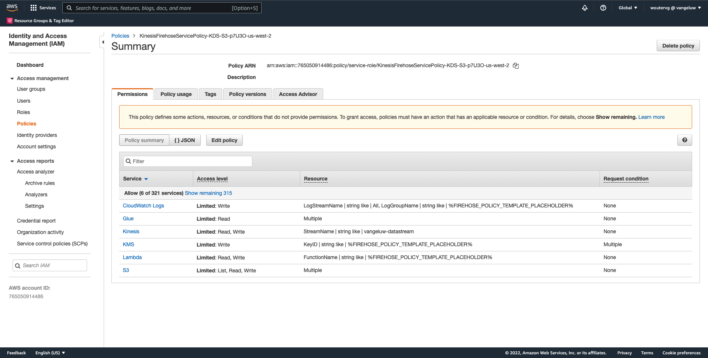

Search for your **KinesisFirehose** role. Click it to open it.


Go to **Trust relationships** and click **Edit trust policy**.


Overwrite the current trust policy by pasting this code to replace the existing code:

```json
{
	"Version": "2012-10-17",
	"Statement": [
		{
			"Effect": "Allow",
			"Principal": {
				"Service": [
                    "firehose.amazonaws.com",
                    "kinesis.amazonaws.com",
                    "apigateway.amazonaws.com"
                ]
			},
			"Action": "sts:AssumeRole"
		}
	]
}
```

Click **Update policy**


You'll then see this. You'll need to specify the **ARN** for this role in the next step.


## 14.5.5 Configure your AWS API Gateway

Amazon API Gateway is an AWS service for creating, publishing, maintaining, monitoring, and securing REST, HTTP, and WebSocket APIs at any scale. API developers can create APIs that access AWS or other web services, as well as data stored in the AWS Cloud. 

You will now expose the Kinesis data stream to the internet through a HTTPS endpoint which can then directly be consumed by Adobe services, like Event Forwarding. 

In the **Find Services** menu, search for **api gateway**. Click **API Gateway**.

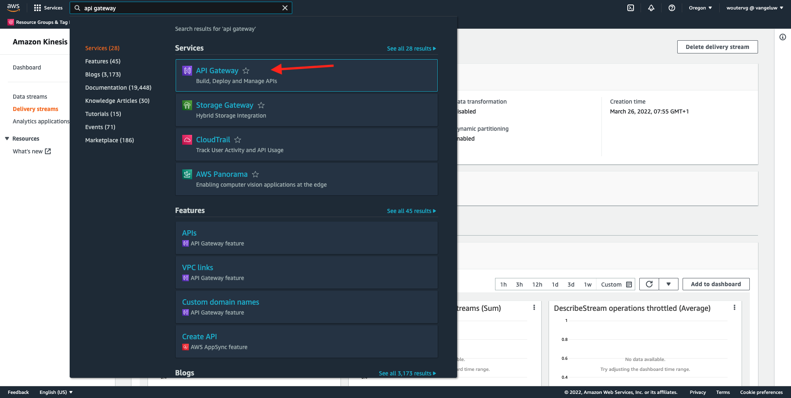

You'll then see something like this. Click **Create API**.


Click **Build** on the **REST API** card.

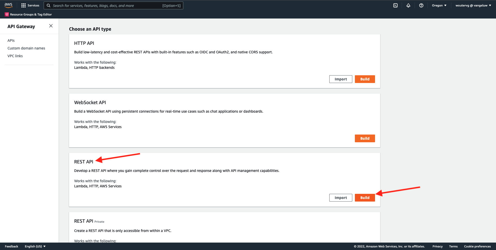

You'll then see this. Fill out the settings like this:

- Choose the protocol: select **REST**
- Create new API: select **New API**
- Settings:
  - API name: use `--demoProfileLdap---eventforwarding`
  - Endpoint Type: select **Regional**

Click **Create API**.

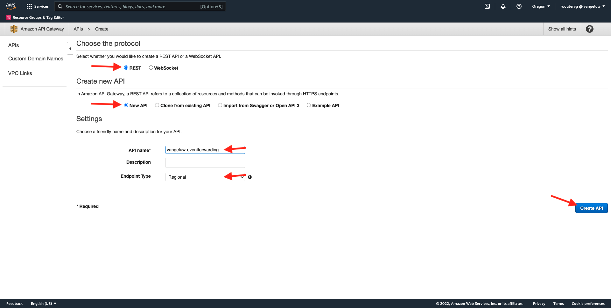

You'll then see this. Click **Actions** and then click **Create Resource**.


You'll then see this. Set **Resource Name** to **stream**. Click **Create Resource**.


You'll then see this. Click **Actions** and then click **Create Method**.


In the dropdown, select **POST** and click the **v** button.


You'll then see this. Fill out the settings like this:

- Integration type: **AWS Service**
- AWS Region: select the region that is used by your Kinesis Data Stream, in this case: **us-west-2**
- AWS Service: select **Kinesis**
- AWS Subdomain: leave empty
- HTTP Method: select **POST**
- Action Type: select **Use action name**
- Action: enter **PutRecord**
- Execution role: paste the **ARN** of the execution role that is used by your Kinesis Data Firehose, as instructed in the previous exercise
- Content Handling: select **Passthrough**
- Use Default Timeout: enable the checkbox

Click **Save**.


You'll then see this. Click **Integration Request**.

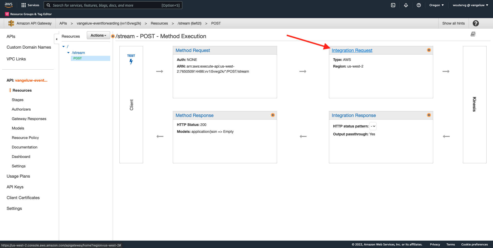

Click **HTTP Headers**.


Scroll down a bit and click **Add header**.


Set **Name** to **Content-Type**, set **Mapped from** to `'application/x-amz-json-1.1'`. Click the **v** icon to save your changes.


You'll then see this. For **Request body passthrough**, select **When there are no templates defined (recommended)**. Next, click **Add mapping template**.


Under **Content-Type**, enter **application/json**. Click the **v** icon to save your changes.


Scroll down to find a code editor window. Paste the below code in there:

```json
{
  "StreamName": "$input.path('StreamName')",
  "Data": "$util.base64Encode($input.json('$.Data'))",
  "PartitionKey": "$input.path('$.PartitionKey')"
}
```

Click **Save**.


Next, scroll up and click **<- Method Execution** to go back.


Click **TEST**.

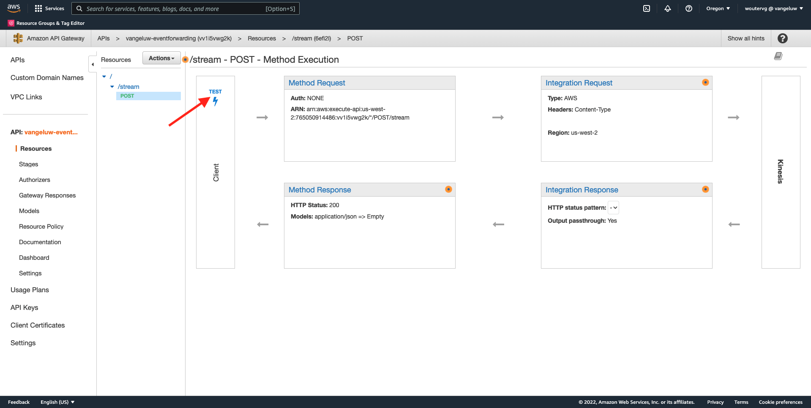

Scroll down, and paste this code under **Request Body**. Click **Test**.

```json
{
  "Data": {
    "message": "Hello World",
    "dynamicPartitioningKey": "v2"
  },
  "PartitionKey": "1",
  "StreamName": "--demoProfileLdap---datastream"
}
```


You'll then see a similar result:


You'll then see this. Click **Actions** and then click **Deploy API**.


For **Deployment stage**, select **New Stage**. As **Stage name**, enter **prod**. Click **Deploy**.


You'll then see this. Click **Save Changes**. FYI: the URL in the image is the URL to use to send data towards (in this example: https://vv1i5vwg2k.execute-api.us-west-2.amazonaws.com/prod).


You can test your setup by using the below cURL request, all you need to do is replace the below URL by yours, `https://vv1i5vwg2k.execute-api.us-west-2.amazonaws.com/prod` in this example, and add `/stream` at the end of the URL.

```json
curl --location --request POST 'https://vv1i5vwg2k.execute-api.us-west-2.amazonaws.com/prod/stream' \
--header 'Content-Type: application/json' \
--data-raw '{
    "Data": {
        "userid": "--demoProfileLdap--@adobe.com",
        "firstName":"--demoProfileLdap--",
        "offerName":"10% off on outdoor gears",
        "offerCode": "10OFF-SPRING",
        "dynamicPartitioningKey": "campaign"
    },
    "PartitionKey": "1",
    "StreamName": "--demoProfileLdap---datastream"
}'
```

Paste the above updated code in a Terminal window, and hit enter. You'll then see this response, similar to the response you could see when testing above.


## 14.5.6 Update your Event Forwarding property

You can now activate to your AWS Kinesis data stream through AWS API Gateway, so you can now send your raw experience events into the AWS ecosystem. Using Real-Time CDP Connections and Event Forwarding, you can now easily enable event forwarding to your newly created AWS API Gateway endpoint. 

### 14.5.6.1 Update your Event Forwarding property: Create a Data Element

Go to [https://experience.adobe.com/#/data-collection/](https://experience.adobe.com/#/data-collection/) and go to **Event Forwarding**. Search your Event Forwarding property and click it to open it.


In the left menu, go to **Data Elements**. Click **Add Data Element**.

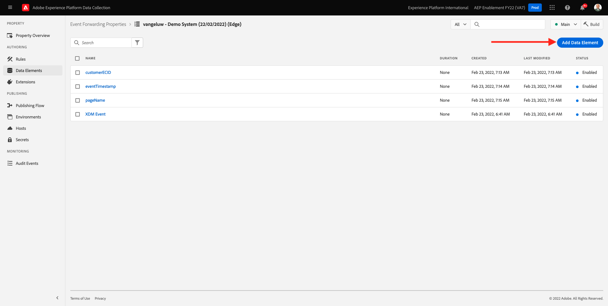

You'll then see a new data element to configure.


Make the following selection:

- As the **Name**, enter **awsDataObject**.
- As the **Extension**, select **Core**.
- As the **Data Element Type**, select **Custom Code**.

You'll now have this. Click **</> Open Editor**.


In the Editor, paste the following code on line 3. Click **Save**.

```javascript
const newObj = {...arc.event.xdm, dynamicPartitioningKey: "event_forwarding"}
return JSON.stringify(newObj);
```


>[!NOTE]
>
>In the above path, a reference is made to **arc**. **arc** stands for Adobe Resource Context and **arc** always stands for the highest available object that is available in the Server Side context. Enrichments and transformations may be added to that **arc** object using Adobe Experience Platform Data Collection Server functions.
>
>In the above path, a reference is made to **event**. **event** stands for a unique event and Adobe Experience Platform Data Collection Server will always evaluate every event individually. Sometimes, you may see a reference to **events** in the payload sent by Web SDK Client Side, but in Adobe Experience Platform Data Collection Event Forwarding, every event is evaluated individually.

You'll then be back here. Click **Save** or **Save to Library**.


### 14.5.6.2  Update your Adobe Experience Platform Data Collection Server property: Update your Rule

In the left menu, go to **Rules**. Click to open the rule **All Pages** which you created in one of the previous exercises.

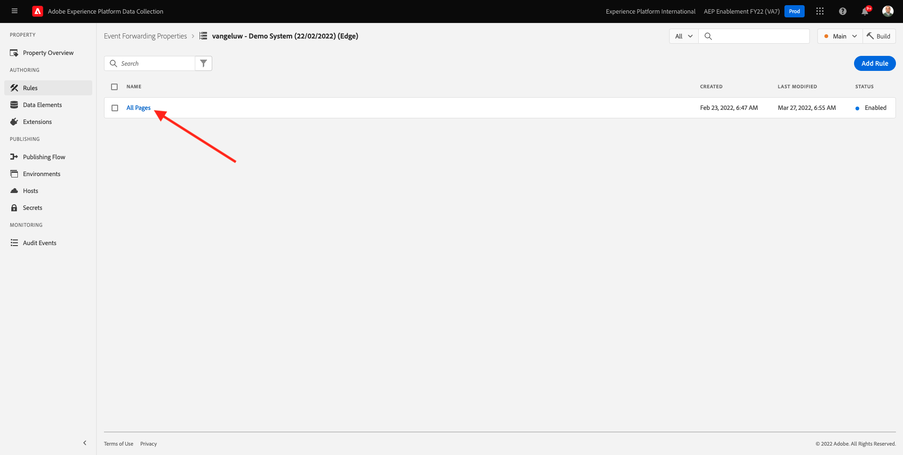

You'll then see this. Click the **+** icon to add a new action.


You'll then see this. Make the following selection:

- Select the **Extension**: **Adobe Cloud Connector**.
- Select the **Action Type**: **Make Fetch Call**.

That should give you this **Name**: **Adobe Cloud Connector - Make Fetch Call**. You should now see this:


Next, configure the following:

- Change the request method from GET to **POST**
- Enter the URL of the AWS API Gateway endpoint you created in one of the previous steps, which looks like this: `https://vv1i5vwg2k.execute-api.us-west-2.amazonaws.com/prod/stream`

You should now have this. Next, go to **Headers**.


Under headers, add a new header with key **Content-Type** and value **application/json**. Next, go to **Body**.


You'll then see this. Paste the following code in the field **Body (Raw)**. Click **Keep Changes**.

```json
{
    "Data":{{awsDataObject}},
    "PartitionKey": "1",
    "StreamName": "--demoProfileLdap---datastream"
}
```


You'll then see be back here. Click **Save** or **Save to Library**.


You've now configured your first rule in an Event Forwarding property. Go to **Publishing Flow** to publish your changes.
Open your Development library by clicking **Main**.


Click the **Add All Changed Resources** button, after which you'll see your Rule and Data Element changes appear in this library. Next, click **Save & Build for Development**. Your changes are now being deployed.


After a couple of minutes, you'll see that the deployment is done and ready to be tested.


## 14.5.7 Test your configuration

Go to [https://builder.adobedemo.com/projects](https://builder.adobedemo.com/projects). After logging in with your Adobe ID, you'll see this. Click your website project to open it.


You can now follow the below flow to access the website. Click **Integrations**.


On the **Integrations** page, you need to select the Data Collection property that was created in exercise 0.1. 


You'll then see your demo website open up. Select the URL and copy it to your clipboard.


Open a new incognito browser window.


Paste the URL of your demo website, which you copied in the previous step. You'll then be asked to login using your Adobe ID.


Select your account type and complete the login process.


You'll then see your website loaded in an incognito browser window. For every demonstration, you'll need to use a fresh, incognito browser window to load your demo website URL.


When you open up your browser Developer View, you can inspect Network requests as indicated below. When you use the filter **interact**, you'll see the network requests that are sent by Adobe Experience Platform Data Collection Client to the Adobe Edge.


If you select the raw payload, go to [https://jsonformatter.org/json-pretty-print](https://jsonformatter.org/json-pretty-print) and paste the payload. Click **Make Pretty**. You'll then see the JSON payload, the **events** object and the **xdm** object. In one of the previous steps, when you defined the Data Element, you used the reference **arc.event.xdm**, which will result in you parsing out the **xdm** object of this payload.


Switch your view to **AWS**. By opening your data stream and going into the **Monitoring** tab, you'll now see incoming traffic.


When you then open your delivery stream and go into the **Monitoring** tab, you'll also see incoming traffic.


Finally, when you have a look at your S3 bucket, you'll now notice files being created there as a consequence of your data ingestion.


When you download such a file and open it using a text editor, you'll see that it contains the XDM payload from the events that were forwarded.

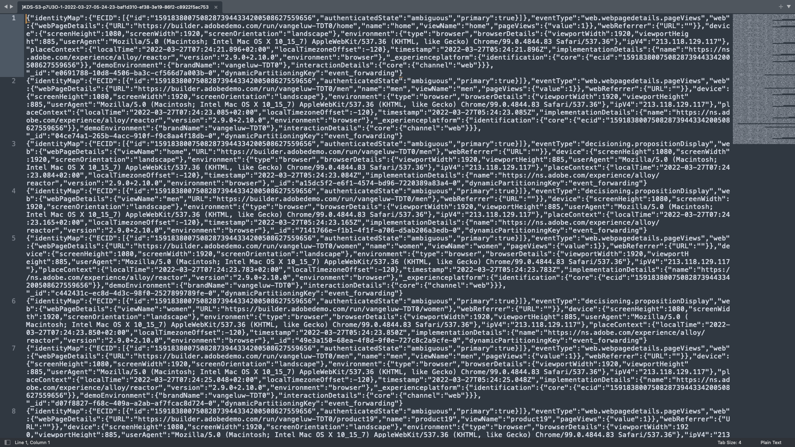

Next Step: [Summary and benefits](./summary.md)

[Go Back to Module 14](./aep-data-collection-ssf.md)

[Go Back to All Modules](./../../overview.md)
