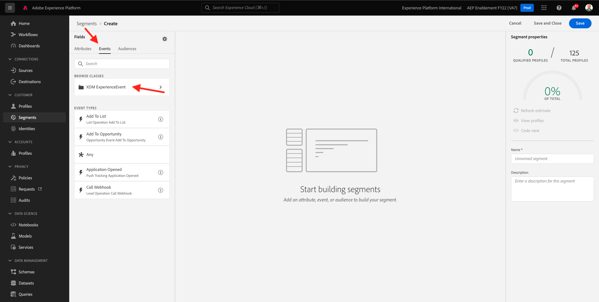

# 6.1 Create a segment

In this exercise, you'll create a segment by making use of Adobe Experience Platform's segment builder.

## 6.1.1 Context

In today's world, responding to a customer's behavior needs to be real-time. One of the ways of responding to customer behavior in real-time is by using a segment, on the condition that the segment qualifies in real-time. In this exercise, you need to build out a segment, taking into account real activity on the website that we've been using.

## 6.1.2 Identify the behavior you want to react to

Go to [https://builder.adobedemo.com/projects](https://builder.adobedemo.com/projects). After logging in with your Adobe ID, you'll see this. Click your website project to open it.

You can now follow the below flow to access the website. Click **Integrations**.

On the **Integrations** page, you need to select the Data Collection property that was created in exercise 0.1. 

You'll then see your demo website open up. Select the URL and copy it to your clipboard.

Open a new incognito browser window.

Paste the URL of your demo website, which you copied in the previous step. You'll then be asked to login using your Adobe ID.

Select your account type and complete the login process.

You'll then see your website loaded in an incognito browser window. For every demonstration, you'll need to use a fresh, incognito browser window to load your demo website URL.

In this example, you want to respond to a specific customer viewing a specific product.
From the **Luma** homepage, go to **Men**, and click the product **PROTEUS FITNESS JACKSHIRT**.

So when somebody visits the product page for **PROTEUS FITNESS JACKSHIRT**, you want to be able to take action. The first thing to do to take action, is define a segment.

## 6.1.3 Create the Segment

Go to [Adobe Experience Platform](https://experience.adobe.com/platform). After logging in, you'll land on the homepage of Adobe Experience Platform.

Before you continue, you need to select a **sandbox**. The sandbox to select is named ``--aepSandboxId--``. You can do this by clicking the text **[!UICONTROL Production Prod]** in the blue line on top of your screen. After selecting the appropriate [!UICONTROL sandbox], you'll see the screen change and now you're in your dedicated [!UICONTROL sandbox].

In the menu on the left side, go to **Segments** and then go to **Browse** where you can see an overview of all existing segments. Click on the **Create Segment** button to start creating a new segment.

As mentioned above, you need to build a segment out of all customers that have viewed the product **PROTEUS FITNESS JACKSHIRT**.

To build out this segment, you need to add an event. You can find all events by clicking on the **Events** icon in the **Segments** menu bar.

Next, you'll see the top level **XDM ExperienceEvent** node.

To find customers that have visited the **PROTEUS FITNESS JACKSHIRT** product, click on **XDM ExperienceEvent**.

Scroll down to **Product List Items** and click it.

Select **Name** and drag and drop the **Name** object from the left **Product List Items** menu onto the segment builder canvas into the **Events** section.

The comparison parameter should be **equals** and in the input field, enter `PROTEUS FITNESS JACKSHIRT`.

Your **Event Rules** should now look like this. Every time you add an element to the segment builder, you can click the **Refresh Estimate** button to get a new estimate of the population in your segment.

Finally, let's give your segment a name and save it.

As a naming convention, use:

- `--demoProfileLdap-- - Interest in PROTEUS FITNESS JACKSHIRT`

Your segment name should look like this:
`vangeluw - Interest in PROTEUS FITNESS JACKSHIRT`

Next, click the **Save and Close** button to save your segment.

You'll now be taken back to the segment overview page.

Next Step: [6.2 Review how to configure DV360 Destination using Destinations](./ex2.md)

[Go Back to Module 11](./real-time-cdp-build-a-segment-take-action.md)

[Go Back to All Modules](../../overview.md)
