# 6.7 Destinations SDK

## 6.7.1 Setup your Adobe I/O Project

>[!IMPORTANT]
>
>If you've created your Adobe I/O project after December 2021, you may reuse that project, skip this exercise and move to exercise 6.7.2 immediately. 
>
>If you created your Adobe I/O project before December 2021, please create a new project to ensure it's compatible with the Destinations Authoring API.

In this exercise you'll be using Adobe I/O quite intensively to query against Platform's APIs. Please follow the below steps to setup Adobe I/O.

Go to [https://developer.adobe.com/console/home](https://developer.adobe.com/console/home)

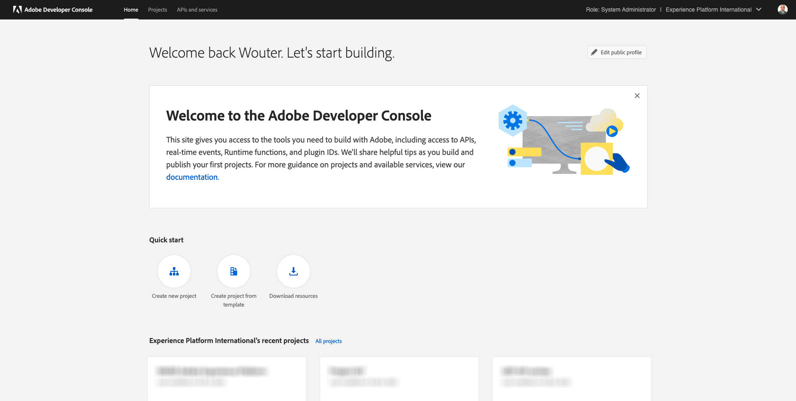

Make sure to select the correct Adobe Experience Platform instance in the top right corner of your screen. Your instance is `--envName--`.


Click **Create new project**.

 or 


Select **+ Add to Project** and select **API**.


You'll then see this:


Click the **Adobe Experience Platform** icon.


Click **Experience Platform API**.


Click **Next**.


You can now choose to either have Adobe I/O generate your security key pair, or upload an existing one. 

Choose **Option 1 - Generate a key pair**.


Click **Generate keypair**.


You'll see a spinner for about 30 seconds.


You'll then see this, and your generated keypair will be downloaded as a zip file: **config.zip**.

Unzip the file **config.zip** on your desktop, you'll see it contains 2 files:


- **certificate_pub.crt** is your Public key certificate. From a security perspective, this is the certificate that is freely used to setup integrations with online applications.
- **private.key** is your Private key. This should never, ever be shared with anyone. The Private Key is what you use to authenticate to your API implementation and is supposed to be a secret. If you share your Private Key with anyone, they can access your implementation and abuse the API to ingest malicious data into Platform and extract all the data that sits in Platform.


Make sure to save the **config.zip** file in a safe location, as you'll need this for the next steps and for future access to Adobe I/O and Adobe Experience Platform APIs.

Click **Next**.


You now have to select the **Product Profile(s)** for your integration. 

Select the required Product Profiles. 

**FYI**: in your Adobe Experience Platform instance, the Product Profiles will have a different naming. You need to select at least one product profile with the proper access rights, which are set up in the Adobe Admin Console.


Click **Save Configured API**.


You'll see a spinner for a couple of seconds.


And next, you'll see your integration.


Click the **Download for Postman** button and then click **Service Account (JWT)** to download a Postman environment (wait until the environment is downloaded, this can take a couple of seconds).


Scroll down until you see **Service Account (JWT)**, which is where you can find all your integration details that are used to configure the integration with Adobe Experience Platform.


Your IO Project currently has a generic name. You need to give a friendly name to your integration. Click on **Project 1** (or similar name) as indicated

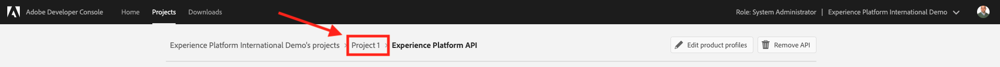

Click **Edit Project**.


Enter a Name and Description for your integration. As a naming convention, we'll use `AEP API --demoProfileLdap--`. Replace ldap with your ldap.
For instance, if your ldap is vangeluw, the name and description of your integration becomes AEP API vangeluw.

Enter `AEP API --demoProfileLdap--` as the **Project Title**. Click **Save**.


Your Adobe I/O integration is now finished.


## 6.7.2 Postman authentication to Adobe I/O

Go to [https://www.getpostman.com/](https://www.getpostman.com/). 

Click on **Get Started**.

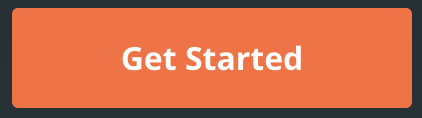

Next, download and install Postman.

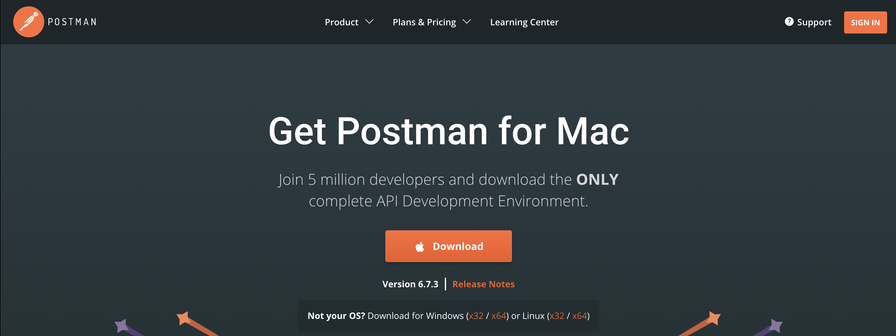

After installation of Postman, start the application.

In Postman, there are 2 concepts: Environments and Collections.

- The Environment contains all of your environmental variables which are more or less consistent. In the Environment, you'll find things like the IMSOrg of our Platform environment, alongside security credentials like your Private Key and others. The environment file is the one you downloaded during the Adobe I/O setup in the previous exercise, it's name like this: **service.postman_environment.json**.
  
- The Collection contains a number of API requests that you can use. We will use 2 collections
  - 1 Collection for Authentication to Adobe I/0
  - 1 Collection for the exercises in this module
  - 1 collection for the exercises in the Real-Time CDP module, for Destination Authoring

Please download the file [postman.zip](../../assets/postman/postman_profile.zip) to your local desktop. 

In this **postman.zip** file, you'll find the following files:

- `_Adobe I-O - Token.postman_collection.json`
- `_Adobe Experience Platform Enablement.postman_collection.json`
- `Destination_Authoring_API.json`
  
Unzip the **postman.zip** file and store these 3 files in a folder on your desktop, together with the downloaded Postman environment from Adobe I/O. You need to have these 4 files in that folder:


Go back to Postman. Click **Import**.


Click **Upload Files**.


Navigate to the folder on your desktop in which you extracted the 4 downloaded files. Select these 4 files at the same time and click **Open**.


After having clicked **Open**, Postman will show you an overview of the Environment and Collections you're about to import. Click **Import**.


You now have everything you need in Postman to start interacting with Adobe Experience Platform through the APIs.

The first thing to do, is to make sure you're properly authenticated. To be authenticated, you need to request an access token.

Make sure that you've got the right Environment selected before executing any request. You can check the currently selected Environment by verifying the Environment-dropdown list in the top right corner. 

The selected Environment should have a name similar to this one:


Click the **eye** icon and then click **Edit** to update the Private Key in the environment file.

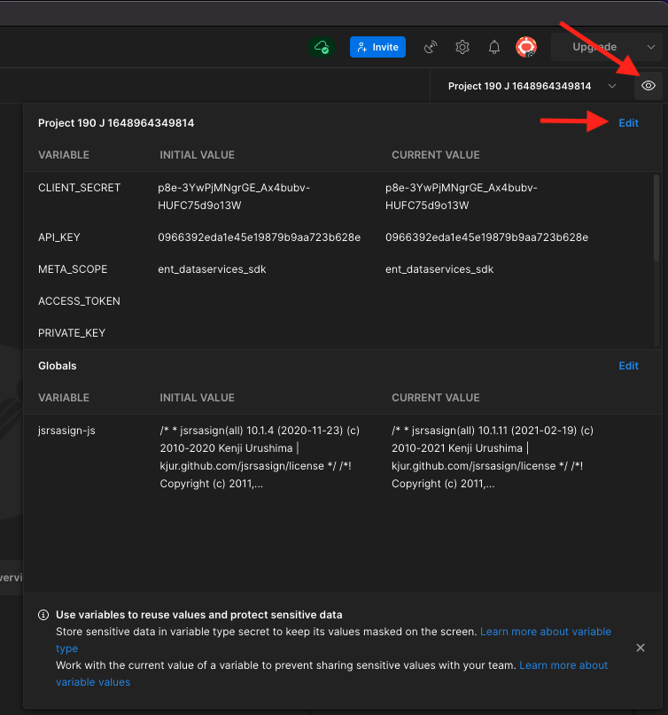

You'll then see this. All fields are pre-populated, except for the field **PRIVATE_KEY**.


The private key has been generated when you created your Adobe I/O Project. It was downloaded as a zip file, named **config.zip**. Extract that zip file to your desktop.


Open the folder **config** and open the file **private.key** with your text editor of choice.


You'll then see something resembling this, copy all the text to your clipboard.


Go back to Postman and paste the private key in the fields next to the variable **PRIVATE_KEY**, for both the columns **INITIAL VALUE** and **CURRENT VALUE**. Click **Save**.


Your Postman environment and collections are now configured and working. You can now authenticate from Postman to Adobe I/O.

To do that, you need to load an external library that will take care of the encryption and decryption of communication. To load this library, you have to execute the request with the name **INIT: Load Crypto Library for RS256**. Select this request in the **_Adobe I/O - Token collection** and you'll see it displayed in the middle of your screen.


Click the blue **Send** button. After a couple of seconds, you should see a response displayed in the **Body** section of Postman:


With the crypto library now loaded, we can authenticate to Adobe I/O.

In the **\_Adobe I/O - Token collection**, select the request with the name **IMS: JWT Generate + Auth**. Again, you'll see the request details displayed in the middle of the screen.


Click the blue **Send** button. After a couple of seconds, you should see a response displayed in the **Body** section of Postman:


If your configuration was successful, you should see a similar response that contains the following information:

| Key     | Value     | 
|:-------------:| :---------------:| 
| token_type          | **bearer** |
| access_token    | **eyJ4NXUiOiJpbXNfbmEx...QT7mqZkumN1tdsPEioOEl4087Dg** | 
| expires_in          | **86399973** |

Adobe I/O has given you a **bearer**-token, with a specific value (this very long access_token) and an expiration window.

The token that we've received is now valid for 24 hours. This means that after 24 hours, if you want to use Postman to authenticate to Adobe I/O, you will have to generate a new token by running this request again.

## 6.7.3 Define endpoint and format

For this exercise, you'll need an endpoint to configure so that when a segment qualifies, the qualification event can be streamed to that endpoint. In this exercise, you'll use a sample endpoint using [https://webhook.site/](https://webhook.site/). Go to [https://webhook.site/](https://webhook.site/), where you'll see something similar to this. Click **Copy to clipboard** to copy the url. You'll need to specify this url in the next exercise. The URL in this example is `https://webhook.site/e0eb530c-15b4-4a29-8b50-e40877d5490a`.

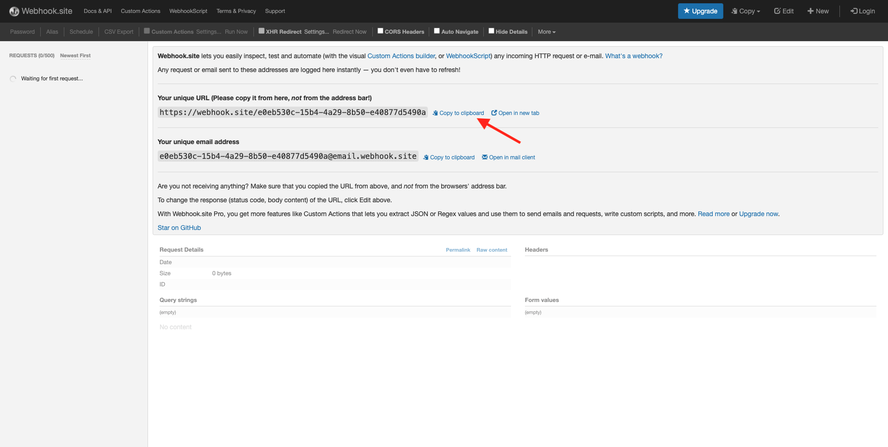

As for the format, we'll use a standard template that will stream segment qualifications or unqualifications along with metadata like customer identifiers. Templates can be customized to meet the expectations of specific endpoints, but in this exercise we'll reuse a standard template, which will result in a payload like this that will be streamed to the endpoint.

```json
{
  "profiles": [
    {
      "identities": [
        {
          "type": "ecid",
          "id": "64626768309422151580190219823409897678"
        }
      ],
      "AdobeExperiencePlatformSegments": {
        "add": [
          "f58c723c-f1e5-40dd-8c79-7bb4ab47f041"
        ],
        "remove": []
      }
    }
  ]
}
```

## 6.7.4 Create a server and template configuration

The first step to create your own Destination in Adobe Experience Platform is to create a server and template configuration.

To do that, go to **Destination Authoring API**, to **Destination servers and templates** and click to open the request **POST - Create a destination server configuration**. You'll then see this. Under **Headers**, you need to manually update the value for the key **x-sandbox-name** and set it to `--aepSandboxId--`. Select the value **{{SANDBOX_NAME}}**.


Replace it by `--aepSandboxId--`.

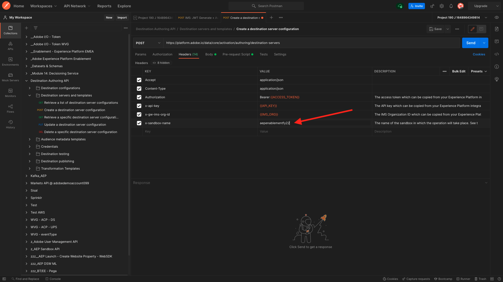

Next, go to **Body**. select the placeholder **{{body}}**.


You now need to replace the placeholder **{{body}}** by the below code:

```json
{
    "name": "Custom HTTP Destination",
    "destinationServerType": "URL_BASED",
    "urlBasedDestination": {
        "url": {
            "templatingStrategy": "PEBBLE_V1",
            "value": "yourURL"
        }
    },
    "httpTemplate": {
        "httpMethod": "POST",
        "requestBody": {
            "templatingStrategy": "PEBBLE_V1",
            "value": "{\n    \"profiles\": [\n    \n        {\n            \"identities\": [\n            \n            \n                \n                {\n                    \"type\": \"{{ namespace }}\",\n                    \"id\": \"{{ identity.id }}\"\n                },\n                ,\n            \n            ],\n            \"AdobeExperiencePlatformSegments\": {\n                \"add\": [\n                \n                    \"{{ segment.key }}\",\n                \n                ],\n                \"remove\": [\n                {#- Alternative syntax for filtering segments by status: -#}\n                \n                    \"{{ segment.key }}\",\n                \n                ]\n            }\n        },\n    \n    ]\n}"
        },
        "contentType": "application/json"
    }
}
```

After pasting the above code, you need to manually update the field **urlBasedDestination.url.value**, and you need to set it to the url of the webhook you created in the previous step, which was `https://webhook.site/e0eb530c-15b4-4a29-8b50-e40877d5490a` in this example.

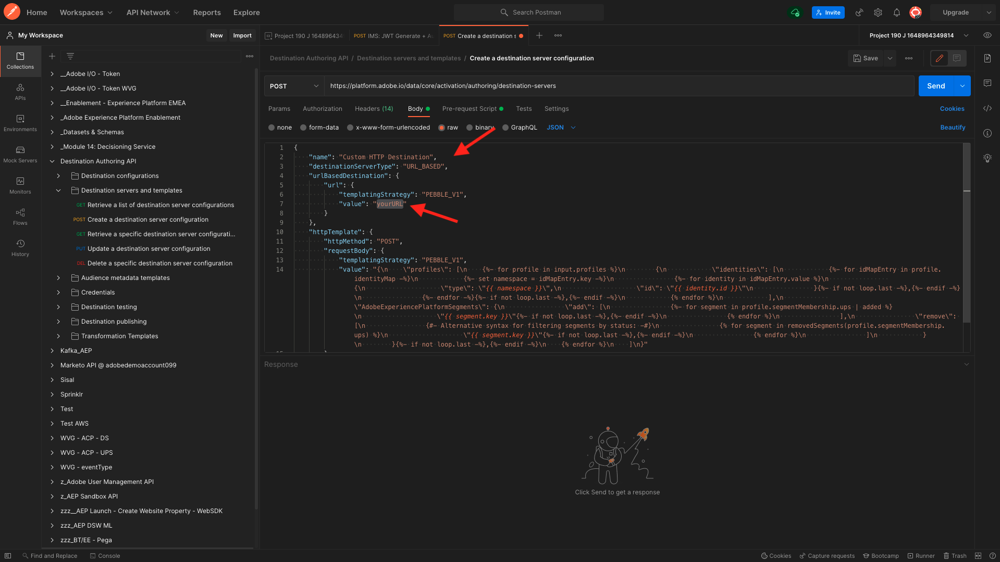

After updating the field **urlBasedDestiantion.url.value**, it should look like this. Click **Send**.


After clicking **Send**, your server template will be created, and as part of the response you'll see a field named **instanceId**. Write it down, as you'll need it in the next step. In this example, the **instanceId** is 
`eb0f436f-dcf5-4993-a82d-0fcc09a6b36c`.


## 6.7.5 Create your destination configuration

In Postman, under **Destination Authoring API**, go to **Destination configurations** and click to open the request **POST - Create a destination configuration**. You'll then see this. Under **Headers**, you need to manually update the value for the key **x-sandbox-name** and set it to `--aepSandboxId--`. Select the value **{{SANDBOX_NAME}}**.


Replace it by `--aepSandboxId--`.


Next, go to **Body**. select the placeholder **{{body}}**.


You now need to replace the placeholder **{{body}}** by the below code:

```json
{
    "name": "--demoProfileLdap-- - Webhook",
    "description": "Exports segment qualifications and identities to a custom webhook via Destination SDK.",
    "status": "TEST",
    "customerAuthenticationConfigurations": [
        {
            "authType": "BEARER"
        }
    ],
    "customerDataFields": [
        {
            "name": "endpointsInstance",
            "type": "string",
            "title": "Select Endpoint",
            "description": "We could manage several instances across the globe for REST endpoints that our customers are provisioned for. Select your endpoint in the dropdown list.",
            "isRequired": true,
            "enum": [
                "US",
                "EU",
                "APAC",
                "NZ"
            ]
        }
    ],
    "uiAttributes": {
        "documentationLink": "https://experienceleague.adobe.com/docs/experience-platform/destinations/home.html?lang=en",
        "category": "streaming",
        "connectionType": "Server-to-server",
        "frequency": "Streaming"
    },
    "identityNamespaces": {
        "ecid": {
            "acceptsAttributes": true,
            "acceptsCustomNamespaces": false
        }
    },
    "segmentMappingConfig": {
        "mapExperiencePlatformSegmentName": true,
        "mapExperiencePlatformSegmentId": true,
        "mapUserInput": false
    },
    "aggregation": {
        "aggregationType": "BEST_EFFORT",
        "bestEffortAggregation": {
            "maxUsersPerRequest": "1000",
            "splitUserById": false
        }
    },
    "schemaConfig": {
        "profileRequired": false,
        "segmentRequired": true,
        "identityRequired": true
    },
    "destinationDelivery": [
        {
            "authenticationRule": "NONE",
            "destinationServerId": "yourTemplateInstanceID"
        }
    ]
}
```

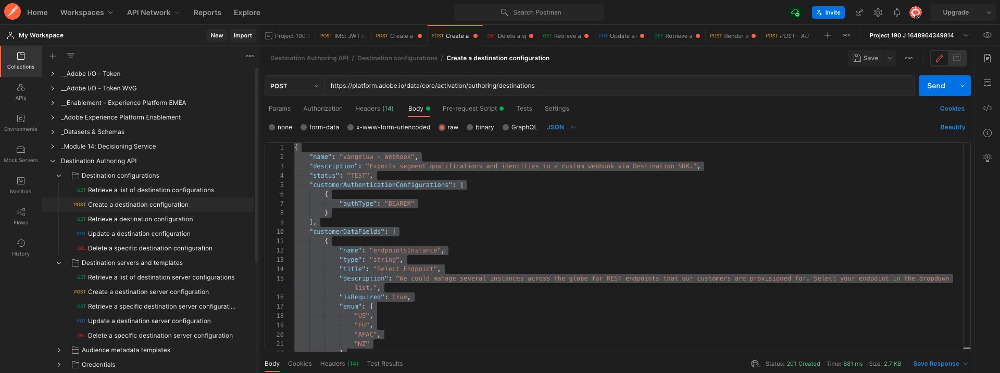

After pasting the above code, you need to manually update the field **destinationDelivery. destinationServerId**, and you need to set it to the **instanceId** of the destination server template you created in the previous step, which was `eb0f436f-dcf5-4993-a82d-0fcc09a6b36c` in this example. Next, cick **Send**.


You'll then see this response.


Your destination is now created in Adobe Experience Platform. Let's go there and check it.

Go to [Adobe Experience Platform](https://experience.adobe.com/platform). After logging in, you'll land on the homepage of Adobe Experience Platform.


Before you continue, you need to select a **sandbox**. The sandbox to select is named ``--aepSandboxId--``. You can do this by clicking the text **[!UICONTROL Production Prod]** in the blue line on top of your screen. After selecting the appropriate [!UICONTROL sandbox], you'll see the screen change and now you're in your dedicated [!UICONTROL sandbox].


In the left menu, go to **Destinations**, click **Catalog** and scroll down to the category **Streaming**. You'll see your destination avaiable there now.

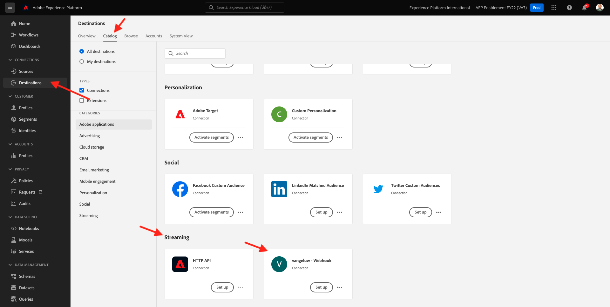

## 6.7.6 Link your segment to your destination

In **Destinations** > **Catalog**, click **Set up** on your destination to start adding segments to your new destination.


Enter a dummy bearer token, like **1234**. Click **Connect to destination**.


You'll then see this. As a name for your destination, use `--demoProfileLdap-- - Webhook`. Select an endpoint of choice, in this example **EU**. Click **Next**.


You can optionally select a data governance policy. Click **Next**.


Select the segment you created earlier, which is named `--demoProfileLdap-- - Interest in PROTEUS FITNESS JACKSHIRT`. Click **Next**.

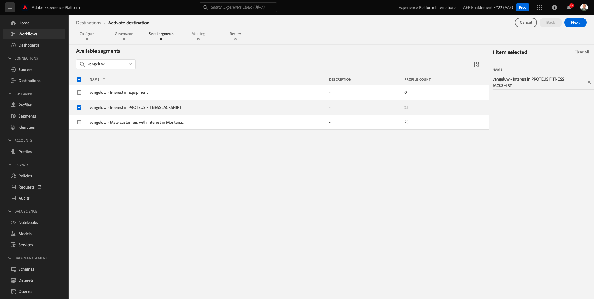

You'll then see this. Make sure to map the **SOURCE FIELD** `--aepTenantId--.identification.core.ecid` to the field `Identity: ecid`. Click **Next**.


Click **Finish**.


Your destination is now live, new segment qualifications will be streamed to your custom webhook now.

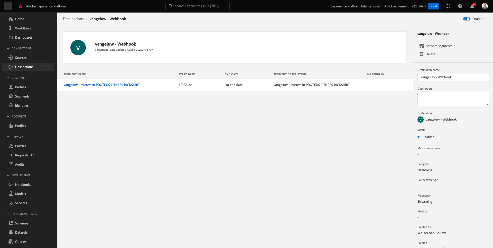

## 6.7.7 Test your segment activation

Go to [https://builder.adobedemo.com/projects](https://builder.adobedemo.com/projects). After logging in with your Adobe ID, you'll see this. Click your website project to open it.


You can now follow the below flow to access the website. Click **Integrations**.


On the **Integrations** page, you need to select the Data Collection property that was created in exercise 0.1. 


You'll then see your demo website open up. Select the URL and copy it to your clipboard.


Open a new incognito browser window.


Paste the URL of your demo website, which you copied in the previous step. You'll then be asked to login using your Adobe ID.


Select your account type and complete the login process.


You'll then see your website loaded in an incognito browser window. For every demonstration, you'll need to use a fresh, incognito browser window to load your demo website URL.


From the **Luma** homepage, go to **Men**, and click the product **PROTEUS FITNESS JACKSHIRT**.


You've now visited the product page for **PROTEUS FITNESS JACKSHIRT**, which means you'll now qualify for the segment that you created earlier in this exercise.


When you open the Profile Viewer, and go to **Segments**, you'll see the segment qualify.


Now go back to your open webhook on [https://webhook.site/](https://webhook.site/), where you should see a new incoming request, which originates from Adobe Experience Platform and which contains the segment qualification event.


Next Step: [Summary and benefits](./summary.md)

[Go Back to Module 6](./real-time-cdp-build-a-segment-take-action.md)

[Go Back to All Modules](../../overview.md)
