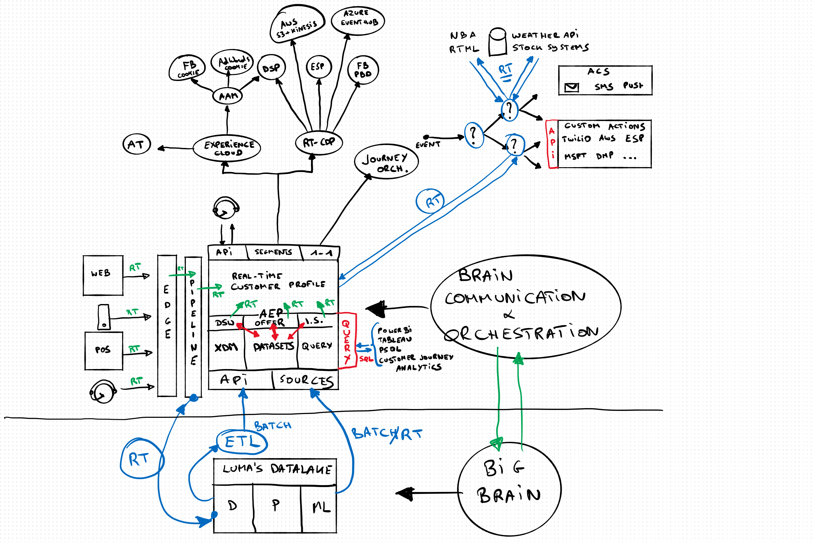
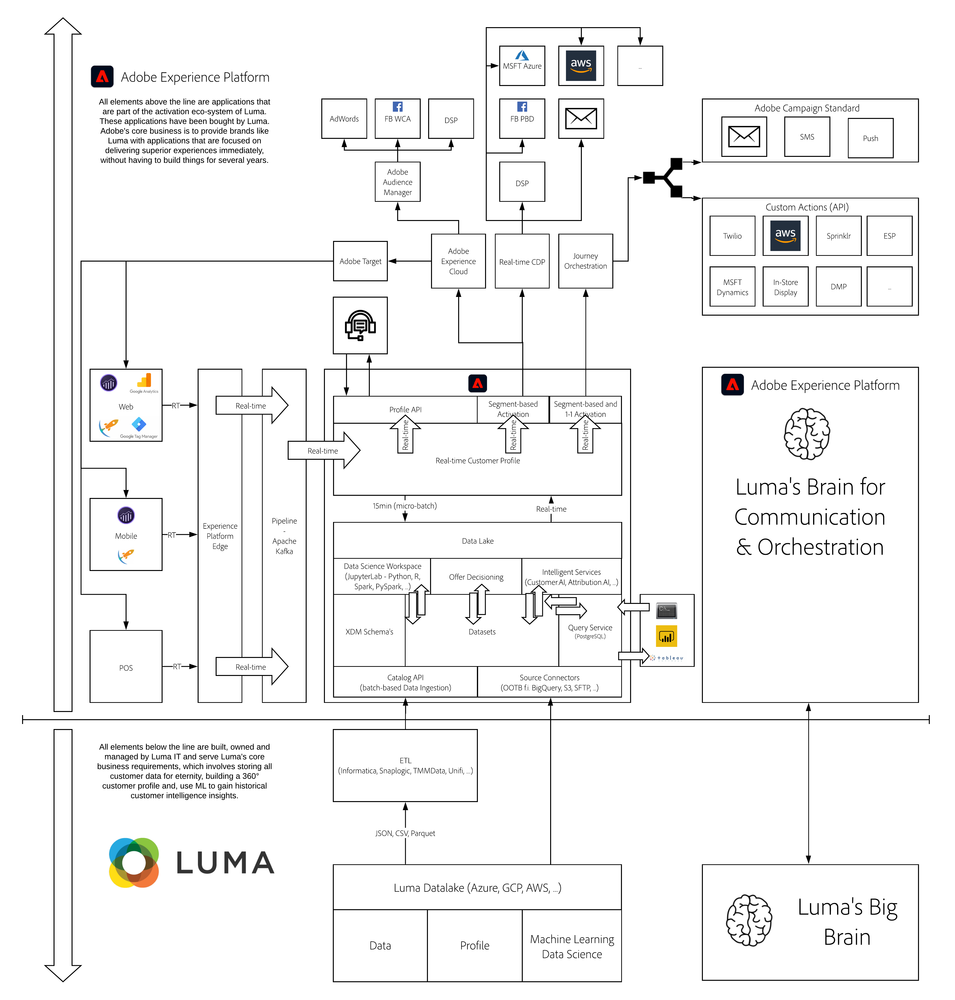

# Architecture

**Author: [Wouter Van Geluwe](https://www.linkedin.com/in/woutervangeluwe/)**

## Learning Objectives

- Learn how to describe the architecture behind Adobe Experience Platform and this tutorial
- Understand the positioning of Adobe Experience Platform in your organization's ecosystem.

## Prerequisites

- No prerequisites

## Introduction Video

>[!VIDEO](https://video.tv.adobe.com/v/35266?quality=12&learn=on)

## Architecture Overview

Here's the image of the whiteboard as you've seen it being created in the above video:

And here's the link to the Lucidchart document which you can copy and reuse if desired:

[Lucidchart Architecture](https://bit.ly/3flr2Nc)

[Go Back to All Modules](./overview.md)
