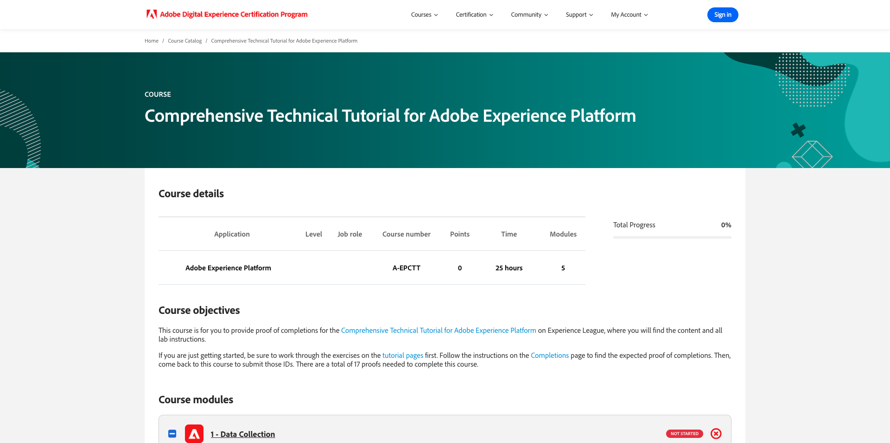

# How is Completion Measured?

Go to [https://certification.adobe.com/courses/1258](https://certification.adobe.com/courses/1258).

To complete a module, you're expected to provide a proof of completion.

Below are the expected proofs of completion for every module.

## Getting Started

The expected proof of completion for module **Getting Started** is the ID of the Demo System project for web that you created.

The ID of the Demo System project for web format looks like this: `--aepUserLdap-- - QIMU`.

## 1.1 Adobe Experience Platform Data Collection and the Web SDK extension

The expected proof of completion for module **Data Collection & Web SDK** is the **Environment ID** of the Data Collection property for web.

The Environment ID of the Data Collection property for web format looks like this: `EN5211f7792b4442f8a45deb68f8902d3a`.

## 1.2 Data Ingestion

The expected proof of completion for module **Data Ingestion** is the Dataflow ID for the Data Landing Zone Source connection.

The Dataflow ID looks like this: **374c2c6d-f39a-4b0b-b568-40c41e6c4e8e**.

## 1.3 Federated Audience Composition

The expected proof of completion for module **Federated Audience Composition** is the ID of the Federated Data Model that you created. 

The ID of the Federated Data Model looks like this: **DMO5110** and can be taken from the URL as indicated in the below image.

## 2.1 Real-time Customer Profile

The expected proof of completion for module **Real-Time Customer Profile** is the **Audience ID** of the audience that you created through the UI, `--aepUserLdap-- - Male customers with interest in iPhone 15 Pro`.

The Audience ID looks like this: **81a9acbe-12e6-424b-b658-abba3a435c83**.

## 2.2 Intelligent Services

The expected proof of completion for module **Intelligent Services** is the **Audience ID** of the audience that you created through the UI, `--aepUserLdap-- - Customer AI High Propensity`.

The Audience ID looks like this: **cb6db21d-8fa3-484a-93ac-25aa1ab48412**.

## 2.3 Real-Time CDP: Build an audience and take action!

The expected proof of completion for module **Real-Time CDP: Build an audience and take action!** is the ID of your **Destinations SDK Webhook destination**.

The ID of your webhook destination looks like this: **b5b4b959-3166-40e2-8279-8223d00c3987** and can be taken from the URL as indicated in the below image.

## 2.4 Real-Time CDP: Audience Activation to Microsoft Azure Event Hub

The expected proof of completion for module **Real-Time CDP: Audience Activation to Microsoft Azure Event Hub** is the ID of your **Microsoft Azure Event Hub** destination in Adobe Experience Platform.

You can find the **Microsoft Azure Event Hub Destination ID**, which looks like this **43cf85bc-3d01-49fd-80c9-a2913db45e3c**, in the URL as indicated below:

## 2.5 Real-Time CDP Connections: Event Forwarding

The expected proof of completion for module **Real-Time CDP Connections: Event Forwarding** is your **Event Forwarding Property ID**.

You can find the **Event Forwarding Property ID**, which looks like this **PRa18819171c1241dfb16d74a49993dd5b**, in the URL as indicated in the below image:

## 2.6 Stream data from Apache Kafka into Real-Time CDP 

The expected proof of completion for module **Stream data from Apache Kafka into Real-Time CDP** is the ID of your source connector `--aepUserLdap-- - Kafka`.

The ID looks like this **f843d50a-ee30-4ca8-a766-0e4f3d29a2f7**, and you can find it here:

## 3.1 Adobe Journey Optimizer: Orchestration

The expected proof of completion for module **Adobe Journey Optimizer: Orchestration** is the ID if the journey you created.

The ID of the journey looks like this, **594fa01f-1a3b-450c-ba09-b7e3ff377c0f**, and can be taken from the URL as indicated in the below image.

## 3.2 Adobe Journey Optimizer: External data sources and custom actions

The expected proof of completion for module **Adobe Journey Optimizer: External data sources and custom actions** is the ID of the journey you created.

The ID of the journey looks like this: **6962d3bc-4f44-4f9c-b326-83978f245f2a**, and can be taken from the URL as indicated in the below image.

## 3.3 Adobe Journey Optimizer: Offer Decisioning

The expected proof of completion for module **Adobe Journey Optimizer: Offer Decisioning** is the ID of the **Decision** that you created.

You can find the **Decision ID**, which looks like this **dps:offer-activity:1a08ba4b529b2fb2**, here:

## 3.4 Adobe Journey Optimizer: Event-based Journeys 

The expected proof of completion for module **Adobe Journey Optimizer: Event-based Journeys** is the ID of the journey you created.

The ID of the journey looks like this: **5f5efc7e-49f7-44c1-85df-b23482b38d32**, and can be taken from the URL as indicated in the below image.

## 4.1 Customer Journey Analytics: Build a dashboard using Analysis Workspace

The expected proof of completion for module **Customer Journey Analytics: Build a dashboard using Analysis Workspace** is the ID of your project `--aepUserLdap-- - Omnichannel Analysis`.

The format looks like this: **677bcb247064db3c7de2a0e4**, you can find it in the URL when you've opened your project.

## 4.2 Customer Journey Analytics: Ingest and Analyze Google Analytics data in Adobe Experience Platform with the BigQuery Source Connector

The expected proof of completion for module **Customer Journey Analytics: Ingest and Analyze Google Analytics data in Adobe Experience Platform with the BigQuery Source Connector** is the ID of your **BigQuery**-source connection.

You can find the **BigQuery Connection ID**, which looks like this **b63a810c-a8cc-4c6b-a57e-dcb7e3368cf8**, here:

## 5.1 Query Service

The expected proof of completion for module **Query Service** is the Dataset ID for your `--aepUserLdap--_callcenter_interaction_analysis` - dataset that you get after completing the module.

The ID looks like this: **675033c903fb3b2aefed8a0a**.

{width="50px" align="left"}

>[!NOTE]
>
>If you have questions, want to share general feedback of have suggestions on future content, please contact Tech Insiders directly, by sending an email to **techinsiders@adobe.com**.

[Go Back to All Modules](./overview.md)