# How is Completion Measured?

Go to [https://certification.adobe.com](https://certification.adobe.com) and navigate to the course **XXX**.

To complete a module, you're expected to provide a proof of completion.

Below are the expected proofs of completion for every module.

## Getting Started

The expected proof of completion for module **Getting Started** is the ID of the Demo System project for web that you created.

The ID of the Demo System project for web format looks like this: `--demoProfileLdap-- - OCUC`.

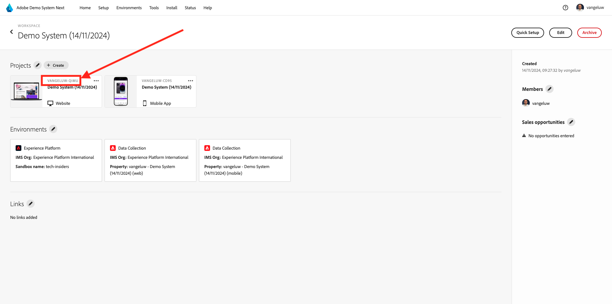

## 1.1 Adobe Experience Platform Data Collection and the Web SDK extension

The expected proof of completion for module **Data Collection & Web SDK** is the name of the Data Collection property for web.

The name of the Data Collection property for web format looks like this: `--demoProfileLdap-- - Demo System (05/02/2022) (enablement) 1644046719474`.

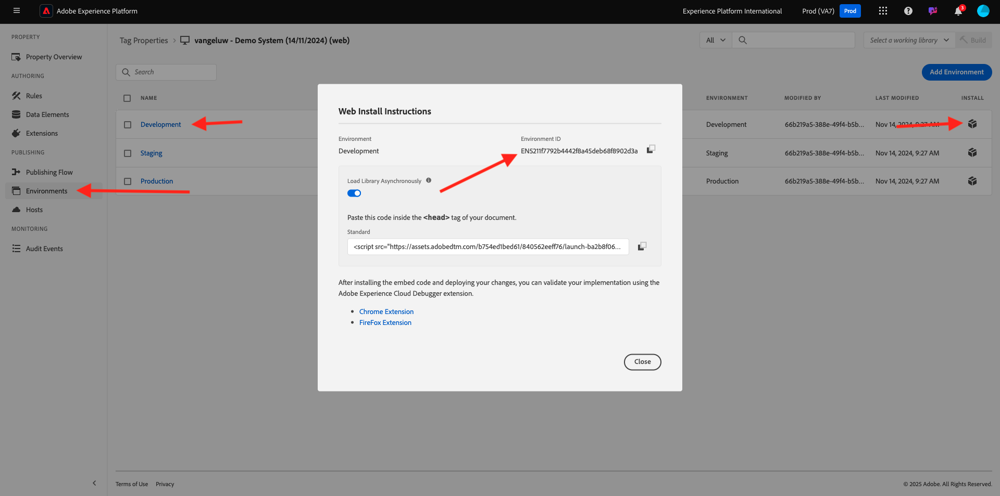

## 1.2 Data Ingestion

The expected proof of completion for module **Data Ingestion** is the Dataset ID for the 2 datasets that you created.

The Dataset ID format looks like this: **5f069724723ef41916a8b5d2**.

`--demoProfileLdap-- - Demo System - Event Dataset for Website`

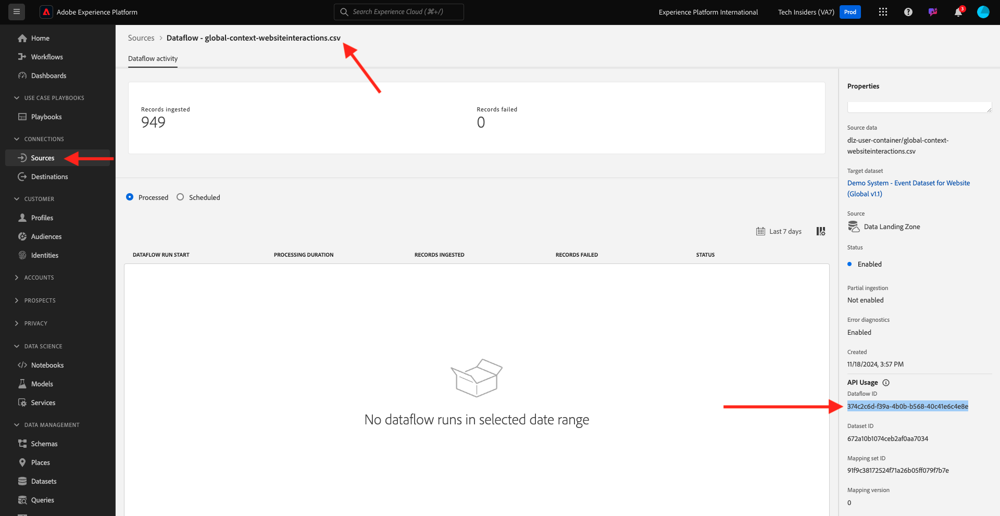

`--demoProfileLdap-- - Demo System - Profile Dataset for Website`

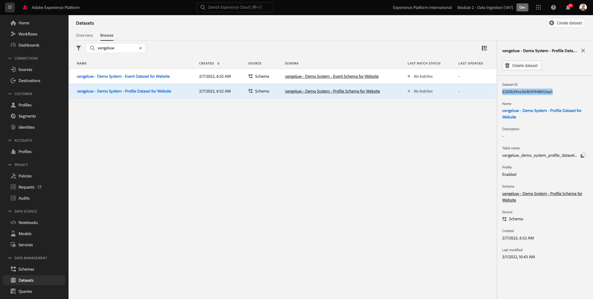

## 1.3 Federated Audience Composition

The expected proof of completion for module **Federated Audience Composition** is...

## 2.1 Real-time Customer Profile

The expected proof of completion for module **Real-Time Customer Profile** is the **Segment ID** of the segment that you created through the UI, `--demoProfileLdap-- - Male customers with interest in Montana Wind Jacket`.

The Segment ID format looks like this: **8cb7034d-d4ae-4d26-a61f-a76559c12457**.

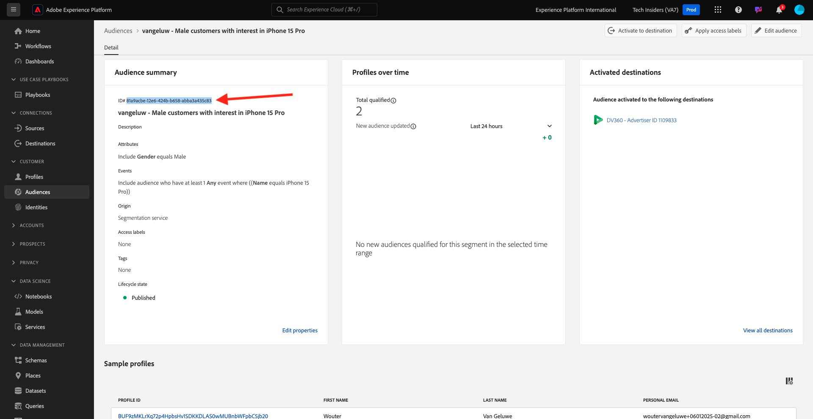

## 2.2 Intelligent Services

The expected proof of completion for module **Intelligent Services** is the ID for your **Product Purchase Propensity Customer AI Service**.

The format looks like this: **12729** and you can retrieve it from the URL when having opened your service.

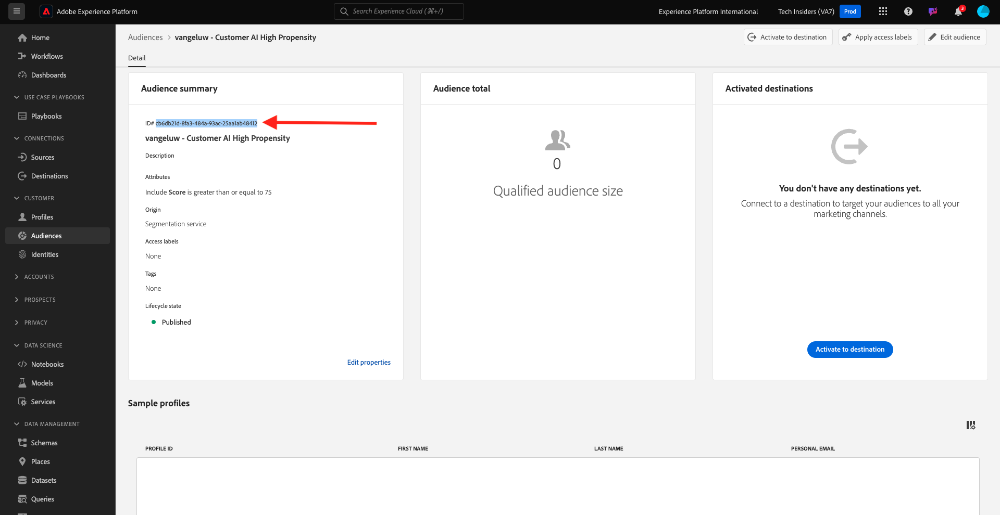

## 2.3 Real-Time CDP: Build an audience and take action!

The expected proof of completion for module **Real-Time CDP** is the ID of your **Adobe Target Activity**.

The format looks like this: **111804**.

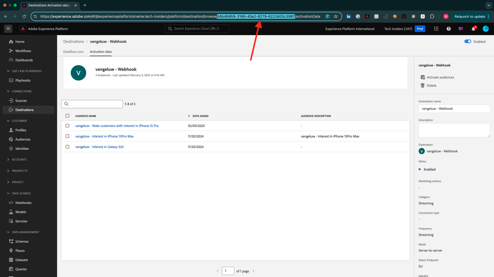

## 2.4 Real-Time CDP: Audience Activation to Microsoft Azure Event Hub

The expected proof of completion for module **RTCDP: EventHub** is the ID of your **Microsoft Azure Event Hub** destination in Adobe Experience Platform.

You can find the **Microsoft Azure Event Hub Destination ID**, which looks like this **fa3f7ce5-86fd-4096-bf7c-e586fdc096ba**, here:

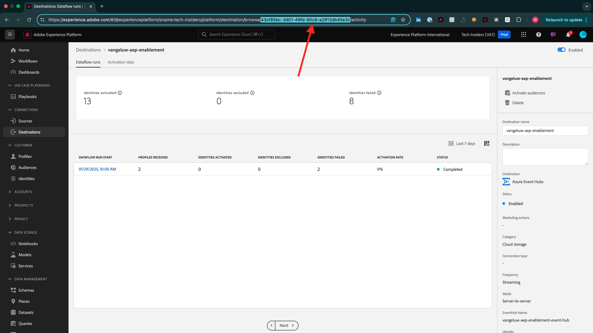

## 2.5 Real-Time CDP Connections: Event Forwarding

The expected proof of completion for module **RTCDP Connections** is your **Event Forwarding Property ID**.

You can find the **Event Forwarding Property ID**, which looks like this **PR40f44184c888472e9c19d8d602aab0de**, here:

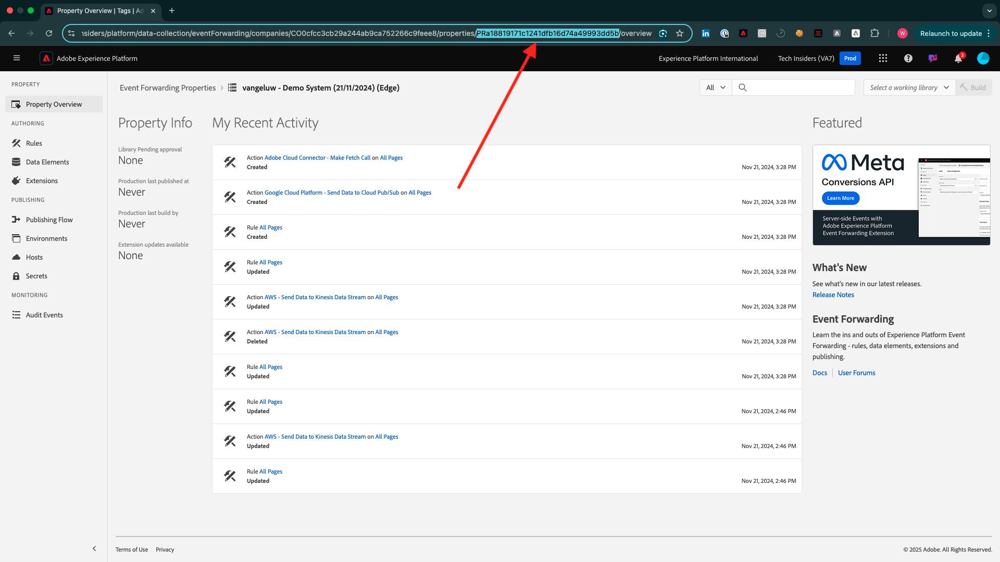

## 2.6 Stream data from Apache Kafka into Real-Time CDP 

The expected proof of completion for module **Apache Kafka** is the ID of your source connector `--demoProfileLdap-- - Kafka`.

The ID looks like this **f843d50a-ee30-4ca8-a766-0e4f3d29a2f7**, and you can find it here:

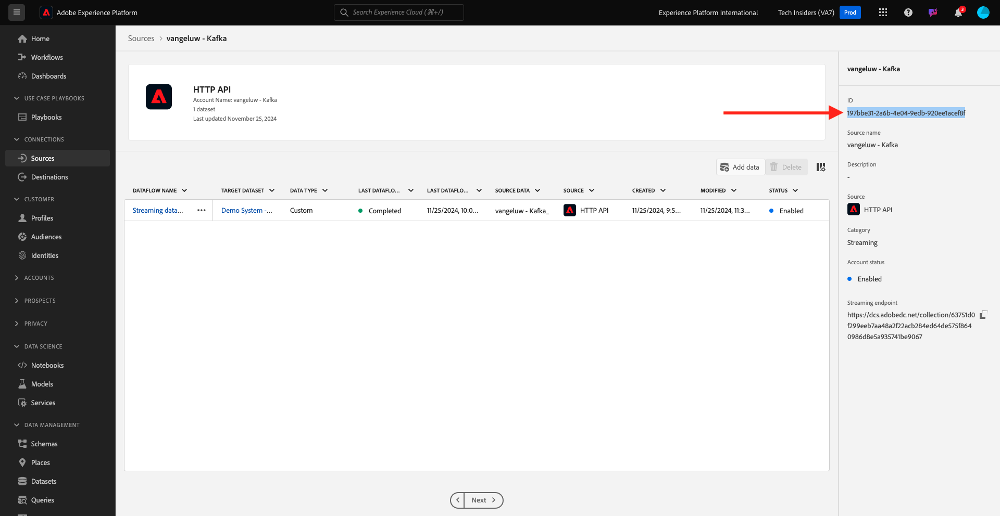

## 3.1 Adobe Journey Optimizer: Orchestration

The expected proof of completion for module **AJO: Orchestration** is the eventID for your `--demoProfileLdap--AccountCreationEvent`.

The format looks like this: **227402c540eb8f8855c6b2333adf6d54d7153d9d7d56fa475a6866081c574736**.

## 3.2 Adobe Journey Optimizer: External data sources and custom actions

The expected proof of completion for module **AJO: Custom Actions** is the eventID for your event `--demoProfileLdap--GeofenceEntry`.

The format looks like this: **fa42ab7982ba55f039eacec24c1e32e5c51b310c67f0fa559ab49b89b63f4934**.

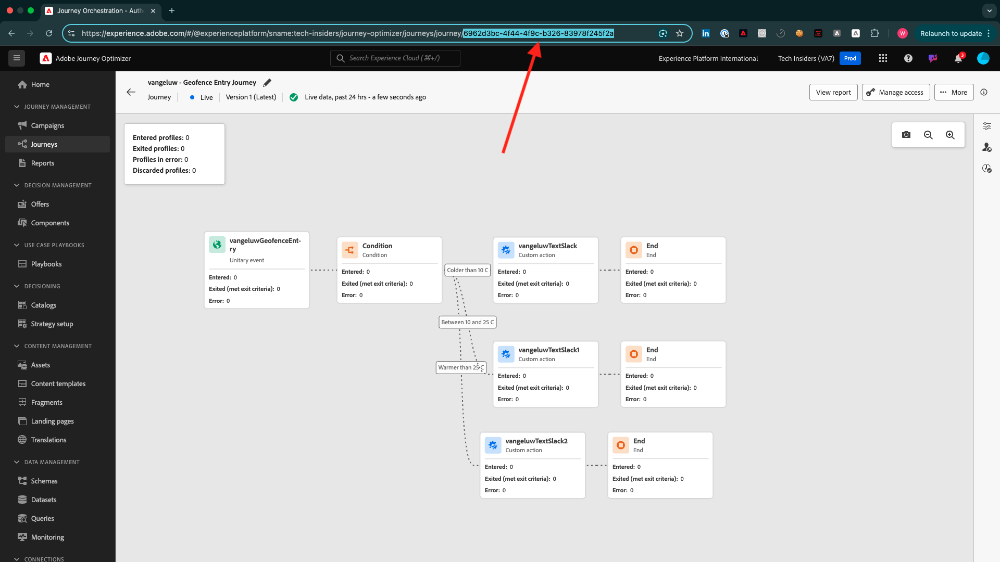

## 3.3 Adobe Journey Optimizer: Offer Decisioning

The expected proof of completion for module **AJO: Offers** is the ID of the **Offer Decision** that you created.

You can find the **Offer Decision ID**, which looks like this **xcore:offer-activity:1122fcc4603ea499**, here:

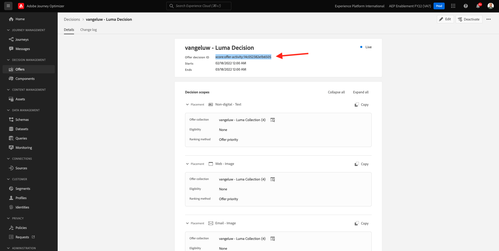

## 3.4 Adobe Journey Optimizer: Event-based Journeys 

The expected proof of completion for module **AJO: Events** is the eventID for your `--demoProfileLdap--StoreEntryEvent`.

The format looks like this: **e3a8f0bdc0b609667cd96a72a6b1e5aafa0ddaf6ccf121c574e6a2030860a633**.

## 4.1 Customer Journey Analytics: Build a dashboard using Analysis Workspace

The expected proof of completion for module **CJA** is the ID of your project `--demoProfileLdap-- - Omnichannel Analysis`.

The format looks like this: **6217344f6249ac70c726db60**, you can find it in the URL when you've opened your project.

## 4.2 Customer Journey Analytics: Ingest and Analyze Google Analytics data in Adobe Experience Platform with the BigQuery Source Connector

The expected proof of completion for module **CJA: BigQuery** is the ID of your **BigQuery**-connection.

You can find the **BigQuery Connection ID**, which looks like this **85a2394d-8b94-410c-a239-4d8b94b10c38**, here:

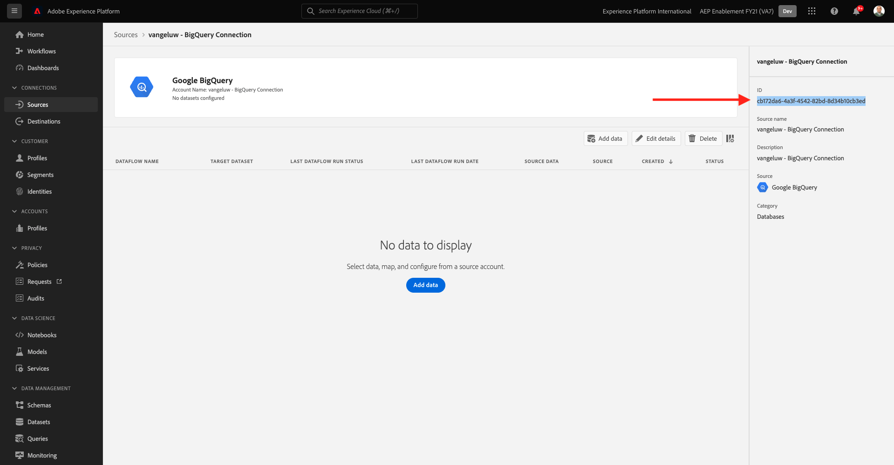

## 5.1 Query Service

The expected proof of completion for module **Query Service** is the Dataset ID for your `--demoProfileLdap--_callcenter_interaction_analysis` - dataset that you get after completing the module.

The format looks like this: **62076f68f14a9d194995d4e2**.

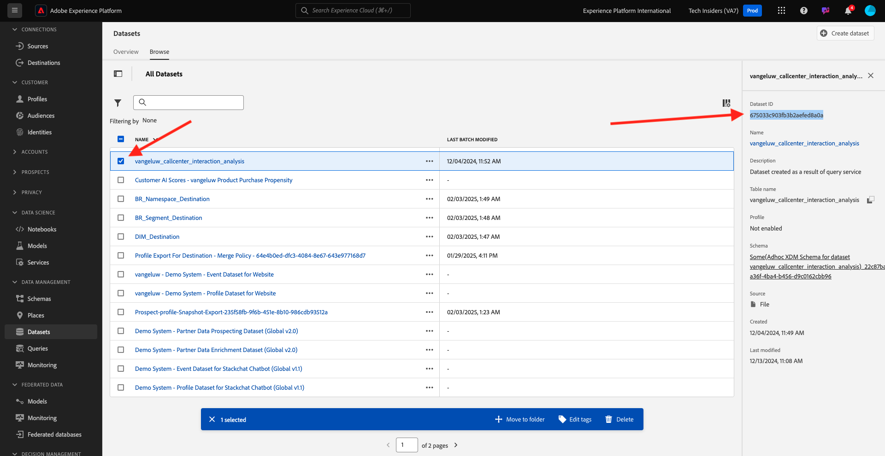

[Go Back to All Modules](./overview.md)
