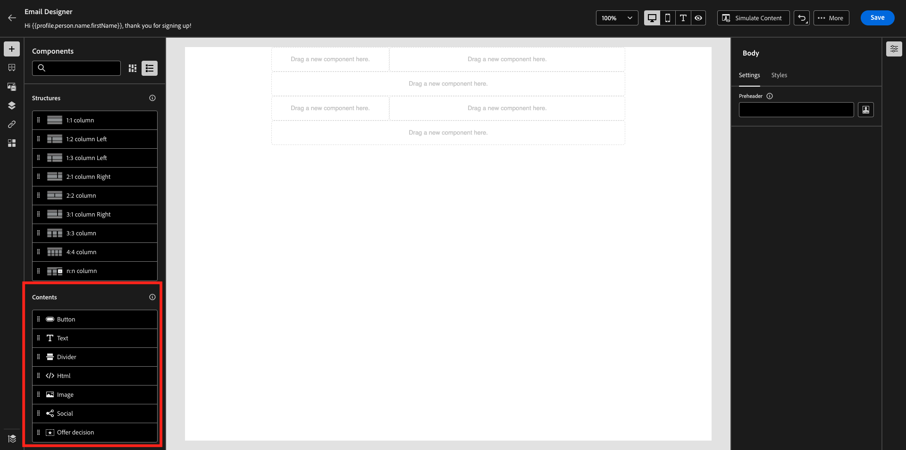
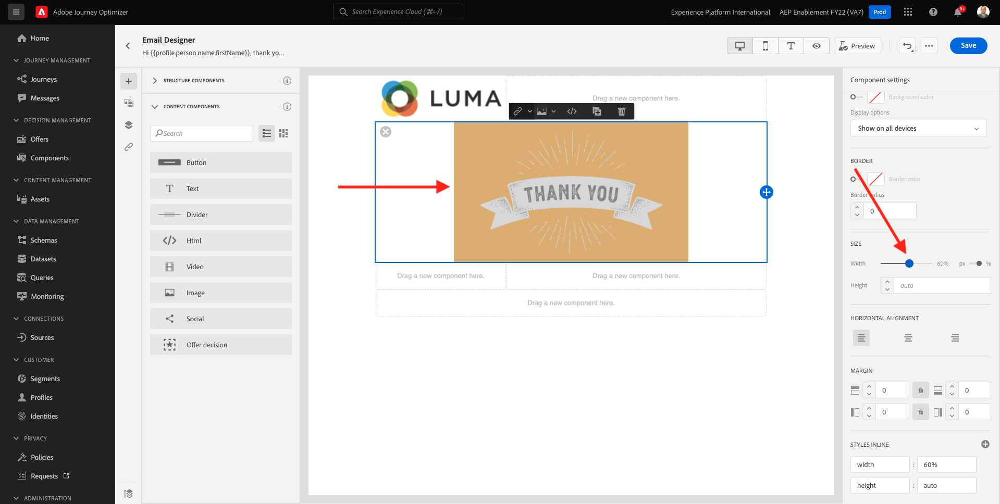

# 3.1.2 Create your journey and email message

In this exercise, you'll configure the journey and the message that needs to be triggered when someone creates an account on the demo website.

Login to Adobe Journey Optimizer by going to [Adobe Experience Cloud](https://experience.adobe.com). Click **Journey Optimizer**.

You'll be redirected to the **Home**  view in Journey Optimizer. First, make sure you're using the correct sandbox. The sandbox to use is called `--aepSandboxName--`.

## Create your journey

In the left menu, click **Journeys**. Next, click **Create Journey** to create a new journey.

 

You'll then see an empty journey screen.

In the previous exercise, you created a new **Event**. You named it like this `--aepUserLdap--AccountCreationEvent` and replaced `ldap` with your ldap. This was the result of the Event creation:

You now need to take this event as the start of this Journey. You can do this by going to the left side of your screen and searching for your event in the list of events.

Select your event, drag and drop it on the Journey canvas. Your Journey now looks like this:

As the second step in the journey, you need to add a short **Wait** step. Go to the left side of your screen to the **Orchestration** section to find this. You'll be using profile attributes and need to make sure they are populated into the Real-time Customer Profile.

Your journey now looks like this. On the right side of the screen you need to configure the wait time. Set it to 1 minute. This will give plenty of time for the profile attributes to be available after the event fires. Click **Save** to save your changes.

As the third step in the journey, you need to add an **Email** action. Go to the left side of your screen to **Actions**, select the **Email** action, then drag and drop it on the second node in your journey. You now see this.

Set the **Category** to **Marketing** and select an email configuration that enables you to send email. In this case, the email configuration to select is **Email**. Ensure that the checkboxes for **Clicks on email** and **email opens** are both enabled.

## Create your message

To create your message, click **Edit content**.

You now see this.

Click the **Open personalization dialog** icon.

Write the text `Hi `. Next you need to bring in the personalization token for the field **First name** which is stored under `profile.person.name.firstName`. In the left menu, navigate to find the **Person > Full Name > First Name** field and click on the **+** icon. You'll then see the personalization token appear in the text field.

Next, add the text **, thank you for signing up!**. Click **Save**.

You'll then be back here. Click **Edit email body** to create the email's content. 

In the next screen you will be prompted with 3 different methods to provide the email's content:

- **Design from scratch**: Start with a blank canvas and use the WYSIWYG-editor to drag and drop structure and content components to visually build up the email's content.
- **Code your own**: Create your own email template by coding it using HTML
- **Import HTML**: Import an existing HTML template, which you'll be able to edit.

Click **Design from scratch**.

In the left menu, you'll find the structure components that you can use to define the structure of the email (rows and columns).

Drag and drop a **1:2 column Left** from the menu into the canvas. This will be the placeholder for the logo image.

Drag and drop a **1:1 column** underneath the previous component. This will be the banner block.

Drag and drop a **1:2 column Left** underneath the previous component. This will be the actual content with an image on the left side and text on the right side.

Next, drag and drop a **1:1 column** underneath the previous component. This will be email's footer. Your canvas should now look like this:

Next, let's use Content Components to add content inside these blocks. 

Drag and drop an **Image** component in the first cell on the first row. Click **Browse**.

 -

You'll then see this. Navigate to the folder **enablement-assets** and select the file **luma-logo.png**. Click **Select**.

You're now back here:

Go to **Content Components** and drag and drop an **Image** component in the first cell on the first row. Click **Browse**.

In the **Assets** pop-up, go to the **enablement-assets** folder. In this folder, you'll find all assets previously prepared and uploaded by the creative team. Select **module23-thankyou-new.png** and click **Select**. 

You'll then have this:

Select your image and in the right menu, scroll down until you see the **Size** width slider component. Use the slider to change the width to f.i. **60%**.

Next, go to **Content Components** and drag and drop a **Text** component in the structure component on the fourth row. 

Select the default text **Please type your text here.** as you would do with any text editor. Write **Dear** instead. Notice the text toolbar displayed when you are in text mode.

In the toolbar click the **Add personalization** icon.

Next, you need to bring the **First name** personalization token which is stored under `profile.person.name.firstName`. In the menu, find the **Person** element, drill down to the **Full Name** element, and then click the **+** icon to add the First Name field onto to expression editor.

Click **Save**.

You'll now notice how the personalization field has been added to your text. 

In the same text field, hit **Enter** twice to add two lines and write **Thank you for creating your account with Luma!**.

The final check to perform to ensure your email is ready is to preview it, click on the **Simulate Content** button.

Start by identifying which profile you want to use for the preview. Select the **email** namespace by clicking on the icon next to **Enter identity namespace** field.

In the list of identity namespaces, select the **Email** namespace.

In the **Identity value** field, enter the email address of a previous demo profile that is already stored in the Real-time Customer Profile. For example **woutervangeluwe+06022022-01@gmail.com** and click on the **Find Test Profile** button

Once your profile shows up in the table, click on the **Preview** tab to access the preview screen.

When the preview is ready, validate that the personalization is correct in the subject line, the body text as well as the unsubscription link is highlighted as an hyperlink.

Click **Close** to close the preview.

Click **Save** to save your message.

Go back to the message dashboard by clicking the **arrow** next to the subject line text in the top-left corner.

You've now completed creating your registration email. Click the arrow in the top left corner to go back to your journey.

Click **Ok**.

## Publish your journey

You still need to give your journey a Name. You can do that by clicking the **Properties** icon in the top right side of your screen.

You can then enter the journey's name here. Please use `--aepUserLdap-- - Account Creation Journey`. Click **OK** to save your changes.

You can now publish your journey by clicking **Publish**.

Click **Publish** again.

You'll then see a green confirmation bar saying that your journey is now Published.

You've now finished this exercise.

Next Step: [3.1.3 Update your Data Collection property and test your journey](./ex3.md)

[Go Back to Module 3.1](./journey-orchestration-create-account.md)

[Go Back to All Modules](../../../overview.md)
