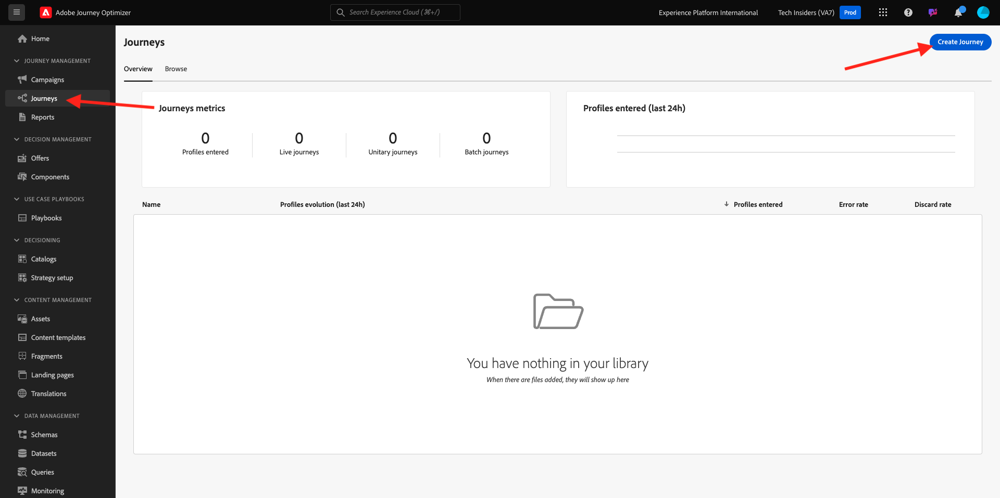

# 3.1.3 Create your Journey, Fragments and Message

In this exercise, you'll configure the journey and the message that needs to be triggered when someone creates an account on the demo website.

Login to Adobe Journey Optimizer by going to [Adobe Experience Cloud](https://experience.adobe.com). Click **Journey Optimizer**.


You'll be redirected to the **Home**  view in Journey Optimizer. First, make sure you're using the correct sandbox. The sandbox to use is called `--aepSandboxName--`.


## 3.1.3.1 Create your Journey

In the left menu, click **Journeys**. Next, click **Create Journey** to create a new journey.

 

You'll then see an empty journey screen.


In the previous exercise, you created a new **Event**. You named it like this `--aepUserLdap--AccountCreationEvent` and replaced `ldap` with your ldap. This was the result of the Event creation:


You now need to take this event as the start of this Journey. You can do this by going to the left side of your screen and searching for your event in the list of events.


Select your event, drag and drop it on the Journey canvas. Your Journey now looks like this:


As the second step in the journey, you need to add a short **Wait** step. Go to the left side of your screen to the **Orchestration** section to find this. You'll be using profile attributes and need to make sure they are populated into the Real-time Customer Profile.


Your journey now looks like this. On the right side of the screen you need to configure the wait time. Set it to 1 minute. This will give plenty of time for the profile attributes to be available after the event fires. Click **Save** to save your changes.


As the third step in the journey, you need to add an **Email** action. Go to the left side of your screen to **Actions**, select the **Email** action, then drag and drop it on the second node in your journey. You now see this.


Set the **Category** to **Marketing** and select an email configuration that enables you to send email. In this case, the email configuration to select is **Email**. Ensure that the checkboxes for **Clicks on email** and **email opens** are both enabled.


## 3.1.3.2 Create your Message

To create your message, click **Edit content**.


You now see this.


Click the **Open personalization dialog** icon.


Write the text `Hi `. Next you need to bring in the personalization token for the field **First name** which is stored under `profile.person.name.firstName`. In the left menu, navigate to find the **Person > Full Name > First Name** field and click on the **+** icon. You'll then see the personalization token appear in the text field.


Next, add the text **, thank you for signing up!**. Click **Save**.


You can now start configuring the body of your email. Click **Edit email body**. 


Before starting to create the content of the actual message itself, it's a good idea to think about the content in the message. Some of the content in the message is unique to the message itself, but other parts are standard components that will likely be the same for every email you'll be sending to customers. 

In the previous exercise, you already created these standard components as Fragments in Journey Optimizer, which you can now reference in this message and all the other future messages you'll be creating.

In the next screen you will be prompted with 3 different methods to provide the email's content:

- **Design from scratch**: Start with a blank canvas and use the WYSIWYG-editor to drag and drop structure and content components to visually build up the email's content.
- **Code your own**: Create your own email template by coding it using HTML
- **Import HTML**: Import an existing HTML template, which you'll be able to edit.

Click **Design from scratch**.


In the left menu, you'll find the structure components that you can use to define the structure of the email (rows and columns).


You'll also find **Fragments** in the left menu, where you'll see the fragments you created earlier.


Before you can add the header and footer onto the canvas, you need to add 2 structures to the email. Click the **+** icon in the left menu, and drag 2 **1:1 column** components onto the canvas.


In the left menu, go back to **Fragments**. Drag and drop the header fragment into the first component and the footer fragment into the second component. You'll then see this.


Click the **+** icon in the left menu and drag and drop 2 more **1:1 column** components onto the canvas, in between the header and the footer.


Drag and drop an **Image** component in the first **1:1 column** component. Click **Browse**.


In the **citi-signal-images** folder. Select the image **`welcome_email_image.png`** and click **Select**. 


You'll then have this:


Next, go to **Contents** and drag and drop a **Text** component in the structure component on the fourth row. 


Select the default text **Please type your text here.** as you would do with any text editor. Write **Welcome to the family,** instead. In the toolbar, click the **Add personalization** icon.


Next, you need to bring the **First name** personalization token which is stored under `profile.person.name.firstName`. In the menu, find the **Person** element, drill down to the **Full Name** element, and then click the **+** icon to add the First Name field onto to expression editor.

Click **Save**.


You'll now notice how the personalization field has been added to your text. 


In the same text field, hit **Enter** twice to add two lines and copy and paste the following text:

```
Welcome aboard! We're thrilled to have you join the CitiSignal family. 
As a valued member of our community, you're now poised to experience top-notch telecommunications services that cater to your every need.

At CitiSignal, we understand that staying connected is more than just a convenience - it's a necessity. Whether you're browsing the web, streaming your favourite content, or keeping in touch with loved ones, we're here to ensure you have the best tools and resources at your fingertips.
```


Set the **Text alignment** to be centered, and feel free to adjust the look and feel of the message to meet your own needs. When you're done, click **Save**.


The final check to perform to ensure your email is ready is to preview it, click on the **Simulate Content** button.


Before you can simulate the email message, you need to add a test profile. Click **Manage test profiles**.


Select the **email** namespace by clicking on the icon next to **Enter identity namespace** field.

In the list of identity namespaces, select the **Email** namespace. In the **Identity value** field, enter the email address of a previous profile that you used in a previous exercise, and that is already stored in Adobe Experience Platform. Click **Add profile**. Go back to the previous screen.


You'll then see your email message, now simulated for this customer profile. You can now validate the personalization in the subject line and the body and send a proof email if desired.

Click **Close** to close the preview.


Click **Save** to save your message and go back to the message dashboard by clicking the **arrow** next to the subject line text in the top-left corner.


Click the **arrow** to go back to your journey.


## 3.1.3.3 Publish your journey

Click **Save**.


You still need to give your journey a name. You can do that by clicking the **Properties** icon in the top right side of your screen.


You can then enter the journey's name here. Please use `--aepUserLdap-- - Registration Journey`. Click **Save**.


You can now publish your journey by clicking **Publish**.


Click **Publish** again.


After a coupleof minutes, the status of your journey will change to **Live** and you'll see a real-time dashboad of your journey's performance.


You've now finished this exercise.

Next Step: [3.1.4 Update your Data Collection property and test your journey](./ex4.md)

[Go Back to Module 3.1](./journey-orchestration-create-account.md)

[Go Back to All Modules](../../../overview.md)
