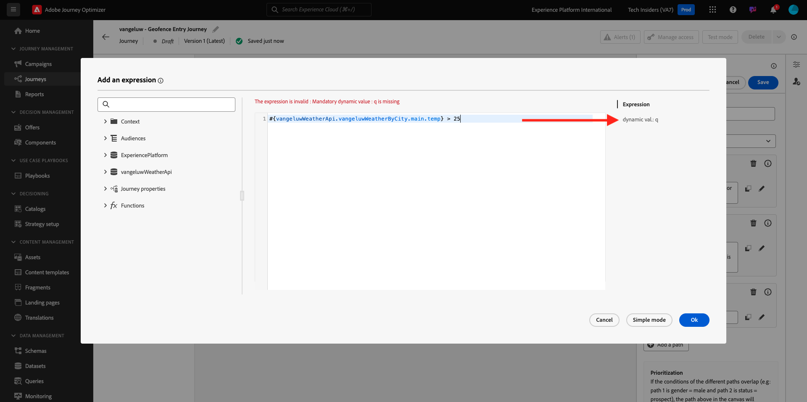
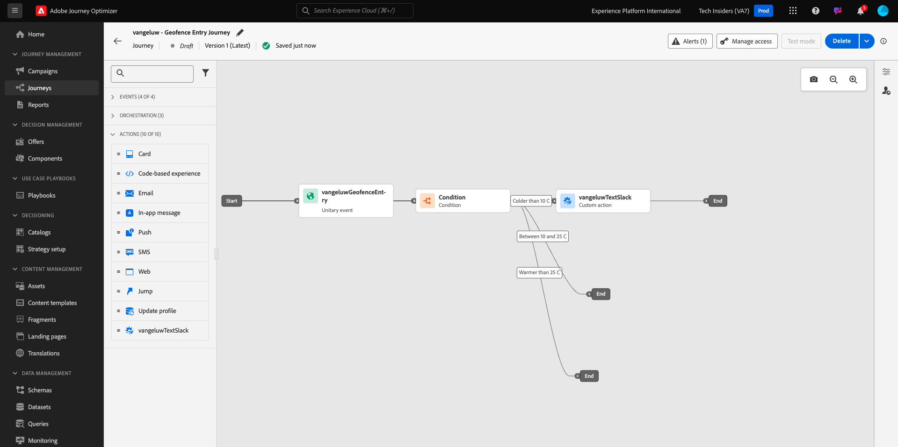

# 3.2.4 Create your journey and messages

In this exercise, you'll create a journey and several text messages by making use of Adobe Journey Optimizer.

For this use case, the goal is to send different messages based on the weather conditions of the location of your customer. 3 scenarios have been defined:

- Colder than 10° Celsius
- Between 10° and 25° Celsius
- Warmer than 25° Celsius

For these 3 conditions, you'll need to define 3 messages in Adobe Journey Optimizer.

## 3.2.4.1 Create your journey

Login to Adobe Journey Optimizer by going to [Adobe Experience Cloud](https://experience.adobe.com). Click **Journey Optimizer**.


You'll be redirected to the **Home**  view in Journey Optimizer. First, make sure you're using the correct sandbox. The sandbox to use is called `--aepSandboxName--`. You'll then be in the **Home** view of your sandbox `--aepSandboxName--`.


In the left menu, go to **Journeys** and click **Create Journey** to start creating your Journey.


You should first name your journey.

As a Name for the journey, use `--aepUserLdap-- - Geofence Entry Journey`. No other values must be set at this moment. Click **Save**.


On the left side of your screen, have a look at **Events**. You should see your previously created event in that list. Select it, then drag and drop it on the journey canvas. Your journey then looks like this. Click **Save**.


Next, click on **Orchestration**. You now see the available **Orchestration** capabilities. Select **Condition**, then drag and drop it on the Journey Canvas.


You now have to configure three paths for this condition:

- It's colder than 10° Celsius
- It's between 10° and 25° Celsius
- It's warmer than 25° Celsius

Let's define the first condition.

### Condition 1: Colder than 10° Celsius

Click on the **Condition**.  Click on **Path1** and edit the name of the path to **Colder than 10 C**. Click on the **Edit** icon for the expression of Path1.


You'll then see an empty **Simple Editor** screen. Your query will be a bit more advanced, so you'll need the **Advanced Mode**. Click **Advanced Mode**.


You'll then see the **Advanced Editor** which allows code entry.


Select the below code and paste it in the **Advanced Editor**.

`#{--aepUserLdap--WeatherApi.--aepUserLdap--WeatherByCity.main.temp} <= 10`

You'll then see this.


In order to retrieve the temperature as part of this condition, you need to provide the city in which the customer currently is.
The **City** needs to be linked to the dynamic parameter `q`, just like you saw previously in the Open Weather API Documentation.

Click the field **dynamic val: q** as indicated in the screenshot.


You then need to find the field that contains the current city of the customer in one of the available Data Sources, in this case, you need to find it under **Context**.


You can find the field by navigating to `--aepUserLdap--GeofenceEntry.placeContext.geo.city`.

By clicking that field or clicking **+**, it will be added as the dynamic value for the parameter `q`. This field will be populated by for instance the geolocation-service that you've implemented in your mobile app. In this case you will simulate this using the data collection property of the demo website. Click **OK**.


### Condition 2: Between 10° and 25° Celsius

After having added the first condition, you'll see this screen. Click **Add a path**.


Double click on **Path1** and edit the path name to **Between 10 and 25 C**. Click the **Edit** icon for the expression this path.


You'll then see an empty **Simple Editor** screen. Your query will be a bit more advanced, so you'll need the **Advanced Mode**. Click **Advanced Mode**.


You'll then see the **Advanced Editor** which allows code entry.


Select the below code and paste it in the **Advanced Editor**.

`#{--aepUserLdap--WeatherApi.--aepUserLdap--WeatherByCity.main.temp} > 10 and #{--aepUserLdap--WeatherApi.--aepUserLdap--WeatherByCity.main.temp} <= 25`

You'll then see this.


In order to retrieve the temperature as part of this Condition, you need to provide the city in which the customer currently is.
The **City** needs to be linked to the dynamic parameter **q**, just like you saw previously in the Open Weather API Documentation.

Click the field **dynamic val: q** as indicated in the screenshot.


You then need to find the field that contains the current city of the customer in one of the available Data Sources.


You can find the field by navigating to `--aepUserLdap--GeofenceEntry.placeContext.geo.city`. By clicking that field, it will be added as the dynamic value for the parameter **q**. This field will be populated by for instance the geolocation-service that you've implemented in your mobile app. In this case you will simulate this using the data collection property of the demo website. Click **OK**.


Next, you'll add the 3rd condition.

### Condition 3: Warmer than 25° Celsius

After having added the second condition, you'll see this screen. Click **Add a path**.


Double click on Path1 to change the name to **Warmer than 25 C**. 
Then click on the **Edit** icon for the expression this path.


You'll then see an empty **Simple Editor** screen. Your query will be a bit more advanced, so you'll need the **Advanced Mode**. Click **Advanced Mode**.


You'll then see the **Advanced Editor** which allows code entry.


Select the below code and paste it in the **Advanced Editor**.

`#{--aepUserLdap--WeatherApi.--aepUserLdap--WeatherByCity.main.temp} > 25`

You'll then see this.


In order to retrieve the temperature as part of this Condition, you need to provide the city in which the customer currently is.
The **City** needs to be linked to the dynamic parameter **q**, just like you saw previously in the Open Weather API Documentation.

Click the field **dynamic val: q** as indicated in the screenshot.



You then need to find the field that contains the current city of the customer in one of the available Data Sources.


You can find the field by navigating to ```--aepUserLdap--GeofenceEntry.placeContext.geo.city```. By clicking that field, it will be added as the dynamic value for the parameter **q**. This field will be populated by for instance the geolocation-service that you've implemented in your mobile app. In this case you will simulate this using the data collection property of the demo website. Click **OK**.


You now have three configured paths. Click **Save**.


As this is a journey for learning purpose, you'll now configure a couple of actions to showcase the variety of options marketeers now have to deliver messages.

## 3.2.4.2 Send messages for path: Colder than 10° Celsius

For each of the temperature contexts, you'll attempt to send a text message to a customer. For this exercise, you'll send a real message to a Slack channel instead of a mobile phone number. 

Let's focus on the path **Colder than 10 C**.


In the left menu, go back to **Actions**, select the Action `--aepUserLdap--TextSlack`, then drag and drop it after the **Message** action.


Go to **Action Parameters** and click the **Edit** icon for the parameter `textToSlack`.


In the popup-window, click **Advanced Mode**.


Select the below code, copy it and paste it in the **Advanced Mode Editor**. Click **Ok**.

`"Brrrr..." + #{ExperiencePlatform.ProfileFieldGroup.profile.person.name.firstName} + ",  it's cold and freezing outside. Get comfortable at home with a 20% discount on a Disney+ subscription!"`


You will see your completed action. Click **Save**.


This path of the journey is now ready.

## 3.2.4.3 Send messages for path: Between 10° and 25° Celsius

For each of the temperature contexts, you'll attempt to send a message to your customer. For this exercise, you'll send a real message to a Slack channel instead of a mobile phone number.

Let's focus on **Between 10 and 25 C** path.



In the left menu, go back to **Actions**, select the Action `--aepUserLdap--TextSlack`, then drag and drop it after the **Message** action.


Go to **Action Parameters** and click the **Edit** icon for the parameter `textToSlack`.


In the popup-window, click **Advanced Mode**.


Select the below code, copy it and paste it in the **Advanced Mode Editor**. Click **Ok**.

`"What nice weather for the time of year, " + #{ExperiencePlatform.ProfileFieldGroup.profile.person.name.firstName} + " 20% discount on Apple AirPods so you can go for a walk and listen to your favorite podcast!"`


You will see your completed action. Click **Ok**.


This path of the journey is now ready.

## 3.2.4.4 Send messages for path: Warmer than 25° Celsius

For each of the temperature contexts, you'll attempt to send a message to your customer. For this exercise, you'll send a real message to a Slack channel instead of a mobile phone number.

Let's focus on **Warmer than 25 C** path.


In the left menu, go back to **Actions**, select the Action `--aepUserLdap--TextSlack`, then drag and drop it after the **Messages** action.


Go to **Action Parameters** and click the **Edit** icon for the parameter `textToSlack`.


In the popup-window, click **Advanced Mode**.


Select the below code, copy it and paste it in the **Advanced Mode Editor**. Click **Ok**.

`"So warm, " + #{ExperiencePlatform.ProfileFieldGroup.profile.person.name.firstName} + "! 20% discount on adding 10GB of extra data so you can get online at the beach!"`


You will see your completed action. Click **Save**.


This path of the journey is now ready.

## 3.2.4.5 Publish your journey

Your journey is now fully configured. Click **Publish**.


Click **Publish** again.


Your journey is now published.


Next Step: [3.2.5 Trigger your journey](./ex5.md)

[Go Back to Module 3.2](journey-orchestration-external-weather-api-sms.md)

[Go Back to All Modules](../../../overview.md)
