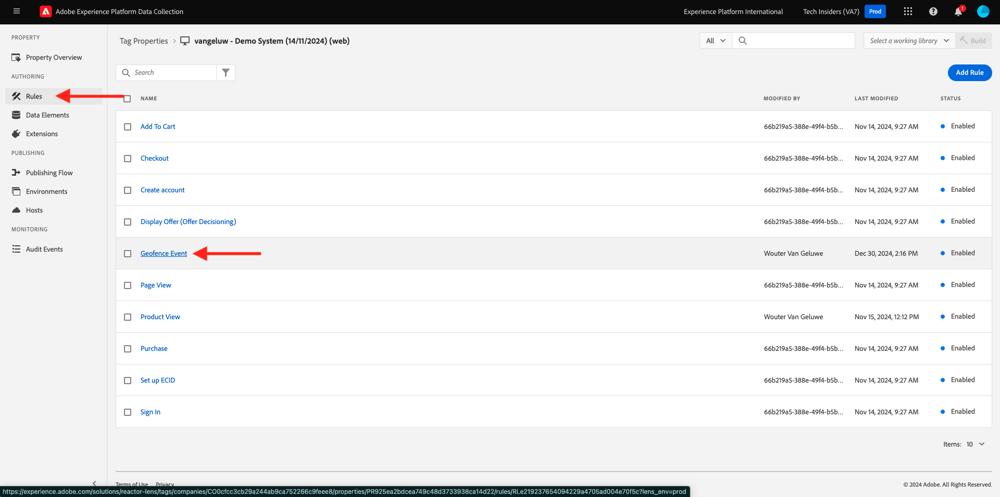
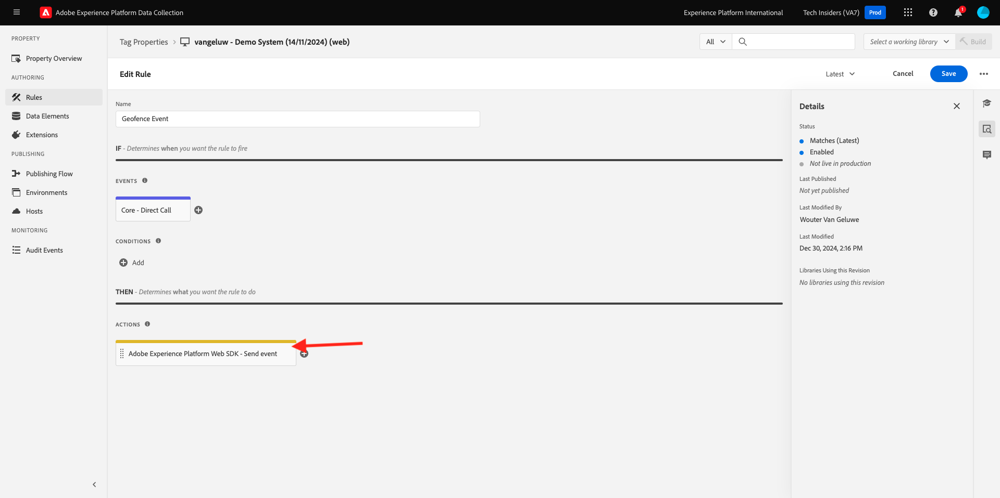
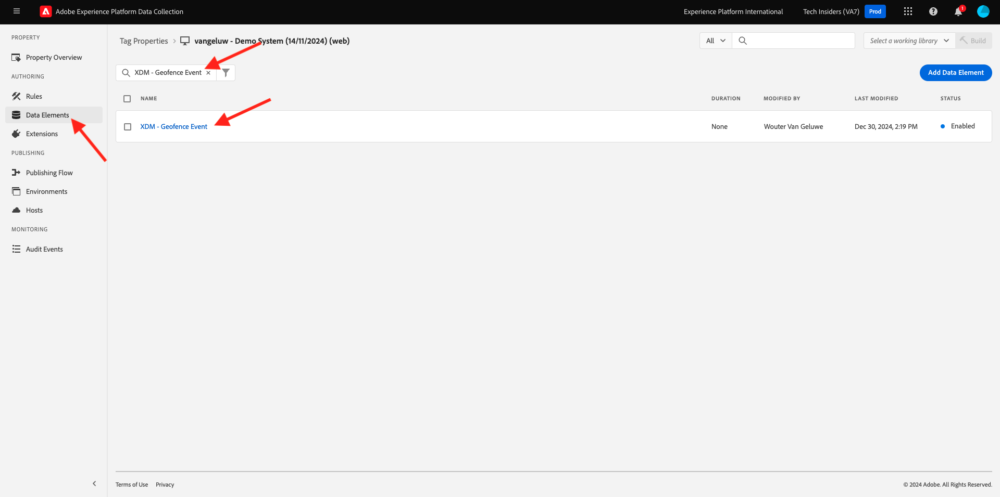
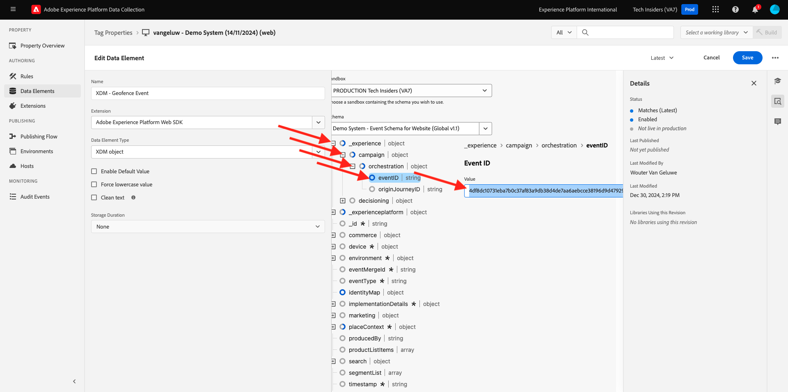
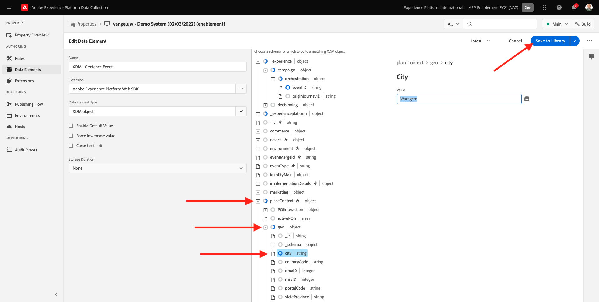
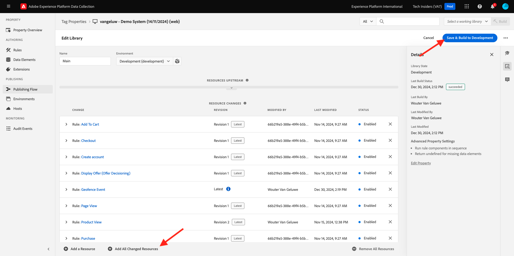
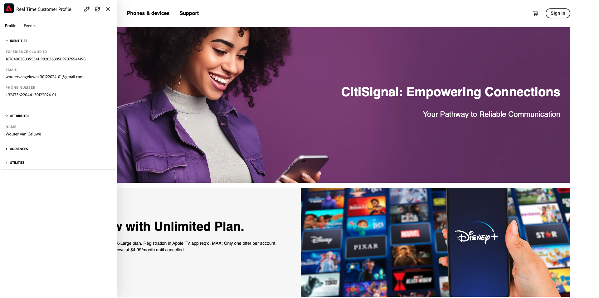
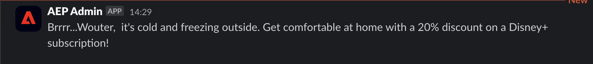

# 3.2.5 Trigger your journey

In this exercise, you'll test and trigger the journey you configured in this module.

## 3.2.5.1 Update your geofence event configuration

Go to [Adobe Experience Platform Data Collection](https://experience.adobe.com/launch/) and select **Tags**.

This is the Adobe Experience Platform Data Collection Properties page you saw before.

 

In **Getting Started**, Demo System created two Client properties for you: one for the website and one for the mobile app. Find them by searching for `--aepUserLdap--` in the **[!UICONTROL Search]** box. Click to open the **Web** property.

You'll then see this.

In the left menu, go to **Rules** and search for the rule **Geofence event**. Click the rule **Geofence event** to open it.

You'll then see the details of this rule. Click to open the action **Adobe Experience Platform Web SDK - Send event**.

You'll then see that when this action is triggered, a specific data element is used to define the XDM data structure. You need to update that data element, and you need to define the **Event ID** of the event that you configured in [Exercise 3.2.1](./ex1.md).

You now need to go update the data element **XDM - Geofence Event**. To do so, go to **Data Elements**. Search for **XDM - Geofence Event** and click to open that data element.

You'll then see this:

Navigate to the field `_experience.campaign.orchestration.eventID`. Remove the current value, and paste your eventID there.

As a reminder, the Event ID can be found in Adobe Journey Optimizer under **Configurations > Events** and you'll find the event ID in the sample payload of your even, which looks like this: `"eventID": "4df8dc10731eba7b0c37af83a9db38d4de7aa6aebcce38196d9d47929b9c598e"`. 

Next, you should define your city in this data element. Go to **placeContext > geo > city** and enter a city of choice. Next, click **Save** or **Save to Library**.

Finally, you need to publish your changes. Go to **Publishing Flow** in the left menu and click **Man** to open your library.

Click **Add All Changed Resources** and then click **Save & Build to Development**.

## 3.2.5.2 Trigger your journey

Go to [https://dsn.adobe.com](https://dsn.adobe.com). After logging in with your Adobe ID, you'll see this. Click the 3 dots **...** on your website project and then click **Run** to open it.

You'll then see your demo website open up. Select the URL and copy it to your clipboard.

Open a new incognito browser window.

Paste the URL of your demo website, which you copied in the previous step. You'll then be asked to login using your Adobe ID.

Select your account type and complete the login process.

You'll then see your website loaded in an incognito browser window. For every exercise, you'll need to use a fresh, incognito browser window to load your demo website URL.

Click the Adobe logo icon in the top left corner of your screen to open the Profile Viewer.
  

Open the Profile Viewer panel and go to Real-time Customer Profile. On the Profile Viewer panel, you should see all of your personal data displayed, like your newly added email and phone identifiers.
      

On the Profile Viewer panel, click **UTILITIES**. Enter `geofenceevent` and click **Send**.

>[!NOTE]
>
>In case you don't have the option on the Profile Viewer panel to send a direct call event, you can manually send one by open the Developer View of your browse and going to **Console**, and then paste and send this command: `_satellite.track('geofenceevent')`.

A couple of seconds later, you'll see the message from Adobe Journey Optimizer appear in the Slack channel.

Next Step: [Summary and benefits](./summary.md)

[Go Back to Module 3.2](journey-orchestration-external-weather-api-sms.md)

[Go Back to All Modules](../../../overview.md)
